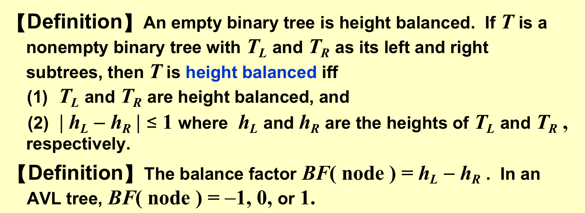
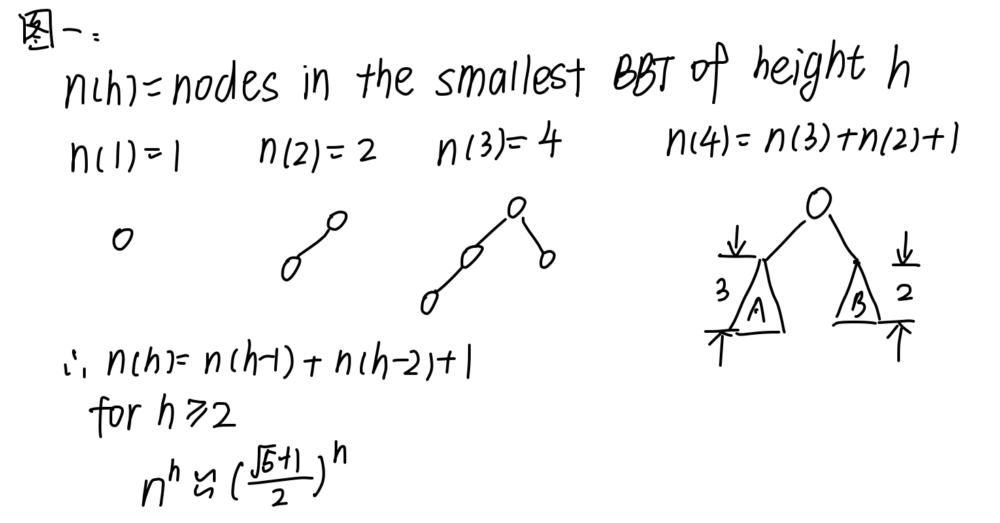
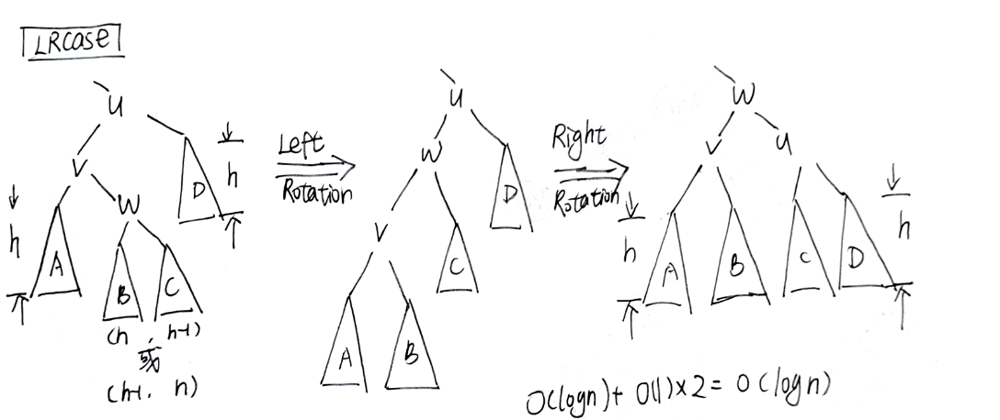
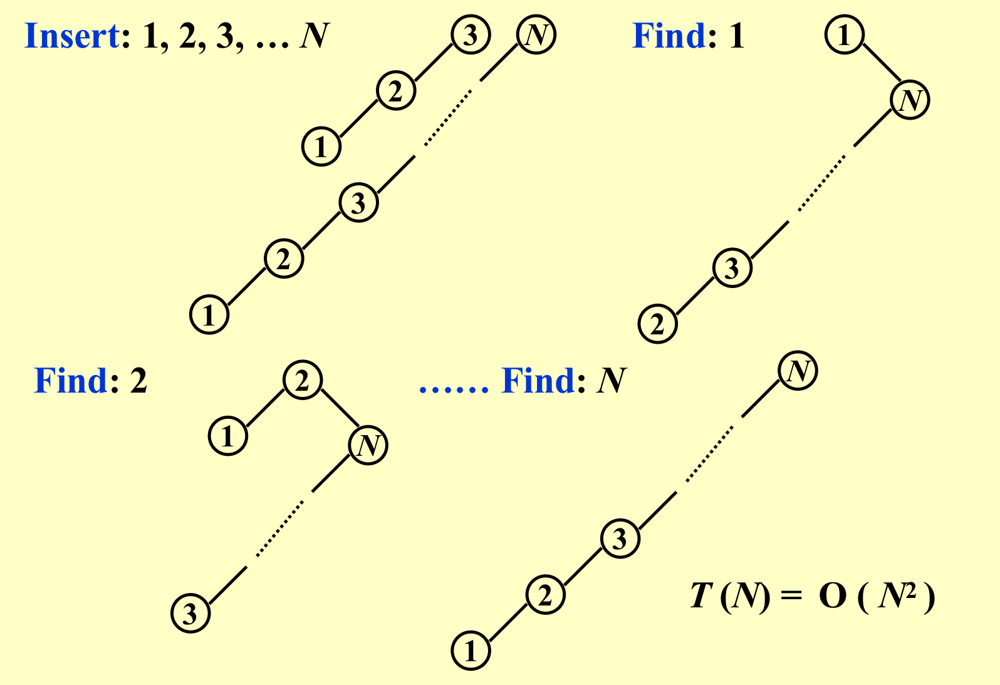
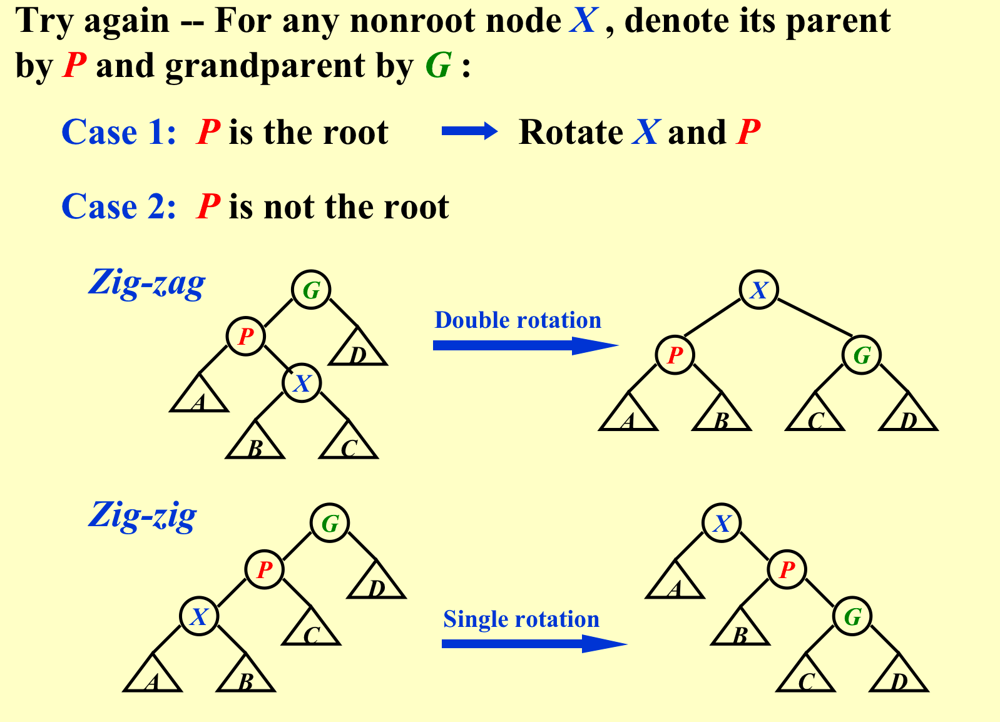
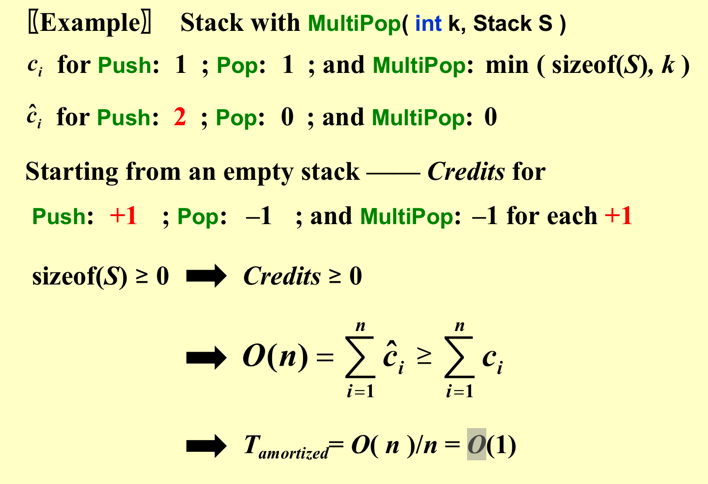
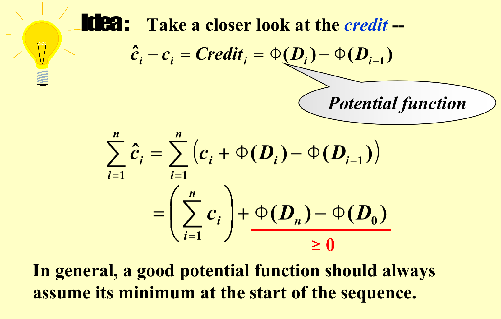
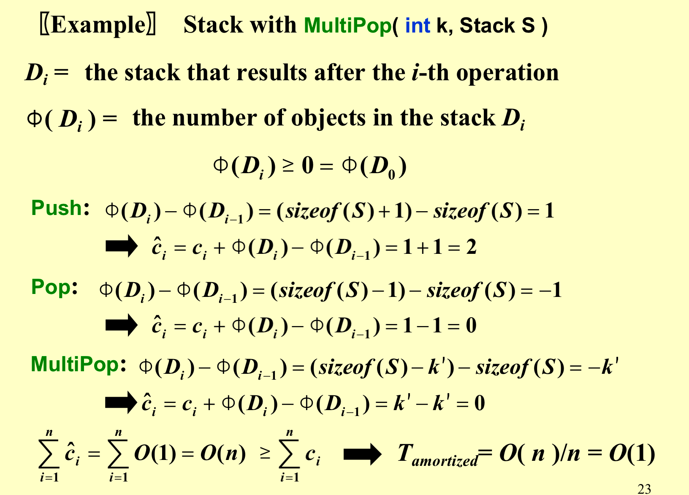
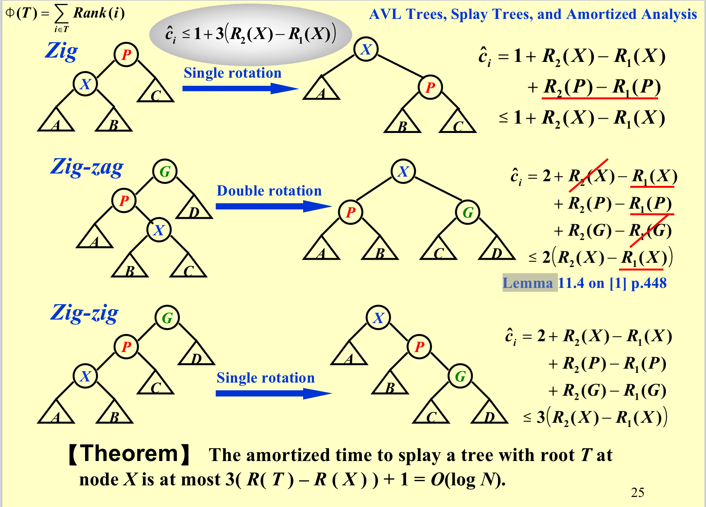

### AVL Tree

#### 1. balance factor(BF)

Order property：左边小，右边大；

Structure property：｜BF｜<= 1；

与堆相反， 应该先满足Order property；

#### 2. 定义

平衡二叉搜索树：balanced binary search tree(BBST) = AVL tree。

高度的定义：空节点的高是1，叶节点高为0，否则就是儿子中高的最大值+1。

#### 3. 为什么要AVL Tree

!!! tip "推论"

    定理：有n个结点的平衡二叉树，是一个斐波那契数列，最后求得高度不高于$O(logn)$.

    证明：先证明引理->任何高度为h的平衡二叉树的结点数小于$c^h$（其中$c$是一个常数）

    

    而这个性质很容易维护，所以就有了AVL Tree。

#### 4. Rotation 操作

##### 4.1 right rotation

1. 只需要改三个指针，所以时间是O（1）；

2. 旋转能够维持BST性质；
3. 旋转会改变高度差，即会改变BF；

##### 4.2 left rotation

#### 5. Insertion

##### 5.1 Left case

###### LLcase（LLRotation）

###### LRcase（LRRotation）

##### 5.2 Right case
##### 5.3 总结

只要修正了最下面那个节点，其他因他而起的不平衡节点都会被修正。

插入引起的不平衡最多两次旋转就能修正。

**case的划分就是破坏者和被破坏者的关系，找的是被破坏者以下的三层，下面的不用看。**

不管是这四种的什么情况，**最后都要变成中间一个两边各一个的情况**，剩下的四块按顺序搬运过去。

#### 6. Deletion

- 步骤：
  - 像BST一样delete；
  - 恢复平衡；
- 在结构上必定会删除一个leaf；

- 删除只会让一个点变得不平衡，但是修复不平衡时候，旋转一次可能会把不平衡向上传，一直传到根结点为止。所以最多旋转$O(logn)$次才能修复，所以最终时间还是为$O(logn) + O(logn)* O(1) = O(logn)$。

#### 7. 总结

综上所述，AVL树的高度是$logn$级别的，并且维持树平衡的代价也是$logn$级别的。

### Splay Trees
#### 1. 核心思想
- 不要求每一步都做得很好，但是平均下来时间复杂性要小于等于$O(logn)$。
- 要找一个对象（其实是任何一个动作，包括插入），那就顺便把这个对象翻到树根（这样下次查找到他的概率就会大一点）。
#### 2. 不好的情况

#### 3. 优化

变换过程中不一定两边高度差不超过1；

#### 4. 删除

- 找到要删除的节点X，将它旋转到跟节点上（Find X）；
- 把跟节点删除，产生左右两颗子树（Remove X）；
- 在左子树上找到最大的节点并将他旋转到根节点上（FindMax( $T_L$ )）；
- 把右子树接到左子树根的右边（根已经是最大的了，不可能有右孩子）；

### Amortized Analysis（均摊代价分析）

!!! quote "点此跳转"

    [1.大佬对均摊代价的分析与理解](https://note.isshikih.top/cour_note/D2CX_AdvancedDataStructure/Ex01/#摊还分析)

#### 定义
- Amortized Bound：任意多次操作的时间复杂性上界；
- Average-case Bound：无限多次操作的时间复杂性上界；
#### 解决方法
##### Aggregate analysis（累计分析）

以push，pop，multipop为例，n次操作，最多只有n个元素，所以mutipop最多也是$O(n-1)$，所以总时间复杂性就是$O(n)$，所以每个的时间就是$O(1)$。

##### Accounting method（记账方法）
总的时间等于push的两倍

摊还时间 = 实际时间 + credit

在假设了一个要证明的均摊复杂度后，对实际的每步操作，如果实际消耗比均摊消耗低，那么把差值作为“余额”存起来，余额可以为其他操作中实际消耗比均摊消耗高出的那部分“付款”。最后只需要证明每一步的均摊消耗之和大于等于实际消耗之和。（from JerryG 20级）

| 操作     | 实际代价 | 摊还代价 |
| -------- | -------- | -------- |
| push     | 1        | 2        |
| pop      | 1        | 0        |
| multipop | min(k,s) | 0        |

总和方法对所有的操作一视同仁，而记账算法不同，每个操作的credit不尽相同。

我们可以把摊还代价设置成这样是因为pop次数之和肯定不会超过push的次数，因此可以保证任何情况下信用值不是负数，而此时摊还代价总和的上界为2n所以平均的摊还代价是O(1)。（from 小角龙）

##### Potential method（势能法）

!!! quote "点此跳转"

    [1.大佬对势能分析法的分析与理解](https://www.yuque.com/xianyuxuan/saltfish_shop/weekly002_amortized_analysis#KmnY6)

核心：**让消耗大的那一步操作势能大大的降！**

对账目分析法的一种形式上的改进。定义数据结构自身状态的“势能”函数， 每次操作可能改变自身的势能，势能的改变跟跟余额的改变(每一步均摊和实际的差值)有密切关系，或者说相等。势能最开始取最小值，每一步中，势能增加量等于均摊消耗比实际消耗多出的部分。定义完势能函数后，均摊复杂度一定是大于势能函数每一步的最大可能的增长值的，所以要定义增长尽量缓慢的势能函数，同时又能表现实际操作和均摊操作的关系(这里不太容易说清楚)。势能函数的最大值往往决定了均摊分析的结果。（JerryG 20级）

##### 分析伸展树
!!! quote "点此跳转"

    [1.大佬对伸展树分析的解读](https://note.isshikih.top/cour_note/D2CX_AdvancedDataStructure/Lec01/)

- 每个结点的势能计算。

- 

!!! quote "点此跳转"

    1. ADS01AVL_Stu.ppt
    2. 小角龙(18)复习笔记.pdf
    3. JerryG(20)复习笔记.pdf
    4. 智云课堂：2023myc，2022hqm，2022yds