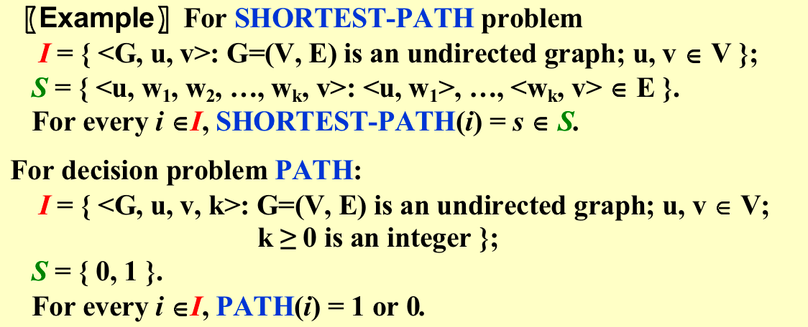
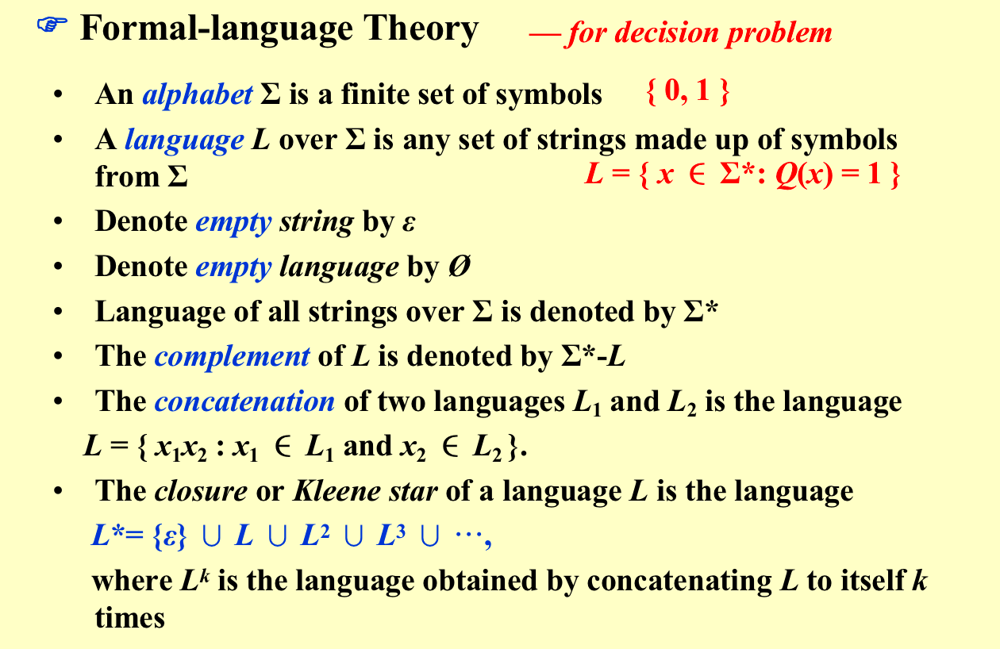
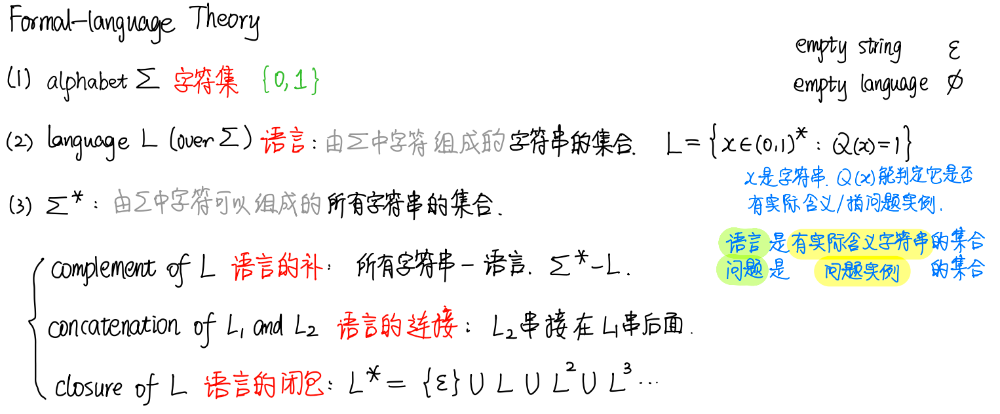
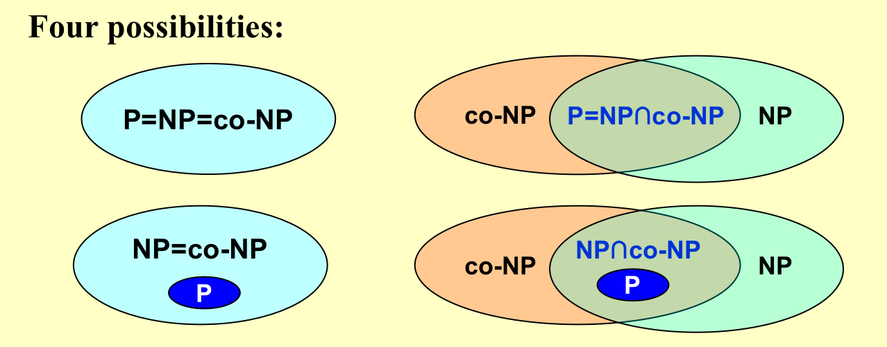
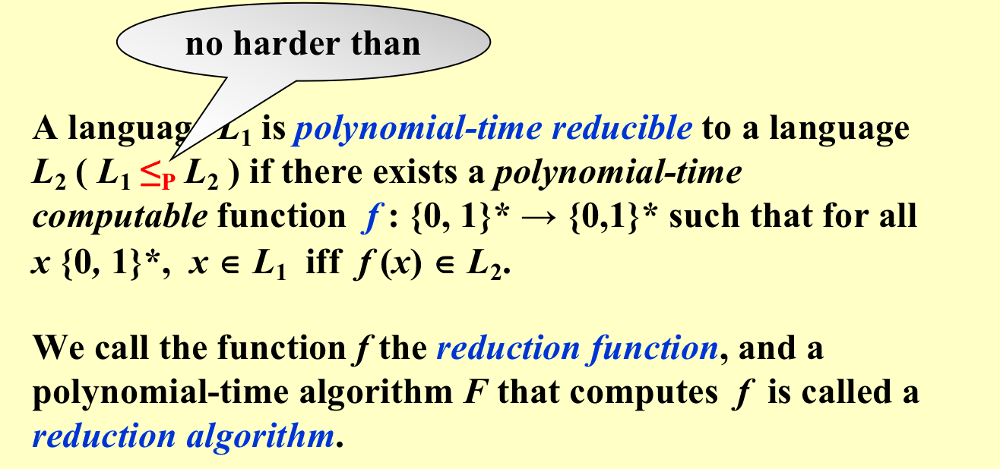
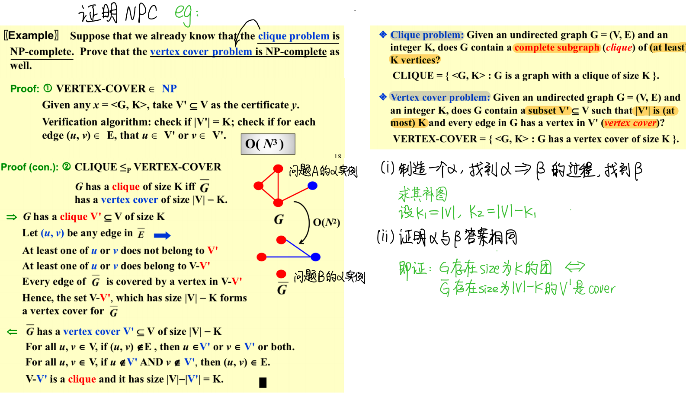

## 1. Recall

- 欧拉回路问题，找到一条路径经过每条边恰好一次，一笔画问题
- 哈密顿（一个回路包括所有顶点）问题，没有发现多项式时间解法
- 单源最短路径问题
- 单源最长路径问题，没有发现多项式时间解法

简单理解就是$n$不在指数上就好了，同理$n!$也不是多项式时间内。

## 2. 引入

简单：$O(N)$，因为需要全部读入；

困难：不能确定的问题，告诉答案也没法验证；

### 2.1 停机问题

!!! tip "理发师悖论"

    克里克岛的一座小城里有位理发师, 有一天他做出一项规定: 他给并且只给那些不给自己理发的人理发. 理发师的这个规定似乎很有道理, 既然有人自己给自己理发了, 那么我就不用"多此一举", 我再给这个人理发.

    最初, 这个规定并没什么问题, 后来, 随着这个理发师自己的头发越来越长, 他发现他陷入了一个两难的境地: 他该不该给自己理发?

    - 如果他为自己理发. 那么他就成为了他规定中那个"自己给自己理发的人", 那么他就不应该为自己理发;
    - 如果他不为自己理发, 那么他不是他规定中那个"自己给自己理发的人", 那么他就应该为自己理发.

    综合以上两种情况, "他为自己理发"当且仅当"他不为自己理发", 这成为了一个悖论.

    理发师悖论在很多领域有重要的应用, 比如罗素利用理发师悖论发现了集合论的缺陷, 在当时学术界引起了极大震动. 在这里, 我们要用理发师悖论分析停机问题.


**停机问题**：编译器能否检测出所有的死循环？不能。假设存在这样一个函数可以用于判断停机问题

```c
bool halts(char *f_code, char *t);
```

其中`f_code`是我们要进行测试的函数f的ASCII源代码，我们可以认为对`f_code`进行编译得到了函数`f`。 当`f`对`t`停机时， `halts(f_code, t)`返回`true`；当`f`对`t`不停机，`halts(f_code, t)`返回`false`。

我们构造这样一个函数

```c
void modified_halts(char *f_code) {
  if (halts(f_code, f_code)) {  // 当halts(f_code, f_code)返回true
    while (true) { /*empty*/ }  // 死循环
  }
  else {                        // 当halts(f_code, f_code)返回false
    return;                     // 立即停止运行
  }
}
```

即当`f`对`f_code`停机时，我们让`modified_halts`不停机；当`f`对`f_code`不停机时，`modified_halts`停机。

假设`modified_halts`这个函数的ASCII源代码是`modified_halts_code`，如果我们把`modified_halts_code`作为`modified_halts`的输入会是什么情况？

- 如果`modified_halts`对`modified_halts_code`停机，说明`halts(modified_halts_code, modified_halts_code)`返回`false`， 说明`modified_halts`对`modified_halts_code`不停机；
- 如果`modified_halts`对`modified_halts_code`不停机，说明`halts(modified_halts_code, modified_halts_code)`返回`true`，说明`modified_halts`对`modified_halts_code`停机。

综合以上两种情况，“`modified_halts`对`modified_halts_code`停机"当且仅当"`modified_halts`对`modified_halts_code`不停机”，这是一个矛盾，说明不存在这样一个`halts`函数可用于判断任意函数的可停机性。

以上这个证明利用的就是理发师悖论，`modified_halts`函数就像是那位克里克岛小城里的理发师，他对并且只对那些不停机的函数停机。当`modified_halts`函数面对他自己的函数代码时，就像理发师该不该给他自己刮胡子一样，将陷入两难境地。

### 2.2 图灵机

**组成：**无限的内存和扫描头

**操作：**

- change the finite control state 改变有限的控制状态状态

- erase the symbol in the unit currently pointed by head and write a new symbol in 清除并写入

- Head moves on unit to left or right or stays at its current position 左右移动或保持不动

**确定性图灵机：**对于每一个输入都会执行确定的行为。

**非确定性图灵机：**理论上存在，但是并没有被设计出来。对于给定的输入可以有多种选择，但是会选择最正确的解决方案。

## 3. 主要概念

### 3.1 P和NP

**P**：多项式时间内可解决的问题，确定性图灵机多项式时间内可解决的问题。

**NP**：对于一个答案多项式时间内可验证的问题，等价于非确定性图灵机多项式时间内可解决的问题（但是因为非确定性图灵机没有被设计出来，所以我们讨论的都是多项式时间=可验证）。

NP问题更加困难一点，若多项式时间内可解决，那么多项式时间一点可验证。$P \subseteq NP$，P是NP的子集，能够验证肯定能够找到。

？$P = NP$ or $P \subset NP$，P是否是NP的真子集，或者说是P是否等于NP（是否所有能在多项式时间验证的算法都能在多项式时间内解决？），这个问题到现在还没有解决，目前无法证明一个问题属于NP但是不属于P。

!!! example "哈密顿圈问题"

    给定一个有向图G(V，E)，如果G中的圈C恰好经过每一个顶点一次，则称圈C是一个哈密顿圈。
    - 验证这个答案是非常好验证的，代入即可，所以这个问题是NP，但是目前并没有找出多项式时间的解法，除非P=NP，我们才能找到多项式时间的解法。

### 3.2 NP-Complete

#### 3.2.1 介绍

性质：NPC问题是NP问题的向上多项式归约所得到的，这是最难的一部分NP问题。

!!! note

    NPC问题是NP问题的边界，所有NPC问题在难度上是等价的，只要我们在多项式时间内解决一个NPC问题，那么NPC问题将全部被解决，NP问题也将被全部解决。


问题的归约：把A类问题的具体问题映射到B类上，这里的映射是多项式时间的。当我们解决了B之后，我们又可以返回去得到A得解决方案。（B类问题通常更加困难（这里的困难不一定是时间上更多，这里困难和简单的界定是多项式时间），但是更为我们所熟悉）


!!! info

    **Decision problem**: 输出的结果是yes或者no。
    **Search problem**: 不仅要知道是否有解，还要找出解是多少。
    **Optimization problem**: 有一个优化目标，找到最优化的解。
    **Counting problem**: 输出解的个数。

    难度自上而下逐步增加。

    任何一个优化目标可以转化成判定问题，只需要加一个参数。比如：找一条最短路（优化问题），转化成找一条比如小于1km的路（判定问题）。一般判定问题都比优化问题简单，而我们的NPC都是针对判定问题来讲的。

    之后要讲的NP-hard就是针对优化问题来讲的。NP-hard问题是一个已知的NPC问题通过多项式归约到的问题（但是NP-hard问题不一定是NP问题，所以NP-hard问题比NPC问题范围广）

    NPC 和 NP-hard 的主要区别在于：验证一个问题A是否为NP-hard问题，无需判断A是否属于NP。

    **除此之外SAT问题，顶点覆盖问题，哈密顿回路问题，TSP问题，团问题，最长路径问题，背包问题都是NPC问题，停机问题不是NPC问题，停机问题是不可判定问题。**


!!! note
    
    我们这节课所要讲的其实是，给定一个问题X，和一个机器模型M，问机器M要多少时间才能解决问题X。我们现在用的大都是RAM机器模型（比如寄存器的存取等操作的时间复杂性都是O(1)），而图灵机和RAM的时间复杂性差别其实也就是一个多项式级别，所以我们简单的就研究在RAM上的情况。


#### 3.2.2 例子

假设我们已经知道哈密顿（一条回路包含所有节点）回路问题是NPC问题，我们要证明旅行商TSP问题（给定一个完全图，任意两个点都有边相连，我们要证明是否有一条路包含所有节点，并且所有路过的边的权重和$\le K$？）也是NPC问题。

我们从哈密顿回路归约到旅行商TSP问题。直觉上来说，我们只需要证明旅行商问题比哈密顿回路问题难，那么比NPC问题还能那也就是NPC问题。稍微严谨一点，归约具有传递性，NP归约成NPC，只要证明一个问题能被NPC归约，那么这个问题肯定会被NP归约，那么这个问题肯定就是NPC问题。

**Proof：**

容易看出TSP问题是NP问题，直接给出结论：我们去证明这个图（这个图没有哈密尔顿回路）带有哈密顿回路当且仅当新的图

包含一个总的边权等于节点数的TSP回路

现在假设给定原图有哈密顿回路，那么就可以找到总的边权等于节点数的TSP回路。反过来，如果有总的边权等于节点数的TSP回路，那么一旦路过了边权为2的边，那么总边权会超过节点数，所以这个解就是哈密尔顿回路的解。

#### 3.3.3 第一个NPC问题

SAT问题是第一个被证明为NPC的问题，这是一个判定问题：

他不是利用归约来证明，而是利用图灵机。证明过程非常复杂，可能有一本书那么厚。

## 4. Formal-language Theory

### 4.1 Abstract Problem

an abstract problem Q is a binary relation on a set I of problem instances and a set S of problem solutions.（抽象问题就是把一个问题的实例（数据）集合映射到解的集合）

如下图所示，对于最短路径问题来说，他的实例就是某个图，他的solution就是某个path，通过最短路径的某个算法把两者关联起来。

将最短路径问题由优化问题通过添加一个参数k转化成一个判定问题，也就是判断这两点之间是否存在长度小于k的路径，这时解空间就变得简单了。

**任何优化问题都可以通过枚举解空间来转化成判定问题。而判定问题的解空间就是0和1，归约要求两个问题的实例解要相等，而判定问题的解都是0和1，所以可以轻易地满足这个条件。**



编码：把问题转化为binary的字符串，让计算机能够看懂。

### 4.2 Formal-language Theory

- 字母表alpabet，使组成语言的基本单元

- 语言language是基于这个字母表所构成的任意一个串的组合

- 用这个字母表中的字符任意组合得到的任意字符串，包含这些所有字符串的语言，我们记作语言的全集
- 语言L的补集就是全集减去自己
- 剩下的概念不太重要



!!! quote "from Carton手写笔记"

    


- 算法接受一个字符串：也就是字符串输入到算法中，输出1，即A(x) = 1；
- 算法拒绝一个字符串：也就是字符串输入到算法中，输出0，即A(x) = 0；
- 一个算法对于任意一个在这个语言集合中的实例，都可以输出1，不在这个语言集合中的实例，都可以输出0，我们就说**这个语言可以被这个算法判定**。（在这套语言系统中，我们的判定性问题，**他的定义其实是答案为yes的实例和它的答案所构成的集合**，比如哈密尔顿回路问题，我们把所有带有哈密尔顿回路的图以及这个回路作为我们的问题，所有不存在哈密尔顿回路的图都不在这个集合之中）
- 一个算法对于任意一个在这个语言集合中的实例，都可以输出1，我们就说**这个语言可以被算法接受**。

### 4.3 描述P、NP、NPC问题

#### 4.3.1 P问题


回过头来看P类问题，给定一个language，如果一个算法能在多项式时间内判定这个语言，那么我就说这是P类语言或者说是P类问题。

#### 4.3.2 NP问题

验证算法是一个双参数算法A，其中一个参数是一个普通的输入字符串x，另一个是一个称为证书（其实就是这个问题的解）的二进制字符串y。

如果存在一个证书y，对于某个输入字符串x，使A(x, y) = 1，那么就说验证算法A可以验证这个算法。

例子：


---

**一个问题属于NP是否能够推出这个问题的补问题属于NP？**

比如：哈密尔顿回路问题，给你一个图问是否存在哈密尔顿回路；补问题是，给你一个图问是否不存在哈密尔顿回路。

如果一类问题的补集是NP类问题，那么我们把这类问题称为**co-NP类问题**。

P问题、NP问题和co-NP问题之间的可能的关系（学术界最倾向于右下角的关系）：



#### 4.3.3 NP-complete问题

如果某个language L1以多项式时间归约到L2，那么我们记作（如图所示）

那么我们要证明一个NPC问题就有两步（第一步是证明这是NP问题，第二部用已知的NPC问题进行归约）

---

例子：

假设我们已经知道团问题是NPC，求证点覆盖问题也是NPC问题。

团问题：给定一个无向图，给定一个正整数K，能否找到一个完全子图（任意两个节点）并且有K个节点？

点覆盖问题：给定一个无向图，给定一个正整数K，能否找到一个节点的子集（个数最多为K）使得任意一条边的某个端点是包含在这个子集之中的？

现在我们要从团问题归约到点覆盖问题来证明点覆盖问题也是NPC问题。

!!! quote "from Carton手写笔记"

    

先证明点覆盖问题是NP问题：

给出一个覆盖集，判断节点数是否小于K，再判断是否每条边都有一个顶点在这个集合中，这里的时间复杂度是$O(E + V)$（先过一遍所有的点染个色再过一遍所有的边）。

再证明多项式归约：

如图所示，最大团就是红色的三个点。我们对图取补集，这个补图的最小覆盖是1，就是蓝色的点。所以我们有结论——G有大小为K的团当且仅当G的补图有(V - K)大小的的覆盖集。

我们要证明这个结论，如果两个点没有边相连，那么这两个节点至少有一个节点不属于这个团，并且它们至少有一点在团的补集里面。

反过来，如果补图中存覆盖集，这个补图中的一条边的两个节点，至少有一个是在覆盖集里面的，这个命题的逆否命题是如果两个节点都不在覆盖集里面，那么它们之间没有边，在原图中有边。

## The End

!!! quote "参考资料"

    1. 知乎 <https://www.zhihu.com/question/20081359/answer/162329455>
    2. ADSNotes_Algorithms.pdf(from Carton手写笔记)
    3. ADS10ppt
    4. 小角龙(18)复习笔记.pdf
    5. JerryG(20)复习笔记.pdf
    6. 智云课堂：2023yds，2023杨洋（主要）


