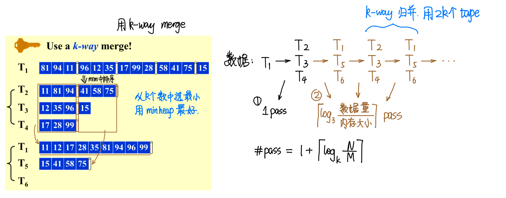
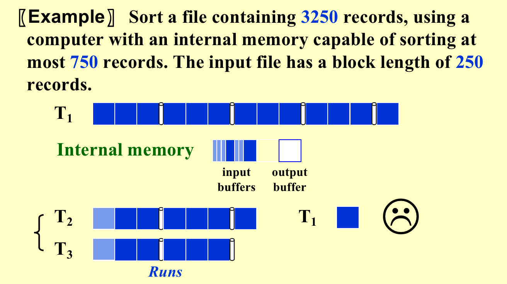
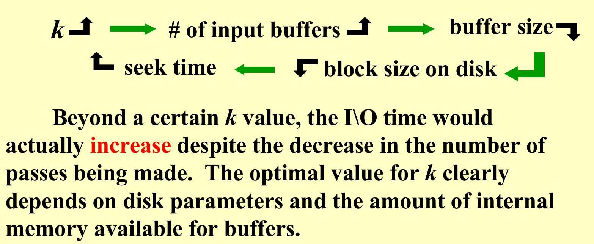
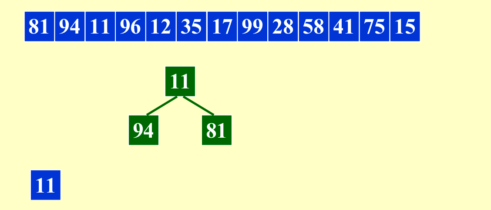
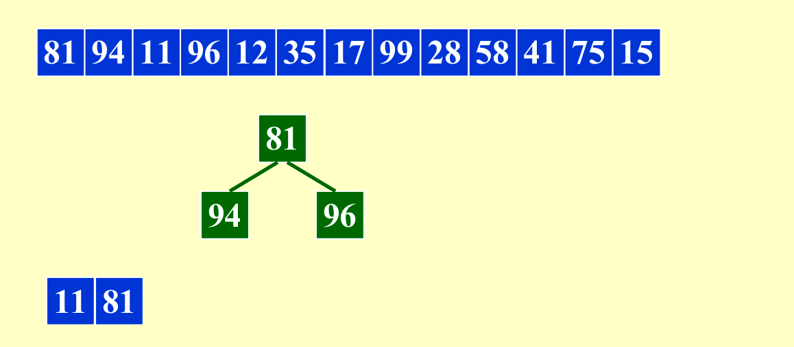
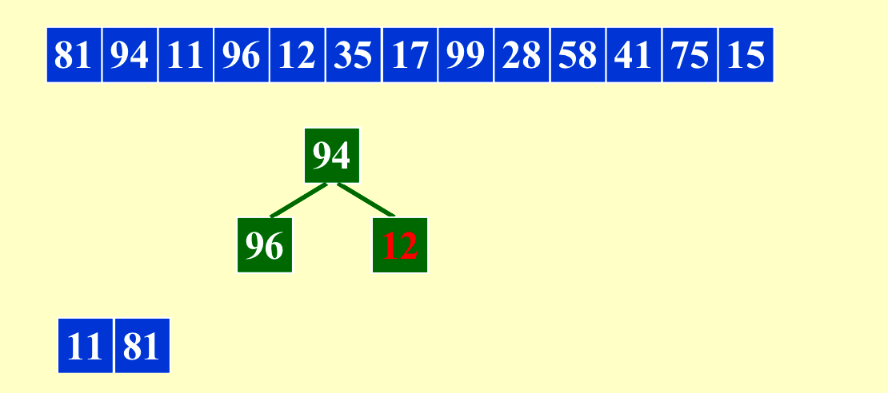
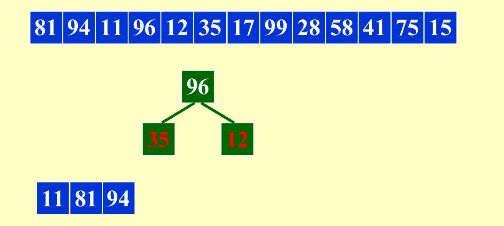
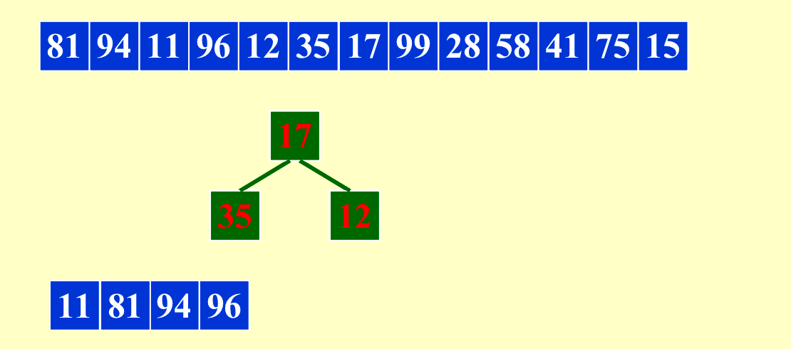
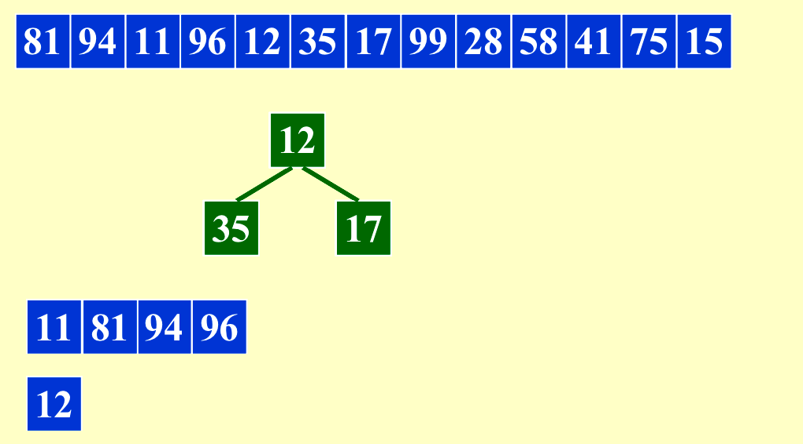
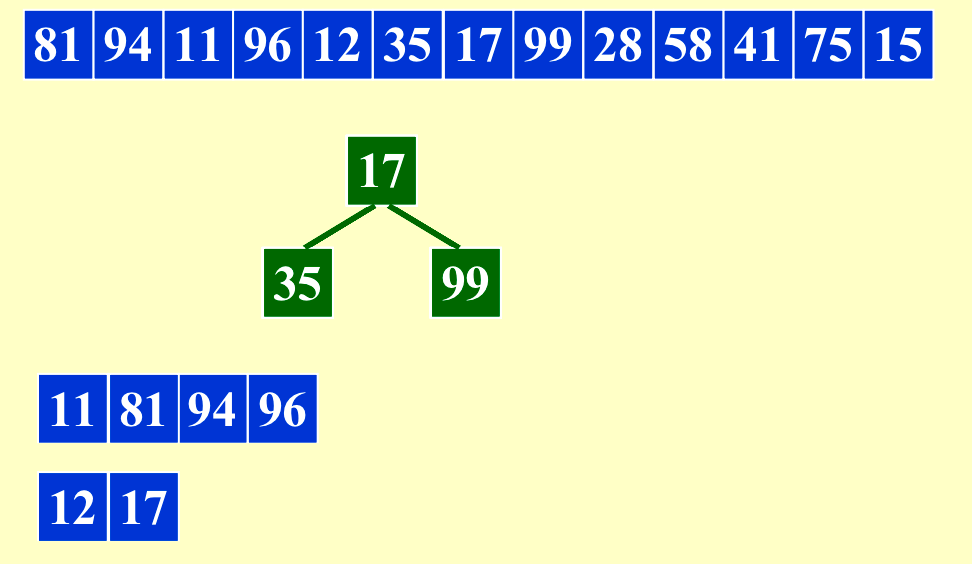

## 1. 概述

处理的数据规模特别大，无法一次性放入内存中。

为什么我们不能在disk上直接进行快速排序？不支持高效率的随机查找。如果在disk中，我们要先找到track，再找到sector，再找到那个数据进行传输。

---

**Example**

一次IO能操作B个元素，那么一次pass需要N/B次IO。

tape: 1.无穷的长度 2.只能够顺序读写不能随机访问

**N是input的大小，M是内存的大小**。内存一次只能存M=3个data，Run就是排序好的block，pass就是如下遍历一次数据。


每个Run的size变成6


全部读入一遍叫作pass，这里需要4次pass来进行排序。也就是$1+[log_2{(N/M)}]$，整数向上取（N/M其实就是run的数目，然后每次合并run的数目减半）。所以如上的$IO_{cost}=N/B*(1+[log_2{(N/M)})]$。

**我们所关心的**：


**目标**：

- 减少pass的次数
- 加快merge
- 使能够parallel
- 让run更长

## 2. 减少Pass

利用堆来进行合并，使用k-way merge来减少pass的次数。（每次几合一，log的底数就是几）



pass的次数降低为$1+[log_k{(N/M)}]$，如果是k-way merge，我们需要有2k个tape（k个放输入k个放输出）。

$(k+2)B \le M (k \ blocks + 2 \ blocks)\to k \le M/B - 2$同时进行k个tape的合并，我们需要k个指针来指向每个tape的当前元素，再用两个block来进行写入（一个负责记录一个负责写回磁盘，详细请看[[#3. Handle Buffers to Parallel]]）。

所以如上的$IO_{costmin}=O(N/B*log_{M/B}{(N/M)})$。

---

**能否减少tape的个数？**

最少只需要k+1个tape，代价是pass的数量可能会变多。

---

比如现在我们有8个长度为2的run，用三条tape就能进行合并。

```
T1: 12 56 34 78 1112 1516 1314 1718

常规思路，平均分到两个tape上，然后两两合并
T2: 12 56 34 78
T3: 1112 1516 1314 1718
合并
T1: 121112 561516 341314 781718 这样无法再合并，行不通

新思路，不均匀分到两个tape上，然后两两合并
T2: 12 56 34 78 1112
T3: 1516 1314 1718
如此进行合并
T1: 121516 561314 341718
T2还剩: 78 1112
再进行合并
T3: 12781516 5611121314
T1还剩: 341718
再进行合并
T2: 12347815161718
T3还剩: 5611121314
再进行合并
T1: 合并结束
```

反向思考

```
tape1 number of runs:0	5	2	0	1
tape2 number of runs:8	3	0	2	1
tape3 number of runs:5	0	3	1	0
类似斐波那契数列
```

所以这样一共需要合并$log_{\frac {\sqrt 5 + 1}2} \frac NM \approx log_{1.6} \frac NM$次，而原来二合一需要的合并次数为$log_2 \frac NM$。

---

那么三合一，怎么构造四条tape？类似之前，之后的每项是之前的三项之和。$F_0=0,F_1=0,F_2=1,F_i=F_{i-1}+F_{i-2}+F_{i-3}$

```
T1: F_{i-1}+F_{i-2}+F_{i-3}		F_{i-2}+F_{i-3}
T2: F_{i-1}+F_{i-2}				F_{i-2}
T3: F_{i-1}						0
T4: 0							F_{i-1}(F_{i-2}+F_{i-3}+F_{i-4})
```

---

**那么k合一，怎么构造k+1条tape？类似之前，之后的每项是之前的k项之和。**$F_0=F_1=...=F_{k-2}=0,F_{k-1}=1,F_i=F_{i-1}+F_{i-2}+...+F_{i-k}$

---

大佬：


## 3. Handle Buffers to Parallel

在上面的2中已经有所提到（复制一遍吧。B就是一次IO的操作个数，也可以看作是并行数，如下图B=250。



$(k+2)B \le M (k \ blocks + 2 \ blocks)\to k \le M/B - 2$同时进行k个tape的合并，我们需要k个指针来指向每个tape的当前元素，再用两个block来进行写入（一个负责记录一个负责写回磁盘。


为了使并行性更加好，我们用2k个buffer来存放input，每个tape对应2个buffer，当一个buffer在进行merge时，另外一个buffer进行读写准备数据。

所以如上的$IO_{costmin}=O(N/B*log_{M/B}{(N/M)})$。

如果B很大，那么一次pass的IO次数也就是时间会很少，但是pass的数量会增多。如果B很小，那么一次pass的IO数量会增加，但是pass的数量会减少。所以B是取中间的某个值。K和B是反比的关系，$K= \frac {1} {d(常数)}(\frac MB - c(常数))$。



## 4. Longer Run

$IO_{costmin}=O(N/B*log_{M/B}{(N/M)})$，一般情况下length of run = M，我们想要run更长，让N/M变小。















我们可以利用这种方法让内存(length of run)最多变成原来的两倍。当原来的输入是比较有序的时候，这个方法会得到非常长的run。

## 5. Minimize the Merge Time

大神已经写的很好了：


## THE END

!!! quote

    1. ADSNotes_Algorithms.pdf(from Carton手写笔记)，本次笔记有三张带笔记的配图是引用，不妥删
    2. ADS15ppt
    3. 小角龙(18)复习笔记.pdf
    4. JerryG(20)复习笔记.pdf
    5. 智云课堂：2023myc