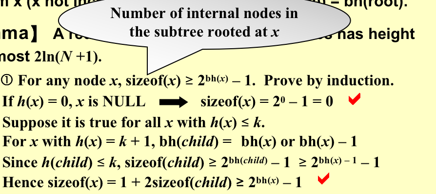
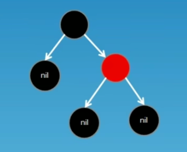
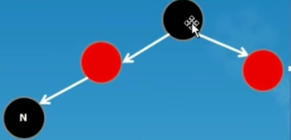
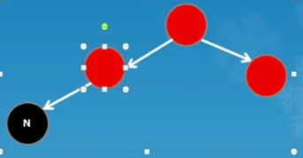
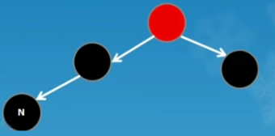
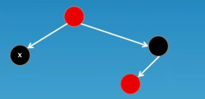
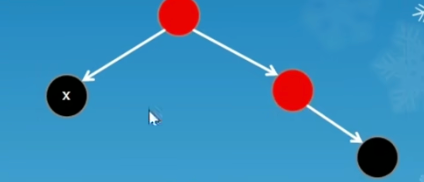
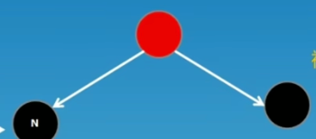
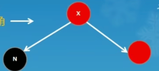
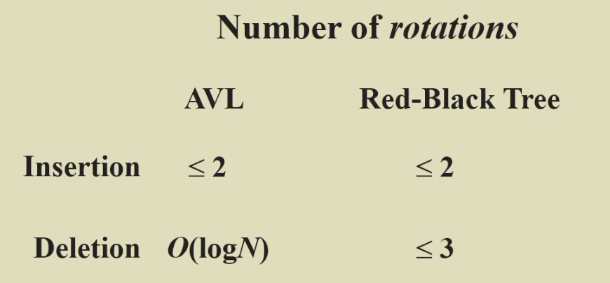

## Red-Black Trees
### 1. Definition
A red-black tree is **a binary search tree** that satisfies the following red-black properties:
- Every node is either red or black.
- The root is black.（头尾都是黑）
- Every leaf (NIL，外部结点) is black.
  - NIL结点是原来的整棵树的结点数加一；
- If a node is red, then both its children are black.（不可能有两个红的相连）
  - 保证红的肯定比黑的少；
- For each node, all simple paths from the node to descendant leaves contain the same number of black nodes.
  - 保证黑点数量一样，保证每一条path的长度比不会超过2，树的高度不会超过两倍的黑高；

>平衡二叉树：高度保持logN的二叉树；

>black-height(bh)是指从当前点（不包括当前点）到叶结点路径中，黑色结点的个数，bh(Tree)=bh(root)；

>A red-black tree with N internal nodes has height at most 2ln(N +1).
>
>证明：
>
>

### 2. Insert

加入红色结点，如果加在黑点后面，那就结束了，如果加在红色结点后面，那么就有后面几种情况：

判断不同的情况直接看uncle（上一代的subling），如果是红的，就是情况一，如果是黑的就是情况二三；

- case1: 改变一下颜色，把这棵子树的的根结点记为P（现在是红色）；
  - 如果P就是整棵树的根结点，直接标黑；
  - 如果P的父母是黑的，没事；
  - 如果P的父母是红的，那就又冲突了；

- case2: 做一次rotate后变成case3；
- case3: 改变一下颜色，做一次rotate；
- 一次插入最多两次旋转，代价非常小，T = O( h ) = O( lnN ) ；

### 3. Delete 

>推论：如果有一个节点，只有一个子节点，那么这个结点一定是黑色，而子节点一定是红色；

- 跟二叉搜索树一样地进行删除操作，到最后一定会退化成删除单个节点，或只有一个子树的节点；
- 恢复红黑树的性质；
  - 若删除叶子红色节点，直接删除即可；
  - 若删除单子树节点，那么这个节点一定是黑色的（刚刚上面的推论），那么也很简单，直接删除，把后面的接上来并修改颜色即可；
  - 稍微复杂的是删除单个黑节点；
    - 黑兄弟，右红侄/双红侄（无论黑兄弟有没有左孩子，无论父亲什么颜色）：左旋父，祖染父色，父叔黑；
    
    - 黑兄弟，左红侄（当没有右红侄的时候，无论父亲什么颜色）：右旋兄，交换兄弟与其右子颜色，变成情况一；
    - 黑兄弟，双黑侄（其实是两个NIL节点，无关父亲颜色）：兄弟红，用递归，遇根或红节点，染黑回；
    
    - 红兄弟：左旋父，父、祖换色，变成前三种情况递归处理；

### 4. Compare

## B+ Trees

### 1. Definition

A B+ tree of order M is a tree with the following structural properties：

- The root is either a leaf or has between 2 and M children.（树的根或者是一片树叶，或者其儿子数在2和M之间）
- All nonleaf nodes (except the root) have between [M/2] and M children.
- All leaves are at the same depth.

> 数据库的基础，先索引（在内存），再寻址（在硬盘）。 
>
> B-树就是非叶节点也存储信息；

### 2. Insert

### 3. Delete

- delete如果到了下限，先看兄弟们有没有能合并的，如果没有，再把父节点下移；

[大佬博客](https://www.cnblogs.com/nullzx/p/8729425.html)

> 听课：2022yds，mooc，2023myc，2022hqm，B站六号智能