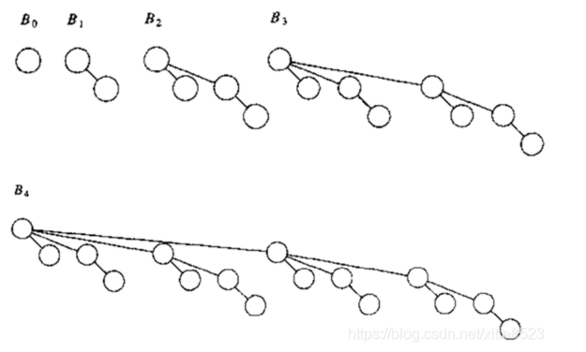
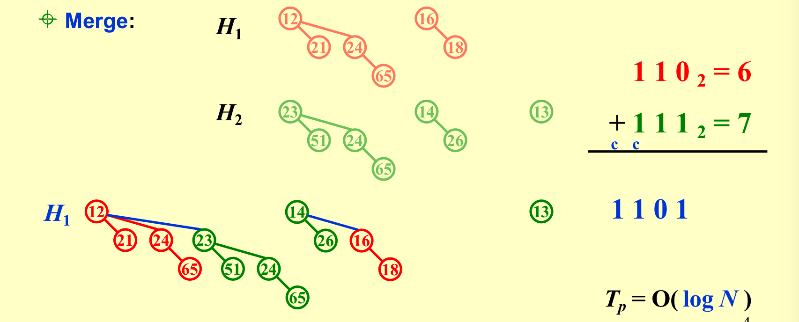
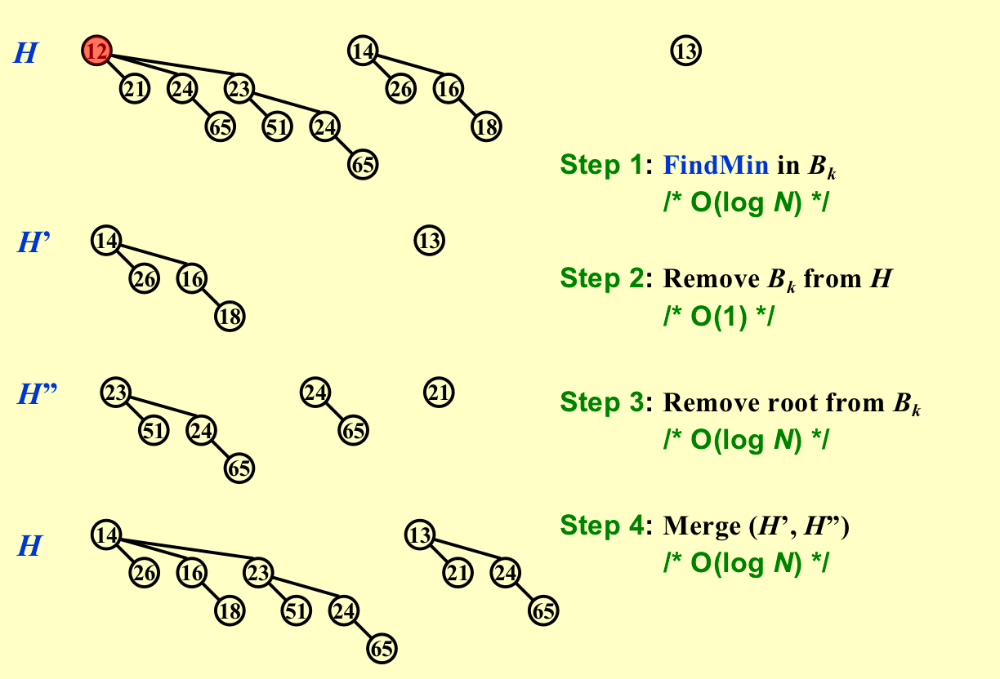
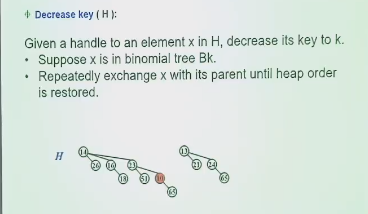
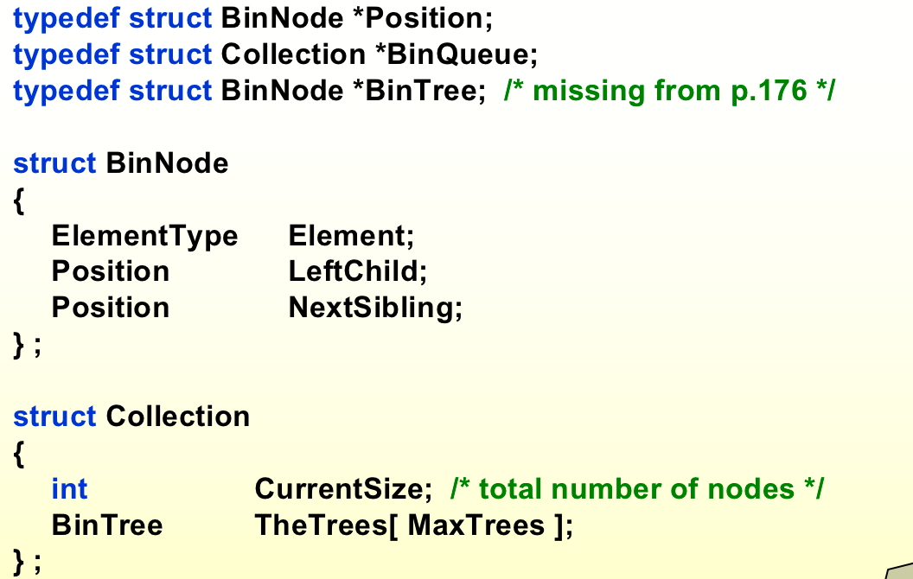
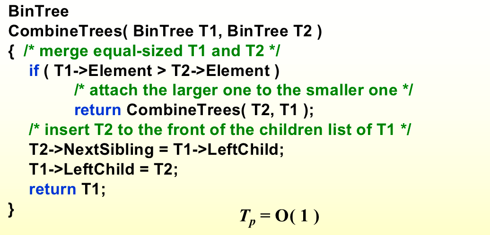
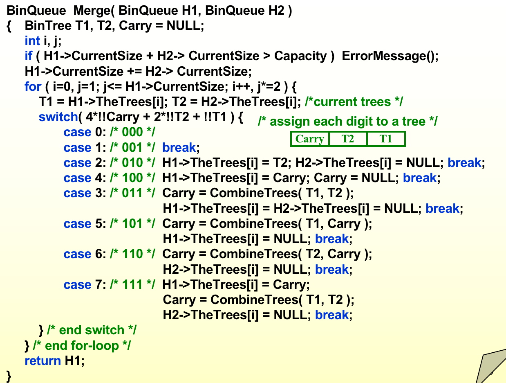
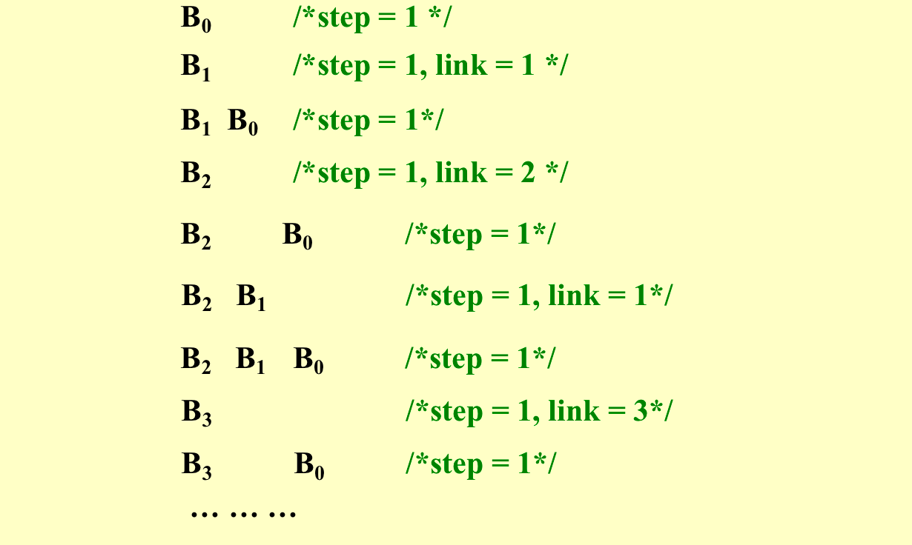
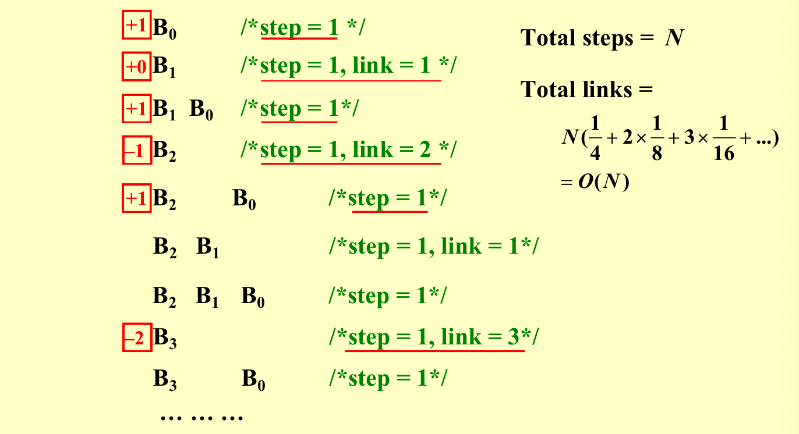
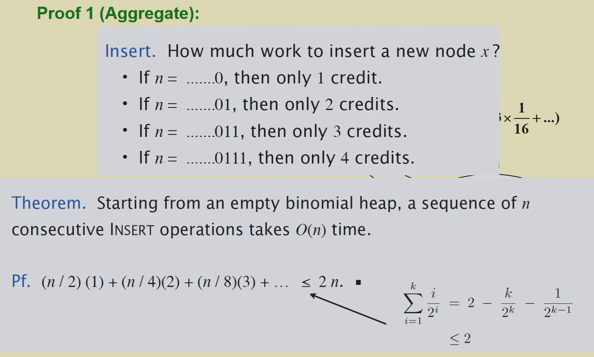

### 1. Definition

- target：左式堆将插入、合并和删除最小元的操作控制在$O(logN)$，尽管时间已经够少了，但二项队列进一步降低了这个时间。二项队列（binomial tree）以**最坏时间$O(logN)$支持合并和删除，并且插入操作平均花费常数时间**。
- 二项队列不是一棵树，而是树的集合，称为森林，这里的树有特定的形式，同时也具有堆序性，叫做二项树（binomial tree）。如图为一个二项队列，有B0, B1, B2, B3, B4五棵二项树。可以看到，二项队列具有以下特性：
  - 高度为k的二项树$B_k$通过将高度为$B_{k-1}$的二项树接到另外一棵高度为$B_{k-1}$的二项树的根上构成；
  - 二项树$B_{k}$由一个带有儿子$B_0$，$B_1$·····$B_{k-1}$的根组成（形状上），从$B_{k}$的构成过程可以知道这个特性，在构成$B_{3}$的过程中，经历了根节点接上$B_{0}$，$B_{1}$，$B_{2}$的过程；
  - 高度为k的树有$2^k$个节点，第k棵树的节点会等于第k-1棵树的节点乘2；
  - 对于每个$B_k$，深度d处的节点数为二项系数$C_k^d$；

### 2. Operations

#### 2.1 FindMin

- 最小的值就在根中，而根最多有$logN$，所以时间复杂度$O(logN)$；
- 我们可以跟踪记录最小的根，那么时间复杂度就变成了$O(1)$；

#### 2.2 Merge

- 
- Must keep the trees in the binomial queue **sorted by height**；
- 时间复杂度为$O(logN)$；

#### 2.3 Inset

- 可以看成是特殊情况的merge；
- 

#### 2.4 DeleteMin

- 

#### 2.5 Decrease key

- 

- 减少key的值，这样的话为了保持堆的有序性，要不断地与父亲进行比较交换，时间复杂的为$O(logN)$；

### 3. Implementation

| 操作      | 性质                    | 解决方法                                 |
| --------- | ----------------------- | ---------------------------------------- |
| DeleteMin | 要快速找到所有的subtree | 用链表实现Left-child-next-sibing         |
| Merge     | 孩子要跟据大小进行排序  | 新的树一定是最大的，以此来维持大小排序； |

!!! note "数据结构"
    注意注意，真正实现二项树使用firstchild-nextsibling的方法！这里的编程细节比较多，容易出填空题啥的......反正这些算法实现都挺重要的！

两个感叹号可以把任何一个数转化成1或者0；

### 4. 摊还分析

- A binomial queue of N elements can be built by $N$ successive insertions in $O(N)$ time.

Proof1(Aggregate normal)

- 如图所示，step表示插入代价，link表示连接代价，link其实就是进位；
- 所以总的step代价就是n，link代价其实也是O(n)，得证；
- 
- 观察，发现，插入代价越小，树的数目就会增加；
- 代价为1，数目加一；代价为2，数目不变，代价为3，数目减一……
- 

Proof1(Aggregate yds)

- 如果最后一个树是0，那么cost就是1，如果倒数第二颗树是0，那么cost就是2，这样子以此类推……
- 所以最后是0的有n/2个，最后是01结尾的有n/4个……
- 然后加起来就对了；

- 

Proof2

- 根据树的变化数目就是2-cost；
- C~i~ 表示第i步插入的实际cost，φ~i~ 表示经过第i步插入后树的数量；
- 

- 

- 

!!! quote "参考资料"
    1. ADS05ppt
    2. 智云课堂：2022yds，2023wc
    3. 小角龙(18)复习笔记.pdf
    4. JerryG(20)复习笔记.pdf

