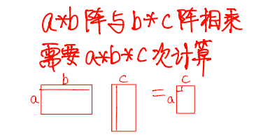
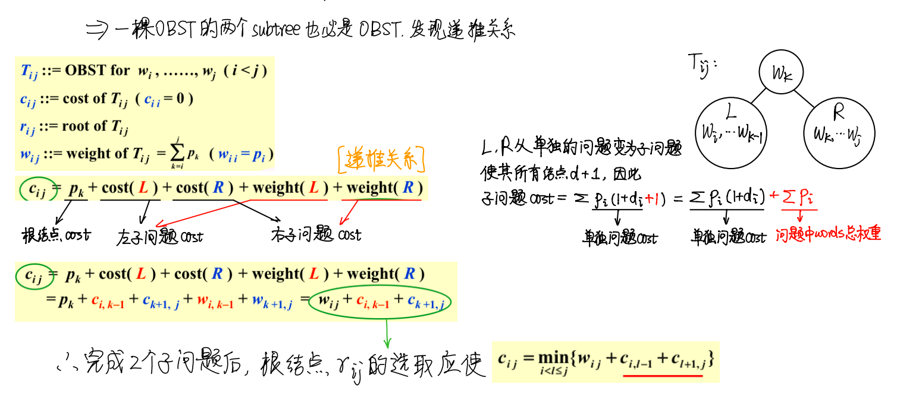
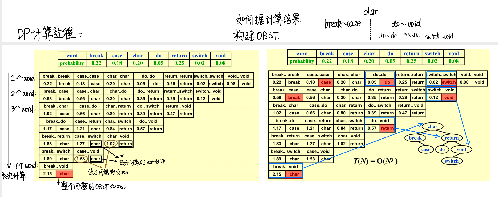
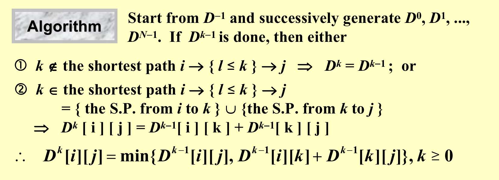
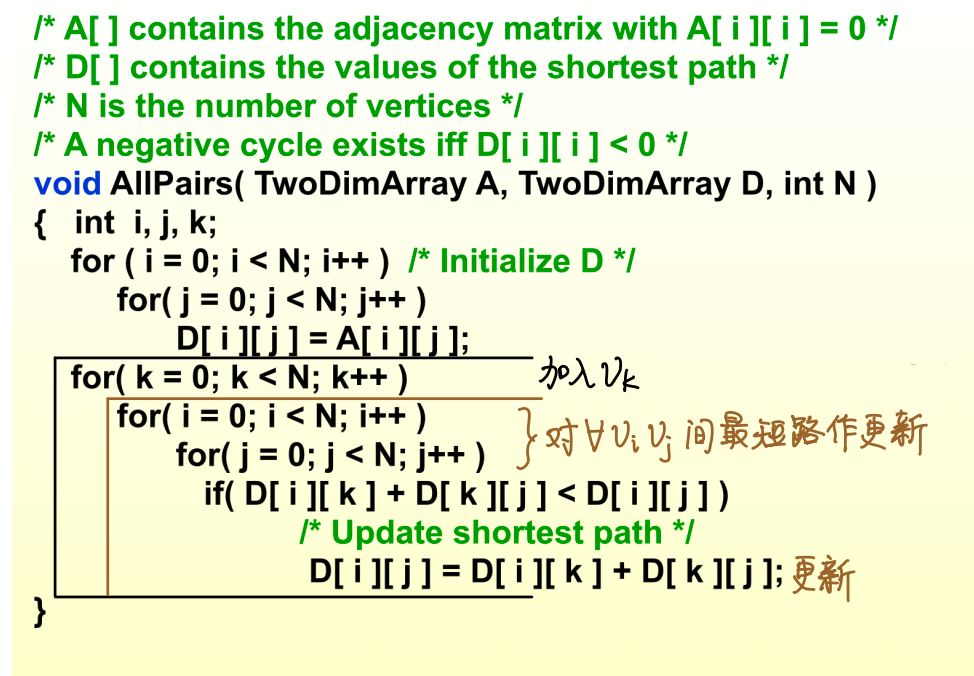

### 0. 概览

- 如果设计动态规划方法？（条件是有最优子结构和重叠子问题，比如有历史依赖性的时候就是不成立的）
  - 找出最优解(Characterize an optimal solution)；
  - 递归地定义最优解的值(Recursively define the optimal values)；
  - 用一定的顺序去计算最优解的值，通常采用自底向上的方法(Compute the values in some order)；
  - 利用计算出的信息构造一个最优解(Reconstruct the solving strategy)；
- 两种方法：
  -  第一种方法称为**带备忘的自顶向下法（top-down with memoization**）。此方法仍按自然的递归形式编写过程，但过程会保存每个子问题的解（通常保存在一个数组或散列表中）。当需要一个子问题的解时，过程首先检查是否已经保存过此解。如果是，则直接返回保存的值，从而节省了计算时间；否则，按通常方式计算这个子问题。我们称这个递归过程是带备忘的（memoized），因为它“记住”了之前已经计算出的结果。
  - 第二种方法称为**自底向上法（bottom-up method）**。这种方法一般需要恰当定义子问题“规模”的概念，使得任何子问题的求解都只依赖于“更小的”子问题的求解。因而我们可以将子问题按规模排序，按由小至大的顺序进行求解。当求解某个子问题时，它所依赖的那些更小的子问题都已求解完毕，结果已经保存。每个子问题只需求解一次，当我们求解它（也是第一次遇到它）时，它的所有前提子问题都已求解完成。
  - 两种方法得到的算法具有相同的渐近运行时间，仅有的差异是在某些特殊情况下，自顶向下方法并未真正递归地考察所有可能的子问题。由于没有频繁的递归函数调用的开销，自底向上方法的时间复杂性函数通常具有更小的系数。
- 核心：（找到最优子结构）在递推过程中避免多次求解同一个子问题，用表记录下来它的结果。

### 1. Fibonacci

原本的复杂度O(N) -> 递归复杂度O(2^N^)，递归有大量重复的运算。

Solution:

- 方法一：在过程中用表记录计算结果，算过的直接查表；
- 方法二：不是用递归，直接计算记录下来最近的两个数，自底向上直接进行计算；

### 2. Ordering Matrix Multiplications（矩阵乘法的顺序）

**1. 问题描述：**

不同的计算顺序下，矩阵乘法的计算量有很大差别，如何才能找到计算量最小的计算顺序很重要。

**2. 总共的情况：**

**3. 找出子问题——求m~ij~：**

理想情况是，m~il~和m~l+1j~已经存在表中，再对m~ij~进行计算

也就是说用O(N^2^)大小的空间来存储m~ij~的结果

**4. 具体算法：**一层一层地进行计算

**5. 最后一步——合并子问题**

### 3. Optimal Banary Search Tree（最优二叉搜索树）

**1. 问题描述：**

给定词的频率，如何进行二叉搜索树的构建可以使期望代价最小。

总代价：d~i~就是深度

**2. 具体问题**

**3. 找出子问题** 

weight：当前OBST所有节点概率的和

完成最优子结构的寻找拆分后，递归表达式其实跟刚刚的矩阵相乘差不多，那么就一个一个节点去试就好了，也就是l取i～j之间的每一个值。

**4. 建立表格并计算结果**

T(N) = O(N^3^)

### 4. ALL-Pairs Shortest Path（任意两点之间的最短路径）

**方法一：**用dijkstra算法，对每个结点使用一次，时间复杂度为O(V^3^)，对于稀疏图比较快。

**方法二：**
k的意思是从i到j只能经过比k小的点，当k不断变大，这个距离可能会变小，D^-1^相当于不经过其他的点

**找到子问题**

分为k在i到j的最短路径中和k不在i到j的最短路径中，求两者的较小值，但是如果有**负圈**的话就不行，这样就不能保证成立，因为可能两个加起来会有一个圈，此时如果圈是负的，那么就还要把圈减掉，那就不对了；当然有**负边**是可以的。 

**代码实现**

**引申思考**

如果每条边的权重都是一，怎么进行简化？

矩阵相乘+分治法。直接邻接矩阵相乘，邻接矩阵的n次方（用分治法去求logN）就代表从这个点经过n条边到另一个点的路径数量，所以比N^3^肯定要小。

### 5. Product Assembly（产品装配线问题）

**问题概述**

一些零件需要被装配成一辆车，有两条生产线，零件可以在两条生产线之间来回切换

最基本的方法需要O(2^N^)时间和O(N)空间

**定义子问题**

从0～N的optimal solution一定对于中途的每一个工序来说都是optimal的，对过程中任意的stage，要么从line0来，要么从line1来，到达stage的optimal path由到达stage-1的optimal path来，这就是递推关系。

**具体代码**

只需要O(N)的时间和O(N)的空间

> 参考：Carton手写笔记，yds（2023 23.4.18）

