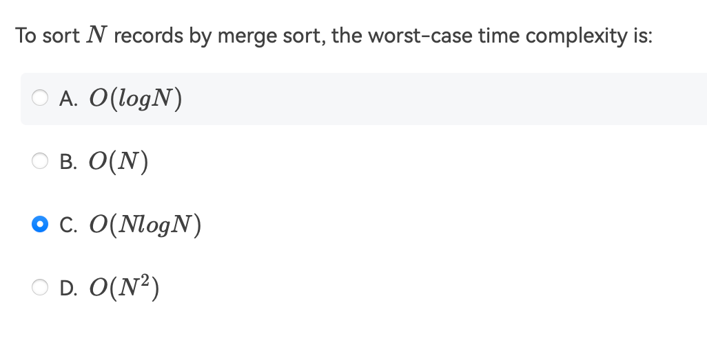

#### 判断题：稳定排序和不稳定排序区别
##### 1. 稳定排序
- 插入排序：在一个有序的序列中插入一个数，使插入后的序列保持有序。因为插入的过程中都是从后向前进行查找，遇到小于等于(或大于等于)的数停止寻找，进行插入操作。不改变排序前后相等数值的相对顺序，故使稳定的排序算法。

- 冒泡排序：冒泡故名思义，数值小的向上飘，数值大的向下沉，向上飘的数遇到的小于等于当前数的值停止，向下沉的数遇到大于等于当前数的数停止，类似于对于向上飘的数有个排序之前在其前面数值相等限制了其向上飘的脚步，原先在俺之下，排序后也在俺之下，向下沉也是同理。故也是稳定的排序算法。
 
- 归并排序：将一段序列分为若干个小序列进行排序，排序后的小序列进行合并得到最后的排序结果。主要运用了分治的思想。分成的前后若干个小序列在最后进行合并时本身就包含了前后位置信息，在合并时不改变相同值在排序前后的相对顺序，故归并排序也是稳定排序。

- 基数排序：按从低到高的相应位的值进行排序，也是稳定排序算法。
##### 2. 不稳定排序
- 选择排序：[1，2，4，2，5，3 ] 主要思想是分别找出当前遍历元素中的最小值与相应位置的数进行交换，第一遍寻找元素的从第一个元素起的最小值(或最大值)和第一个元素进行交换，第二趟寻找从第二个元素起最小的(或最大的)元素与第二个元素进行交换，以此类推。[3,3',2]    排序后  [2,3',3]

- 快速排序：[5，3，3，4，3'，8，7]  排序后[3',3,3,4,5,8,7]

- 希尔排序：一次插入排序是稳定的，多次插入排序不是稳定的。

- 堆排序：不是稳定排序算法，下次补充。

#### 选择题T3

- 

