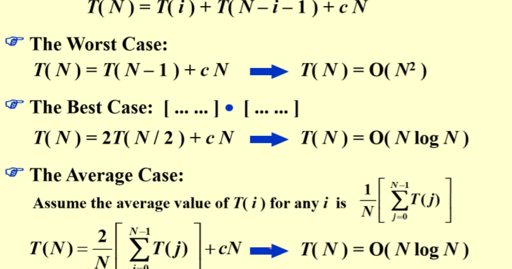
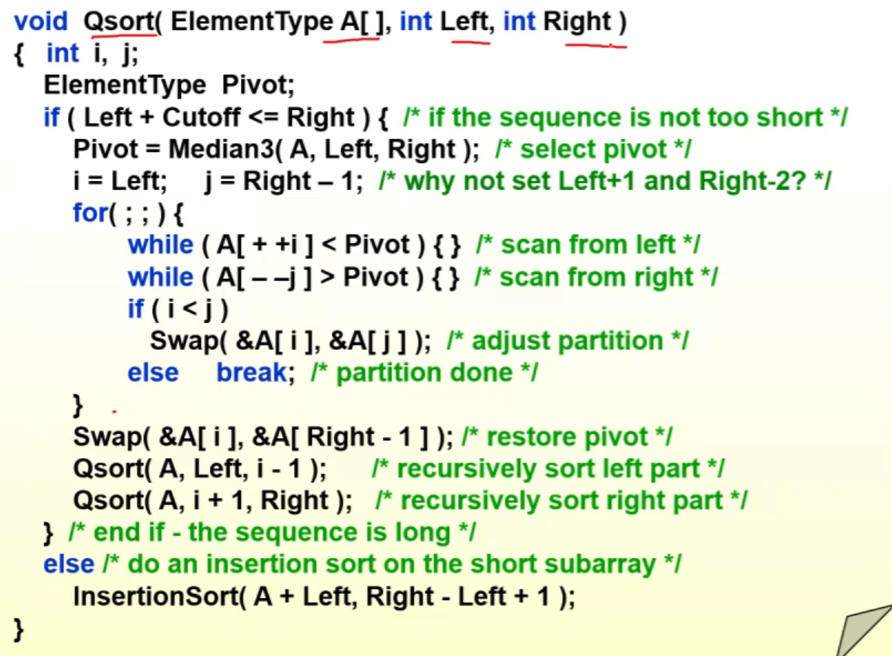
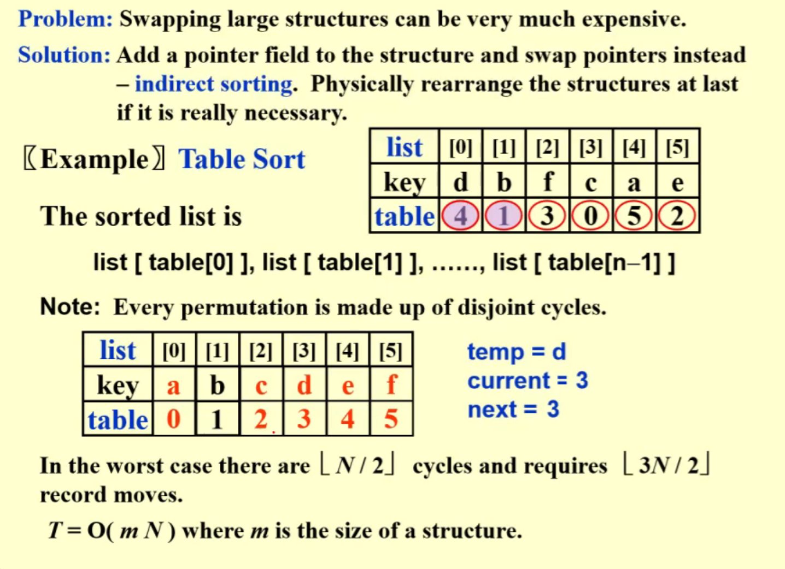
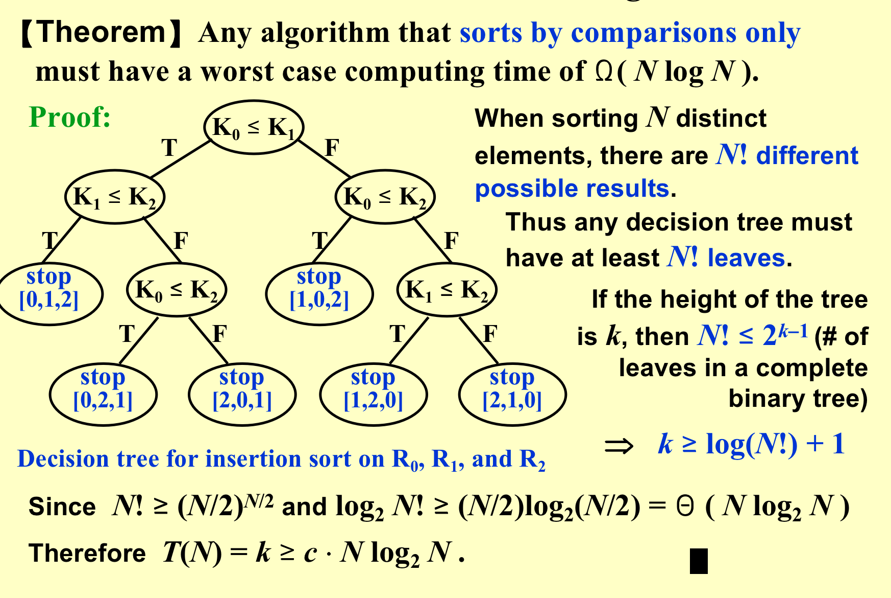
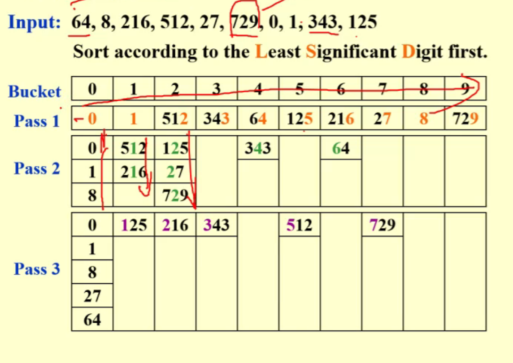

```toc
```
### Quicksort
#### 1.时间

- 前者为归并排序的递归式，后者为快速排序的递归式；

- 

- 他们都是最慢n^2^，最快nlogn；

- 

#### 2. 步骤

1. pivot[[fds_lec11#4.1 算法]]；
2. partition（不额外占用空间）[[fds_lec11#4.1 算法]]；

#### 3. 空间复杂度
- O（log2n）；因为递归需要堆栈的空间，需要空间，平均情况是log2n；

#### 4. 代码实现
##### 4.1 总体思路
- 
##### 4.2 总的函数
- 
##### 4.3 寻找pivot

- 首先
- 然后
- 最后返回

- 

##### 4.4 主要函数

- 先判断是否需要快速排序
- 寻找pivot
- 双向扫描

- 

#### 5. 一个额外的问题：找到第k大的元素

- 排序；
- 建堆，删除k次；
- 找pivot，如果比pivot的小的数组有k-1个，那刚好，如果大于k-1，就在小的数组里面继续找pivot，如果小于k-1，就在大的数组里面找；

### Sorting Large Structures

- 排大结构时候不要挪动对象本身，设定一个table；
- 然后知道最后的位置后，进行换位；
- 

### A General Lower Bound for Sorting（决策树）

- 

###  Bucket Sort and Radix Sort
#### Bucket Sort
- 数字范围较小，桶排序；
- 

#### Radix Sort
- 数字范围较大，基数排序；
- 第一步根据个位数，扔到桶里去；
- 然后根据十位数，根据百位数......
- 


