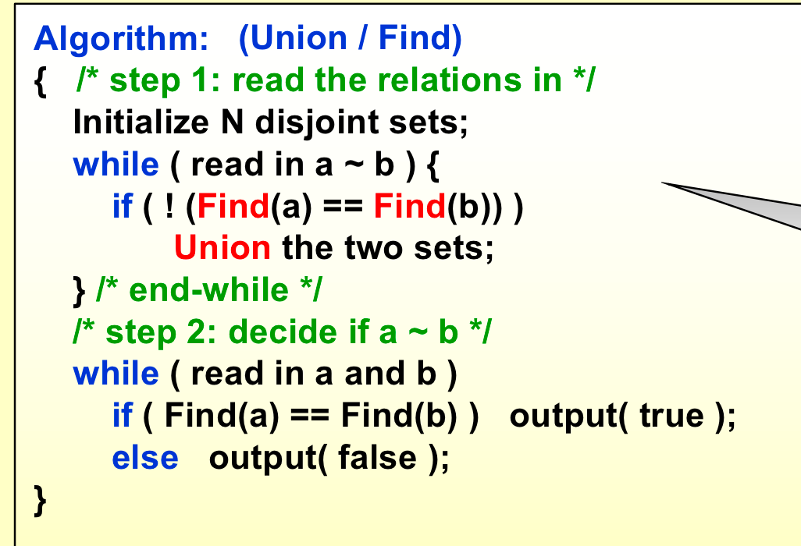
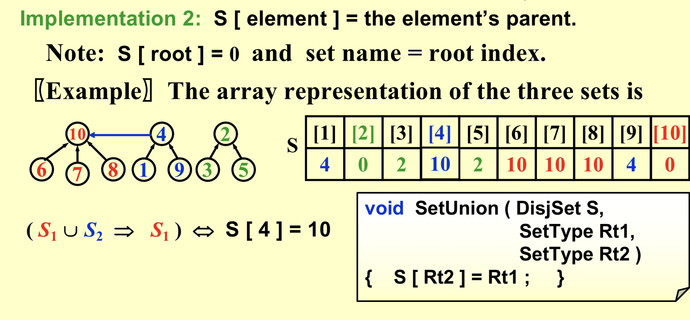
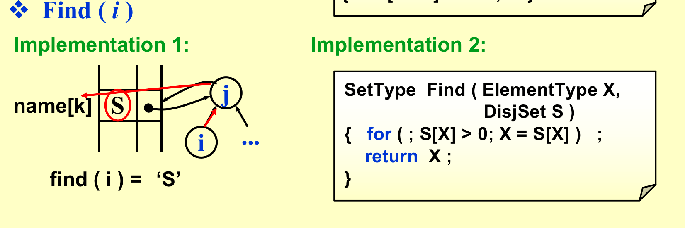
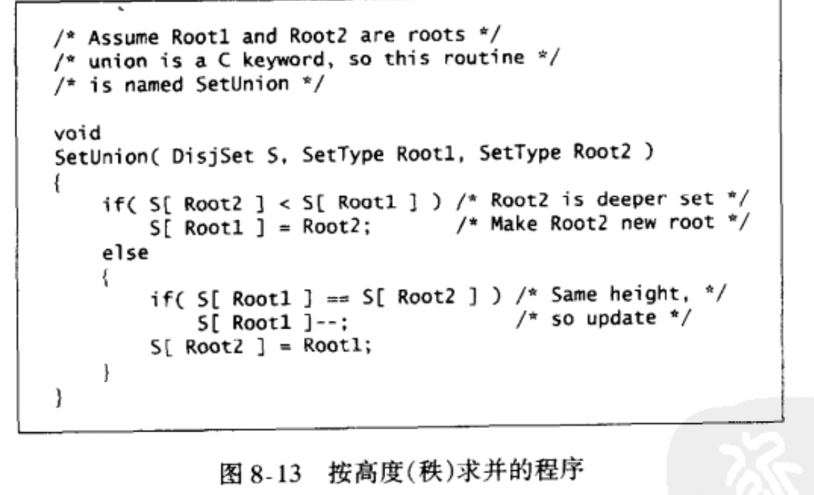
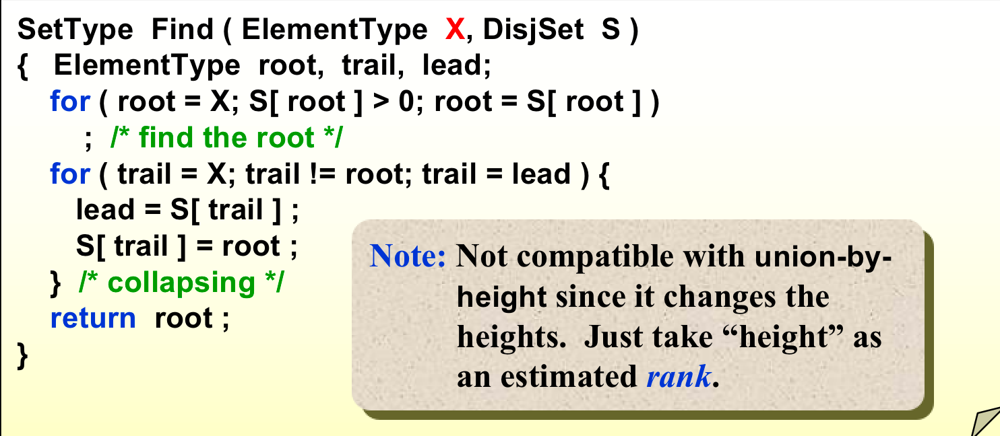
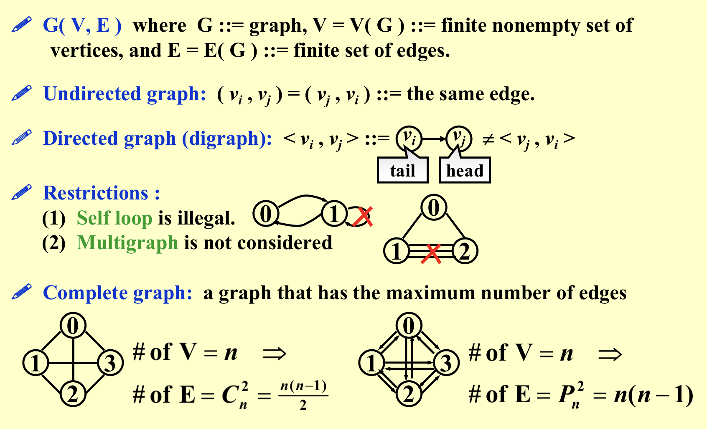
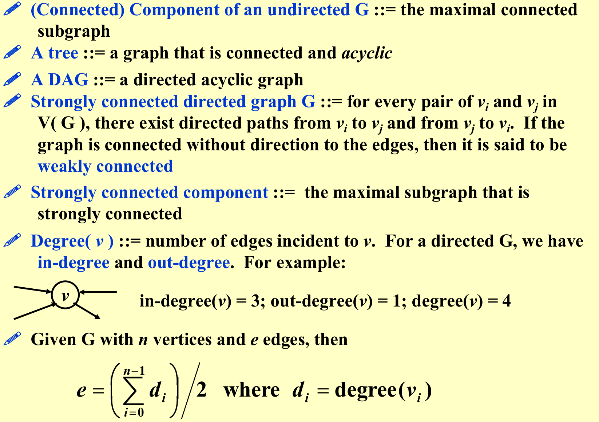

## The disjoint set ADT
等价类划分，不是数据结构，是一个问题。
### 1. Equivalence Relations（等价关系）
#### 特点：自反，对称，传递

### 2. The Dynamic Equivalence Problem
#### 2. 1 operations（管理集合）
1. `Union`：合并集合；
2. `find`：查找元素所在集合；

#### 2.2 实现
1. 链表。`union`方便，使用循环链表，但是`find`很麻烦。
2. 树。把树合并，找到树的根两个操作。

### 3. Basic Data Structure
数组下标代表元素，数组数值代表parent指针。
`union`：把一个根赋值另一个根；

`find`：向上寻找；

### 4. Smart Union Algorithms（优化`union`操作）
1. Union-by-Size

2. Union-by-Height

### 5. Path Compression（优化`find`操作）
`find`时，自动把路径上指向根。
#### 两种实现算法
1. 递归；

2. 循环：两个指针一前一后；

### 6. Worst Case for Union-by-Rank and Path Compression

> 树是保证连通关系的最少边；
> Union-by-Height不能和Path Compression一起用；

## 期中考试
程序填空，判断题，选择题，期中考试到此为止；

## Graph Algorithms
### 1. Definitions
- G(V, E)
- Undirected graph（无向图）
- Directed graph(digraph)
- Compelet graph（完全图）：任意两点都有线；

- adjacent：任意两点之间有边；
- subgraph：V，E都是子集；
- path（路径）：一堆点的序列；
- simple path：路过的点不重复（头尾除外）；
- Cycle：头尾一样；
- 两点间connect：之间有路径；

- 连通图：任意两点都是连通的；
- DAG：有向无环图；
- 强连通图：任何两点间都有路；
- 弱连通图：当成无向图是连通的；
- 强连通子图：
- degree(v)：几条线，出度，入度；

### 2. Representation of Graph
- 利用邻接矩阵的二维数组；

- Adjacnecy Lists（邻接表）：

  指出去的结点连接起来的链表；
  逆邻接表：指向自己的结点连接起来的链表；

