```toc
```
### 1. Acyclic Graphs
- CPM(Critical Path Method)
	- 边之间有先后关系；
	- 边有权重；

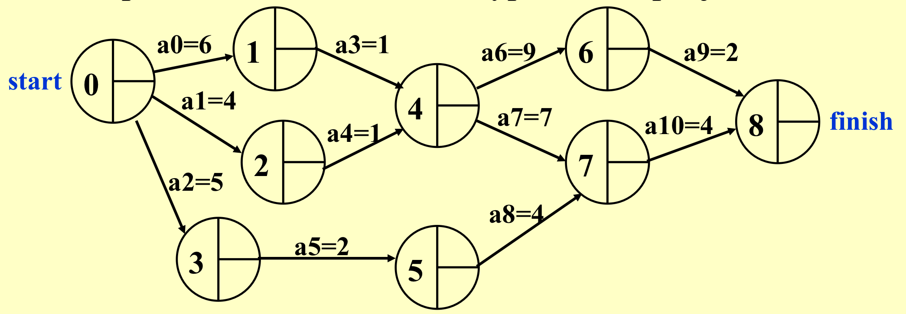

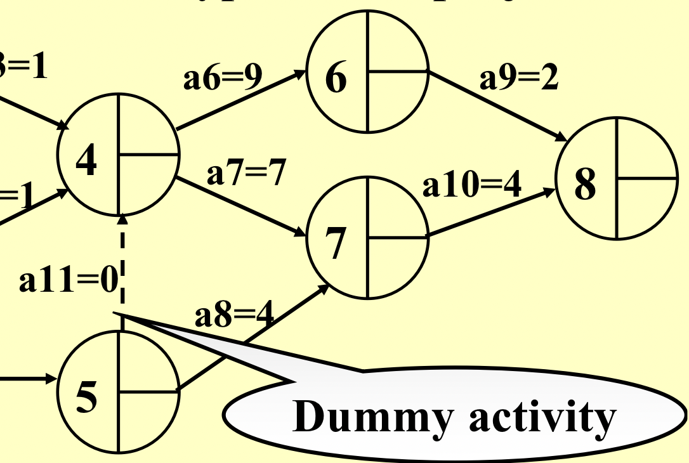

- 解决方案：
1. 算出每个结点最早结束的时间，左边到自己的最大值；
	

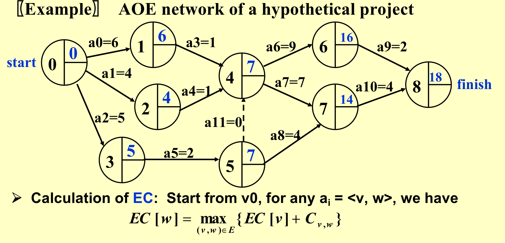

2. 算出每个结点的可以的最晚时间。右边到自己的最小值；

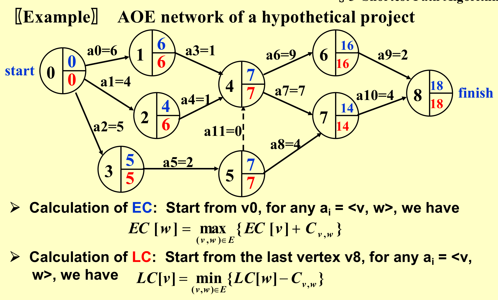

3. 算出拖延时间；


4. 所有不能拖延的点连起来就是关键路径；


### 2. All-Pairs Shortest Path Problem

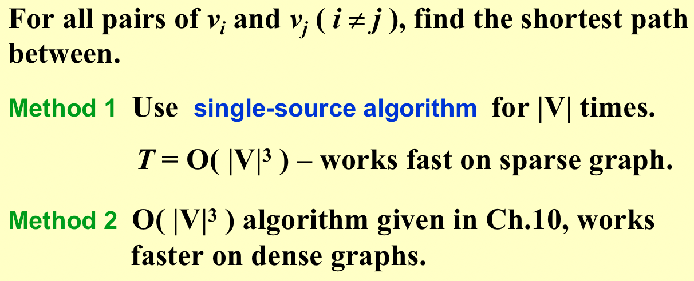


### 3. Network Flow Problems
- 求出从起点到终点最大流量是多少；

1. 解决方法一：

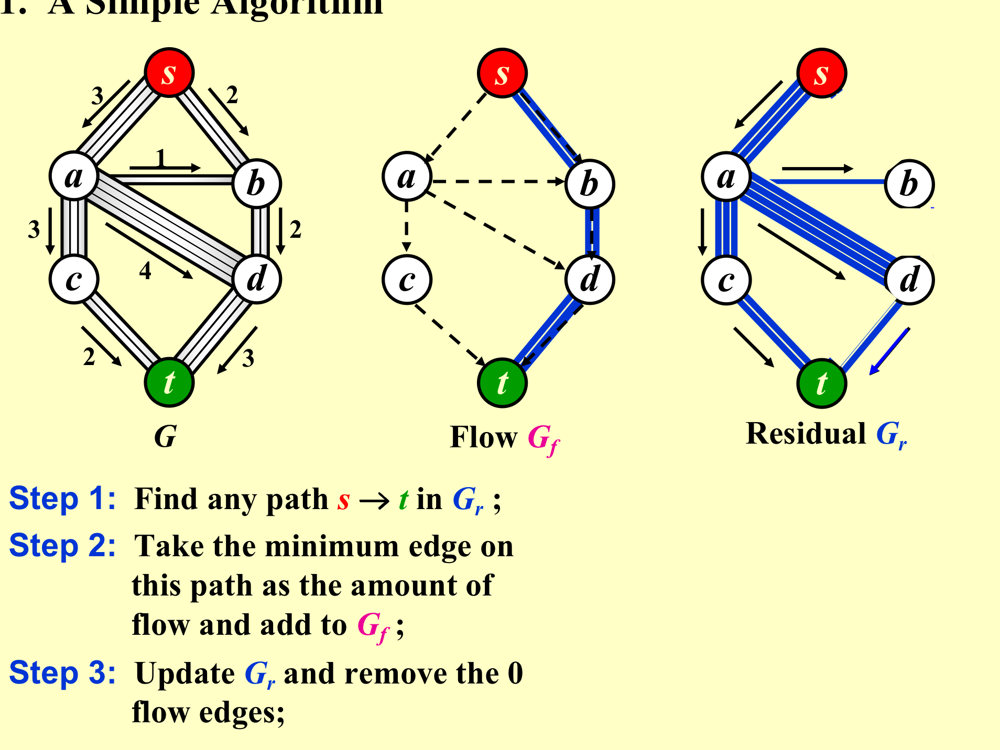

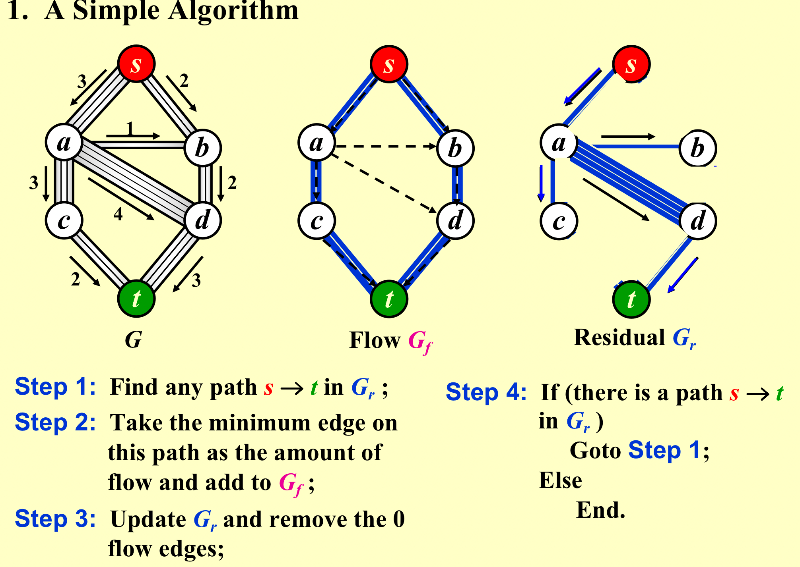

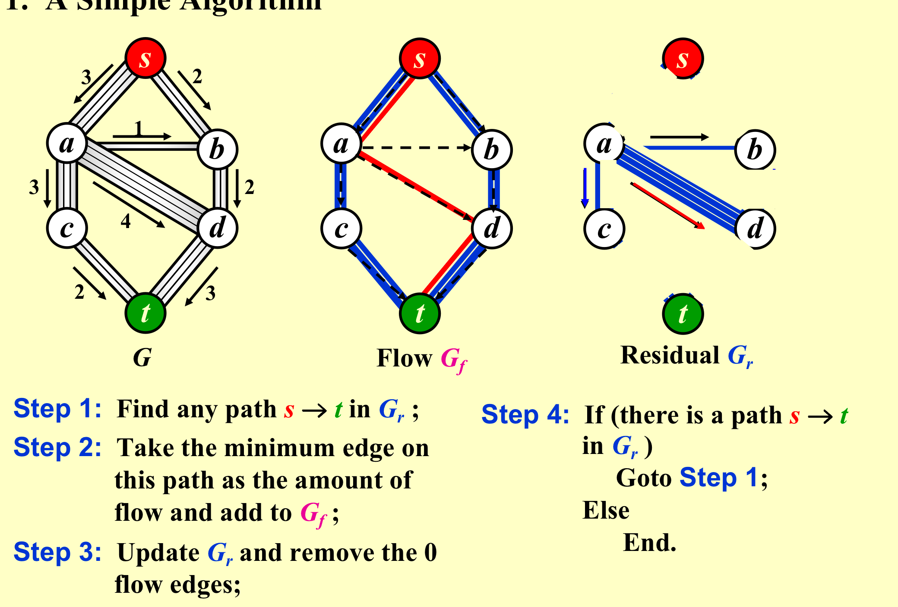

- 这个方法不一定能找到最佳路径，挑错了就找不到最优解了；

2. 解决方法二（allow the algorithm to undo its decisions
）

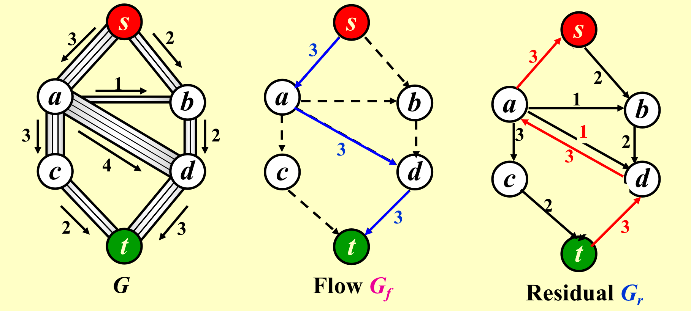

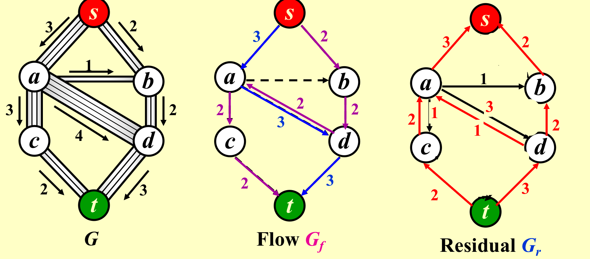

- 老师这个问题一笔带过了……

### 4. Minimum Spanning Tree
- n个结点，n-1条边，是连通的生成树；

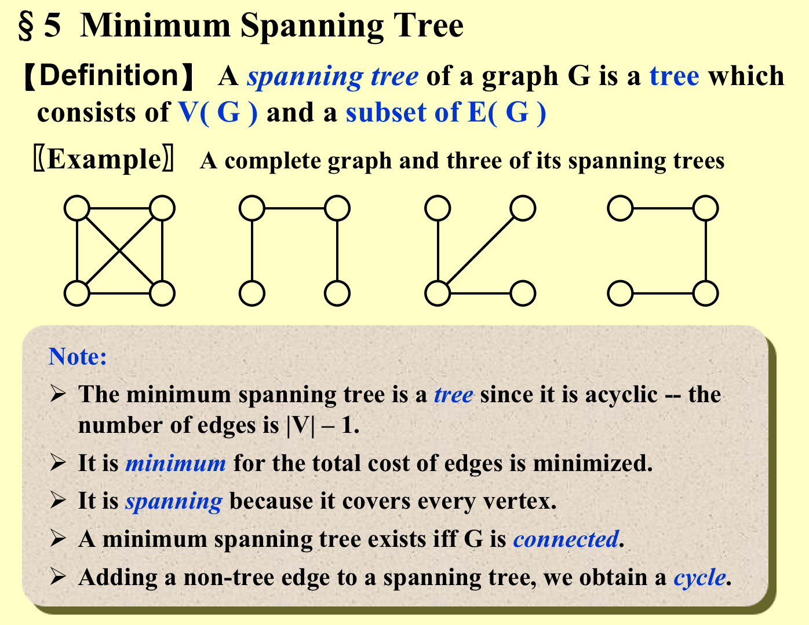

1. Kruskal’s Algorithm（以边为核心）

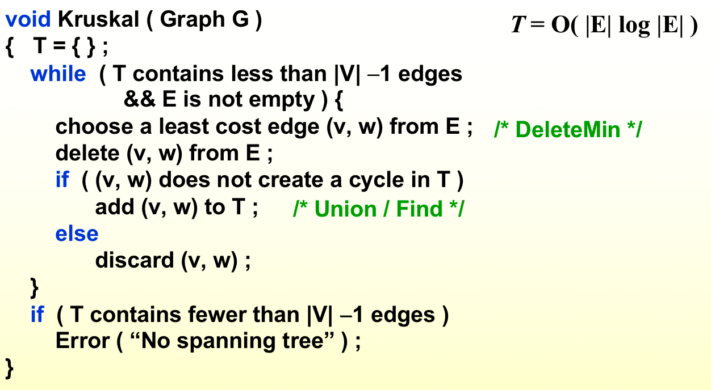

- 判断是否有环可以使用等价类，利用Unionfind，连一起就是同一个等价类；

2. Prim’s Algorithm（以点为核心）
- 找出跟局部生成树连接最小边并一直保持是树；

