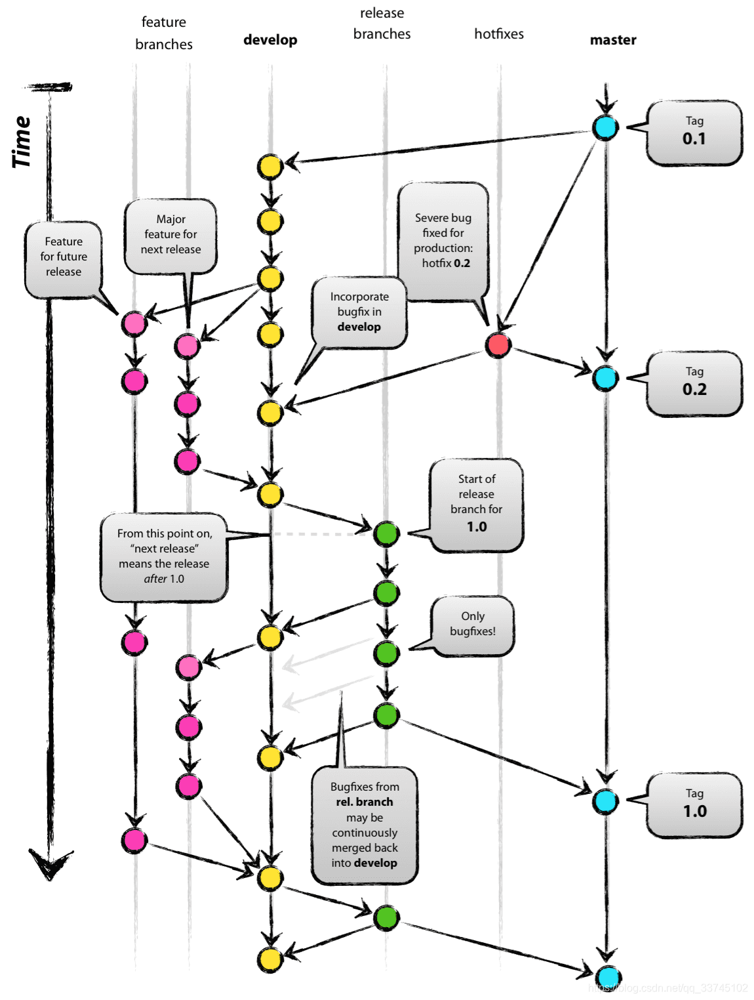
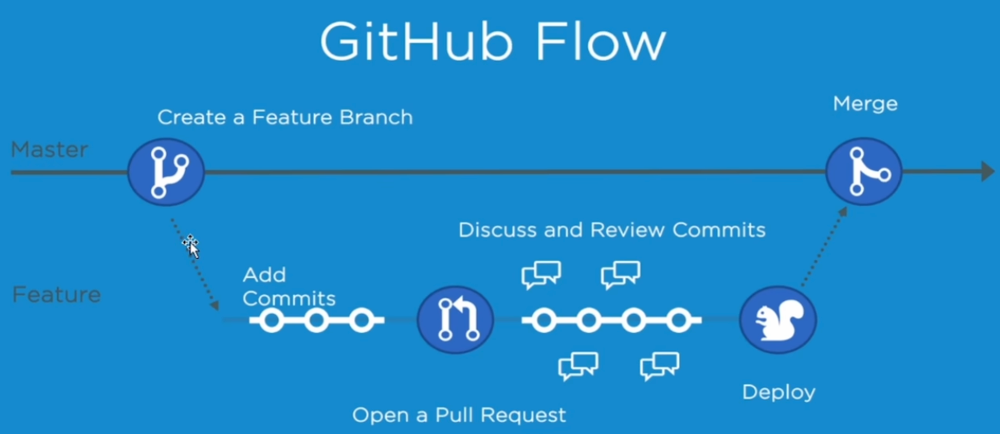

# Git

[【GeekHour】一小时Git教程](https://www.bilibili.com/video/BV1HM411377j?p=6&vd_source=42c86408cc4dbfc276d7f1c599a9d974)

---

#### `git reset`回退版本

- `git reset --soft (回退版本id)`：回退到某个版本，并且保留工作区和暂存区的所有修改内容。也就是清除了回退版本之后的`git commit`。
    - 提交了多个版本，但是觉得可以合并为一个版本。
- `git reset --hard (回退版本id)` ：回退到某个版本，并且丢弃工作区和暂存区的所有修改内容。回到回退版本的那个时候，之后的所有操作全部丢弃。
    - 想放弃目前本地所有修改内容。
- `git reset --mixed (回退版本id)`（默认）：回退到某个版本，只保留工作区的所有修改内容。也就是清除了回退版本之后的`git add` 和`git commit`。
    - 提交了多个版本，但是觉得可以合并为一个版本。

> - 上一个版本可以使用`HEAD^`来取代id。
>
> - `git log --oneline`简洁地显示记录。
>
> - `git reflog`查看操作历史记录。
>
> - `git ls-files`查看暂存区中的内容。

---

#### `git diff`查看差异

- 用途：
    - 查看工作区、暂存区、本地仓库之间的差异
    - 查看不同版本之间的差异
    - 查看不同分支之间的差异

- `git diff`：比较工作区和暂存区之间的差异，本地和`git add `后的。

- `git diff HEAD`：比较工作区和版本库的内容，本地和`git commit`后的。

- `git diff --cached`：比较暂存区和版本库之间的差异。

- `git diff (版本1id) (版本2id)`：比较两个版本之间的差异。较新的在后面。

- `git diff (版本1id) (版本2id) (文件名)`：比较某文件在两个版本之间的差异。

- `git diff (分支名1) (分支名2)`：比较两个分支的差异。

> - 当前节点可以用`HEAD`来指代，而不需要使用版本id。
>
> - 上一节点可以用`HEAD~`来指代，而不需要使用版本id。
>
> - 提交之前第二个版本可以用`HEAD~2`来指代，而不需要使用版本id。

---

#### `git rm`删除文件

- `git rm <file>`：删除工作区和暂存区的文件，当然还是要提交的。相当于`rm`+`git add`。

- `git rm --cached <file>`：把文件从暂存区删除，但是工作区保留。

- `git rm -r *`：递归删除某个目录下的所有子目录和文件。

---

#### `.gitignore`文件

- `.gitignore`文件生效需要有一个前提，就是这个文件不能是已经添加到版本库中的文件。

- .gitignore文件的匹配规则

    - 空行或者以#开头的行会被Git忽略。一般空行用于可读性的分隔，#一般用作注释
    - 使用标准的Blob模式匹配，例如：
      星号*通配任意个字符
      问号?匹配单个字符
      中括号[]表示匹配列表中的单个字符，比如: [abc]表示a/b/c
    - 两个星号**表示匹配任意的中间目录
    - 中括号可以使用短中线连接，比如：[0-9]表示任意一位数字，[a-z]表示任意一位小写字母
    - 感叹号！表示取反

---

#### 关联本地仓库和远程仓库

- `git remote add <远程仓库别名> <远程仓库地址>`：关联远程仓库

- `git branch -M main`：指定分支的名称为main

- `git push -u <远程仓库别名> main:main`：把本地分支的main推送给远程仓库的main

- `git pull <远程仓库名> <远程分支名>:<本地分支名>`：省略就是默认拉取origin的main分支

- `git fetch`：只拉取修改，不会自动合并到本地仓库中

---

#### 分支简介和基本操作

- `git branch`：查看所有分支
- `git branch <分支名>`：创建一个新的分支
- `git branch -d <分支名>`：删除已经合并的分支，但是如果没有被合并是不能被删除的
- `git branch -D <分支名>`：删除分支
- `git switch <分支名>`：切换分支
- `git merge <分支名>`：将不同分支合并到当前分支

---

#### 解决合并冲突

如果分支修改了同一文件的同一行，那么就会产生冲突。

冲突后就进入该冲突文件手动更改再提交，就会自动完成合并。

- `git merge --abort`：终止合并

---

#### 回退和rebase

执行rebase之后，最后的结果湖边成一条直线，这和merge是不同的。

- `git rebase <分支名>`：先找到当前分支和目标分支的共同祖先，再把当前分支上从共同祖先到最新提交记录的所有提交，接到目标分支的最新提交后面。

- `git checkout -b <分支名> <结点id>`：回退到某分支的某个节点，即使被删除也没事。

- 比较：
    - merge的优点是不会破坏原分支的提交历史，方便回溯和查看。缺点是会产生额外的提交节点。而且分支图比较复杂。
    - rebase不会新增额外的提交记录，形成线性历史，比较直观和干净。但缺点是会改变提交历史，改变当前分支branch out的结蒂娜，避免在共享分支中使用。

---

#### 分支管理和工作流模型

##### GitFlow模型

- main（主要分支）：主线分支的代码会被部署到生产环境中，代码不允许直接修改，只能通过合并分支的方式来修改，每次合并分支都建议生成一个新的版本

> 【版本号规则】
>
> - 主版本（Major Version）：主要的功能变化或重大更新；
> - 次版本（Minor Version）：一些新的功能、改进和更新，通常不会影响现有功能；
> - 修订版本（Patch Version）：一些小的bug修复，安全漏洞补丁等。通常不会更改现有功能和接口。

- hotfix：问题修复分支，从主分支中分离出来，包含了项目某个问题修复的源码，修复完成之后就合并并删除
- develop（主要分支）：开发分支，从主分支中分离出来，包含了项目最新开发版本的代码，用于开发和测试，是长期存在的分支
- feature：功能分支，从开发分支中分离出来，包含了项目某个新功能的代码，功能稳定后再合并回开发分支
- release：预发布分支，从开发分支中分离出来包含项目最新预发布版本的代码，用于发布前的测试和验证，当release代码测试稳定后，会合并到主分支和开发分支，然后删除预发布分支

##### GitHub Flow

- 只有一个长期存在的主分支，可以直接部署到生产环境中，一般禁止团队成员在主分支上进行提交。
- 团队成员从主分支中分离出自己的分支进行开发和测试，等到开发完成后，发起Pull Request（合并请求），然后管理员评估后将其合并到主分支。

> 分支的命名规范：
>
> - 推荐使用带有意义的描述性名称来命名分支
> - 版本发布分支/Tag示例：v1.0.0，直接写版本号
> - 功能分支示例：feature-login-page，直接写功能
> - 修复分支示例：hotfix-＃issueid-desc，带上问题号
>
> 分支管理规范：
>
> - 定期合并已经成功验证的分支，及时删除已经合并的分支
> - 保持合适的分支数量
> - 为分支设置合适的管理权限