# General Guidance : overfit

## Framework of ML

​我们已经看了作业一了，其实之后好几个作业，它看起来的样子，基本上都是大同小异

​就是你会有一堆训练的资料，这些**训练集**里面，会包含了$x$跟$y$的hat，$x¹$ 和跟它对应的$ŷ¹$，$x²$ 跟它对应的$ŷ²$，一直到$xⁿ$ 还有它对应的$ŷⁿ$

​测试集，**测试集就是你只有x没有y**，其实在之后每一个作业，看起来都是非常类似的格式

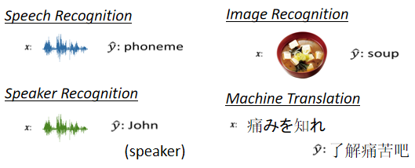

- 作业二，其实是做**语音辨识**，我们的x就是非常小的一段声音讯号，其实这个不是真正完整的语音辨识系统，它是语音辨识系统的一个阉割版，ŷ是要去预测判断，这一小段声音讯号，它对应到哪一个phoneme。你不知道phoneme是什么没有关系，你就把它想成是音标就可以了
- 作业三叫做**图像识别**，这个时候我们的x是一张图片，ŷ是机器要判断说这张图片里面，有什么样的东西
- 作业四是**语者辨识**，语者辨识要做的事情是，这个x也是一段声音讯号，ŷ现在不是phoneme，ŷ是现在是哪一个人在说话，这样的系统，现在其实非常的有用，如果你打电话去银行的客服，现在都有自动的语者辨认系统，它会听说现在打电话进来的人，是不是客户本人，就少了客服人员问你身份验证的时间
- 作业五是做**机器翻译**，x就是某一个语言，比如说，这是我唯一会的一句日文，痛みを知れ，它的ŷ就是另外一句话。

​训练集就要拿来训练我们的Model，训练Model的过程上周已经讲过了，训练的过程就是**三个步骤**

- 第一步，你要先写出一个有未知数的function，这个未知数，以后我们都用$θ$来代表，一个Model里面所有的未知函数，所以$f_θ(x)$的意思就是说，我现在有一个function叫f(x)，它里面有一些未知的参数，这些未知的参数表示成$θ$，它的input叫做x，这个input叫做feature
- 第二步，你要定一个东西叫做loss，loss是一个function，这个loss的输入就是一组参数，去判断说这一组参数是好还是不好
- 第三步，你要解一个，Optimization的problem，你要去找一个θ，这个θ 可以让loss的值越小越好，可以让loss的值 最小的那个$θ$，我们叫做$θ^*$

​有了$θ^*$以后，那你就把它拿来用在测试集上，也就是你把$θ^*$带入这些未知的参数，本来$f_θ(x)$里面有一些未知的参数，现在这个$θ$ 用$θ^*$来取代，它的输入就是你现在的测试集，输出的结果 你就把它存起来，然后上传到Kaggle就结束了。

​接下来你就会遇到一个问题，直接执行助教的sample code，往往只能够给你simple baseline的结果而已，如果你想要做得更好，那应该要怎么办，

## General Guide

​以下就是如何让你做得更好的攻略，它适用于前期所有的作业，这个攻略是怎么走的呢?

​从最上面开始走起，第一个是你今天如果你觉得，你在Kaggle上的结果不满意的话，第一件事情你要做的事情是，**检查你的training data的loss**

​有人说"我在意的不是应该是，testing data的loss吗，因为Kaggle上面的结果，呈现的是testing data的结果"

​但是你要先检查你的training data，看看你的model在training data上面，有没有学起来，再去看testing的结果，如果你发现，你的**training data的loss很大**，显然它**在训练集上面也没有训练好**，接下来你要分析一下，在训练集上面没有学好，是什么样的原因，这边有两个可能，第一个可能是model的bias

### Model bias

​model的bias这件事情，我们在上周已经跟大家讲过了，所谓model bias的意思是说，假设你的model太过简单。

​举例来说，我们现在写了一个有未知parameter的function，这个未知的parameter，我们可以代各种不同的数字，你代θ¹ 得到一个function $f_{θ^1}(x)$，我们把那个function用这个，一个点来表示，θ² 得到另一个function $f_{θ^1}(x)$，你把所有的function集合起来，得到一个function的set.

​但是这个function的set太小了，这个function的set里面，没有包含任何一个function，可以让我们的loss变低，即可以让loss变低的function，不在你的model可以描述的范围内。

​在这个情况下，就算你找出了一个θ*，它是这些蓝色的function里面最好的那一个，也无济于事了，loss还是不够低。

​这个状况就是你想要在**大海里面捞针**，这个针指的是一个loss低的function，结果**针根本就不在海里**，白忙一场，你怎么捞都捞不出针，因为针根本就不在你的function set里面，不在你的这个大海里面，所以怎么办？  

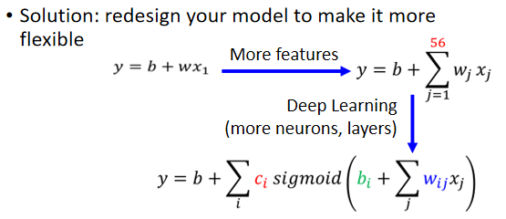

​这个时候**重新设计一个model，给你的model更大的弹性**，举例来说，你可以增加你输入的features，我们上周说，本来我们输入的features，只有前一天的资讯，假设我们要预测接下来的这个，观看人数的话，我们用前一天的资讯，不够多，那用56天前的资讯，那model的弹性就比较大了

​你也可以用Deep Learning，增加更多的弹性，所以如果你觉得，你的model的弹性不够大，那你可以增加更多features，可以设一个更大的model，可以用deep learning，来增加model的弹性，这是第一个可以的解法。

​但是并不是training的时候，loss大就代表一定是model bias，你可能会遇到另外一个问题，这个问题是什么，这个问题是**optimization做得不好**，什么意思呢？

### Optimization Issue

​我们知道说，我们今天用的optimization，在这门课里面，我们其实都只会用到gradient descent，这种optimization的方法，这种optimization的方法很多的问题。

​举例来说 我们上周也讲过说，你可能会卡在==local minima==的地方，你没有办法找到一个，真的可以让loss很低的参数，如果用图具象化的方式来表示，就像这个样子

​蓝色部分是你的model可以表示的函式所形成的集合，你可以把θ 代入不同的数值，形成不同的function，把所有的function通通集合在一起，得到这个蓝色的set，这个蓝色的set里面，确实包含了一些function，这些function它的loss是低的。

​但问题是**gradient descent这一个演算法，没办法帮我们找出，这个loss低的function**，gradient descent是解一个optimization的problem，找到θ* 然后就结束了

​但是这个$θ^*$ 它给我的loss不够低，这一个model里面，存在著某一个function，它的loss是够低的，gradient descent，没有给我们这一个function

​这就好像是说 我们想**大海捞针，针确实在海里，但是我们却没有办法把针捞起来**，这边问题就来了

​==training data的loss不够低的时候，到底是model bias，还是optimization的问题呢==

- 找不到一个loss低的function，到底是因为我们的model的弹性不够，我们的海里面没有针
- 还是说，我们的model的弹性已经够了，只是optimization gradient descent不给力，它没办法把针捞出来

​到底是哪一个呢，到底我们的model已经够大了，还是它不够大，怎么判断这件事呢

#### Gaining the insights from comparison 

​一个建议判断的方法，就是你可以**透过比较不同的模型，来得知说，你的model现在到底够不够大**，怎么说呢

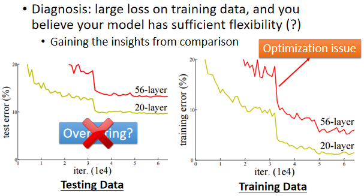

​我们这边举一个例子，这一个实验是从residual network，那篇paper里面节录出来的，我们把paper链接：http://arxiv.org/abs/1512.03385

​这篇paper一开头就跟你讲一个故事，它说 我想测2个networks

- **一个network有20层**
- **一个network有56层**

​我们把它们测试在测试集上，这个**横轴指的是training的过程**，就是你参数update的过程，随著参数的update，当然你的loss会越来越低，但是结果**20层的loss比较低，56层的loss还比较高**

​这个residual network是比较早期的paper，2015年的paper，如果你现在大学生的话，那个时候你都还是高中生而已，所以那个时候大家对Deep Learning，了解还没有那么的透彻，大家对deep learning，有各种奇怪的误解，很多人看到这张图都会说，这个代表overfitting，告诉你deep learning不work，56层太深了 不work，根本就不需要那么深

​那个时候大家也不是每个人都觉得deep learning是好的，那时候还有很多，对deep learning的质疑，所以看到这个实验有人就会说，最深没有比较好，所以这个叫做overfitting，但是这个是overfitting吗

​**这个不是overfitting**，等一下会告诉你overfitting是什么，**并不是所有的结果不好，都叫做overfitting**

​你要**检查一下训练集上面的解释**，你检查训练集的结果发现说，现在20层的network，跟56层的network比起来，在训练集上，20层的network loss其实是比较低的，56层的network loss是比较高的

​**这代表56层的network，它的optimization没有做好**，它的optimization不给力

​你可能问说，你怎么知道是56层的optimization不给力，搞不好是model bias，搞不好是56层的network，它的model弹性还不够大，它要156层才好，56层也许弹性还不够大，但是你比较56层跟20层，20层的loss都已经可以做到这样了，56层的弹性一定比20层更大对不对

​如果今天**56层的network要做到20层的network可以做到的事情**，对它来说是轻而易举的

​它**只要前20层的参数，跟这个20层的network一样**，剩下36层就什么事都不做，identity copy前一层的输出就好了，56层的network一定可以做到20层的network可以做到的事情，所以20层的network已经都可以走到这么底的loss了，56层的network，它比20层的network弹性还要更大，所以没有道理

​所以56层的network，如果你optimization成功的话，它应该要比20层的network，可以得到更低的loss，但结果在训练集上面没有，这个不是overfitting，这个也不是model bias，因为56层network弹性是够的，这个问题是你的**optimization不给力，optimization做得不够好**

####  Start from shallower networks (or other models)， which are easier to train. 

​所以刚才那个例子就告诉我们，你怎么知道你的optimization有没有做好，这边给大家的建议是

​**看到一个你从来没有做过的问题，也许你可以先跑一些比较小的，比较浅的network，或甚至用一些，不是deep learning的方法**，比如说 linear model，比如说support vector machine，support vector machine不知道是什么也没有关系，它们可能是比较容易做Optimize的，它们比较不会有optimization失败的问题

​也就是这些model它会竭尽全力的，在它们的能力范围之内，找出一组最好的参数，它们比较不会有失败的问题，所以你可以先train一些，比较浅的model，或者是一些比较简单的model，先知道 先有个概念说，这些简单的model，到底可以得到什么样的loss

#### If deeper networks do not obtain smaller loss on training data，  then there is optimization issue. 

​接下来还缺一个深的model，如果你发现你深的model，跟浅的model比起来，深的model明明弹性比较大，但loss却没有办法比浅的model压得更低，那就代表说你的optimization有问题，你的gradient descent不给力，那你要有一些其它的方法，来把optimization这件事情做得更好

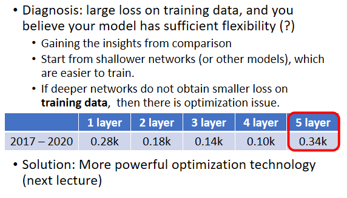

​举例来说，我们上次看到的这个，观看人数预测的例子，我们说在训练集上面，2017年到2020年的资料是训练集，一层的network，它的loss是0.28k，2层就降到0.18k，3层就降到0.14k，4层就降到0.10k。

​但是 我测5层的时候结果变成0.34k，这是什么问题

​我们现在loss很大，这显然不是model bias的问题，因为4层都可以做到0.10k了，5层应该可以做得更低，这个是optimization的problem，这个是optimization的时候做得不好，才造成这样子的问题。

​那如果optimization做得不好的话，怎么办呢，这个我们下一节课，就会告诉大家要怎么办，你现在就知道怎么判断，现在如果你的training的loss大，到底是model bias还是optimization，如果model bias 那就把model变大，如果是optimization失败了，那就看等一下的课程怎么解这个问题。

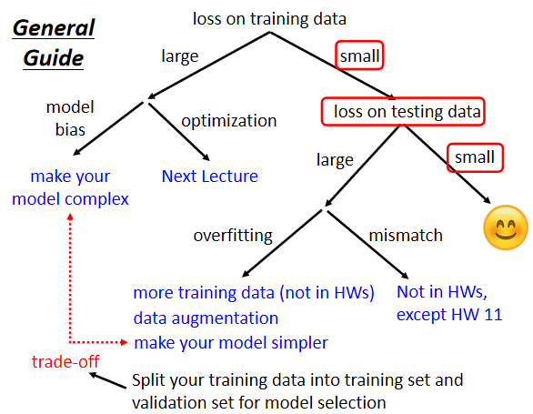

​假设你现在经过一番的努力，你已经可以让你的，training data的loss变小了，那接下来你就可以来看，testing data loss，如果testing data loss也小，有比这个strong baseline还要小就结束了，没什么好做的就结束了。

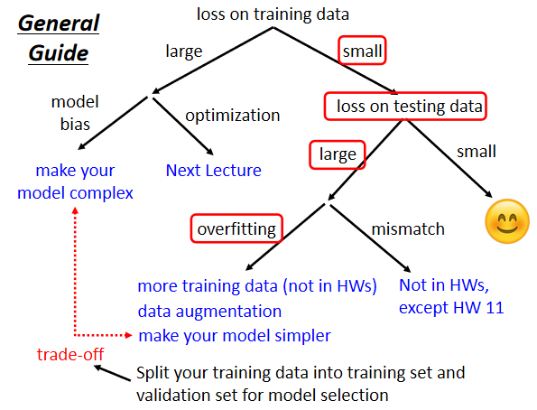

​那但是如果你觉得还不够小呢，==如果training data上面的loss小，testing data上的loss大，那你可能就是真的遇到overfitting的问题==

​==你要注意的是training的loss小，testing的loss大才叫做overfitting==。首先我们要先确定说你的optimization没有问题，你的model弹性够大了，然后接下来，才看看是不是testing的问题，**如果是training的loss小，testing的loss大，这才有可能是overfitting**。

### Overfitting 

​为什么会有overfitting这样的状况呢，为什么有可能training的loss小，testing的loss大呢，这边就举一个极端的例子。 	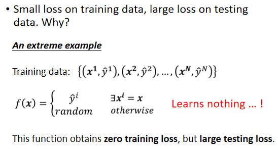

​这是我们的训练集，假设根据这些训练集，某一个很废的，machine learning的方法，它找出了一个一无是处的function

​这个一无是处的function说，**如果今天x当做输入的时候，我们就去比对这个x，有没有出现在训练集里面，如果x有出现在训练集里面，就把它对应的ŷ当做输出，如果x没有出现在训练集里面，就输出一个随机的值**

​那你可以想象这个function啥事也没有干，它是一个一无是处的function，但虽然它是一个一无是处的function，它**在training的data上，它的loss可是0呢**

​你把training的data，通通丢进这个function里面，它的输出跟你的训练集的level，是一模一样的，所以在training data上面，这个一无是处的function，它的loss可是0呢，可是在testing data上面，它的loss会变得很大，因为**它其实什么都没有预测**，这是一个比较极端的例子，在一般的状况下，也有可能发生类似的事情。

​举例来说，假设我们输入的feature叫做x，我们输出的level叫做y，那x跟y都是一维的

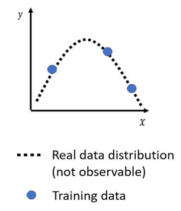

​x跟y之间的关系，是这个二次的曲线，这个曲线我们刻意用虚线来表示，因为我们通常没有办法，直接观察到这条曲线，我们真正可以观察到的是什么，我们真正可以观察到的，是我们的训练集，训练集 你可以想象成，就是从这条曲线上面，随机sample出来的几个点

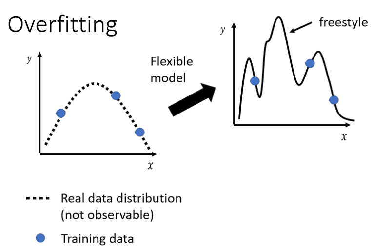

​今天的模型，它的能力非常的强，它的flexibility很大，它的弹性很大的话，你只给它这三个点，它会知道说，在这三个点上面我们要让loss低，所以今天你的model，它的这个曲线会通过这三个点，但是其它没有训练集做为限制的地方，它就会有freestyle，因为它的flexibility很大，它弹性很大，所以你的model，可以变成各式各样的function，你没有给它资料做为训练，它就会有freestyle，可以产生各式各样奇怪的结果。

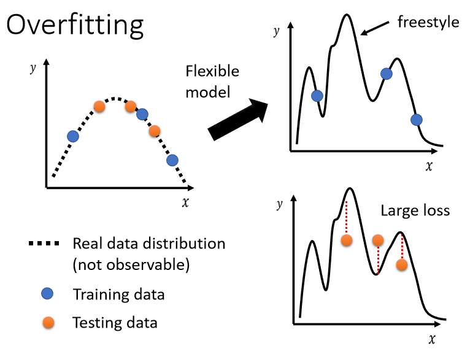

​这个时候，如果你再丢进你的testing data，你的testing data 和training的data，当然不会一模一样，它们可能是从同一个，distribution sample出来的，testing data是橙色的这些点，训练data是蓝色的这些点

​用蓝色的这些点，找出一个function以后，你测试在橘色的这些点上，不一定会好，**如果你的model它的自由度很大的话，它可以产生非常奇怪的曲线，导致训练集上的结果好，但是测试集上的loss很大**，那至于更详细的背后的数学原理，为什么这个比较有弹性的model，它就比较会，overfitting背后的数学原理，我们留到下下周

​那怎么解决overfitting的问题呢？有两个可能的方向

1. 第一个方向是，也许这个方向往往是最有效的方向，是**增加你的训练集**

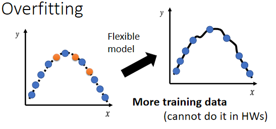

​今天假设你自己，想要做一个application，你发现有overfitting的问题，其实我觉得，最简单解决overfitting的方法，就是增加你的训练集

​所以今天如果训练集，蓝色的点变多了，那虽然你的model它的弹性可能很大，但是因为你这边的点非常非常的多，它就可以限制住，它看起来的形状还是会很像，产生这些资料背后的二次曲线

​那你可以做什么呢，你可以做**data augmentation**，这个方法并不算是使用了额外的资料。

​Data augmentation 就是**你用一些你对于这个问题的理解，自己创造出新的资料**。 

​举例来说在做影像辨识的时候，非常常做的一个招式是，假设你的训练集里面有某一张图片，把它左右翻转，或者是把它其中一块截出来放大等等，你做左右翻转 你的资料就变成两倍，那这个就是data augmentation

​但是你要注意一下data augmentation，不能够随便乱做，这个augment 要augment得有道理，举例来说在影像辨识里面，你就**很少看到有人把影像上下颠倒**当作augmentation，因为这些图片都是合理的图片，你把一张照片左右翻转，并不会影响到里面是什么样的东西，但你把它颠倒 那就很奇怪了，这可能不是一个训练集里面，可能不是真实世界会出现的影像

​那如果你给机器看这种，奇怪的影像的话，它可能就会学到奇怪的东西，所以**data augmentation，要根据你对资料的特性，对你现在要处理的问题的理解，来选择合适的，data augmentation的方式**，好 那这边是增加资料的部分

2. 另外一个解法就是**不要让你的模型，有那么大的弹性**，给它一些限制，

​举例来说 假设我们直接限制说，现在我们的model，我们somehow猜测出 知道说，x跟y背后的关系，其实就是一条二次曲线，只是我们不明确的知道这二次曲线，里面的每一个参数长什么样

​那你说你怎么会猜测出这样子的结果，你怎么会知道说，**要用多constrain的model才会好呢**，那这就取决于你对这个问题的理解，因为这种model是你自己设计的，到底model要多constrain多flexible，结果才会好，那这个要问你自己，那要看这个设计出不同的模型，你就会得出不同的结果

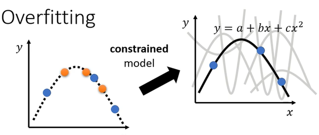

​那现在假设我们已经知道说，模型就是二次曲线，那你就会给你，你就会在选择function的时候，有很大的限制，因为二次曲线要嘛就是这样子，来来去去就是那几个形状而已，所以当我们的训练集有限的时候，因为我们来来去去，只能够选那几个function

​所以你可能，虽然说只给了三个点，但是因为我们能选择的function有限，你可能就会正好选到，跟真正的distribution，比较接近的function，然后在测试集上得到比较好的结果。

​所以这是第二个方法，解决overfitting的问题，你要给你的model一些限制，最好你的model正好，跟背后产生资料的过程，你的process是一样的，那你可能就会，你就有机会得到好的结果

​有哪些方法可以给model制造限制呢，举例来说，

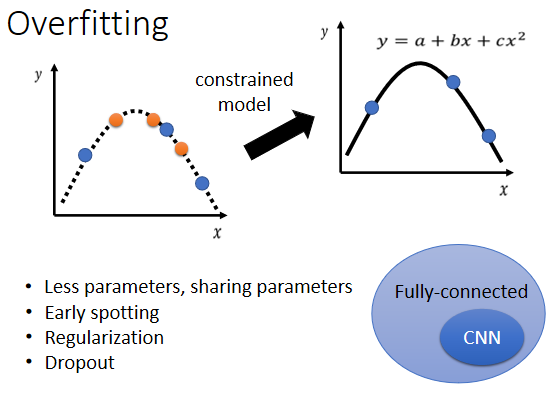

- 给它**比较少的参数**，如果是deep learning的话，就给它比较少的神经元的数目，本来每层一千个神经元，改成一百个神经元之类的，或者是你可以让model共用参数，你可以让一些参数有一样的数值，那这个部分如果你没有很清楚的话，也没有关系，我们之后在讲CNN的时候，会讲到这个部分，所以这边先前情 先预告一下，就是我们之前讲的network的架构，叫做 ==fully-connected network==，那fully-connected network，其实是一个比较有弹性的架构，而 ==CNN是一个比较有限制的架构==，就说你可能会说，CNN不是比较厉害吗，大家都说做影像就是要CNN，比较厉害的model，难道它比较没有弹性吗，没错，它是一种比较没有弹性的model，它厉害的地方就是，它是针对影像的特性，来限制模型的弹性，所以你今天fully-connected的network，可以找出来的function所形成的集合，其实是比较大的，CNN这个model所找出来的function，它形成的集合其实是比较小的，其实包含在fully-connected的，network里面的，但是就是因为CNN给了，比较大的限制，所以CNN在影像上，反而会做得比较好，那这个之后都还会再提到，
- 另外一个就是用**比较少的features**，那刚才助教已经示范过，本来给三天的资料，改成用给两天的资料，其实结果就好了一些，那这个是一个招数
- 还有一个招数叫做**Early stopping**，Early stopping，Regularization跟Dropout，都是之后课程还会讲到的东西，那这三件事情在作业一的程式里面，这个Early stopping其实是有的，助教有写在它的code里面，所以不知道这是什么也没有关系，反正你直接执行sample code，里面就有了，Regularization，助教留下了一个空格给大家填，那你不知道什么是regularization，没有关系，反正你可以过得了middle的baseline，那如果你想做得更好，也许你可以先自己survey一下，regularization是什么，看有没有办法自己写
- **Dropout**，这是另外一个在Deep Learning里面，常用来限制模型的方法

​**但是我们也不要给太多的限制**，为什么不能给模型太多的限制呢

​假设我们现在给模型更大的限制说，我们假设我们的模型，一定是Linear的Model，一定是写成y=a+bx，那你的model它能够产生的function，就一定是一条直线

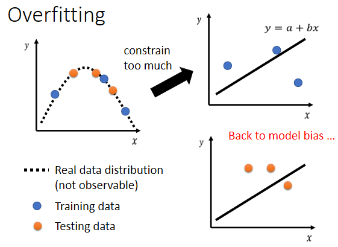

​今天给三个点，没有任何一条直线，可以同时通过这三个点，但是你只能找到一条直线，这条直线跟这些点比起来，它们的距离是比较近的，但是你没有办法找到任何一条直线，同时通过这三个点，这个时候你的模型的限制就太大了，你在测试集上就不会得到好的结果

​但是这个不是overfitting，因为你又回到了**model bias**的问题，所以你现在这样在这个情况下，这个投影片的case上面你结果不好，并不是因为overfitting了，而是因为你给你模型太大的限制，大到你有了model bias的问题。

​所以你就会发现说，这边**产生了一个矛盾的状况**

​所谓比较复杂就是，**它可以包含的function比较多，它的参数比较多，这个就是一个比较复杂的model**

​那一个比较复杂的model，如果你看它的training的loss，你会发现说**随著model越来越复杂，Training的loss可以越来越低**，但是testing的时候呢，**当model越来越复杂的时候，刚开始，你的testing的loss会跟著下降，但是当复杂的程度，超过某一个程度以后，Testing的loss就会突然暴增了**

​那这就是因为说，当你的model越来越复杂的时候，复杂到某一个程度，overfitting的状况就会出现，所以你在training的loss上面，可以得到比较好的结果，那在Testing的loss上面，你会得到比较大的loss，那我们当然期待说，我们可以选一个中庸的模型，不是太复杂的 也不是太简单的，刚刚好可以在训练集上，给我们最好的结果，给我们最低的loss，给我们最低的testing loss，怎么选出这样的model呢

​一个很直觉的方法

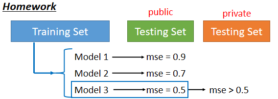

​假设我们有三个模型，它们的复杂的程度不太一样，我不知道要选哪一个模型才会刚刚好，在测试集上得到最好的结果，因为你选太复杂的就overfitting，选太简单的有model bias的问题，那怎么选一个不偏不倚的，不知道 那怎么办

​把这三个模型的结果都跑出来，然后上传到kaggle上面，你及时的知道了你的分数，看看哪个分数最低，那个模型显然就是最好的模型

​但是并不建议你这么做，为什么不建议你这么做呢

​我们再举一个极端的例子，我们再把刚才那个极端的例子拿出来，假设现在有一群model，这一群model不知道为什么都非常废，它们每一个model产生出来的，都是一无是处的function，我们有一到一兆个model，这一到一兆个model不知道为什么，learn出来的function，都是一无是处的function

​它们会做的事情就是，**训练集里面有的资料就把它记下来，训练集没看过的，就直接output随机的结果**

​那你现在有一兆个模型，那你再把这一兆个模型的结果，通通上传到kaggle上面，你就得到一兆个分数，然后看这一兆的分数里面，哪一个结果最好，你就觉得那个模型是最好的

​那虽然说每一个模型，它们在这个Testing data上面，这个testing data它都没有看过啊，所以它输出的结果都是随机的，但虽然在testing data上面，输出的结果都是随机的，但是**你不断的随机，你总是会找到一个好的结果**，所以也许编号五六七八九的那个模型，它找出来的function，正好在testing data上面，就给你一个好的结果，那你就会很高兴觉得说，这个model编号五六七八九，是个好model，这个好model得到一个好function

​虽然它其实是随机的 但你不知道，但这个好function，在这个testing data上面，给我们好的结果，所以你就觉得说 这个结果不错，就这样 我就**选这一个model，这个function，当作我们最后上传的结果，当作我最后要用在，private testing set上的结果**

​但是**如果你这样做，往往就会得到非常糟的结果**，因为这个model毕竟是随机的，它**恰好在public的testing set data上面得到一个好结果，但是它在private的testing set上，可能仍然是随机的**

​我们这个testing set，分成public的set跟private的set，你在看分数的时候 你只看得到public的分数，private的分数要deadline以后才知道，但假设你在挑模型的时候，你完全看你在public set上面的，也就leaderboard上的分数，来选择你的模型的话，你可能就会这个样子：你在public的leaderboard上面排前十，但是deadline一结束，你就心态就崩了这样，你就掉到三百名之外，而且我们这修课的人这么多，你搞不好会掉到一千名之外，也说不定。

​	**那为什么我们要把testing的set，分成public跟private呢**？

​你自己想想看，假设所有的data都是public，那我刚才说，就算是一个一无是处的Model，得到了一无是处的function，它也有可能在public的data上面，得到好的结果，如果我们今天只有public的testing set，没有private的testing set，那你就回去写一个程式，不断random产生输出就好，然后不断把random的输出，上传到kaggle，然后看你什么时候，可以random出一个好的结果，那这个作业就结束了

​这个显然没有意义，显然不是我们要的，而且因为如果今天 你想想看，然后这边有另外一个有趣的事情就是，你知道因为今天如果，public的testing data是公开的，你可以知道public的，testing data的结果，那你就算是一个很废的模型，产生了很废的function，也可能得到非常好的结果

​所以讲了这么多，只是想要告诉大家说，我们为什么要切public的testing set，我为什么要切private的testing set，然后你其实不要花，不要用你public的testing set，去调你的模型，因为你可能会在，private的testing set上面，得到很差的结果。

## Cross Validation

​那到底要怎么做才选择model，才是比较合理的呢，那界定的方法是这个样子的，那助教程式里面也都帮大家做好了，你要**把Training的资料分成两半，一部分叫作Training Set，一部分是Validation Set**

​刚才助教程式里面已经看到说，有90%的资料放在Training Set里面，有10%的资料，会被拿来做Validation Set，你在Training Set上训练出来的模型，**你在Validation Set上面，去衡量它们的分数，你根据Validation Set上面的分数，去挑选结果**，再把这个结果上传到Kaggle上面，去看看你得到的public的分数，那因为你在挑分数的时候，是用Validation Set来挑你的model，所以你的public的Testing Set的分数，就可以反应你的，private Testing Set的分数，就比较不会得到说，在public上面结果很好，但是在private上面结果很差，这样子的状况

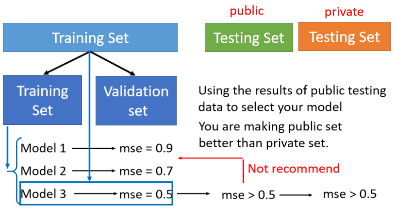

​其实 最好的做法，就是用Validation loss，最小的直接挑就好了，就是你不要去管，你的public Testing Set的结果 这样，那我知道说在实作上，你不太可能这么做，因为public set的结果你有看到，所以它对你的模型的选择，可能还是会有些影响的，但是你要越少去看那个，public Testing Set的结果越好

​线上直播的同学，我复述一下刚才那个同学的问题，他的问题是说，所以我们不能去看，public Testing Set的结果吗，理想上是，理想上你就用Validation Set挑就好，然后上传以后 怎样就是怎样，有过那个strong basseline以后，就不要再去动它了，那这样子就可以避免，你overfit在Testing Set上面，好 那但是这边会有一个问题，就是怎么分Training Set，跟Validation Set呢，那如果在助教程式里面，就是随机分的，但是你可能会说，搞不好我这个分 分得不好啊，搞不好我分到很奇怪的Validation Set，会导致我的结果很差，

### N-fold Cross Validation

​如果你有这个担心的话，那你可以用N-fold Cross Validation，

​N-fold Cross Validation就是你先**把你的训练集切成N等份**，在这个例子里面我们切成三等份，切完以后，你拿其中**一份当作Validation Set**，**另外两份当Training Set**，然后这件事情你要**重复三次**

​也就是说，你先第一份第二份当Train，第三份当Validation，然后第一份第三份当Train，第二份当Validation，第一份当Validation，第二份第三份当Train

​然后接下来 你有三个模型，你不知道哪一个是好的，你就把这三个模型，在这三个setting下，在这三个Training跟Validation的，data set上面，通通跑过一次，**然后把这三个模型，在这三种状况的结果都平均起来**，把每一个模型在这三种状况的结果，都平均起来，再看看谁的结果最好

​那假设现在model 1的结果最好，你用这三个fold得出来的结果是，这个model 1最好，然后你再把model 1，用在全部的Training Set上，然后训练出来的模型，再用在Testing Set上面，好 那这个是N-fold Cross Validation，好 那这个就是这门课前期的攻略，它可以带你打赢前期所有的副本

那接下来也许你要问的一个问题是，上周结束的时候，不是讲到预测2/26，也就是上周五的观看人数吗，到底结果做得怎么样

那这个就是我们要做的结果，上周比较多人选了三层的network，所以我们就把三层的network，拿来测试一下，以下是测试的结果，我们就没有再调参数了，大家决定用三层的就是下好离手了，就直接用上去了

​得到的结果是这个样子了，这个图上 这个横轴就是从，2021年的1月1号开始 一直往下，然后红色的线是真实的数字，蓝色的线是预测的结果，2/26在这边 这个是今年2021年，观看人数最高的一天了，那机器的预测怎样呢，哇 非常的惨 差距非常的大，差距有2.58k这么多，感谢大家 为了让这个模型不準，上周五花了很多力气，去点了这个video，所以这一天是，今年观看人数最多的一天，那你可能开始想说，那别的模型怎么样呢，其实我也跑了一层二层跟四层的看看，所有的模型 都会惨掉，两层跟三层的错误率都是2点多k，其实四层跟一层比较好，都是1.8k左右，但是这四个模型不约而同的，觉得2/26应该是个低点，但实际上2/26是一个公值，那模型其实会觉得它是一个低点，也不能怪它，因为根据过去的资料，礼拜五就是没有人要学机器学习，礼拜五晚上大家都出去玩了对不对，礼拜五的观看人数是最少了，但是2/26出现了反常的状况，好 那这个就不能怪模型了，那我觉得出现这种状况，应该算是另外一种错误的形式，这种错误的形式，我们这边叫作mismatch。

​那也有人会说，mismatch也算是一种Overfitting，这样也可以，这都只是名词定义的问题，那我这边想要表达的事情是，**mismatch它的原因跟overfitting，其实不一样**，一般的overfitting，你可以用搜集更多的资料来克服，但是**mismatch意思是说，你今天的训练集跟测试集，它们的分布是不一样的**

​在训练集跟测试集，分布是不一样的时候，你训练集再增加，其实也没有帮助了，那其实在多数的作业里面，我们不会遇到这种mismatch的问题，我们都有把题目设计好了，所以资料跟测试集它的分布差不多

​举例来说 以刚才作业一的，Covid19为例的话，假设我们今天资料在，分训练集跟测试集的时候，我们说**2020年的资料是训练集，2021年的资料是测试集**，那mismatch的问题可能就很严重了，这个我们其实有试过了 试了一下，如果今天用2020年当训练集，2021年当测试集，你就怎么做都是惨了 就做不起来，训练什么模型都会惨掉

​因为2020年的资料跟2021年的资料，它们的背后的分布其实都是不一样，所以你拿2020年的资料来训练，在2021年的作业一的资料上，你根本就预测不準，所以后来助教是用了别的方式，来分割训练集跟测试集，好 所以我们多数的作业，都不会有这种mismatch的问题，那除了作业十一。

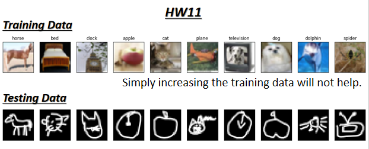

​因为作业十一就是，针对mismatch的问题来设计的，作业十一也是一个影像分类的问题，这是它的训练集，看起来蛮正常的，但它测试集就是长这样子了，所以你知道这个时候，这个时候增加资料哪有什么用呢，增加资料，你也没有办法让你的模型做得更好，所以这种问题要怎么解决，那犹待作业十一的时候再讲，好 那你可能会问说 我怎么知道，现在到底是不是mismatch呢，那我觉得知不知道是mismatch，那就要看你对这个资料本身的理解了，你可能要对你的训练集跟测试集，的产生方式有一些理解，你才能判断说，它是不是遇到了mismatch的状况，好 那这个就是我们作业的攻略，