# When gradient is small

## Critical Point

### Training Fails because

​	现在我们要讲的是Optimization的部分，所以我们要讲的东西基本上跟Overfitting没有什么太大的关联，我们只讨论Optimization的时候，怎么把gradient descent做得更好，那为什么Optimization会失败呢？

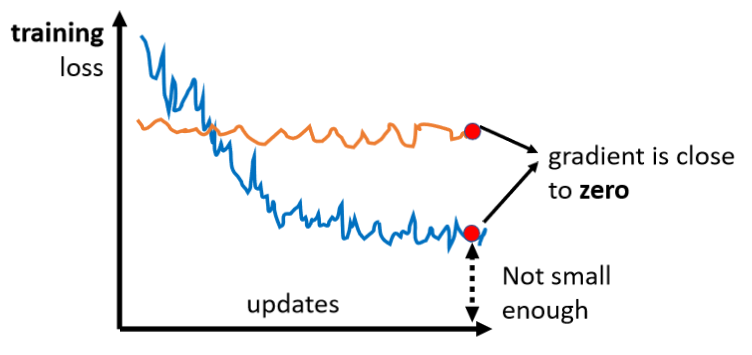

​	在做Optimization的时候，你常常会发现，**随着你的参数不断的update，你的training的loss不会再下降**，但是你对这个loss仍然不满意，就像我刚才说的，你可以把deep的network，跟linear的model，或比较shallow network比较，发现说它没有做得更好，所以你觉得deep network，没有发挥它完整的力量，所以Optimization显然是有问题的

​	但有时候你会甚至发现，一开始你的model就train不起来，一开始你不管怎么update你的参数，你的loss通通都掉不下去，那这个时候到底发生了什么事情呢？

​	过去常见的一个猜想，是因为我们现在走到了一个地方，**这个地方参数对loss的微分为零**，当你的参数对loss微分为零的时候，gradient descent就没有办法再update参数了，这个时候training就停下来了，loss当然就不会再下降了。

​	讲到gradient为零的时候，大家通常脑海中最先浮现的，可能就是==local minima==，所以常有人说做deep learning，用gradient descent会卡在local minima，然后所以gradient descent不work，所以deep learning不work。

​	但是如果有一天你要写，跟deep learning相关paper的时候，你千万不要讲卡在local minima这种事情，别人会觉得你非常没有水准，为什么

​	因为**不是只有local minima的gradient是零**，还有其他可能会让gradient是零，比如说 ==saddle point==，所谓的saddle point，其实就是gradient是零，但是不是local minima，也不是local maxima的地方，像在右边这个例子里面 红色的这个点，它在左右这个方向是比较高的，前后这个方向是比较低的，它就像是一个马鞍的形状，所以叫做saddle point，那中文就翻成鞍点

​	像saddle point这种地方，它也是gradient为零，但它不是local minima，那像这种gradient为零的点，统称为==critical point==，所以**你可以说你的loss，没有办法再下降，也许是因为卡在了critical point，但你不能说是卡在local minima，因为saddle point也是微分为零的点**

​	但是今天如果你发现你的gradient，真的很靠近零，卡在了某个critical point，我们有没有办法知道，到底是local minima，还是saddle point？其实是有办法的

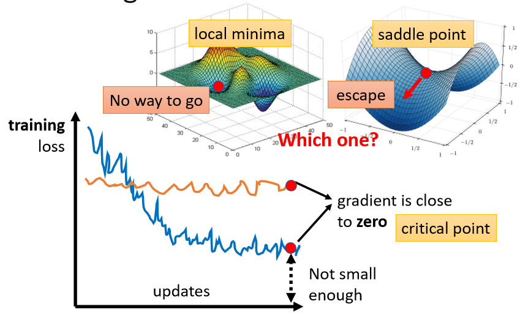

​	**为什么我们想要知道到底是卡在local minima，还是卡在saddle point呢**

- 因为如果是**卡在local minima，那可能就没有路可以走了**，因为四周都比较高，你现在所在的位置已经是最低的点，loss最低的点了，往四周走 loss都会比较高，你会不知道怎么走到其他的地方去
- 但saddle point就没有这个问题，如果你今天是**卡在saddle point的话，saddle point旁边还是有路可以走的，**还是有路可以让你的loss更低的，你只要逃离saddle point，你就有可能让你的loss更低

​	所以鉴别今天我们走到，critical point的时候，到底是local minima，还是saddle point，是一个值得去探讨的问题，那怎么知道一个critical point，到底是属于local minima，还是saddle point呢？

#### Warning of Math

​	那怎么知道说一个点，到底是local minima，还是saddle point呢？虽然我们没有办法完整知道，整个loss function的样子

##### Tayler Series Approximation

​	但是如果给定某一组参数，比如说蓝色的这个$θ'$，在$θ'$附近的loss function，是有办法被写出来的，它写出来就像是这个样子

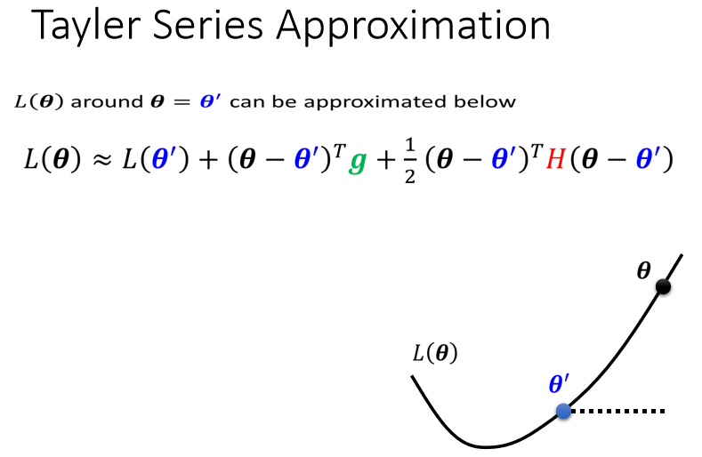

​	所以这个$L(θ)$完整的样子写不出来，但是它在$θ'$附近，你可以用这个式子来表示它，这个式子是，Tayler Series Appoximation泰勒级数展开，这个假设你在微积分的时候，已经学过了，所以我就不会细讲这一串是怎么来的，但我们就只讲一下它的概念，这一串里面包含什么东西呢?

- 第一项是$L(θ')$，就告诉我们说，当$θ$跟$θ'$很近的时候，$L(θ)$应该跟$L(θ')$还蛮靠近的

- 第二项是$(θ-θ')^Tg$

    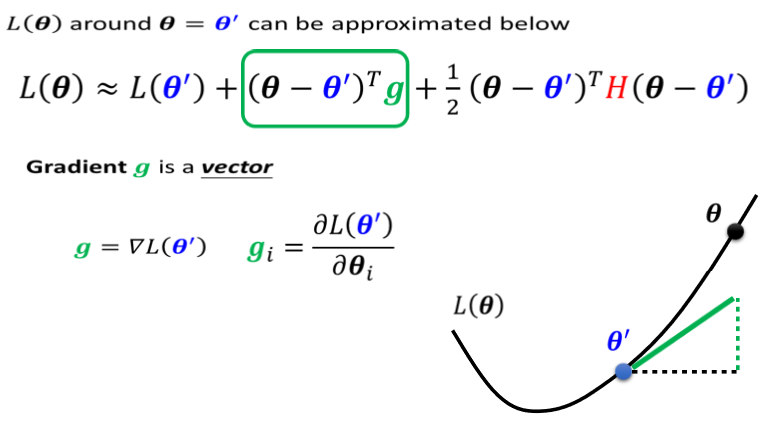 

    **$g$是一个向量，这个g就是我们的gradient**，我们用绿色的这个g来代表gradient，这个**gradient会来弥补，$θ'$跟$θ$之间的差距**，我们虽然刚才说$θ'$跟$θ$，它们应该很接近，但是中间还是有一些差距的，那这个差距，第一项我们用这个gradient，来表示他们之间的差距，有时候gradient会写成$∇L(θ')$，这个地方的$g$是一个向量，**它的第i个component，就是θ的第i个component对L的微分**，光是看g还是没有办法，完整的描述L(θ)，你还要看第三项

- 第三项跟Hessian有关，这边有一个$H $

    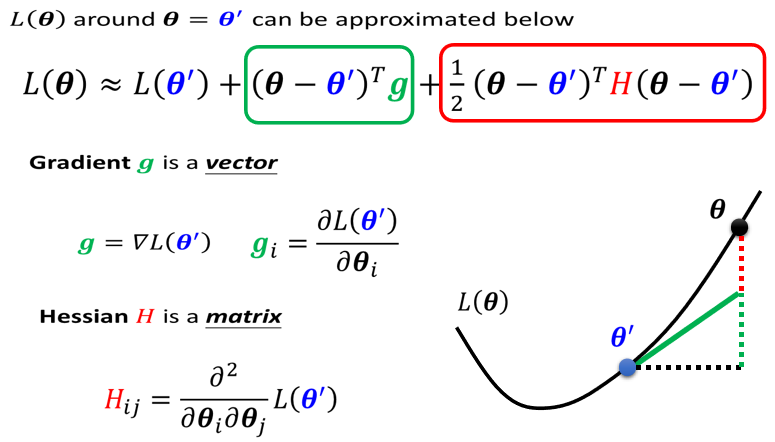

    这个$H$叫做Hessian，它是一个矩阵，这个第三项是，再$(θ-θ')^TH(θ-θ')$，所以第三项会再补足，再加上gradient以后，与真正的L(θ)之间的差距.**H里面放的是L的二次微分**，**它第i个row，第j个column的值，就是把θ的第i个component，对L作微分，再把θ的第j个component，对L作微分，再把θ的第i个component，对L作微分，做两次微分以后的结果** 就是这个$H_i{_j}$

​	如果这边你觉得有点听不太懂的话，也没有关系，反正你就记得这个$L(θ)$，这个loss function，这个error surface在$θ'$附近，可以写成这个样子，这个式子跟两个东西有关系，**跟gradient有关系，跟hessian有关系，gradient就是一次微分，hessian就是里面有二次微分的项目**

##### Hession

​	那如果我们今天走到了一个critical point，意味著gradient为零，也就是绿色的这一项完全都不见了

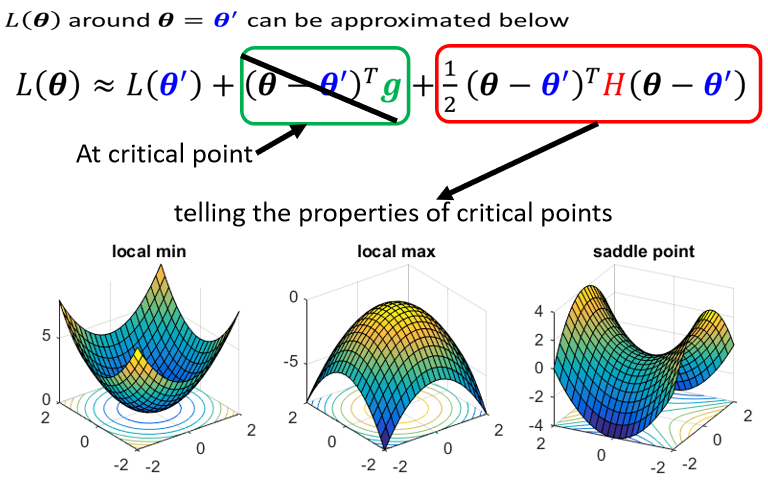

​	$g$**是一个zero vector，绿色的这一项完全都不见了**，只剩下红色的这一项，所以当在critical point的时候，这个loss function，它可以被近似为$L(θ')$，加上红色的这一项

​	我们可以**根据红色的这一项来判断**，在$θ'$附近的error surface，到底长什么样子

​	知道error surface长什么样子，我就可以判断

​	$θ'$它是一个==local minima==，是一个==local maxima==，还是一个==saddle point==

​	我们可以靠这一项来了解，这个error surface的地貌，大概长什么样子，知道它地貌长什么样子，我们就可以知道说，现在是在什么样的状态，这个是Hessian

​	那我们就来看一下怎么根据Hessian，怎么根据红色的这一项，来判断θ'附近的地貌

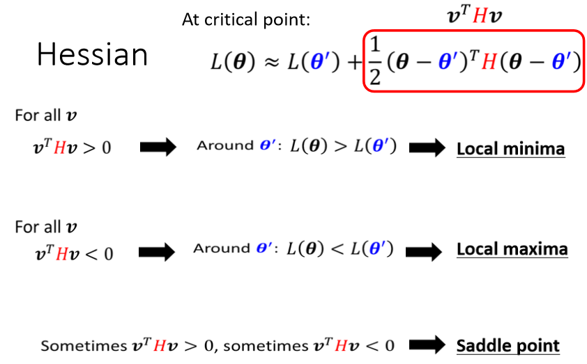

​	我们现在为了等一下符号方便起见，我们**把$(θ-θ')$用$v$这个向量来表示**

- 如果今天对任何可能的$v$**，$v^THv$都大于零**，也就是说 现在θ不管代任何值，v可以是任何的v，也就是θ可以是任何值，不管θ代任何值，**红色框框里面通通都大于零**，那意味著说 $L(θ)>L(θ')$。$L(θ)$不管代多少 只要在$θ'$附近，$L(θ)$都大于$L(θ')$，**代表$L(θ')$是附近的一个最低点，所以它是local minima**
- 如果今天反过来说，对所有的$v$而言，**$v^THv$都小于零，也就是红色框框里面永远都小于零**，也就是说$θ$不管代什么值，红色框框里面都小于零，意味著说$L(θ)<L(θ')$，**代表$L(θ')$是附近最高的一个点，所以它是local maxima**
- 第三个可能是假设，**$v^THv$，有时候大于零 有时候小于零**，你代不同的v进去 代不同的θ进去，红色这个框框里面有时候大于零，有时候小于零，意味著说在θ'附近，有时候L(θ)&gt;L(θ') 有时候L(θ)&lt;L(θ')，在L(θ')附近，有些地方高 有些地方低，这意味著什么，**这意味著这是一个saddle point**

​	但是你这边是说我们要代所有的$v$，去看$v^THv$是大于零，还是小于零。我们怎么有可能把所有的v，都拿来试试看呢，所以有一个更简便的方法，去确认说这一个条件或这一个条件，会不会发生。

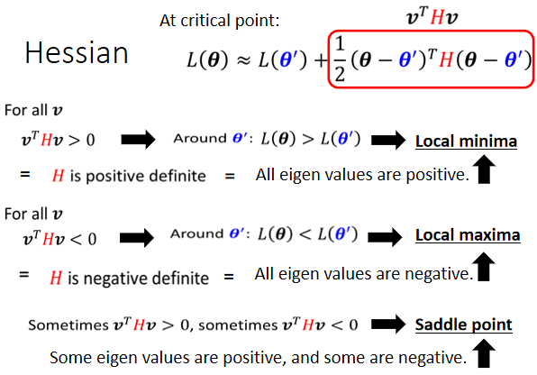

​	这个就直接告诉你结论，线性代数理论上是有教过这件事情的，如果今天对所有的v而言，$v^THv$都大于零，那这种矩阵叫做**positive definite 正定矩阵**，positive definite的矩阵，**它所有的eigen value特征值都是正的**

​	所以如果你今天算出一个hessian，你不需要把它跟所有的v都乘看看，你只要去直接看这个H的eigen value，如果你发现

- **所有eigen value都是正的**，那就代表说这个条件成立，就$v^THv$，会大于零，也就代表说是一个local minima。所以你从hessian metric可以看出，它是不是local minima，你只要算出hessian metric算完以后，看它的eigen value发现都是正的，它就是local minima。
- 那反过来说也是一样，如果今天在这个状况，对所有的v而言，$v^THv$小于零，那H是negative definite，那就代表所有**eigen value都是负的**，就保证他是local maxima
- **那如果eigen value有正有负**，那就代表是saddle point，

​	那假设在这里你没有听得很懂的话，你就可以记得结论，**你只要算出一个东西，这个东西的名字叫做hessian，它是一个矩阵，这个矩阵如果它所有的eigen value，都是正的，那就代表我们现在在local minima，如果它有正有负，就代表在saddle point。**

​	那如果刚才讲的，你觉得你没有听得很懂的话，我们这边举一个例子

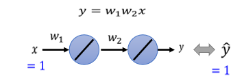

​	我们现在有一个史上最废的network
$$
y= w₁×w₂×x
$$
​	我们有一个史上最废的training set，这个data set说，我们只有一笔data，这笔data是x，是1的时候，它的level是1 所以输入1进去，你希望最终的输出跟1越接近越好

​	而这个史上最废的training，它的error surface，也是有办法直接画出来的，因为反正只有两个参数 w₁ w₂，假设没有bias，只有w₁跟w₂两个参数，这个network只有两个参数 w₁跟w₂，那我们可以穷举所有w₁跟w₂的数值，算出所有w₁ w₂数值所代来的loss，然后就画出error surface 长这个样

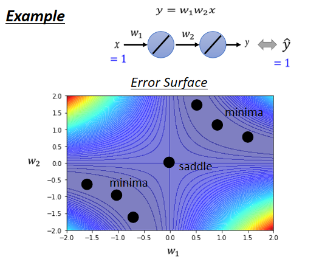

​	四个角落loss是高的，好 那这个图上你可以看出来说，有一些critical point，这个黑点点的地方(0，0)，**原点的地方是critical point**，然后事实上，**右上三个黑点也是一排critical point，左下三个点也是一排critical point**

​	如果你更进一步要分析，他们是saddle point，还是local minima的话，那圆心这个地方，**原点这个地方 它是saddle point**，为什么它是saddle point呢

​	你往左上这个方向走 loss会变大，往右下这个方向走 loss会变大，往左下这个方向走 loss会变小，往右下这个方向走 loss会变小，它是一个saddle point

​	而这两群critical point，它们都是local minima，所以这个山沟里面，有一排local minima，这一排山沟里面有一排local minima，然后在原点的地方，有一个saddle point，这个是我们把error surface，暴力所有的参数，得到的loss function以后，得到的loss的值以后，画出error surface，可以得到这样的结论

​	现在假设如果不暴力所有可能的loss，如果要直接算说一个点，是local minima，还是saddle point的话 怎么算呢

​	我们可以把loss的function写出来，这个loss的function 这个L是
$$
L=(\hat{y}-w_1 w_2 x)^2
$$
​	正确答案 ŷ减掉model的输出，也就是w₁ w₂x，这边取square error，这边**只有一笔data，所以就不会summation over所有的training data**，因为反正只有一笔data，x代1 ŷ代1，我刚才说过只有一笔训练资料最废的，所以只有一笔训练资料，所以loss function就是$L=(\hat{y}-w_1 w_2 x)^2$，那你可以把这一个loss function，它的gradient求出来，w₁对L的微分，w₂对L的微分写出来是这个样子
$$
\frac{∂L}{∂w_1 }=2(1-w_1 w_2 )(-w_2 )
$$

$$
\frac{∂L}{∂w_2 }=2(1-w_1 w_2 )(-w_1 )
$$

​	这个东西
$$
\begin{bmatrix}
\frac{∂L}{∂w_1 }\\\
\frac{∂L}{∂w_2 }
\end{bmatrix}
$$
​	就是所谓的g，所谓的gradient，什么时候gradient会零呢，什么时候会到一个critical point呢?

​	举例来说 如果w₁=0 w₂=0，就在圆心这个地方，如果w₁代0 w₂代0，w₁对L的微分 w₂对L的微分，算出来就都是零 就都是零，这个时候我们就知道说，原点就是一个critical point，但**它是local maxima，它是local maxima，local minima，还是saddle point呢，那你就要看hessian才能够知道了**

​	当然 我们刚才已经暴力所有可能的w₁ w₂了，所以你已经知道说，它显然是一个saddle point，但是现在假设还没有暴力所有可能的loss，所以我们要看看能不能够用H，用Hessian看出它是什么样的critical point，那怎么算出这个H呢

​	**H它是一个矩阵，这个矩阵里面元素就是L的二次微分**，所以这个矩阵里面第一个row，第一个coloumn的位置，就是w₁对L微分两次，第一个row 第二个coloumn的位置，就是先用w₂对L作微分，再用w₁对L作微分，然后这边就是w₁对L作微分，w₂对L作微分，然后w₂对L微分两次，这四个值组合起来，就是我们的hessian，那这个hessian的值是多少呢

​	这个hessian的式子，我都已经把它写出来了，你只要把w₁=0 w₂=0代进去，代进去 你就得到在原点的地方，hessian是这样的一个矩阵
$$
\begin{bmatrix}
 {0}&-2\\\
{-2}&0
\end{bmatrix}
$$
​	这个hessian告诉我们，它是local minima，还是saddle point呢，那你就要看这个矩阵的eigen value，算一下发现，这个矩阵有两个eigen value，2跟-2 **eigen value有正有负，代表saddle point** 

​	所以我们现在就是用一个例子，跟你操作一下 告诉你说，你怎么从hessian看出一个点，它一个critical point 它是saddle point，还是local minima，

### Don't afraid of saddle point

​	如果今天你卡的地方是saddle point，也许你就不用那么害怕了，因为如果你今天你发现，你停下来的时候，是因为saddle point 停下来了，那其实就有机会可以放心了

​	因为H它不只可以帮助我们判断，现在是不是在一个saddle point，它还指出了我们参数，可以update的方向，就之前我们参数update的时候，都是看gradient看g，但是我们走到某个地方以后，发现g变成0了，不能再看g了，g不见了gradient没有了，但如果是一个saddle point的话，还可以再看H，怎么再看H呢，H怎么告诉我们，怎么update参数呢

​	我们这边假设$\mu$是H的eigen vector特征向量，然后$λ$是u的eigen  value特征值。

​	如果我们把这边的$v$换成$\mu$的话，我们把$\mu$乘在H的左边，跟H的右边，也就是$\mu^TH\mu$，  $H\mu$会得到$λ\mu$，因为$\mu$是一个eigen vector。H乘上eigen vector特征向量会得到特征向量λ eigen value乘上eigen vector即$λ\mu$

​	所以我们在这边得到uᵀ乘上λu，然后再整理一下，把uᵀ跟u乘起来，得到‖u‖²，所以得到λ‖u‖²

​	假设我们这边v，代的是一个eigen vector，我们这边θ减θ'，放的是一个eigen vector的话，会发现说我们这个红色的项里面，其实就是λ‖u‖²

​	那今天如果λ**小于零**，eigen value小于零的话，那λ‖u‖²就会小于零，因为‖u‖²一定是正的，所以eigen value是负的，那这一整项就会是**负的**，也就是u的transpose乘上H乘上u，它是负的，也就是**红色这个框里是负的**

​	所以这意思是说假设$θ-θ'=\mu$，那这一项$(θ-θ')^TH(θ-θ')$就是负的，也就是$L(θ)<L(θ')$

​	也就是说假设$θ-θ'=\mu$，也就是，**你在θ'的位置加上u，沿著u的方向做update得到θ，你就可以让loss变小**

​	因为根据这个式子，你只要θ减θ'等于u，loss就会变小，所以你今天只要让θ等于θ'加u，你就可以让loss变小，你只要沿著u，也就是eigen vector的方向，去更新你的参数 去改变你的参数，你就可以让loss变小了

​	所以虽然在critical point没有gradient，如果我们今天是在一个**saddle point**，你也不一定要惊慌，你只要**找出负的eigen value，再找出它对应的eigen vector，用这个eigen vector去加θ'，就可以找到一个新的点，这个点的loss比原来还要低**

​	举具体的例子

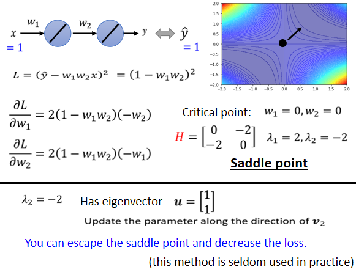

​	刚才我们已经发现，原点是一个critical point，它的Hessian长这个样，那我现在发现说，这个Hessian有一个负的eigen value，这个eigen value等于-2，那它对应的eigen vector，它有很多个，其实是无穷多个对应的eigen vector，我们就取一个出来，我们取$\begin{bmatrix}{1} \\\ {1}\end{bmatrix}$是它对应的一个eigen vector，那我们其实只要顺著这个u的方向，顺著$\begin{bmatrix}{1} \\\ {1}\end{bmatrix}$这个vector的方向，去更新我们的参数，就可以找到一个，比saddle point的loss还要更低的点

​	如果以今天这个例子来看的话，你的saddle point在(0，0)这个地方，你在这个地方会没有gradient，Hessian的eigen vector告诉我们，只要往$\begin{bmatrix}{1} \\\ {1}\end{bmatrix}$的方向更新，你就可以让loss变得更小，也就是说你可以逃离你的saddle point，然后让你的loss变小，所以从这个角度来看，似乎saddle point并没有那么可怕

​	如果你今天在training的时候，你的gradient你的训练停下来，你的gradient变成零，你的训练停下来，是因为saddle point的话，那似乎还有解

​	**但是当然实际上，在实际的implementation里面，你几乎不会真的把Hessian算出来**，这个要是二次微分，要计算这个矩阵的computation，需要的运算量非常非常的大，更遑论你还要把它的eigen value，跟 eigen vector找出来，所以在实作上，你几乎没有看到，有人用这一个方法来逃离saddle point

​	等一下我们会讲其他，也有机会逃离saddle point的方法，他们的运算量都比要算这个H，还要小很多，那今天之所以我们把，这个saddle point跟 eigen vector，跟Hessian的eigen vector拿出来讲，是想要告诉你说，如果是卡在saddle point，也许没有那么可怕，最糟的状况下你还有这一招，可以告诉你要往哪一个方向走.

### Saddle Point v.s. Local Minima

​	讲到这边你就会有一个问题了，这个问题是，那到底**saddle point跟local minima，谁比较常见呢**，我们说，saddle point其实并没有很可怕，那如果我们今天，常遇到的是saddle point，比较少遇到local minima，那就太好了，那到底saddle point跟local minima，哪一个比较常见呢？这边我们要讲一个不相干的故事，先讲一个故事

​	这个故事发生在1543年，1543年发生了什么事呢，那一年君士坦丁堡沦陷，这个是君士坦丁堡沦陷图，君士坦丁堡本来是东罗马帝国的领土，然后被鄂图曼土耳其帝国占领了，然后东罗马帝国就灭亡了，在鄂图曼土耳其人进攻，君士坦丁堡的时候，那时候东罗马帝国的国王，是君士坦丁十一世，他不知道要怎么对抗土耳其人，有人就献上了一策，找来了一个魔法师叫做狄奥伦娜

​	这是真实的故事，出自三体的故事，这个狄奥伦娜这样说，狄奥伦娜是谁呢，他有一个能力跟张飞一样，张飞不是可以万军从中取上将首级，如探囊取物吗，狄奥伦娜也是一样，他可以直接取得那个苏丹的头，他可以从万军中取得苏丹的头，大家想说狄奥伦娜怎么这么厉害，他真的有这么强大的魔法吗，所以大家就要狄奥伦娜，先展示一下他的力量，这时候狄奥伦娜就拿出了一个圣杯，大家看到这个圣杯就大吃一惊，为什么大家看到这个圣杯，要大吃一惊呢，因为这个圣杯，本来是放在圣索菲亚大教堂的地下室，而且它是被放在一个石棺里面，这个石棺是密封的，没有人可以打开它.

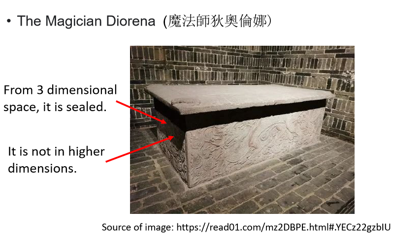

​	但是狄奥伦娜他从里面取得了圣杯，而且还放了一串葡萄进去，君士坦丁十一世为了要验证，狄奥伦娜是不是真的有这个能力，就带了一堆人真的去撬开了这个石棺，发现圣杯真的被拿走了，里面真的有一串新鲜的葡萄，就知道狄奥伦娜真的有，这个万军从中取上将首级的能力，那为什么迪奥伦娜可以做到这些事呢，那是因为这个石棺你觉得它是封闭的，那是因为你是从三维的空间来看，从三维的空间来看，这个石棺是封闭的，没有任何路可以进去，但是狄奥伦娜可以进入四维的空间，从高维的空间中，这个石棺是有路可以进去的，它并不是封闭的，至于狄奥伦娜有没有成功刺杀苏丹呢，你可以想象一定是没有嘛，所以君坦丁堡才沦陷，那至于为什么没有，大家请见于三体，

​	总之这个**从三维的空间来看，是没有路可以走的东西，在高维的空间中是有路可以走的，error surface会不会也一样呢**

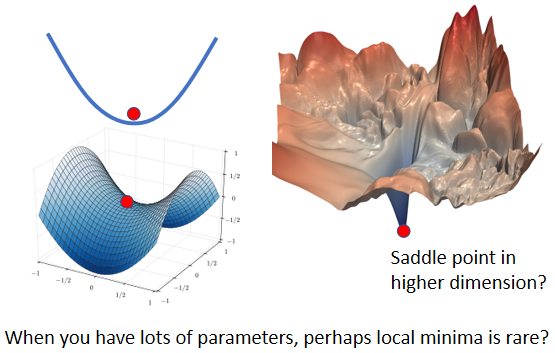

​	所以你在一维的空间中，一维的一个参数的error surface，你会觉得好像到处都是local minima，但是会不会在二维空间来看，它就只是一个saddle point呢，常常会有人画类似这样的图，告诉你说Deep Learning的训练，是非常的复杂的，如果我们移动某两个参数，error surface的变化非常的复杂，是这个样子的，那显然它有非常多的local minima，我的这边现在有一个local minima，但是会不会这个local minima，只是在二维的空间中，看起来是一个local minima，在更高维的空间中，它看起来就是saddle point，在二维的空间中，我们没有路可以走，那会不会在更高的维度上，因为更高的维度，我们没办法visualize它，我们没办法真的拿出来看，会不会在更高维的空间中，其实有路可以走的，那如果维度越高，是不是可以走的路就越多了呢，所以 今天我们在训练，一个network的时候，我们的参数往往动輒百万千万以上，所以我们的error surface，其实是在一个非常高的维度中，对不对，我们参数有多少，就代表我们的error surface的，维度有多少，参数是一千万 就代表error surface，它的维度是一千万，竟然维度这么高，会不会其实，根本就有非常多的路可以走呢，那既然有非常多的路可以走，会不会其实local minima，根本就很少呢，

​	而经验上，如果你自己做一些实验的话，也支持这个假说

​	这边是训练某一个network的结果，每一个点代表，训练那个network训练完之后，把它的Hessian拿出来进行计算，所以这边的每一个点，都代表一个network，就我们训练某一个network，然后把它训练训练，训练到gradient很小，卡在critical point，把那组参数出来分析，看看它比较像是saddle point，还是比较像是local minima

- 纵轴代表training的时候的loss，就是我们今天卡住了，那个loss没办法再下降了，那个loss是多少，那很多时候，你的loss在还很高的时候，训练就不动了 就卡在critical point，那很多时候loss可以降得很低，才卡在critical point，这是纵轴的部分
- 横轴的部分是minimum ratio，minimum ratio是**eigen value的数目分之正的eigen value的数目**，又**如果所有的eigen value都是正的，代表我们今天的critical point，是local minima，如果有正有负代表saddle point**，那在实作上你会发现说，你几乎找不到完全所有eigen value都是正的critical point，你看这边这个例子里面，这个minimum ratio代表eigen value的数目分之正的eigen value的数目，最大也不过0.5到0.6间而已，代表说只有一半的eigen value是正的，还有一半的eigen value是负的，

​	所以今天虽然在这个图上，越往右代表我们的critical point越像local minima，**但是它们都没有真的，变成local minima**，就算是在最极端的状况，我们仍然有一半的case，我们的eigen value是负的，这一半的case eigen value是正的，代表说在所有的维度里面有一半的路，这一半的路 如果要让loss上升，还有一半的路可以让loss下降。

​	所以从经验上看起来，其实local minima并没有那么常见，多数的时候，你觉得你train到一个地方，你gradient真的很小，然后所以你的参数不再update了，往往是因为你卡在了一个saddle point。

