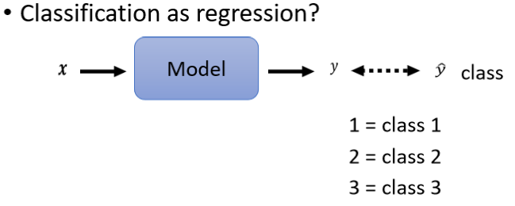
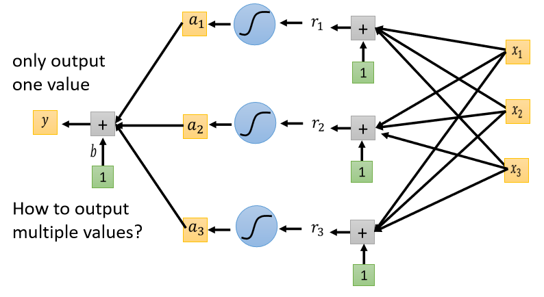
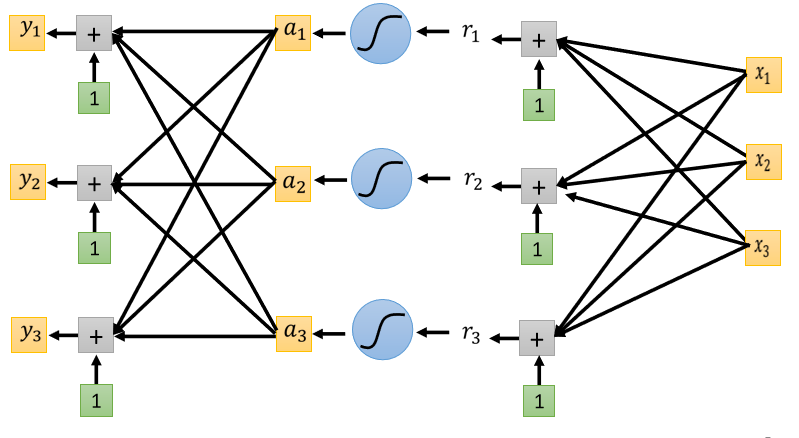
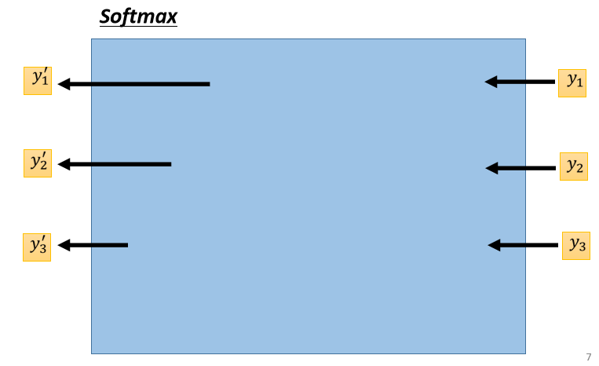
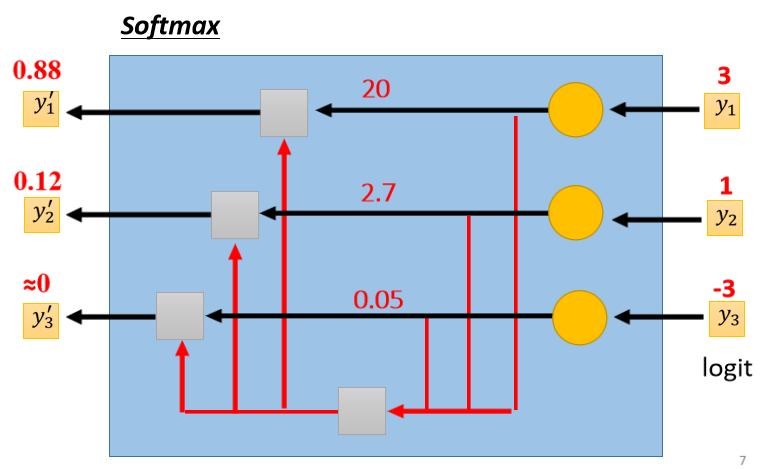
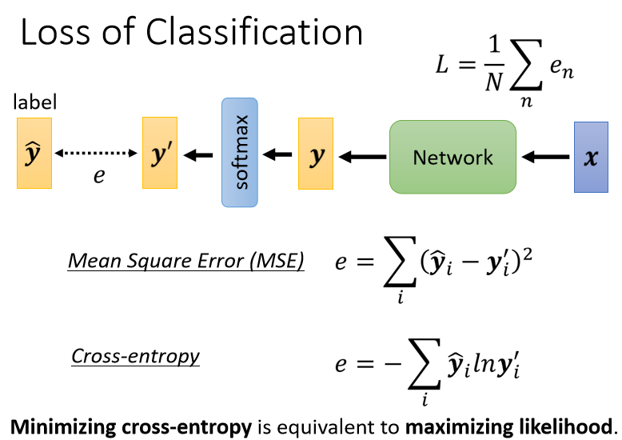
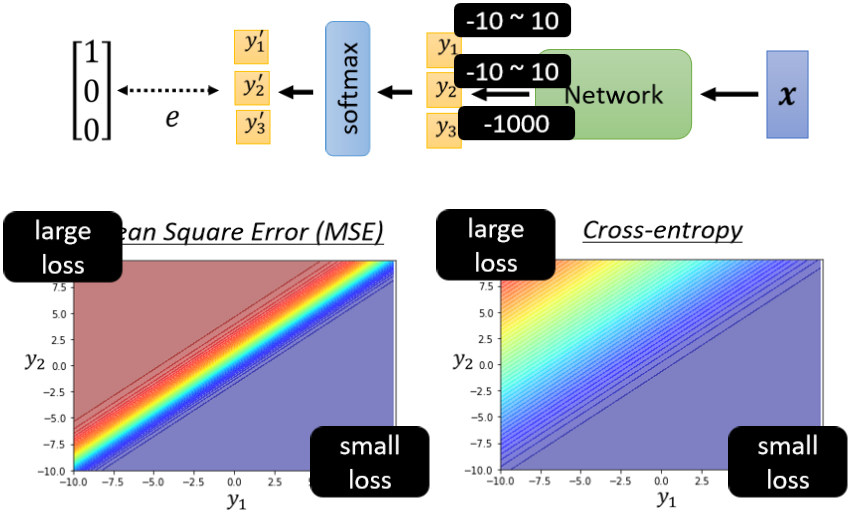

# Classification

## To learn more

接下来讲有关分类怎么做这件事情，这边讲的是一个短的版本，因为时间有限的关系，如果你想要看长的版本的话，可以看一下[过去上课的录影](https://www.bilibili.com/video/BV13x411v7US?p=10)

过去可能是花两个小时，到三个小时的时间才讲完，分类这件事情，我们这边用一个最快的方法，直接跟你讲分类是怎么做的

## Classification as Regression？

分类是怎么做的呢？我们已经讲了Regression，就是输入一个向量，然后输出一个数值，我们希望输出的数值跟某一个label，也就是我们要学习的目标，越接近越好。这门课里面，**如果是正确的答案就有加Hat，Model的输出没有加Hat**

有一个可能，假设你会用Regression的话，我们其实可以**把Classification，当作是Regression来看**

这个方法不一定是个好方法，这是一个比较奇妙的方法，输入一个东西以后，我们的输出仍然是一个scaler，它叫做y 然后这一个y，我们要让它跟正确答案，那个Class越接近越好，但是**y是一个数字**，我们怎么让它跟Class越接近越好呢，我们**必须把Class也变成数字**

举例来说 Class1就是编号1，Class2就是编号2，Class3就是编号3，接下来我们要做的事情，就是希望y可以跟Class的编号，越接近越好

但是这会是一个好方法吗，如果你仔细想想的话，这个方法也许在某些状况下，是会有瑕疵的

因为如果你假设说Class one就是编号1，Class two就是编号2，Class3就是编号3，意味着说你觉得**Class1跟Class2是比较像**，然后**Class1跟Class3 它是比较不像**，像这样子的表示Class的方式，有时候可行，有时候不可行

- 假设你的Class one two three**真的有某种关系**。举例来说，你想要根据一个人的身高跟体重，然后预测他是几年级的小学生，一年级 二年级 还是三年级，那可能一年级真的跟二年级比较接近，一年级真的跟三年级比较没有关系

- 但是假设你的三个Class本身，**并没有什么特定的关系**的话，你说Class one是1，Class two是2 Class two是3，那就很奇怪了，因为你这样是预设说，一二有比较近的关系，一三有比较远的关系，所以怎么办呢？

## Class as one-hot vector

当你在做分类的问题的时候，比较常见的做法是把你的Class，用 One-hot vector来表示

如果有三个Class，我们的 label 这个ŷ，就是一个三维的向量，然后呢 如果是Class1就是$\begin{bmatrix}{1} \\\ {0}\\\ {0}\end{bmatrix}$，如果是Class2就是$\begin{bmatrix} {0}\\\ {1}\\\ {0}\end{bmatrix}$，如果是Class3就是$\begin{bmatrix} {0}\\\ {0}\\\ {1}\end{bmatrix}$，所以每一个Class，你都用一个One-hot vector来表示

而且你用One-hot vector来表示的话，就没有说Class1跟Class2比较接近，Class1跟Class3比较远这样子的问题，如果你把这个One-hot vector**用来算距离的话，Class之间两两它们的距离都是一样**的。

如果我们今天的目标y hat是一个向量。比如说，ŷ是有三个element的向量，那我们的network，也应该要Output的维度也是三才行

到目前为止我们讲的network，其实都只Output一个数值，因为我们**过去做的都是Regression的问题，所以只Output一个数字**

其实**从一个数值改到三个数值，它是没有什么不同的**

你可以Output一个数值，你就可以Output三个数值，所以把本来Output一个数值的方法，重复三次

- 把a₁ a₂ a₃，乘上三个不同的Weight 加上bias，得到y₁

- 再把a₁ a₂ a₃乘上另外三个Weight，再加上另外一个bias得到y₂

- 再把a₁ a₂ a₃再乘上另外一组Weight，再加上另外一个bias得到y₃

你就可以产生三组数字，所以你就可以Input一个feature的Vector，然后产生y₁ y₂ y₃，然后希望y₁ y₂ y₃，跟我们的目标越接近越好，

## Classification with softmax

好 那所以我们现在，知道了Regression是怎么做的，输入 x 输出 y 要跟 label ŷ，越接近越好

如果是Classification，input x可能乘上一个W，再加上b 再通过activation function，再乘上W'再加上b' 得到y，我们现在的**y它不是一个数值，它是一个向量**

但是在做Classification的时候，我们往往会**把y再通过一个叫做Soft-max的function得到y'**，然后我们才去计算，y'跟y hat之间的距离

为什么要加上Soft-max呢，一个比较简单的解释

这边有一个骗小孩的解释就是，这个 ŷ 它里面的值，都是0跟1，它是One-hot vector，所以里面的值只有0跟1，但是 y 里面有任何值

既然我们的目标只有0跟1，但是 ==y 有**任何值**，我们就先把它Normalize到**0到1之间**，这样才好跟 label 的计算相似度==，这是一个比较简单的讲法

Soft-max要做的事情，就是把本来y里面可以放任何值，改成挪到0到1之间

### Softmax

这个是 Soft-max 的 block，输入y₁ y₂ y₃，它会产生y₁' y₂' y₃'

它里面运作的模式是这个样子的
$$
y_i'=\frac{exp(y_i)}{\sum_j exp(y_i)}
$$
我们会先把所有的y取一个exponential，就算是负数，取exponential以后也变成正的，然后你再对它做Normalize，除掉所有y的exponential值的和，然后你就得到y'

或者是用图示化的方法是这个样子

有了这个式子以后，你就会发现

- y₁' y₂' y₃'，它们都是介于**0到1之间**
- y₁' y₂' y₃'，它们的**和是1**

如果举一个例子的话，本来 y₁等于3、y₂等于1、y₃等于-3，取完exponential的时候呢，就变成 exp3 就是20，exp1就是2.7，exp-3就是0.05，做完Normalization以后，这边就变成0.88  0.12 和0

所以这个Soft-max它要做的事情，除了Normalized，让 y₁' y₂' y₃'，**变成0到1之间**，还有**和为1**以外，它还有一个附带的效果是，==它会让大的值跟小的值的差距更大==

本来 -3 然后通过exponential，再做Normalized以后，会变成趋近于0的值，然后这个Soft-max的输入，往往就叫它==logit==

这边考虑了3个class的状况，那**如果两个class会是怎么样**

如果是两个class你当然可以直接套soft-max这个function没有问题，但是也许你更常听到的是，当有两个class的时候，我们就不套soft-max，我们直接取sigmoid

那==当两个class用sigmoid，跟soft-max两个class，你如果推一下的话，会发现说这两件事情是等价的==

## Loss of Classification

我们把 x，丢到一个 Network 里面产生 y 以后，我们会通过 soft-max 得到 y'，再去计算 y' 跟 ŷ 之间的距离，这个写作 е

**计算 y' 跟 ŷ 之间的距离不只一种做法**，举例来说，如果我喜欢的话，我要让这个距离是 Mean Square Error
$$
e=\sum_i(\hat{y_i}-y_i')^2
$$
就是把 ŷ 里面每一个 element 拿出来，然后计算它们的平方和，当作我们的 error，这样也是计算两个向量之间的距离，你也可以说，你也可以做到说当 minimize，Mean Square Error的时候，我们可以让 ŷ 等于 y'

但是有另外一个更常用的做法，叫做 Cross-entropy
$$
e=-\sum_i\hat{y_i}\ln{y_i'}
$$
- Cross-entropy 是对所有的 i 求和
- 然后把 ŷ 的第 i 位拿出来，乘上 y' 的第 i 位取自然对数
- 然后再全部加起来

这个是 Cross-entropy，那当 ŷ 跟 y' 一模一样的时候，你也可以 Minimize Cross-entropy 的值，此时，MSE 会是最小的，Cross-entropy 也会是最小的

但是为什么会有 Cross-entropy，这么奇怪的式子出现呢？

那如果要讲得长一点的话，这整个故事我们可以把它讲成，**Make Minimize Cross-entropy 其实就是 maximize likelihood**，你很可能在很多地方，都听过 likelihood 这个词汇，详见[过去上课影片](https://www.bilibili.com/video/BV13x411v7US?p=10)

所以如果有一天有人问你说，如果我们今天在做分类问题的时候，maximize likelihood ，跟 Minimize Cross-entropy，有什么关系的时候，不要回答说它们其实很像，但是其实又有很微妙的不同这样，不是这样，它们两个就是一模一样的东西，只是同一件事不同的讲法而已

所以假设你可以接受说，我们在训练一个 classifier 的时候，应该要maximize likelihood 就可以接受，应该要 Minimizing Cross-entropy

在 pytorch 里面，Cross-entropy 跟 Soft-max，他们是被绑在一起的，他们是一个 Set，你只要 Copy Cross-entropy，里面就自动内建了 Soft-max

那接下来**从 optimization 的角度，来说明相较于 Mean Square Error，Cross-entropy 是被更常用在分类上，**

那这个部分，你完全可以在数学上面做证明，但是我这边，是直接用举例的方式来跟你说明，如果你真的非常想看数学证明的话，我把[链接](http://speech.ee.ntu.edu.tw/~tlkagk/courses/MLDS_2015_2/Lecture/Deep%20More%20(v2).ecm.mp4/index.html)放在这边你可以一下过去上课的录影

如果你不想知道的话，那我们就是举一个例子来告诉你说，为什么是Cross-entropy比较好

那现在我们要做一个**3个Class的分类**

Network 先输出 y₁ y₂ y₃，在通过 soft-max 以后，产生 y₁' y₂' 跟 y₃'

那接下来假设我们的正确答案就是如上向量，我们要去计算100这个向量，跟 y₁' y₂' 跟 y₃' 他们之间的距离，那这个距离我们用 е 来表示，е 可以是 Mean square error，也可以是 Cross-entropy，

我们现在假设 y₁ 的变化是从-10到10，y₂ 的变化也是从-10到10，y₃ 我们就固定设成-1000

因为 y₃ 设很小，所以过 soft-max 以后 y₃' 就非常趋近于0，它跟正确答案非常接近，且它对我们的结果影响很少

总之我们 **y₃ 设一个定值**，我们**只看 $y_1$ 跟 $y_2$ 有变化的时候，对我们的 e 对我们的 Loss 对我们 loss 有什么样的影响**

那我们看一下 如果我们这个 e，设定为 Mean Square Error，跟 Cross-entropy 的时候，算出来的 Error surface 会有什么样，不一样的地方。底下这两个图，就分别在我们 e 是 Mean square error，跟 Cross-entropy 的时候， y₁ y₂ 的变化对 loss 的影响，对 Error surface 的影响，

我们这边是用**红色代表 Loss 大，蓝色代表 Loss 小**

- 那如果今天 **y₁ 很大  y₂ 很小**，就代表 **y₁' 会很接近1，y₂' 会很接近0**，所以不管是对 Mean Square Error，或是 Cross-entropy 而言，**y₁ 大  y₂ 小的时候，Loss 都是小的**

- 如果 **y₁ 小 y₂大**的话，这边 **y₁' 就是 0，y₂' 就是1**，所以这个时候 Loss 会比较大

所以这两个图都是**左上角 Loss 大，右下角 Loss 小**，所以我们就期待说，我们最后**在 Training 的时候，我们的参数可以走到右下角**的地方

那假设**我们开始的地方，都是左上角**

- 如果我们选择 Cross-Entropy，左上角这个地方，它是有斜率的，所以你有办法透过 gradient，一路往右下的地方走，
- 如果你选 Mean square error 的话，你就卡住了，Mean square error 在这种 Loss 很大的地方，它是非常平坦的，它的 gradient 是非常小趋近于0的，如果你初始的时候在这个地方，离你的目标非常远，那它 gradient 又很小，你就会没有办法用 gradient descent，顺利的走到右下角的地方去，

所以你如果你今天自己在做 classification，你选 Mean square error 的时候，你有非常大的可能性会 train 不起来，当然这个是在你没有好的 optimizer 的情况下，今天如果你用 Adam，这个地方 gradient 很小，那 gradient 很小之后，它 learning rate 之后会自动帮你调大，也许你还是有机会走到右下角，不过这会让你的 training，比较困难一点，让你 training 的起步呢，比较慢一点

所以这边有一个很好的例子，是告诉我们说，就算是 Loss function 的定义，都可能影响 Training 是不是容易这件事情，刚才说要用神罗天征，直接把 error surface 炸平，这边就是一个好的例子告诉我们说，你可以改 Loss function，居然可以改变 optimization 的难度。