# Transformer_P1_Encoder

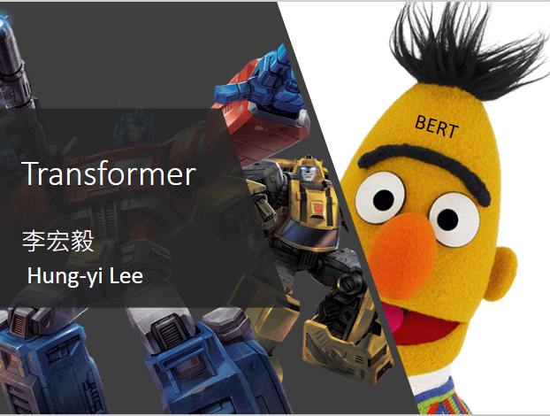

变形金刚的英文就是Transformer，那Transformer也跟我们之后会提到的BERT有非常强烈的关系，所以这边有一个BERT探出头来，代表说Transformer跟BERT是很有关系的

## Sequence-to-sequence (Seq2seq)

Transformer就是一个==Sequence-to-sequence==的model，他的缩写，我们会写做==Seq2seq==，那Sequence-to-sequence的model，又是什么呢

我们之前在讲input a sequence的，case的时候，我们说input是一个sequence，那output有几种可能

- 一种是input跟output的长度一样，这个是在作业二的时候做的
- 有一个case是output只output一个东西，这个是在作业四的时候做的
- 那接来作业五的case是我们不知道应该要output多长，由机器自己决定output的长度，即Seq2seq

1. 举例来说，Seq2seq一个很好的应用就是 **语音辨识**

    

    在做语音辨识的时候，输入是声音讯号，声音讯号其实就是一串的vector，输出是语音辨识的结果，也就是输出的这段声音讯号所对应的文字

    我们这边用圈圈来代表文字，每一个圈圈就代表，比如说中文里面的一个方块子，今天**输入跟输出的长度，当然是有一些关系，但是却没有绝对的关系**，输入的声音讯号，他的长度是大T，我们并没有办法知道说，根据大T输出的这个长度N一定是多少。

    **输出的长度由机器自己决定**，由机器自己去听这段声音讯号的内容，自己决定他应该要输出几个文字，他输出的语音辨识结果，输出的句子里面应该包含几个字，由机器自己来决定，这个是语音辨识

2. 还有很多其他的例子，比如说作业五我们会做机器翻译

    

    让机器读一个语言的句子，输出另外一个语言的句子，那在做机器翻译的时候，**输入的文字的长度是N，输出的句子的长度是N'，那N跟N'之间的关系，也要由机器自己来决定**

    输入机器学习这个句子，输出是machine learning，输入是有四个字，输出有两个英文的词汇，但是并不是所有中文跟英文的关系，都是输出就是输入的二分之一，到底输入一段句子，输出英文的句子要多长，由机器自己决定

3. 甚至可以做更复杂的问题，比如说做语音翻译

    

    语音翻译就是，你对机器说一句话，比如说machine learning，他输出的不是英文，他直接**把他听到的英文的声音讯号翻译成中文文字**

    你对他说machine learning，他输出的是机器学习

    为什么我们要做Speech Translation这样的任务，为什么我们不直接先做一个语音辨识，再做一个机器翻译，把语音辨识系统跟机器翻译系统，接起来就直接是语音翻译？

    因为**世界上有很多语言，他根本连文字都没有**，世界上有超过七千种语言，那其实在这七千种语言，有超过半数其实是没有文字的，对这些没有文字的语言而言，你要做语音辨识，可能根本就没有办法，因为他没有文字，所以你根本就没有办法做语音辨识，但我们有没有可能对这些语言，做语音翻译，直接把它翻译成，我们有办法阅读的文字

### Hokkien（闽南语、台语）

一个很好的例子也许就是，台语的语音辨识，但我不会说台语没有文字，很多人觉得台语是有文字的，但台语的文字并没有那么普及，现在听说小学都有教台语的文字了，但台语的文字，并不是一般人能够看得懂的

如果你做语音辨识，你给机器一段台语，然后它可能输出是母汤，你根本就不知道，这段话在说什么。

所以我们期待说机器也许可以做语音的翻译，对它讲一句台语，它直接输出的是同样意思的，中文的句子，那这样一般人就可以看懂

我们可以训练一个类神经网路，这个类神经网路听某一种语言，的声音讯号，输出是另外一种语言的文字。

今天你要训练一个neural network，你就需要有input跟output的配合，你需要有台语的声音讯号，跟中文文字的对应关系，那这样的资料是比较容易收集的。比如说YouTube上面，有很多的乡土剧

乡土剧就是，台语语音 中文字幕，所以你只要它的台语语音载下来，中文字幕载下来，你就有台语声音讯号，跟中文之间的对应关系，你就可以train一个模型，然后叫机器直接做台语的语音辨识，输入台语 输出中文

那你可能会觉得这个想法很狂，而且好像听起来有很多很多的问题，那我们实验室就载了一千五百个小时的乡土剧的资料，然后就真的拿来训练一个，语音辨识系统

你可能会觉得说，这听起来有很多的问题

- 乡土剧有很多杂讯，有很多的音乐，不要管它这样子
- 乡土剧的字幕，不一定跟声音有对起来，就不要管它这样子
- 台语还有一些，比如说台罗拼音，台语也是有类似音标这种东西，也许我们可以先辨识成音标，当作一个中介，然后在从音标转成中文，也没有这样做 

直接训练一个模型，输入是声音讯号，输出直接就是中文的文字，这种没有想太多 直接资料倒进去，就训练一个模型的行为，就叫作==硬train一发==

那你可能会想说，这样子硬train一发到底能不能够，做一个台语语音辨识系统呢，其实 还真的是有可能的，以下是一些真正的结果

机器在听的一千五百个小时的，乡土剧以后，你可以对它输入一句台语，然后他就输出一句中文的文字，以下是真正的例子

机器听到的声音是这样子的

- 你的身体撑不住(台语)，那机器输出是什么呢，它的输出是 你的身体撑不住，这个声音讯号是你的身体撑不住(台语)，但机器并不是输出无勘，而是它就输出撑不住
- 或者是机器听到的，是这样的声音讯号，没事你为什么要请假(台语)，没事你为什么要请假，机器听到没事(台语)，它并不是输出 没代没志，它是输出 没事，这样听到四个音节没代没志(台语)，但它知道说台语的没代没志(台语)，翻成中文 也许应该输出 没事，所以机器的输出是，没事你为什么要请假
- 但机器其实也是蛮容易犯错的，底下特别找机个犯错的例子，给你听一下，你听听这一段声音讯号，不会腻吗(台语)，他说不会腻吗(台语)，我自己听到的时候我觉得，我跟机器的答案是一样的，就是说**要生了吗**，但其实这句话，正确的答案就是，不会腻吗(台语)，不会腻吗
- 当然机器在倒装，你知道有时候你从台语，转成中文句子需要倒装，在倒装的部分感觉就没有太学起来，举例来说它听到这样的句子，我有跟厂长拜托(台语)，他说我有跟厂长拜托(台语)，那机器的输出是，我有帮厂长拜托，但是你知道说这句话，其实是倒装，我有跟厂长拜托(台语)，是我拜托厂长，但机器对于它来说，如果台语跟中文的关系需要倒装的话，看起来学习起来还是有一点困难

这个例子想要告诉你说，直接台语声音讯号转繁体中文，不是没有可能，是有可能可以做得到的，那其实台湾有很多人都在做，台语的语音辨识，如果你想要知道更多有关，台语语音辨识的事情的话，可以看一下下面这个[网站](https://sites.google.com/speech.ntut.edu.tw/fsw/home/challenge-2020)

#### Text-to-Speech (TTS) Synthesis  

台语语音辨识反过来，就是台语的**语音合成**，我们如果是一个模型，输入台语声音 输出中文的文字，那就是语音辨识，反过来 输入文字 输出声音讯号，就是语音合成

这边就是demo一下台语的语音合成，这个资料用的是，台湾 媠声(台语)的资料，来找GOOGLE台湾媠声(台语)，就可以找到这个资料集，里面就是台语的声音讯号，听起来像是这个样子

比如说你跟它说，欢迎来到台湾台大语音处理实验室

不过这边是需要跟大家说明一下，现在还没有真的做End to End的模型，**这边模型还是分成两阶**，他会先把中文的文字，转成台语的台罗拼音，就像是台语的KK音标，在把台语的KK音标转成声音讯号，不过从台语的KK音标，转成声音讯号这一段，就是一个像是Transformer的network，其实是一个叫做echotron的model，它本质上就是一个Seq2Seq model，大概长的是这个样子

所以你输入文字，欢迎来到台大语音处理实验室，机器的输出是这个样子的，欢迎来到台大(台语)，语音处理实验室(台语)，或是你对他说这一句中文，然后他输出的台语是这个样子，最近肺炎真严重(台语)，要记得戴口罩 勤洗手(台语)，有病就要看医生(台语)

所以你真的是可以，合出台语的声音讯号的，就用我们在这一门课里面学到的，Transformer或者是Seq2Seq的model

### Seq2seq for Chatbot

刚才讲的是跟语音比较有关的，那在**文字**上，也会很广泛的使用了Seq2Seq model

举例来说你可以用Seq2Seq model，来训练一个聊天机器人

聊天机器人就是你对它说一句话，它要给你一个回应，**输入输出都是文字**，文字就是一个vector Sequence，所以你完全可以用Seq2Seq 的model，来做一个聊天机器人

你就要**收集大量人的对话**，像这种对话你可以收集，电视剧 电影的台词 等等，你可以收集到，一堆人跟人之间的对话

假设在对话里面有出现，某一个人说Hi，和另外一个人说，Hello How are you today，那你就可以教机器说，看到输入是Hi，那你的输出就要跟，Hello how are you today，越接近越好

那就可以训练一个Seq2Seq model，那跟它说一句话，它就会给你一个回应

### Question Answering (QA)

那事实上Seq2Seq model，在NLP的领域，在natural language processing的领域的使用，是比你想像的更为广泛，其实很多**natural language processing的任务，都可以想成是==question answering，QA==的任务**

Question Answering，就是给机器读一段文字，然后你问机器一个问题，希望他可以给你一个正确的答案

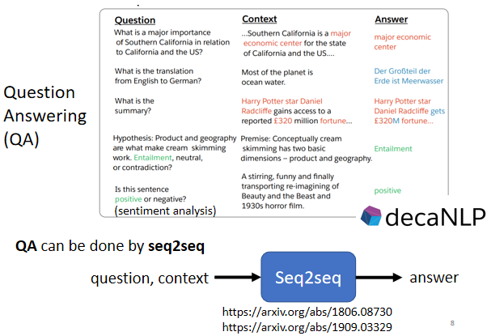

- 假设你今天想做的是翻译，那机器读的文章就是一个英文句子，**问题**就是这个句子的德文翻译是什么，然后输出的**答案**就是德文
- 或者是你想要叫机器自动作摘要，摘要就是给机器读一篇长的文章，叫他把长的文章的重点节录出来，那你就是给机器一段文字，**问题**是这段文字的摘要是什么，然后期待他**答案**可以输出一个摘要
- 或者是你想要叫机器做Sentiment analysis，Sentiment analysis就是机器要自动判断一个句子，是正面的还是负面的；假设你有做了一个产品，然后上线以后，你想要知道网友的评价，但是你又不可能一直找人家ptt上面，把每一篇文章都读过，所以就做一个Sentiment analysis model，看到有一篇文章里面，有提到你的产品，然后就把这篇文章丢到，你的model里面，去判断这篇文章，是正面还是负面。你就给机器要判断正面还负面的文章，**问题**就是这个句子，是正面还是负面的，然后希望机器可以告诉你**答案**

所以各式各样的NLP的问题，往往都可以看作是QA的问题，而**QA的问题，就可以用Seq2Seq model来解**

具体来说就是有一个Seq2Seq model输入，就是有问题跟文章把它接在一起，输出就是问题的答案，就结束了，你的问题加文章合起来，是一段很长的文字，答案是一段文字

Seq2Seq model只要是**输入一段文字**，**输出一段文字**，只要是**输入一个Sequence**，**输出一个Sequence**就可以解，所以你可以把QA的问题，硬是用Seq2Seq model解，叫它读一篇文章读一个问题，然后就直接输出答案，所以各式各样NLP的任务，其实都有机会使用Seq2Seq model

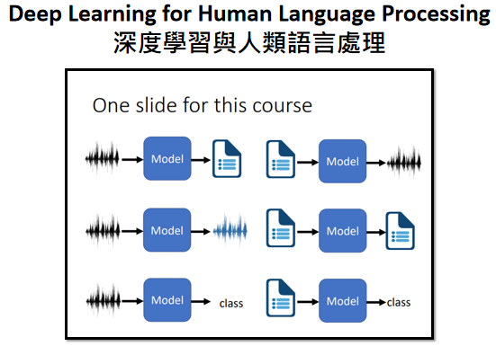

必须要强调一下，对多数NLP的任务，或对多数的语音相关的任务而言，往往为这些任务**客制化模型，你会得到更好的结果**

但是各个任务客制化的模型，就不是我们这一门课的重点了，如果你对人类语言处理，包括语音 包括自然语言处理，这些相关的任务有兴趣的话呢，可以参考一下以下课程网页的[链接](Source webpage: https://speech.ee.ntu.edu.tw/~hylee/dlhlp/2020-spring.html)，就是去年上的深度学习，与人类语言处理，这门课的内容里面就会教你，各式各样的任务最好的模型，应该是什么

举例来说在做语音辨识，我们刚才讲的是一个Seq2Seq model，输入一段声音讯号，直接输出文字，今天啊 Google的 pixel4，Google官方告诉你说，Google pixel4也是用，N to N的Neural network，pixel4里面就是，有一个Neural network，输入声音讯号，输出就直接是文字

但他其实用的不是Seq2Seq model，他用的是一个叫做，RNN transducer的 model，像这些模型他就是为了，语音的某些特性所设计，这样其实可以表现得更好，至于每一个任务，有什么样客制化的模型，这个就是另外一门课的主题，就不是我们今天想要探讨的重点

### Seq2seq for Syntactic Parsing 

在语音还有自然语言处理上的应用，其实有很多应用，你**不觉得他是一个Seq2Seq model的问题，但你都可以硬用Seq2Seq model的问题硬解他**

举例来说**文法剖析**，给机器一段文字，比如Deep learning is very powerful

机器要做的事情是产生，一个**文法的剖析树**告诉我们，deep加learning合起来，是一个名词片语，very加powerful合起来，是一个形容词片语，形容词片语加is以后会变成一个动词片语，动词片语加名词片语合起来是一个句子

那今天文法剖析要做的事情，就是产生这样子的一个Syntactic tree，所以在文法剖析的任务里面，假设你想要deep learning解的话，输入是一段文字，他是一个Sequence，但输出看起来不像是一个Sequence，输出是一个树状的结构，但**事实上一个树状的结构，可以硬是把他看作是一个Sequence**

这个树状结构可以对应到一个，这样子的Sequence，从这个Sequence里面，你也可以看出

- 这个树状的结构有一个S，有一个左括号，有一个右括号
- S里面有一个noun phrase，有一个左括号跟右括号
- NP里面有一个左括号跟右括号，NP里面有is
- 然后有这个形容词片语，他有一个左括号右括号

这一个**Sequence就代表了这一个tree 的structure**，你先把tree 的structure，转成一个Sequence以后，你就可以用Seq2Seq model硬解他

train一个Seq2Seq model，读这个句子，然后直接输入这一串文字，再把这串文字转成一个树状的结构，你就可以硬是用Seq2Seq model，来做文法剖析这件事，这个概念听起来非常的狂，但这是真的可以做得到的，

你可以读一篇文章叫做，grammar as a Foreign Language

这篇文章其实不是太新的文章，你会发现她放在arxiv上面的时间是14年的年底，所以其实也是一个上古神兽等级的文章，这篇文章问世的时候，那个时候Seq2Seq model还不流行，那时候Seq2Seq model主要只有被用在翻译上，所以这篇文章的title才会去说grammar as a Foreign Language

他把文法剖析这件事情当作是一个翻译的问题，把文法当作是另外一种语言，直接套用当时人们认为只能用在翻译上的模型硬做，结果他得到state of the art的结果

我(李宏毅老师)其实在国际会议的时候，有遇过这个第一作者Oriol Vlnyals，那个时候Seq2Seq model，还是个非常潮的东西，那个时候在我的认知里面，我觉得这个模型，应该是挺难train的，我问他说，train Seq2Seq model有没有什么tips，没想到你做个文法剖析，用Seq2Seq model，居然可以硬做到state of the art，这应该有什么很厉害的tips吧

他说什么没有什么tips，他说我连Adam都没有用，我直接gradient descent，就train起来了，我第一次train就成功了，只是我要冲到state of the art，还是稍微调了一下参数而已，我也不知道是真的还假的啦，不过今天Seq2Seq model，真的是已经被很广泛地应用在各式各样的应用上了

### multi-label classification

还有一些任务可以用seq2seq's model，举例来说 ==multi-label的classification==

==multi-class==的classification，跟==multi-label==的classification，听起来名字很像，但他们其实是不一样的事情，multi-class的classification意思是说，我们有不只一个class机器要做的事情，是从数个class里面，选择某一个class出来

但是multi-label的classification，意思是说**同一个东西，它可以属于多个class**，举例来说 你在做文章分类的时候

可能这篇文章 属于class 1跟3，这篇文章属于class 3 9 17等等，你可能会说，这种multi-label classification的问题，能不能**直接把它当作一个multi-class classification的问题来解**

举例来说，我把这些文章丢到一个classifier里面

- 本来classifier只会输出一个答案，输出分数最高的那个答案
- 我现在就输出分数最高的前三名，看看能不能解，multi-label的classification的问题

但**这种方法可能是行不通的**，因为每一篇文章对应的class的数目，根本不一样 有些东西 有些文章，对应的class的数目，是两个 有的是一个 有的是三个

所以 如果你说 我直接取一个threshold，我直接取分数最高的前三名，class file output分数最高的前三名，来当作我的输出，显然不一定能够得到好的结果，那怎么办呢？

这边可以用seq2seq硬做，**输入一篇文章**，**输出就是class**，就结束了，机器自己决定它要输出几个class

我们说seq2seq model，就是由机器自己决定输出几个东西，输出的output sequence的长度是多少，既然你没有办法决定class的数目，那就让机器帮你决定每篇文章要属于多少个class

### Seq2seq for Object Detection

或者是object detection，这个看起来跟seq2seq model，应该八竿子打不着的问题，它也可以用seq2seq's model硬解

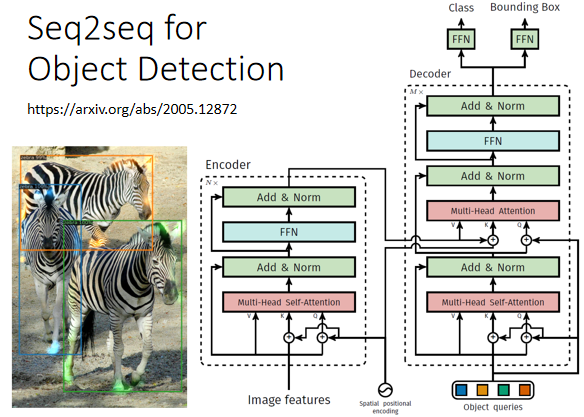

object detection就是给机器一张图片，然后它把图片里面的物件框出来，把它框出说 这个是斑马 这个也是斑马，但这种问题 可以用seq2seq's硬做，至于怎么做 我们这边就不细讲，我在这边放一个文献，放一个链接给大家参考，讲这么多就是要告诉你说，seq2seq's model 它是一个很powerful的model，是一个很有用的model

## Encoder-Decoder

我们现在就是要来学，怎么做seq2seq这件事。一般的seq2seq's model，它里面会分成两块，一块是Encoder，另外一块是Decoder

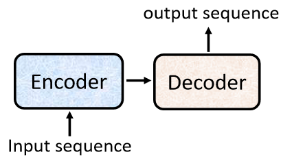

你input一个sequence有Encoder，负责处理这个sequence，再把处理好的结果丢给Decoder，由Decoder决定，它要输出什么样的sequence，等一下我们都还会再细讲Encoder跟Decoder内部的架构

seq2seq model的起源，其实非常的早在14年的9月，就有一篇seq2seq's model用在翻译的文章

可以想像当时的seq2seq's model看起来还是比较阳春的，今天讲到seq2seq's model的时候，大家第一个会浮现在脑中的，可能都是我们今天的主角，也就是transformer

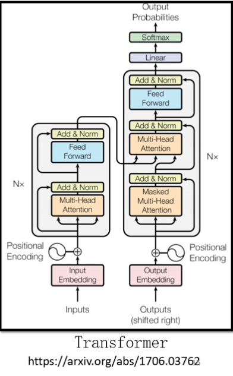

它有一个Encoder架构，有一个Decoder架构，它里面有很多花花绿绿的block，等一下就会讲一下，这里面每一个花花绿绿的block，分别在做的事情是什么

### Encoder

seq2seq model ==Encoder==要做的事情，就是**给一排向量，输出另外一排向量**

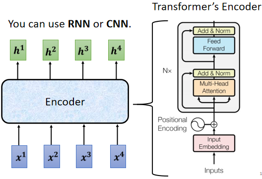

给一排向量、输出一排向量这件事情，很多模型都可以做到，可能第一个想到的是，我们刚刚讲完的self-attention，其实不只self-attention，RNN CNN 其实也都能够做到，input一排向量，output另外一个同样长度的向量

在transformer里面，transformer的Encoder用的就是self-attention，这边看起来有点复杂，我们用另外一张图，来仔细地解释一下，这个Encoder的架构，等一下再来跟原始的transformer的论文里面的图进行比对，

现在的Encoder里面，会**分成很多很多的block**

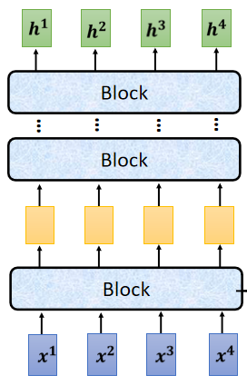

每一个block都是输入一排向量，输出一排向量，你输入一排向量 第一个block，第一个block输出另外一排向量，再输给另外一个block，到最后一个block，会输出最终的vector sequence，**每一个block其实并不是neural network的一层**

**每一个block里面做的事情，是好几个layer在做的事情**，在transformer的Encoder里面，每一个block做的事情，大概是这样子的

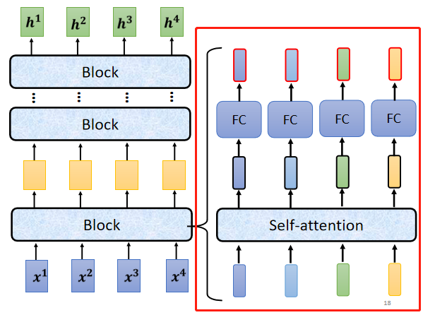

- 先做一个self-attention，input一排vector以后，做self-attention，考虑整个sequence的资讯，Output另外一排vector.
- 接下来这一排vector，会再丢到fully connected的feed forward network里面，再output另外一排vector，这一排vector就是block的输出

事实上在原来的**transformer里面做的事情更复杂**

在之前self-attention的时候，我们说输入一排vector，就输出一排vector，这边的每一个vector，它是考虑了所有的input以后所得到的结果

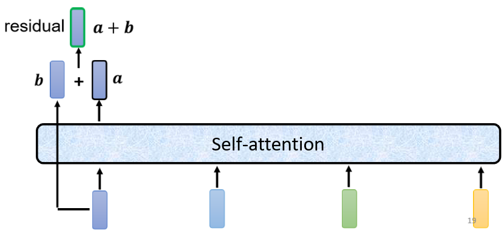

在transformer里面，它加入了一个设计，我们**不只是输出这个vector**，我们还要**把这个vector加上它的input**，它要把input拉过来 直接加给输出，得到新的output 

也就是说，这边假设这个vector叫做$a$，这个vector叫做$b$ 你要把$a+b$当作是新的输出

这样子的network架构，叫做==residual connection==，那其实这种residual connection，在deep learning的领域用的是非常的广泛，之后如果我们有时间的话，再来详细介绍，为什么要用residual connection

那你现在就先知道说，有一种network设计的架构，叫做**residual connection，它会把input直接跟output加起来，得到新的vector**

得到residual的结果以后，再把它做一件事情叫做normalization，这边用的不是batch normalization，这边用的叫做==layer normalization==

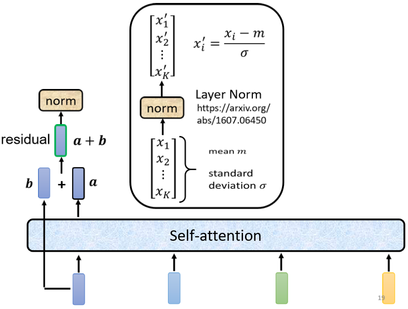

layer normalization做的事情，比bacth normalization更简单一点

输入一个向量 输出另外一个向量，不需要考虑batch，它会**把输入的这个向量，计算它的mean跟standard deviation**

但是要注意一下，**==batch normalization==是对不同example，不同feature的同一个dimension，去计算mean跟standard deviation**

但**==layer normalization==，它是对同一个feature，同一个example里面不同的dimension，去计算mean跟standard deviation**

计算出mean，跟standard deviation以后，就可以做一个normalize，我们把input这个vector里面每一个，dimension减掉mean，再除以standard deviation以后得到x'，就是layer normalization的输出
$$
x'_i=\frac{x_i-m}{\sigma}
$$
得到layer normalization的输出以后，它的这个输出才是FC network的输入

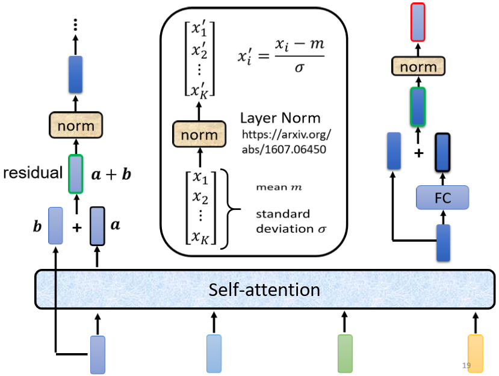

而**FC network这边，也有residual的架构**，所以 我们会把FC network的input，跟它的output加起来做一下residual，得到新的输出

这个FC network做完residual以后，还不是结束，你要把residual的结果，**再做一次layer normalization**，得到的输出，才是residual network里面，一个block的输出，所以这个是挺复杂的

所以我们这边讲的这一个图，其实就是我们刚才讲的那件事情

- 首先 你有self-attention，其实在input的地方，还有加上positional encoding，我们之前已经有讲过，如果你只光用self-attention，你没有未知的资讯，所以你需要加上positional的information，然后在这个图上，有特别画出positional的information
- Multi-Head Attention，这个就是self-attention的block，这边有特别强调说，它是Multi-Head的self-attention
- Add&norm，就是residual加layer normalization，我们刚才有说self-attention，有加上residual的connection，加下来还要过layer normalization，这边这个图上的Add&amp;norm，就是residual加layer norm的意思
- 接下来，要过feed forward network
- fc的feed forward network以后再做一次Add&amp;norm，再做一次residual加layer norm，才是一个block的输出，
- 然后这个block会重复n次，这个复杂的block，其实在之后会讲到的一个非常重要的模型BERT里面，会再用到，BERT它其实就是transformer的encoder

## To Learn more

讲到这边 你心里一定充满了问号，就是为什么 transformer的encoder，要这样设计，不这样设计行不行?

行 不一定要这样设计，这个encoder的network架构，现在设计的方式，本文是按照原始的论文讲给你听的，但**原始论文的设计 不代表它是最好的，最optimal的设计**

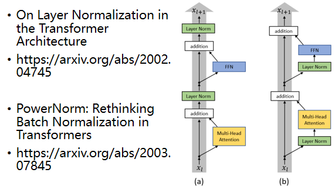

- 有一篇文章叫，[on layer normalization in the transformer architecture](https://arxiv.org/abs/2002.04745)，它问的问题就是 为什么，layer normalization是放在那个地方呢，为什么我们是先做，residual再做layer normalization，能不能够把layer normalization，放到每一个block的input，也就是说 你做residual以后，再做layer normalization，再加进去 你可以看到说左边这个图，是原始的transformer，右边这个图是稍微把block，更换一下顺序以后的transformer，更换一下顺序以后 结果是会比较好的，这就代表说，原始的transformer 的架构，并不是一个最optimal的设计，你永远可以思考看看，有没有更好的设计方式
- 再来还有一个问题就是，为什么是layer norm 为什么是别的，不是别的，为什么不做batch normalization，也许这篇paper可以回答你的问题，这篇paper是[Power Norm：，Rethinking Batch Normalization In Transformers](https://arxiv.org/abs/2003.07845)，它首先告诉你说 为什么，batch normalization不如，layer normalization，在Transformers里面为什么，batch normalization不如，layer normalization，接下来在说，它提出来一个power normalization，一听就是很power的意思，都可以比layer normalization，还要performance差不多或甚至好一点

