# BERT P2_Fun Facts about BERT（已整理）

## Why does BERT work?

为什么BERT有用？

最常见的解释是，当输入一串文本时，每个文本都有一个对应的向量。对于这个向量，我们称之为embedding。

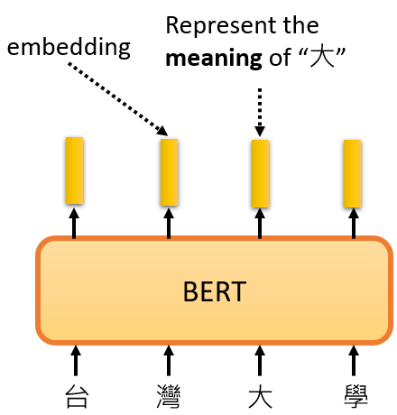

这些向量的特别之处在于，他们代表了**输入词**的**含义**。例如，模型输入"台湾大学"，输出4个向量。这4个向量分别代表"台"、"湾"、"大"和"学"。

更具体地说，如果你把这些词所对应的向量画出来，或者计算它们之间的**距离**。

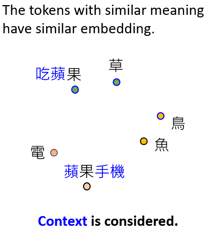

你会发现，**意思越相似的字**，它们的**向量越接近**。例如，水果和草都是植物，它们的向量比较接近。

你可能会问，中文有歧义，其实不仅是中文，很多语言都有歧义，**BERT可以考虑上下文**，所以，同一个字，比如说"果"，它的上下文和另一个"果"不同，它们的向量也不会相同。

水果"苹果"和手机"苹果"都是"果"，但根据上下文，它们的**含义是不同**的。所以，它的**向量和相应的embedding会有很大不同**。水果"苹果"可能更接近于"草"，手机"苹果"可能更接近于"电"。

现在我们看一个真实的例子。假设我们现在考虑"苹果"这个词，我们会收集很多有"苹果"这个词的句子，比如"喝苹果汁"、"苹果电脑"等等。然后，我们把这些句子放入BERT中。

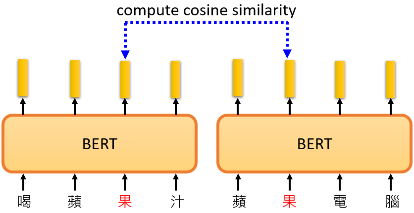

接下来，我们将计算每一个"果"的对应embedding。为什么这两个“果”不一样呢？在Encoder中存在Self-Attention，所以根据"果"的不同语境，得到的向量会有所不同。接下来，我们计算这些结果之间的==cosine similarity==，即计算它们的相似度。

结果是这样的，这里有10个句子

- 前5个句子中的"果"代表**可食用**的苹果。

- 后面五个句子也有"果"，但提到的是**苹果公司**的苹果。

两两之间计算相似度，得到一个10×10的矩阵。**相似度越高，这个颜色就越浅**。所以，自己和自己之间的相似度一定是最大的，自己和别人之间的相似度一定是更小的。所以左上角的1/4个正方形比较小，左下角的1/4个正方形比较小。

但前五个"苹果"和后五个"苹果"之间的相似度相对较低，因此另外两个小正方形颜色较深。

所以**BERT知道，上下两堆"苹果"的含义不同**。

BERT的这些输出向量，每个向量代表该词的含义。BERT在训练做填空的过程中已经学会了每个汉字的意思。也许它真的理解了中文的意思，对它来说，汉字不再是毫无关联的，既然它理解了中文，它就可以在接下来的任务中做得更好。

那么接下来你可能会问，为什么BERT有如此神奇的能力？为什么它能输出代表输入词含义的向量？ 这里，约翰-鲁伯特-弗斯，一位60年代的语言学家，提出了一个假说。他说，要知道一个词的意思，我们需要看它的"**Company**"，也就是经常和它**一起出现的词汇**，也就是它的**上下文**。

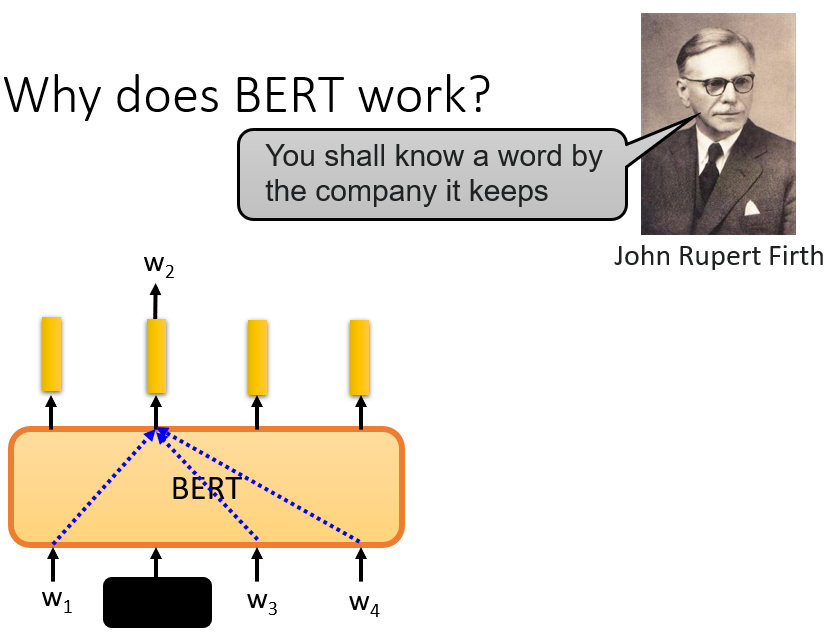

一个词的意思，取决于它的上下文

- 所以以苹果中的“果”字为例。如果它经常与"吃"、"树"等一起出现，那么它可能指的是可食用的苹果。

- 如果它经常与电子、专利、股票价格等一起出现，那么它可能指的是苹果公司。

当我们训练BERT时，我们给它w1、w2、w3和w4，我们mask住w2，并告诉它预测w2，而它就是从上下文中提取信息来预测w2。所以这个向量是从上下文信息中抽取出来的精华，可以用来预测w2是什么。

这样的想法在BERT之前已经存在了。在word embedding中，有一种技术叫做CBOW。

CBOW所做的与BERT完全一样。把中间挖空，并要求它预测空白处的内容。这个CBOW（word embedding）技术，可以给每个词汇一个向量，来代表这个词汇的意义。

CBOW只使用了两个Transform，是一个**非常简单的模型**，有人会问"为什么它只使用两个变换？""它可以更复杂一点吗？"。CBOW的作者Thomas Mikolov曾经来到台湾，当时我在上课的时候，经常有人问我，为什么CBOW只用线性而不用深度学习。我问过Thomas Mikolov这个问题，他说可以用深度学习，但是之所以选择线性模型这么一个简单的模型，最大的担心其实是**算力问题**。当时的计算能力和现在不在一个数量级上，当时要训练一个非常大的模型还是比较困难的，所以他选择了一个比较简单的模型。 

今天，当你使用**BERT**的时候，就相当于一个**深度版本的CBOW**，你可以做更复杂的事情，而且BERT还可以根据不同的语境，从同一个词汇产生不同的embedding。因为它是一个考虑到语境的高级版本的word embedding，BERT也被称为Contextualized embedding，这些由BERT提取的向量被称为Contextualized embedding。

但是这个答案，它真的是这样吗？这是你在文献中听到最多的答案。当你和别人讨论BERT时，这是大多数人都会告诉你的理由。它真的是这样吗？这里有一个难以理解的，由我们实验室的一个学生做的实验。实验是这样的：我们把训练在文字上的BERT对蛋白质、DNA链和音乐进行分类。

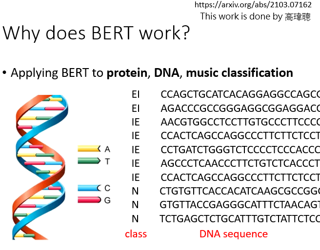

让我们以DNA链的分类为例。DNA是一系列的脱氧核糖核酸，有四种，分别用A、T、C和G表示，所以一条DNA链是这样的。

你可能会问，"EI IE和N代表什么？"不要在意细节，总之这是一个分类问题。只要用训练数据和标记数据来训练它就可以了。

神奇的地方来了，DNA可以用ATCG来表示，现在，我们要用BERT来对DNA进行分类

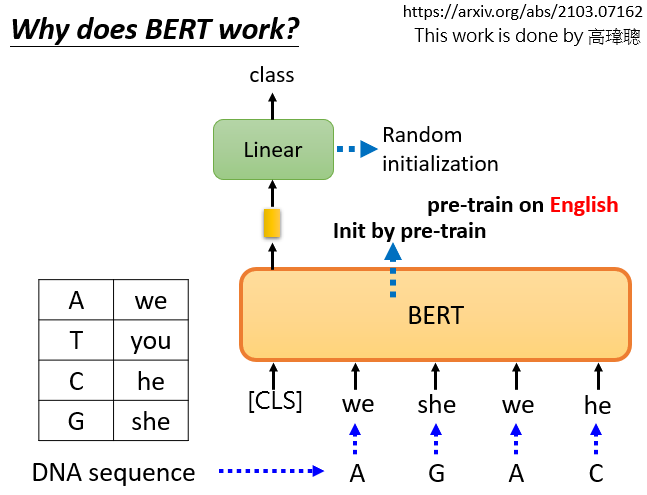

例如"A"是"we"，"T"是"you"，"C"是"he"。对应的词并不重要，你可以随机生成。"A"可以对应任何词汇，"T"、"C"和"G"也可以对应任何词汇，这并不重要。只是DNA链变成了一串不知所云的文字。例如"AGAC"变成了"we she we he"。

然后，把它扔进一个一般的BERT，用CLS标记，输出CLS的向量，通过Linear transform，再对它进行分类。只是分类的是DNA的类别，我不知道他们是什么意思。

和以前一样，Linear transform使用随机初始化，而BERT是通过预训练模型初始化的。但用于初始化的模型，是学习填空的模型。它已经学会了英语填空。

你可能会认为，这个实验完全是无稽之谈。如果我们把一个DNA序列预处理成一个无意义的序列，那么BERT的目的是什么? 大家都知道，BERT可以分析一个有效句子的语义，你怎么能给它一个无法理解的句子呢? 做这个实验的意义是什么? 

蛋白质有三种分类，那么蛋白质是由氨基酸组成的，有十种氨基酸，只要给每个氨基酸一个随机的词汇，那么DNA是一组ATCG，音乐也是一组音符，给它每个音符一个词汇，然后，把它作为一个文章分类问题来做。

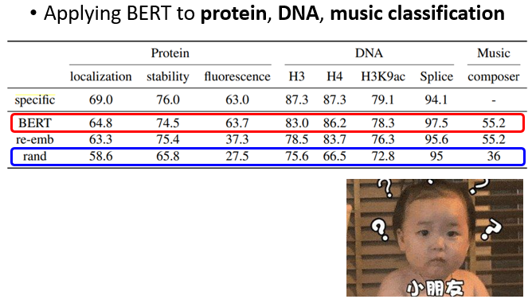

你会发现，如果你不使用BERT，你得到的结果是蓝色部分，如果你使用BERT，你得到的结果是红色部分，居然是比较好的，大多数人现在一定很困惑。

这个实验只能用神奇来形容，没有人知道它为什么有效，而且目前还没有很好的解释，我之所以要谈这个实验，是想告诉你们，BERT为什么好，还有很大的研究空间。

我并不是要否认BERT能够分析句子的含义这一事实。从embedding中，我们清楚地观察到，BERT知道每个词的含义，它能找出含义相似的词和不相似的词。但正如我想指出的那样，即使你给它一个无意义的句子，它仍然可以很好地对句子进行分类。

所以，**也许它的力量并不完全来自于对实际文章的理解**。也许还有其他原因。例如，也许，BERT只是一套更好的初始参数。也许这与语义不一定有关。也许这套初始参数只是在训练大型模型时更好。

是这样吗？这个问题**需要进一步研究**来回答。我之所以要讲这个实验，是想让大家知道，我们目前使用的模型往往是非常新的，需要进一步的研究，以便我们了解它的能力。

你今天学到的关于BERT的知识，只是沧海一粟。我会把一些视频的链接放在这里。

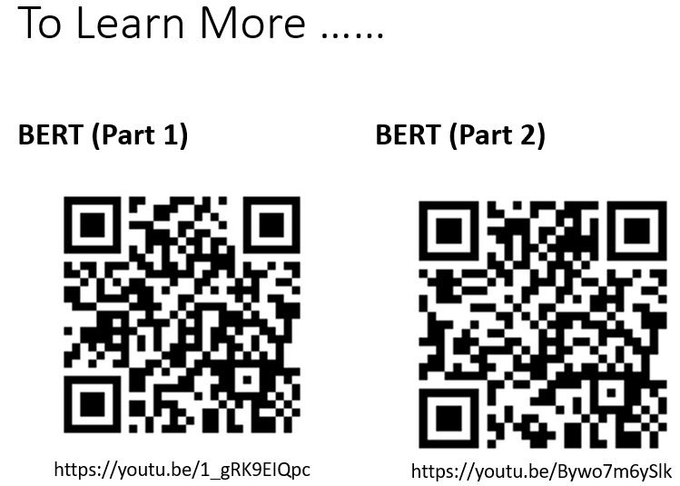

如果你想了解更多关于BERT的知识，你可以参考这些链接。我只是想告诉你，BERT还有很多其他的变种。

## Multi-lingual BERT

接下来我要讲的是一种叫做Multi-lingual BERT的BERT，多语言的BERT有什么神奇之处？

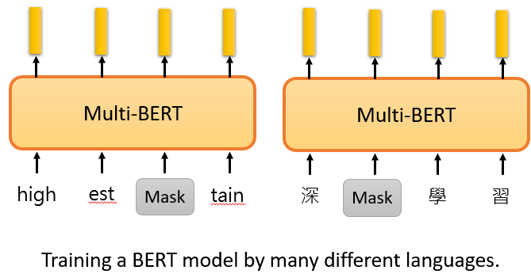

它是由很多语言来训练的，比如中文、英文、德文、法文等等，通通用填空题来训练BERT，这就是Multi-lingual BERT的训练方式。

### Zero-shot Reading Comprehension

google训练了一个Multi-lingual BERT，它能够做104种语言的填空题。神奇的地方来了，如果你用**英文**问答**数据**训练它，它就会自动学习如何做**中文问答**

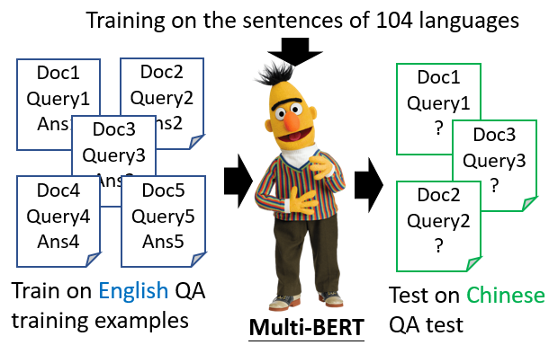

我不知道你是否完全理解我的意思，所以这里有一个真实的实验例子。

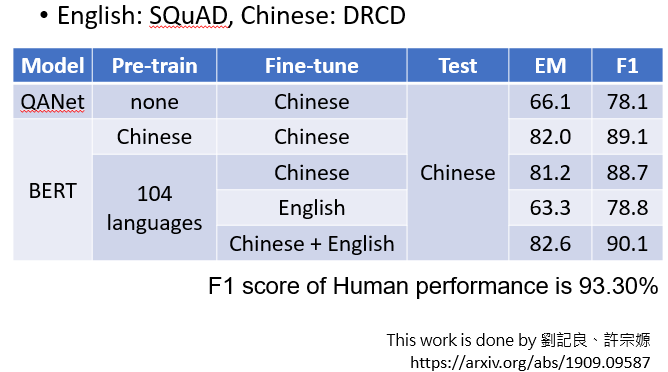

这是一些训练数据，SQuAD是一个英文Q&A数据集，中文数据集是由台达电发布的叫DRCD。

在BERT提出之前，效果并不好。在BERT之前，最强的模型是QANet。它的正确率只有，我是说F1得分，而不是准确率，但你可以暂时把它看成是准确率或正确率。

如果我们允许用中文填空题进行Pre-train，然后用中文Q&A数据进行Fine-tune，那么它在中文Q&A测试集上的正确率达到89%。因此，其表现是相当令人印象深刻的。

神奇的是，如果我们把一个Multi-lingual的BERT，用英文Q&A数据进行微调，它仍然可以回答中文Q&A问题，并且有78%的正确率，这几乎与QANet的准确性相同。它从未接受过中文和英文之间的翻译训练，也从未阅读过中文Q&A的数据收集。它在没有任何准备的情况下参加了这个中文Q&A测试，尽管它从未见过中文测试，但不知为何，它能回答这些问题。

### Cross-lingual Alignment?

你们中的一些人可能会说："它在预训练中读过104种语言，104种语言中的一种是中文，是吗？ 如果是，这并不奇怪。"但是在预训练中，学习的目标是填空。它只能用中文填空。有了这些知识，再加上做英文问答的能力，不知不觉中，它就自动学会了做中文问答。

听起来很神奇，那么BERT是怎么做到的呢？一个简单的解释是：也许对于多语言的BERT来说，**不同的语言并没有那么大的差异**。无论你用中文还是英文显示，对于具有相同含义的单词，它们的embedding都很接近。汉语中的"跳"与英语中的"jump"接近，汉语中的"鱼"与英语中的"fish"接近，汉语中的"游"与英语中的"swim"接近，也许在学习过程中它已经自动学会了。

它是可以被验证的。我们实际上做了一些验证。验证的标准被称为Mean Reciprocal Rank，缩写为MRR。我们在这里不做详细说明。你只需要知道，**MRR的值越高，不同embedding之间的Alignment就越好**。

更好的Alignment意味着，具有相同含义但来自不同语言的词将被转化为更接近的向量。如果MRR高，那么具有相同含义但来自不同语言的词的向量就更接近。

这条深蓝色的线是谷歌发布的104种语言的Multi-lingual BERT的MRR，它的值非常高，这说明不同语言之间没有太大的差别。Multi-lingual BERT只看意思，不同语言对它没有太大的差别。

橙色这条是我们试图自己训练Multi-lingual BERT。我们使用的**数据较少**，每种语言只使用了20万个句子。数据较少。我们自己训练的模型结果并不好。我们不知道为什么我们的Multi-lingual BERT不能将不同的语言统一起来。似乎它不能学习那些在不同语言中具有相同含义的符号应该具有相同的含义。这个问题困扰了我们很长时间。

为什么我们要做这个实验？为什么我们要自己训练Multi-lingual BERT？因为我们想了解，是什么造成了Multi-lingual BERT。我们想设置不同的参数，不同的向量，看看哪个向量会影响Multi-lingual BERT。

但是我们发现，对于我们的Multi-lingual BERT来说，无论你如何调整参数，它就是不能达到Multi-lingual的效果，它就是不能达到Alignment的效果。我们把数据量**增加了五倍**，看看能不能达到Alignment的效果。在做这个实验之前，大家都觉得有点害怕，因为训练时间要比原来的长五倍。

这是loss下降的图，训练了两天后，什么也没发生，损失甚至不能减少，就在我们要放弃的时候，损失突然下降了

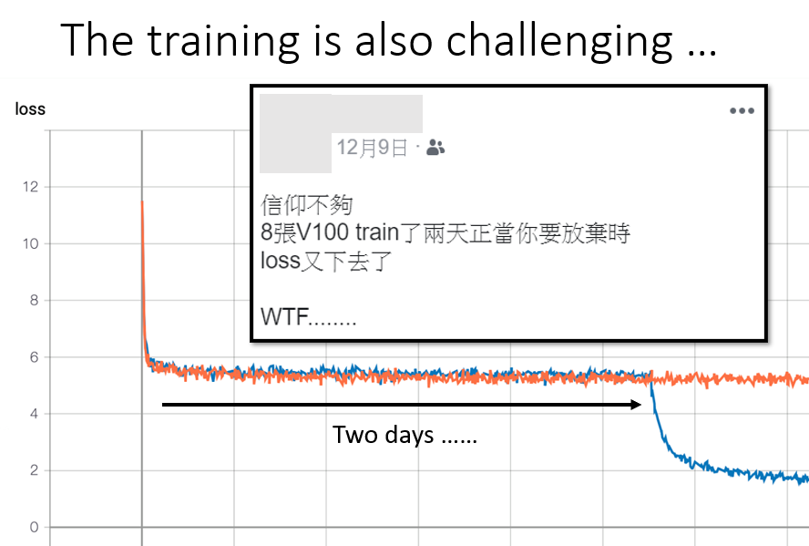

用了8个V100来训练，我们的实验室也没有8个V100，是在NCHC（国家高性能计算中心）的机器上运行的，训练了两天后，损失没有下降，似乎失败了。当我们要放弃的时候，损失下降了。

这是某个学生在Facebook上发的帖子，我在这里引用它来告诉你，我当时心里的感叹。整个实验，必须运行一个多星期，才能把它学好，每一种语言1000K的数据。

所以看起来，**数据量是一个非常关键的因素**，关系到能否成功地将不同的语言排列在一起。所以有时候，神奇的是，很多问题或很多现象，只有在有足够的数据量时才会显现出来。它可以在A语言的QA上进行训练，然后直接转移到B语言上，从来没有人说过这一点

这是过去几年才出现的，一个可能的原因是，过去没有足够的数据，现在有足够的数据，现在有大量的计算资源，所以这个现象现在有可能被观察到。

最后一个神奇的实验，我觉得这件事很奇怪

你说BERT可以把不同语言中含义相同的符号放在一起，使它们的向量接近。但是，当训练多语言的BERT时，如果给它英语，它可以用英语填空，如果给它中文，它可以用中文填空，它不会混在一起

那么，如果不同语言之间没有区别，怎么可能只用英语标记来填英语句子呢？为什么它不会用中文符号来填英文的空呢？它没有这样做，这说明它知道语言的信息也是不同的，那些不同语言的符号毕竟还是不同的，它并没有完全抹去语言信息，所以我想出了一个研究课题，我们来找找，语言信息在哪里。

后来我们发现，语言信息并没有隐藏得很深。一个学生发现，我们把所有**英语单词**的embedding，放到多语言的BERT中，**取embedding的平均值**，我们对**中文单词**也做**同样的事情**。然后我们把这两个平均值相减得到蓝色的向量。在这里，我们给Multi-lingual BERT一个英语句子，并得到它的embedding。我们在embedding中**加上**这个**蓝色的向量**，蓝色向量就是**英语和汉语之间的差距**。

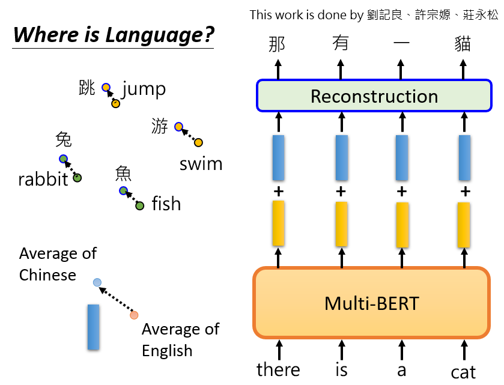

这些向量，从Multi-lingual BERT的角度来看，变成了汉语。有了这个神奇的东西，你可以做一个奇妙的无监督翻译。

例如，你给BERT看这个英文句子。

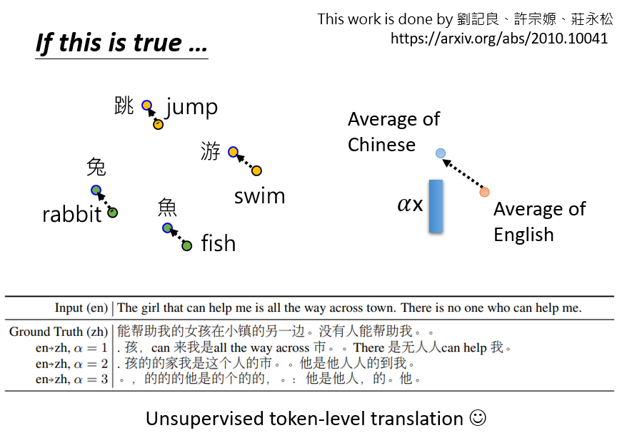

这个英文句子是"The girl that can help me is all the way across town. There is no one who can help me."，现在我们把这个句子扔到Multi-lingual BERT中。

然后我们取出Multi-lingual BERT中的一个层，它不需要是最后一层，可以是任何一层。我们拿出某一层，给它一个embedding，加上这个蓝色的向量。对它来说，这个句子马上就从英文变成了中文。

在向BERT输入英文后，通过在中间加一个**蓝色的向量来转换隐藏**层，转眼间，中文就出来了。"没有人可以帮助我"，变成了"There是无人人can help me"，所以它在某种程度上可以做无监督的标记级翻译，尽管它并不完美，神奇的是，Multi-lingual的BERT仍然保留了语义信息。