# **Explainable Machine Learning** P1-Why Does the Model Make This Prediction

到目前为止，我们已经训练了很多很多的模型，你可能我们训练过影像辨识的模型，给它一张图片，它会给你答案，但我们并不满足于此，接下来我们要机器给我们，它**得到答案的理由**，这个就是 Explainable 的 Machine Learning

## Why we need Explainable ML?

那开始之前，开始介绍技术之前，我们需要讲一下，为什么 Explainable 的 Machine Learning，是一个重要的议题呢，我觉得那个本质上的原因是，就算今天机器可以得到正确的答案，也不代表它一定非常地聪明，举一个例子，过去有一匹马它很聪明，所以大家叫它**神马汉斯**，那这个神马汉斯可以做什么事情呢

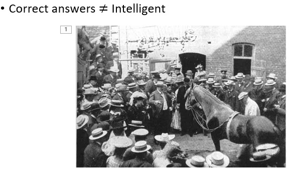

**它会做数学问题**，举例来说，你问它根号 9 是多少，然后它就开始计算得到答案，它怎么告诉你它的答案呢，它会用它的马蹄去跺地板，所以如果答案是 3，它就敲三下，然后就停下来，代表它得到正确的答案，然后旁边的人就会欢呼，所以这个是神马汉斯，然后一堆人呢，在看它解数学问题

后来有人就很怀疑说，为什么汉斯可以解数学问题呢，它只是一匹马，它为什么能够理解数学问题呢，后来有人发现说，只要没有人围观的时候，汉斯就会答不出数学问题，没有人看它的时候，你问它一个数学的问题，它就会不断地敲它的马蹄，不知道什么时候停下来，所以**它其实只是侦测到，旁边人类微妙的情感变化，知道它什么时候要停下跺马蹄**，它就可以有胡萝卜吃，**它并不是真的学会解数学的问题**，而今天我们看到种种人工智慧的应用，有没有可能跟神马汉斯是一样的状况

而今天在很多真实的应用中，Explainable 的 Machine Learning，可解释性的模型往往是必须的

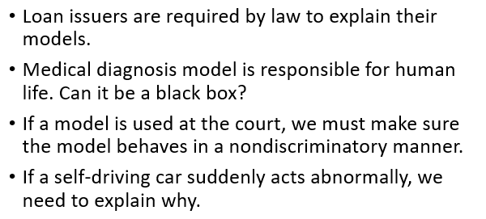

举例来说

- 银行今天可能会用机器学习的模型，来判断要不要贷款给某一个客户，但是根据法律的规定，银行作用机器学习模型来做自动的判断，它必须要给出一个理由，所以这个时候，我们不是只训练机器学习模型就好，我们还需要机器学习的模型，是具有解释力的
- 或者是说机器学习未来，也会被用在医疗诊断上，但医疗诊断人命关天的事情，如果机器学习的模型只是一个黑箱，不会给出诊断的理由的话，那我们又要怎么相信，它做出的是正确的判断呢
- 今天也有人想，把机器学习的模型用在法律上，比如说帮助法官判案，帮助法官自动判案说，一个犯人能不能够被假释，但是我们怎么知道机器学习的模型，它是公正的呢，我们怎么知道它在做判断的时候，没有种族歧视等其他的问题呢，所以我们希望机器学习的模型，不只得到答案，它还要给我们得到答案的理由
- 再更进一步，今天自驾车未来可能会满街跑，当今天自驾车突然急剎的时候，甚至急剎导致车上的乘客受伤，那这个自驾车到底有没有问题呢，这也许取决于它急剎的理由，如果它是看到有一个老太太在过马路，所以急剎，那也许自驾车是对的，但是假设它只是无缘无故，就突然发狂要急剎，那这个模型就有问题了，所以对自驾车，它的种种的行为 种种的决策，我们希望知道决策背后的理由

更进一步，也许机器学习的模型，如果具有解释力的话，那未来我们可以凭**藉著解释的结果，再去修正我们的模型**

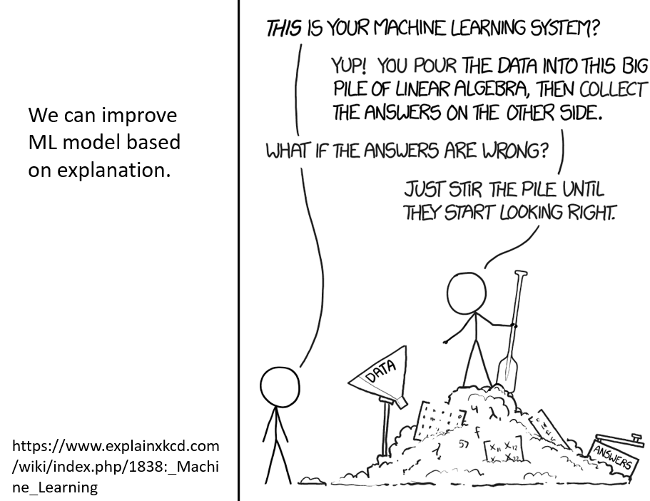

今天在使用这些深度学习技术的时候，往往状况是这个样子，有某人说，这个就是你的机器学习的系统，是啊 我就是**把资料丢进去，里面就是有很多矩阵的相乘**，接下来呢，就会跑出我的结果，如果结果**不如预期的话**，怎么样呢，现在大家都知道就**爆调一下参数**对不对，改个 Learning Rate 对不对，调一下 Network 的架构对不对，你根本不知道自己在做什么对不对，就调一下 Network 的架构，我就把这一堆数学，**这一堆 Linear Algebra 再重新打乱一下，看看结果会不会比较好**，那如果其它没有做过 Deep Learning 的人，就会大吃一惊，觉得哇 这样怎么可以呢

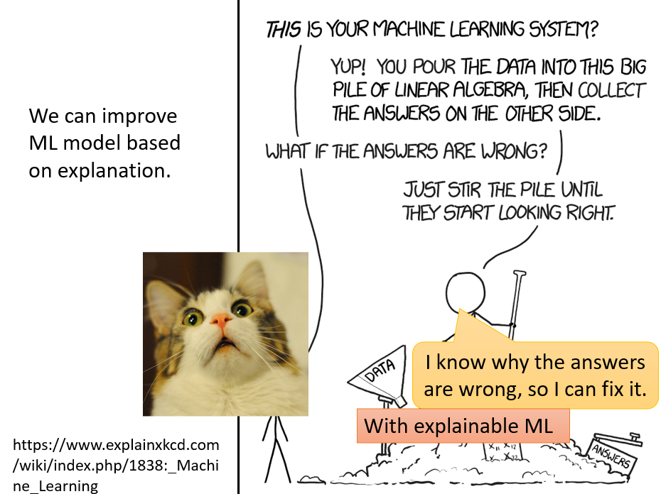

但实际上今天深度学习的模型，你往往要改进模型，就是需要调一些 Hyperparameter，但是我们期待也许未来，当我们知道，Deep Learning 的模型犯错的时候，它是错在什么样的地方，它为什么犯错，也许我们可以有更好的方法，更有效率的方法，来 Improve 我的模型，当然这个是未来的目标，今天离用 Explainable 的 Machine Learning，**做到上述  Improve Model 的想法，还有很长的一段距离**

## Interpretable v.s. Powerful

那讲到这边呢，有人可能会想说，我们今天之所以这么关注，Explainable Machine Learning 的议题，也许是因为 Deep 的 Network，它本身就是一个黑箱，那我们能不能够用，其它的机器学习的模型呢

**如果不要用深度学习的模型，改採用其他比较容易解释的模型，会不会就不需要研究，Explainable Machine Learning 了呢**，举例来说，假设我们都**採用 Linear 的 Model，Linear 的 Model，它的解释的能力是比较强的**，我们可以轻易地知道，根据一个 Linear Model 里面的，每一个 Feature 的 Weight，知道 Linear 的 Model 在做什么事

所以你训练完一个 Linear Model 以后，你可以轻易地知道，它是怎么得到它的结果的，但是  **Linear Model 的问题就是，它没有非常地 Powerful**，我们其实在第一堂课就已经告诉你说，Linear 的 Model 有很巨大地限制，所以我们才很快地进入了 Deep 的 Model

但是 **Deep 的 Model 它的坏处就是，它不容易被解释**，Deep 的 Network 大家都知道，它就是一个黑盒子，黑盒子里面发生了什么事情，我们很难知道，虽然它比 Linear 的 Model 更好，但是它的解释的能力，是远比 Linear 的 Model 要差

所以讲到这边，很多人就会得到一个结论，你可能常常听到这样的想法，我们就不应该用这种 Deep 的 Model，我们不该用这些比较 Powerful 的 Model，因为它们是黑盒子，但是在我看来，这样的想法其实就是削足适履，我们因为一个模型，它非常地 Powerful，但是不容易被解释就扬弃它吗，我们不是应该是想办法，让它具有可以解释的能力吗

我听过Yann LeCun讲了一个故事，这个是Yann LeCun讲的，那这个故事是个老梗，谁都听过

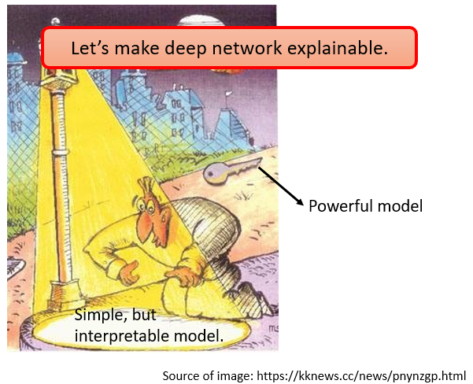

就是有一个醉汉，他在路灯下面找钥匙，大家问他说，你的钥匙掉在路灯下吗，他说不是，因为这边有光

那所以我们坚持一定要用简单，但是比较容易被解释的模型，其实就好像是，我们坚持一定要在路灯下面，找钥匙一样，我们坚持因为一个模型，是比较 Interpretable 的，虽然它比较不好，但我们还是坚持要使用它

就好像一定要在路灯下面找钥匙一样，不知道说真实的模型，**真实 Powerful 的模型，也许根本在路灯的范围之外**，而我们现在要做的事情，就是改变路灯的范围，改变照明的方向，看能不能够让这些比较 Powerful 的模型，可以被置于路灯之下，比较 Interpretable，比较 Explainable

其实 **Interpretable 跟 Explainable**，这两个词汇，虽然在文献上常常被互相使用，那其实它们是**有一点点差别**的

- 通常这个 Explainable 指的是说，有一个东西它本来是个黑箱，我们想办法赋予它解释的能力，叫做 Explainable
- 那 Interpretable 通常指的是，一个东西它本来就不是黑箱，我们可以跟，它本来就不是黑箱，我们本来就可以知道它的内容，这个叫 Interpretable，好 不过这两者在文献上也常常被混用了，所以我们这边就不特别跟大家强调，Explainable 跟 Interpretable 的差异，好 

那讲到既 Interpretable 又 Powerful 的模型，也许有人会说，那 ==Decision Tree== 会不会就是一个好的选择呢，Decision Tree 相较于 Linear 的 Model，它是更强大的模型

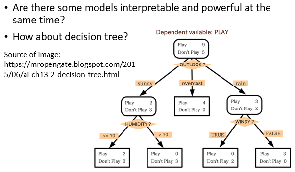

而 Decision Tree 的另外一个好处，**相较于 Deep Learning，它非常地 Interpretable**，你看一个 Decision Tree 的 Structure，你就可以知道说，今天模型是凭藉著什么样的规则，来做出最终的判断，那 Decision Tree，不是我们这门课会讲的东西

但是就算是你没有学过的 Decision Tree，你其实也不难想像，Decision Tree 它是在做什么，它做的事情就是，你有很多的节点，那每一个节点都会问一个问题，让你决定向左还是向右，最终当你走到节点的末尾，当你走到 Leaf Node 的时候，就可以做出最终的决定，因为在每一个节点都有一个问题，你看那些问题以及答案，你就可以知道，现在整个模型，凭藉著什么样的特徵，是如何做出最终的决断，所以从这个角度看来，**Decision Tree，它既强大又 Interpretable**

所以这堂课我们可以就上到这边，就是 Decision Tree is all you need?，然后就结束了这样子

但是 Decision Tree，真的就是我们所需要的吗，你再仔细想一下，**Decision Tree 也有可能是很复杂的**

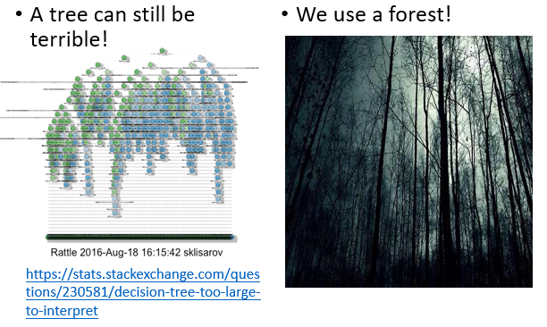

举例来说，我看到在网路上找到，有人问了一个问题，他说他有一个这么复杂的 Decision Tree，他完全看不懂这个 Decision Tree 在干嘛，有没有人有什么样的，Explainable Machine Learning 的方法，可以把这个 Decision Tree 变得更简单一点，我看三 四年过去了，都没有人回答这个问题，有人看到的话，也许可以帮忙回答一下

但另外一方面，你再仔细想想看，你是怎么实际使用 Decision Tree 这个技术的呢，我知道很多同学都会说，这个打 Cargo 比赛的时候，Deep Learning 不是最好用，什么 Decision Tree，那个才是最好用的，那才是 Cargo 比赛的常胜军，但是你想想看，当你在使用 Decision Tree 技术的时候，你是只用一棵 Decision Tree 吗，其实不是，你真正用的技术叫做 ==Random Forest== 对不对，你真正用的技术，其实是**好多棵 Decision Tree 共同决定的结果**，一棵 Decision Tree，你可以凭藉著每一个节点的问题跟答案，知道它是怎么做出最终的判断的，但当你有一片森林，当你有 500 棵 Decision Tree 的时候，你就很难知道说，这 500 棵 Decision Tree 合起来，是怎么做出判断，所以 Decision Tree 也不是最终的答案，并不是有 Decision Tree，我们就解决了，Explainable Machine Learning 的问题

## Goal of Explainable ML

那再继续深入讲，Explainable Machine Learning 的技术之前，这边还有一个问题就是，**Explainable Machine Learning 的目标是什么**

在我们之前的每一个作业里面，我们都有一个 Leaderboard，也就是我们有一个明确的目标，要嘛是降低 Error Rate，要嘛是提升 Accuracy，我们总是有一个明确的目标，但是 Explainable 的目标到底是什么呢？什么才是最好的 Explanation 的结果呢，那 Explanation 它的目标其实非常地不明确，就是因为目标不明确，你才发现说 Explainable Machine Learning 的作业，就没有 Leaderboard，因为出不了 Leaderboard，我们只能够出选择题，让大家增加一些知识，我们只能够做这样子而已

那但到底 Explainable Machine Learning，它的终极目标是什么呢，什么才是最好的 Explanation，那**以下是我个人的看法，并不代表它是对的，你可能不认同，那我也不会跟你争辩**，那这个只是我个人的看法而已

**很多人对于 Explainable Machine Learning会有一个误解**，它觉得一个好的 Explanation，就是要告诉我们，整个模型在做什么事，我们要了解模型的一切，我们要知道它到底是，我们要完全了解，它是怎么做出一个决断的，但是你想想看，这件事情真的是有必要的吗，我们今天说 Machine Learning 的 Model，**Deep 的 Network 是一个黑盒子，所以我们不能相信它**

但你想想看，世界上有很多很多的黑盒子，正在你的身边，**人脑不是也是黑盒子吗，我们其实也并不完全知道，人脑的运作原理，但是我们可以相信，另外一个人做出的决断**，那人脑其实也是一个黑盒子，你可以相信人脑做出了决断，为什么 Deep 的 Netwok 是一个黑盒子，你没有办法相信，Deep 的 Netwok 做出来的决断，为什么你对 Deep 的 Netwok 会这么恐惧呢，那我觉得其实对人而言，也许一个东西，能不能让我们放心，能不能够让我们接受，理由是非常重要的，以下呢，是一个跟 Machine Learning，完全无关的心理学实验

这个实验是 1970 年代就做了，这是 Ellen Langer，一个哈佛大学教授做的，这个实验非常地有名，这个实验是这样，这个实验是一个跟印表机有关的实验，在哈佛大学图书馆印表机呢，会大排长龙，很多人都排队要印东西，这个时候

- 如果有一个人跟他前面的人说，拜託请让我先印，我就印 5 页而已，那一般人会不会接受呢，会不会让他先印呢，有 60% 的人会让这个人先印，所以感觉哈佛大学，学生人都还蛮好的，这个是接受程度是比我预期得要高，你给一个人说让我先印，有 60% 的人会答应
- 但这个时候，你只要把刚才问话的方法稍微改一下，你本来只说能不能让我先印，现在改成说，能不能让我先印，因为我赶时间，他是不是真的赶时间，没人知道，但是当你说你有一个理由，所以你要先印的时候，这个时候接受的程度变成 94%
- 而神奇的事情是，就算你的理由稍微改一下，举例来说，有人说请让我先印，因为我需要先印，光是这个样子，接受的程度也变成 93%，所以神奇的事情是，人就是需要一个理由，你为什么要先印，你只要讲出一个理由，就算你的理由是因为我需要先印，大家也会接受

什么叫做好的 Explanation，**好的 Explanation就是人能接受的 Explanation**，人就是需要一个理由让我们觉得高兴，而到底是让谁高兴呢

这个是高兴的人，可能是你的客户，因为很多人就是听到，Deep Network 是一个黑盒子，他就不爽，你告诉他说这个是可以被解释的，给他一个理由，他就高兴了，他可能是你的老闆，老闆看了很多的农场文，他也觉得说 Deep Learning 黑盒子就是不好的，告诉他说这个是可以解释的，他就高兴了，或者是你今天要让，你今天要说服的对象是你自己，你自己觉得有一个黑盒子，Deep Network 是一个黑盒子，你心里过不去，今天它可以给你一个做出决断的理由，你就高兴了

所以我觉得什么叫做好的 Explanation，就是让人高兴的 Explanation，就是好的 Explanation，其实你等一下再记，在各种研究的发展上会发现说，我们在设计这些技术的时候，确实跟我现在讲的，什么叫好的 Explanation，就是让人高兴的 Explanation，这个想法，这个技术的进展是蛮接近的

## Explainable ML

所以 Explainable Machine Learning，它的目标就像我刚才讲的，就是要给我们一个理由，那 Explainable 的 Machine Learning 呢，又分成两大类，第一大类叫做 ==Local 的 Explanation==，第二大类叫做 ==Global 的 Explanation==

Local 的 Explanation 是说，假设我们有一个 Image 的 Classify，我们给它一张图片，它判断说它是一只猫，那我们要问的问题是，为什么，或者机器要回答问题是，**为什么你觉得这张图片是一只猫，它根据某一张图片来回答问题**，这个叫做 Local Explanation

还有另外一类呢，叫 Global Explanation，意思是说，现在还没有给我们的 Classifier任何图片，我们要问的是，对一个 Classifier 而言，什么样的图片叫做猫，我们**并不是针对任何一张，特定的图片来进行分析**，我们是想要知道说，当我们有**一个 Model，它里面有一堆参数的时候，对这堆参数而言，什么样的东西叫作一只猫**，所以 Explainable 的 Machine 有两大类

### **Local Explanation** 

我们先来看第一大类，第一大类是为什么，你觉得一张图片是一只猫

#### Which component is critical? 

我们可以把一个图片，这个问题问得更具体一点，给机器一张图片，它知道它是一只猫的时候，**到底是这个图片里面的什么东西，让模型觉得它是一只猫**

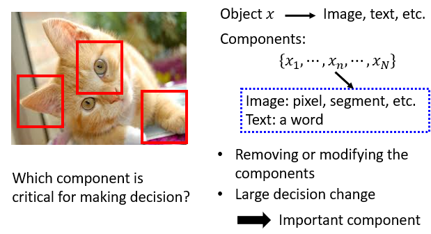

是眼睛吗，是耳朵吗，还是猫的脚，让机器觉得它看到了一只猫，或者讲的更 General 一点，假设现在我们模型的输入叫做 x，这个 x 可能是一张影像，可能是短文字，而 x 呢，可以**拆成多个 Component**，$x_1$ 到 $x_N$，如果对于影像而言，可能每一个 Component，就是一个 Pixel，那对于文字而言，可能每一个 Component，就是一个词汇，或者是一个 Token，那我们现在要问的问题就是，这些  Token 里面，那这些 Component 里面，那这个如果对文字来说是 Token，对 Image 来说可能就是 Pixel，这些 Component 里面，哪一个对于机器现在做出最终的决断是最重要的呢

那怎么知道一个 Component 的重要性呢，那基本的原则是这个样子，就是我们**把 Component 都拿出来，然后把每一个 Component 做改造，或者是删除，如果我们改造或删除某一个 Component 以后，今天 Network 的输出有了巨大的变化**，那我们就知道说，这个 Component 没它不行，它很重要，如果某个 Component 被删掉以后，现在 Network 的输出有了巨大的变化，就代表这个 Component，没它不行，那这个 Component，就是一个重要的 Component

讲得更具体一点，你想要知道，今天一个影像里面，每一个区域的重要性的时候，有一个非常简单的方法

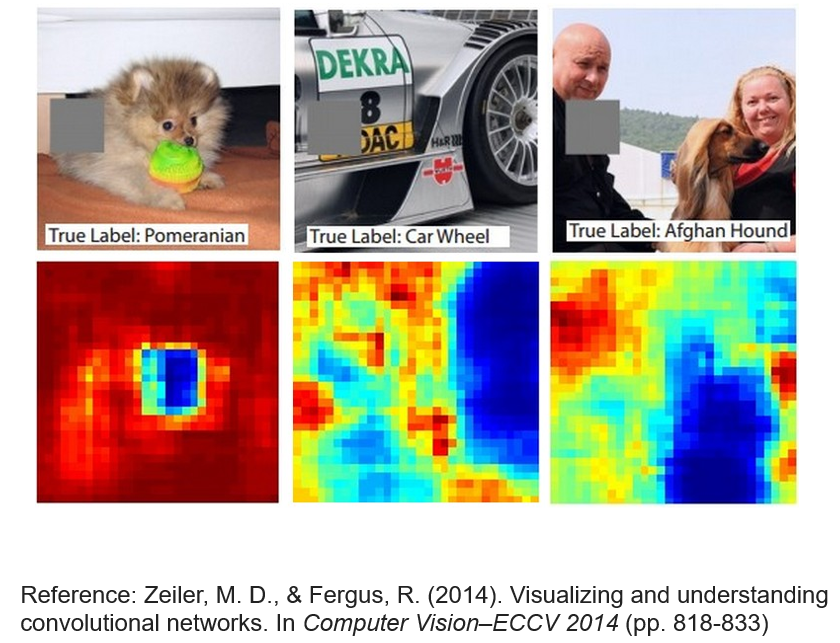

像是这个样子，就给一张图片，然后丢到 Network 里面，它知道这是一只博美狗，接下来在这个图片里面，**不同的位置放上这个灰色的方块**，当这个方块放在不同的地方的时候，今天你的 Network 会 Output 不同的结果

那这边这个，下面这个图 这些顏色，代表今天 Network 输出博美狗的机率，**蓝色代表博美狗的机率是低的，红色代表博美狗的机率是高的**，而这边的每一个位置，代表了这个灰色方块的位置，也就是说，当我们把灰色的方块移到这边，移到这边，移到博美狗的脸上的时候，今天你的 Image Classifier，就不觉得它看到一只博美狗，如果你把灰色的方块，放在博美狗的四周，这个时候机器就觉得，它看到的仍然是博美狗，所以知道说，它不是看到这个球，觉得它看到博美狗，也不是看到地板，也不是看到墙壁，觉得看到博美狗，而是真的看到这个狗的脸，所以它觉得，它看到了一只狗

那这边也有一样的例子，把灰色的方框在，把灰色的方块在这个图片上移动，你会发现说呢，灰色的方块移到轮胎上的时候，机器就不觉得它有看到轮胎了，所以机器知道轮胎长什么样子，它今天看到这个图片，知道答案是轮胎的时候，并不是瞎蒙蒙到的，而是它知道说，轮胎出现在这个位置，或者是说这边有一张图片，然后这个图片里面有两个人

还有一只这个阿富汗猎犬，但是机器到底是真的看到了阿富汗猎犬，还是把人误认为狗呢，这个时候你就可以把这个灰色的方框，在这个图片上移动，然后你发现这个灰色的方框，放在这个人的脸上，或放在这个人的脸上的时候，机器仍然觉得，它有看到阿富汗猎犬，但是当你把灰色的方框，放到这个位置，放到这个位置的时候，机器就觉得，它没有看到阿富汗猎犬，所以它是真的有看到阿富汗猎犬，它知道这一只就是阿富汗猎犬，并不是把人误认为阿富汗猎犬，所以这个是最简单的，知道 Component 重要性的方法

#### Saliency Map

接下来还有一个更进阶的方法，是**计算 Gradient**，这个方法是这样子的

假设我们有一张图片，我们把它写作 $x_1$ 到 $x_N$，这边的**每一个 x，代表了一个 Pixel**，接下来呢，我们去计算这张图片的 Loss，我们这边呢，用小 e 来表示，这个小 e 是什么呢，**这个小 e 是把这张图片呢，丢到你的模型里面，这个模型的输出的结果跟正确答案的差距**，跟正确答案的 ==Cross Entropy==，这个 **e 越大**，就代表现在辨识的**结果越差**

那接下来，怎么知道某一个 Pixel，对于影像辨识这个问题的重要性呢，那你就把某一个 Pixel 的值，做一个小小的变化，把它加上一个 Δx，然后你接下来看一下，你的 Loss 会有什么样的变化

- 如果今天把**某一个 Pixel，做小小的变化以后，Loss 就有巨大的变化**，代表说**这个 Pixel，对影像辨识是重要的**
- 反之如果加了 Δx，这个 Δe 趋近于零，这个 Loss 完全没有反应，就代表说这个 Δx，这个位置，这个 Pixel 对于影像辨识而言，可能是不重要的

那我们可以用 Δe 跟 Δx 的比值，来代表这一个 Pixel，$x_N$ 的重要性，而事实上 Δx 分之 Δe 这一项，就是把 $x_N$ 对你的 Loss 做偏微分，如果你不知道偏微分是什么的话也没有关系，反正就是 Δx 跟 Δe 的比值，就代表了这个 $x_N$ 的重要性，那这个比值越大，就代表 $x_N$ 越重要

那你把每一个图片里面，每一个 Pixel，它的这个比值都算出来，你就得到一个图呢，叫做 ==Saliency Map==，它在我们的作业里面，你会有很多机会，画各式各样的 Saliency Map，那下面这个图，上面这个是原始图片，下面这个黑色的，然后有亮白色点的是 Saliency Map

那在这个  Saliency Map 上面呢，**越偏白色就代表这个比值越大，也就是这个位置的 Pixel 是越重要的，**

举例来说，给机器看这个水牛的图片，它并不是看到草地，觉得它看到牛，也不是看到竹子，觉得它看到牛，而是真的知道牛在这个位置，它觉得判断这张图片是什么样的类别，对它而言最重要的，是出现在这个位置的 Pixel，像是真的看到牛，所以知道说，所以才会 Output 牛这个答案，如果机器看到这个图片，说它看到一个猴子，那猴子在哪里呢，猴子在树梢上面，它并不是把叶子判断成猴子，它知道这个位置出现的东西，就是它判断正确答案的准则，我给它这个图片，它知道说狗呢，是出现在这个位置的，所以这个，这个技术呢 叫做 Saliency Map

那 Saliency Map 这个技术，我们等一下来举一个实际的应用，这个应用是什么呢，这个应用跟宝可梦还有数码宝贝有关啦，

这个宝可梦是一种动物，数码宝贝是另外一种动物，然后我在网路上呢，看到有人说，他训练了一个数码宝贝跟宝可梦的分类器，然后正确率非常地高，所以我决定自己也来做这个实验，看看为什么可以得到这么高的正确率

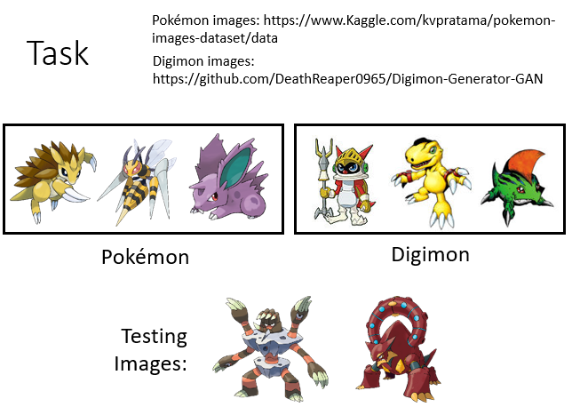

那你可以在网路上呢，找到宝可梦的图库，也可以找到数码宝贝的图库，所以你有一堆宝可梦的图，有一堆数码宝贝的图，那这个对大家来说一定都不成问题，这个就是二元分类的问题而已 对不对，胡乱 Train 一个 Classifier，就结束了，就把作业三的 Code 改一改，然后把本来分成 11 类，改成分成两类，就结束了

那接下来呢，训练完以后呢，当然要用机器没有看过的图去测试它，所以你不能够把所有的宝可梦，跟所有的数码宝贝都拿去做训练，你要特别留一些宝可梦跟数码宝贝，是训练的时候没有看过的，看看机器看到新的宝可梦跟数码宝贝，它能不能够得到正确的结果，那这边呢，我们来看一下人类，能不能够正确的判断宝可梦跟数码宝贝好了

我来问一下大家，你觉得这一只

是宝可梦 还是数码宝贝呢，觉得它是宝可梦的同学举手一下，手放下，觉得它是数码宝贝的同学举手一下，好 也有一些，好 手放下，好 老实说我答案忘记了这样子，所以，所以你可见这个宝可梦跟数码宝贝，是很难分辨的，今天你就算是人类，你也很难够，很难判断说一只动物，到底是宝可梦还是数码宝贝，机器的表现如何呢

好 这边就是随便兜了一个模型，也没有几层，Train 下去

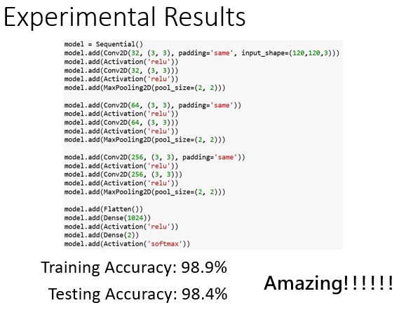

哇 Training Accuracy，98.9% 这个非常地高，但是不要高兴地太早，这个也许Overfitting 而已，也许 Machine 只是把 Training 的 Data，记下来而已，因为毕竟训练资料没几张啊，数码宝贝 宝可梦才各几千张而已，所以也许Overfitting，所以测试资料上没看过的图怎么样呢，正确率 98.4 啊，这个不可思议，这个伟哉机器学习，这个人类都没有办法判断，宝可梦跟数码宝贝的差异，但机器可以，还有 98.4% 的正确率

那接下来我就很好奇，就想要知道说，机器到底是凭藉著什么样的规则，判断宝可梦和数码宝贝的差异呢，所以我决定来画一下 Saliency Map

这边有几只动物，它们是什么呢，它们是数码宝贝

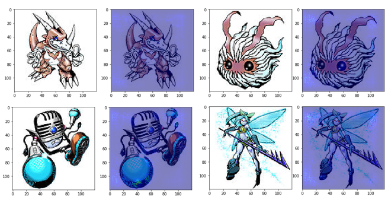

这些是数码宝贝，接下来呢，我就在这些图片上画 Saliency Map，让机器来告诉我说，为什么它觉得这几张是数码宝贝，机器给我的答案是这个样子，这边亮亮的点，代表它觉得比较重要，这有点怪怪的，好像亮亮的点都分布在四个角落，不知道发生了什么事

接下来我来分析宝可梦，这个情况更明显

你发现说机器觉得重要的点，基本上都是避开宝可梦的本体啦，都是在影像的背景上啊，为什么呢

因为我后来发现

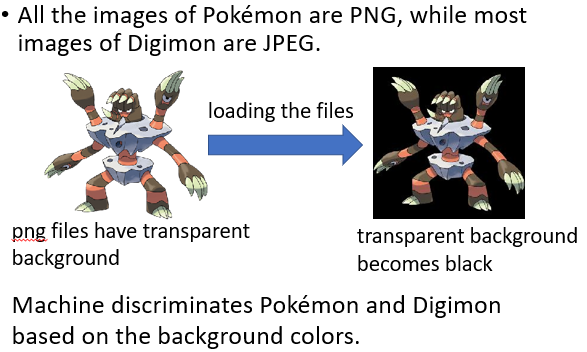

**宝可梦都是 PNG 档啦，数码宝贝都是 JPEG 档，PNG 档读进来以后，背景都是黑的啦，所以机器只要看背景，就知道一张图片是宝可梦还是数码宝贝**啦，就结束了这样子，好，所以这个例子就是告诉我们说，Explainable AI 是一个很重要的技术

那我刚才举的例子可能你觉得有点荒谬，也许在正常的应用中不会发生这种事情，但真的不会发生吗

有一个真实的例子，有一个 Benchmark Corpus，叫做 PASCAL VOC 2007，里面有各式各样的物件，机器要学习做影像的分类，机器看到这张图片

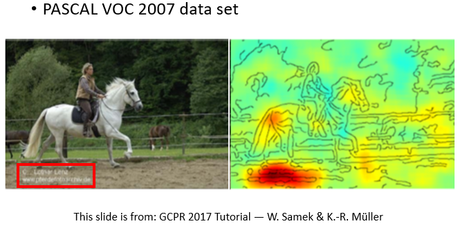

它知道是马的图片，但如果你画 Saliency Map 的话，你发现结果是这个样子的，只是觉得左下角对马是最重要，为什么，因为左下角有一串英文啊，这个图库里面马的图片，很多都是来自于某一个网站啊，左下角都有一样的英文啊，所以机器看到左下角这一行英文，就知道是马，它根本不需要学习马是长什么样子

所以今天在这个真实的应用中，在 Benchmark Corpus 上，类似的状况也是会出现的，所以这告诉我们，这种 Explainable Machine Learning，这个技术是很重要的

那有没有什么方法，把 Explainable 的 Machine Learning，Saliency Map 画得更好呢，第一个方法啊，就是助教刚才有提到的这个 ==SmoothGrad==，什么意思呢，这张图片是指瞪羚

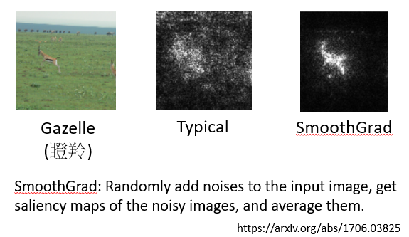

那你期待说，你今天去做 Saliency Map 的时候，机器会把它主要的精力，集中在瞪羚身上

那如果你用刚才我们讲的方法，直接画 Saliency Map 的话，你得到的结果可能是这个样子，确实今天在，确实在瞪羚附近有比较多亮的点，但是在其他地方也有一些杂讯，让人看起来有点不舒服，所以就有了 SmoothGrad 这个方法，SmoothGrad 会让你的这个 Saliency Map，上面的杂讯比较少

如果在这个例子上，你就会发现多数的亮点，真的都集中在瞪羚身上，那 SmoothGrad 这个方法是怎么做呢，非常简单，说穿了也不值钱

就是你**在你的图片上面啊，加上各种不同的杂讯**，那加不同的杂讯就是不同的图片了嘛，每一张图片上面，都去计算 Saliency Map，那你有加 100 种杂讯，就有 100 张 Saliency Map，平均起来，就得到 SmoothGrad 的结果，就结束了

当然有人会问说，欸 那你怎么知道说这个 SmoothGrad，这样子的结果一定就是比原来的结果好呢，也许对机器来说，它真的觉得这些草很重要啊，它真的觉得这个天空很重要啊，它真的觉得这个背景很重要啊

也许是，那就像我一开始说的，**Explainable Machine Learning 最重要的目标，就是要让人看了觉得爽**啊，你画了这个图，你的老闆就会觉得不爽啊，他就会觉得，哇 这个 Model 有点烂哦，这个 Model 解释性好像很低哦，所以你就会把它画成 SmoothGrad 这个样子，然后告诉别人说，你看这个 Model，它果然知道瞪羚是最重要的啊，所以这个，嗯 这个 Model 不错，然后这个，Explainable Machine Learning 的方法也不错

但是呢，其实光看  Gradient，并不完全能够反映一个 Component 的重要性，怎么说呢，这边就举一个例子给大家参考

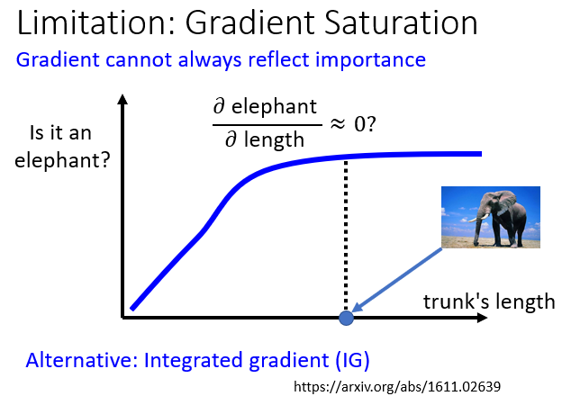

- 这个横轴代表的是大象鼻子的，某一个生物鼻子的长度
- 那纵轴代表说这个生物是大象的可能性

我们都知道说大象的特徵，就是长鼻子，所以一个生物，它的鼻子越来越长，它就越有可能是大象，但是当它的鼻子长到一个极限的时候，再变更长一点，它也不会变得更像大象，鼻子很长的大象，就只是鼻子特别长的大象，所以当一个大象的鼻子变长的时候，长到超出一个范围的时候，你也不会觉得它变得更像大象

所以 鼻子的，生物鼻子的长度跟它是大象的可能性，它的关系，也许一开始在长度比较短的时候，随着长度越来越长，今天这个生物是大象的可能性越来越大，但是**当鼻子的长度长到一个程度以后，就算是更长，也不会变得更像大象**

这个时候，如果你计算鼻子长度，对是大象可能性的偏微分的话，那你在这个地方得到的**偏微分，可能会趋近于 0**，所以如果你**光看 Gradient，光看 Saliency Map**，你可能会得到一个结论是，**鼻子的长度，对是不是大象这件事情是不重要的**，鼻子的长度不是判断是否为大象的一个指标，因为鼻子的长度的变化，对是大象的可能性的变化，是趋近于 0 的，所以鼻子根本不是，判断是不是大象的重要的指标

那事实上是这样吗，**事实上你知道不是这个样子**，所以光看 Gradient，光看偏微分的结果，可能没有办法完全告诉我们，一个 Component 的重要性，所以有其他的方法，有一个方法叫做 I==nterated 的 Gradient==，它的缩写叫做 IG，那这边，我就不打算详细讲说 IG 是怎么运作的，我们就把文件留在这边，那助教的程式里面也有实作的 IG，那如果你有兴趣，你可以自己研究看看 IG 是怎么运作的，如果你没有兴趣，反正你按个 Enter，就跑出那个 IG 的分析的结果了

#### How a network processes the input data?

好 那刚才我们是看 **Network 它是，我们刚才是看一个输入，它的哪些部分是比较重要的**，那接下来我们要问的下一个问题是，当我们给 Network 看一个输入的时候，它到底是怎么去处理这个输入的呢，它到底是怎么对输入做处理，然后得到最终的答案的呢

那有不同的方法，第一个方法最直觉的，就是**人眼去看，今天 Network 里面到底发生了什么事情**，那在作业里面，是要你去看 BERT 里面发生了什么事情，是跟文字有关的，那上课举的例子，我们就举语音的例子，在作业二里面，你已经训练了一个 Network

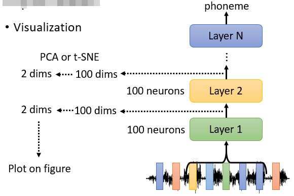

这个 Network 就是吃一小段声音当中输入，判断说这段声音，是属于哪一个 Phoneme，属于哪一个 KK 音标，然后呢，假设你第一个 Layer 有 100 个 Neurons，第二个 Layer 也有 100 个 Neurons，那第一个 Layer 的输出，就可以看作是 100 维的向量，第二个 Layer 的输出，也可以看作是 100 维的向量，通过这些分析这些向量，也许我们就可以知道一个 Network 里面，发生了什么事

但是 **100 维的向量，不容易看 不容易观察 不容易分析**，所以怎么办呢，你有很多方法，可以**把 100 维的向量，把它降到二维**，那至于是什么方法，我们这边就不细讲，总之这些方法有一箩筐可以使用，把 100 维降到二维以后，你就可以画在图上，那你就可以细心地观察它，看看你可以观察到什么现象

以下呢，举的是语音的例子，那这个例子来自于一篇 2012 年的 Paper

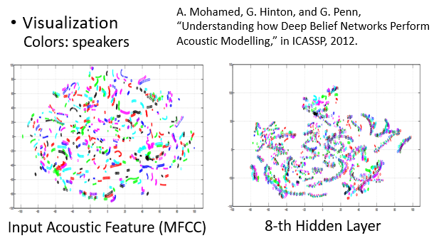

你会发现 Hinton，这个深度学习之父，也是这篇文章的作者，这篇文章做的事情是什么呢，这篇文章，其实老实说，这篇文章做的就是你的作业二 知道吗，它跟你作业二用的 Data 是一模一样的

所以假设你穿越时空到十年前，拿你作业二的结果给 Hinton 看，他就吓一跳这样子，你可以顺便告诉他说，这个只是我们 15 个作业的其中一个而已，他就吓一跳了，你还可以告诉他说，哦 这个，我只 Train 了一个小时就 Train 完了，那个时候要 Train 类似的东西，大概要 Train 个一周以上吧，然后 Hinton 就会吓一跳这样子，所以看到这些过去的文章啊，我真的只能说，哇 这个大人 时代变了啊，以前 Train Network 多么麻烦，现在真的是时代变了，而且其实那个时候用的是 **Deep Belief Network**，Deep Belief Network，是 Deep Neural Network吗，不是这样子，那这个是什么东西呢，这个我们就不会讲它，因为现在已经没有人在用这个东西了，好 那但是它得到的结果啊，还是蛮值得我们今天拿来看的，其实你在作业二，应该也可以观察到类似的结果

这边做的事情是什么呢，这边做的事情是，首先我们把模型的 Input，就是 Acoustic Feature，也就是 MFCC 拿出来，把它降到二维，画在二维的平面上，在这个图上啊，**每一个点代表一小段声音讯号，那每一个顏色，代表了某一个 Speaker**，某一个讲话的人，那其实我们丢给这个 Network 的资料，有很多句子是重复的，就是有人说，A 说了 How are you，B 也说了 How are you，C 也说了 How are you，很多人说了一样的句子，但从这个图上你看不出来，从 Acoustic Feature上你会发现说，就算是不同的人唸同样的句子，内容一样

但是我们从 Acoustic Feature 上看不出来，同一个人他说的话就是比较相近，就算是不同的人说同样的句子，你也没有办法看到，他们被align在一起，所以从这个结果，人们就会觉得 哇 这个，这个语音辨识太难啦，语音辨识不能做啊，这个同样的人说不，这个不同的人说同样的话，看起来这个 Feature 差这么多啊，这个语音辨识怎么是有可能，有办法做的问题呢

但是当我们把 Network 拿出来看的时候，结果就不一样了，这个是第 8 层 Network 的输出，你会发现什么呢，你会发现这边变成一条一条的，每一条没有特定的顏色，这边每一条代表什么呢，每一条就代表了同样内容的某一个句子，所以你会发现说，不同人说同样的内容，在 MFCC 上看不出来，它**通过了 8 层的 Network 之后，机器知道说这些话是同样的内容，虽然声音讯号看起来不一样，是不同人讲的，但他们是同样的内容**，它可以把同样的内容，不同人说的句子，把它align在一起，所以最后就可以得到精确的分类结果

好 那刚才讲的是直接拿 Neuron 的输出，来进行分析，你也可以分析这个 Attention 的 Layer，现在 Self-Attention 用得很广，你也可以看 Attention 的结果，来决定今天 Network 学到什么事

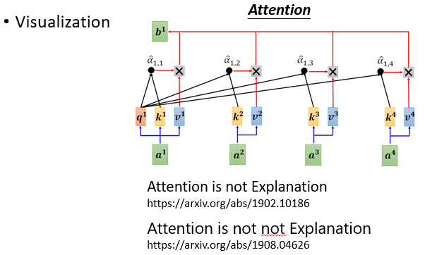

那我们在作业里面，也要求大家看了 BERT 的 Attention，但是当你使用 Attention 的时候，还是有一些要注意的地方，我们直觉觉得 Attention 应该非常具有解释力，从某一个词汇 Attention 到另外一个词汇，当然就代表说这两个的词汇有关系啊等等，那在作业里面，我们也挑了比较明显可以看出关联性的例子，给大家来实作，给大家来回答问题

但是实际上，你在文献上会找到这样子的文献，Attention is not Explanation，Attention 并不是总是可以被解释的，当然也有人发文献说，Attention is not not Explanation 这样子，所以你知道这个，这个研究 进展得非常快，很快又搞不好又会有人做，Attention is not not not Explanation，所以这个，到底 Attention 能不能被解释，什么状况可以被解释，什么状况不能够被解释，这个还是尚待研究的问题

那除了用人眼观察以外，还有另外一个技术叫做 ==Probing==，Probing 就是用探针的意思，就是你用探针去插入这个 Network，然后看看说发生了什么事

举例来说，假设你想要知道 BERT 的某一个 Layer，到底学到了什么东西，除了用肉眼观察以外，不过肉眼观察比较有极限嘛，可能有很多你没有观察到的现象，而且你也没有办法一次看过大批的资料，所以怎么办呢，你可以训练一个探针，**你的探针其实就是分类器**

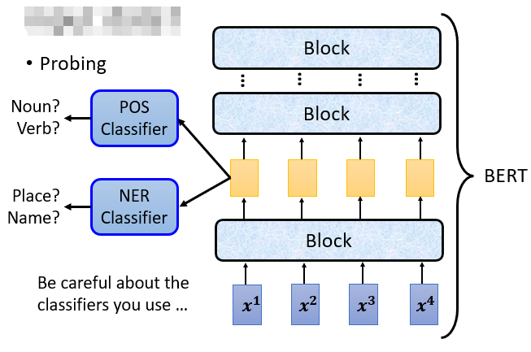

举例来说，你训练一个分类器，这个分类器是要根据一个 Feature，根据一个向量决定说现在这个词汇，它的 POS Tag，也就是它的词性是什么，你就把 BERT 的 Embedding，丢到 POS 的 Classifier 里面去，你就训练一个 POS 的 Classifier，它要试图根据这些 Embedding，决定说现在这些 Embedding，是来自于哪一个词性的词汇

如果这个 POS 的 Classifier 它的正确率高，就代表说这些 Embedding 里面，有很多词性的资讯，如果它正确率第一，就代表这些 Embedding 里面，没有词性的资讯

或者是说你 Learn 一个 NER，Name Entity Recognition 的 Classifier，然后呢，它看这些 Feature，决定说现在看到的词汇属于哪，属于人名还是地名，还是不是任何专有名词，那你透过这个 NER Classifier 的正确率，就可以知道这些 Feature 里面，有没有名字，有没有这个地址，有没有人名的资讯等等

但是使用这个技术的时候，有一点你要小心，什么你要小心呢，**小心你使用的 Classifier 它的强度**，为什么，因为假设你今天发现你的 Classifier 正确率很低，真的一定保证它的输入的这些 Feature，也就是 BERT 的 Embedding，没有我们要分类的资讯吗，不一定，为什么

因为有可能就是你的 Classifier Train 烂啦，对不对，我们大家都有很多 Train Network 的经验嘛，你没有办法 100% 保证，你 Classifier Train 出来一定是好的啊，那搞不好你训练完一个 Classifier，它的正确率很低，不是因为这些 Feature 里面，没有我们需要的资讯，单纯就是你 Learning Rate 没有调好，你什么东西没有调好，所以 Train 不起来，有没有可能是这样呢，有可能是这个样子，所以用 Probing Model 的时候，你要小心不要太快下结论，有时候你会得到一些结论，只是因为你 Classifier 没有 Train好，或 Train 得太好，导致你 Classifier 的正确率，没有办法当做评断的依据

Probing 不一定要是 Classifier，我这边特别举一个例子告诉你说，Probing 有种种的可能性，举例来说，我们实验室有做一个尝试是，训练一个语音合成的模型，一般语音合成的模型是吃一段文字，产生对应的声音讯号

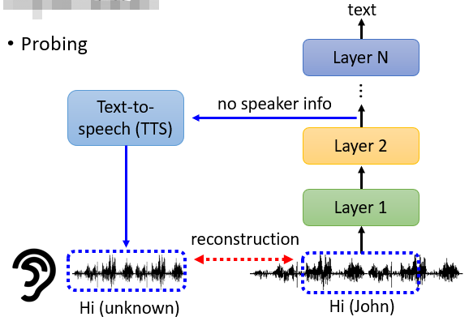

我们这边语音合成的模型不是吃一段文字，它是吃 Network Output 的 Embedding，**它吃 Network Output 的 Embedding 作为输入，然后试图去输出一段声音讯号**

也就是说你在作业二，你训练了一个 Classifier，那接下来训练了一个 Phoneme 的 Classifier，接下来我们就把你的 Network 拿出来，然后呢 把某一个 Layer 的输出呢，丢到 TTS 的模型里面，然后我们训练这个 TTS 的模型，我们训练的目标，是希望 TTS 的模型，可以去**復现 Network 输入**，就 Network 的输入是这段声音讯号，希望通过这些 Layer 以后，产生了 Embedding，丢到 TTS 以后，可以回復原来的声音讯号

那这样子的分析有什么用呢，你可能会想说，我们训练这个 TTS 产生原来的声音讯号，那不就产生原来的声音讯号，一模一样的声音讯号，就是输入的那一个，那有什么样的可看性呢

那这边有趣的地方是，假设这个 Network 做的事情，就是**把 比如说语者的资讯去掉**，那对于这个 TTS 的模型而言，这边 Layer 2 的输出，没有任何语者的资讯，那它无论怎么努力，都无法还原语者的特徵，那虽然内容说的是 Hi，然后是一个男生的声音，你会发现说，可能通过几个 Layer 以后，丢到 TTS 的模型 它，它这个产生出来的声音，会变成也是 Hi 的内容，但是你听不出来是谁讲的，那这样你就可以知道说，欸 这个 Network 啊，一个语音辨识的模型啊，它在训练的过程中，真的学到去抹去语者的特徵，只保留内容的部分，只保留声音讯号的内容

以下是真实的例子

这个例子是这样子的，这边有一个 5 层的 Bi-directional 的 Lstm，它吃声音讯号做输入，那输出就是文字，它是语音辨识的模型，好 那现在我们给它一段声音讯号做输入，是女生的声音，接下来再给它听另外一个，男生讲不一样的内容，听起来像是这样的，接下来我们把这些声音讯号，丢到这个 Network 里面，然后再把这个 Network 的 Embedding，用 TTS 的模型去还原回原来的声音讯号，看看我们听到什么，以下是过第一层 Lstm 的结果，你会发现声音讯号有一点失真，但基本上跟原来是差不多的，男生的声音是这样的，跟原来都是差不多的，但通过了 5 层的 Lstm 以后发生什么事呢，声音讯号变成这个样子，所以本来一个句子是男生讲的，一个句子是女生讲的，通过 5 层的 Lstm 以后，就听不出来是谁讲的，它把两个人的声音，都变成是一样的

那你可能说，欸 这个不是 10 年前，Hinton 就已经知道了吗，透过 Visualization，然后这个研究有什么厉害的地方呢，他厉害地方就是他潮 知道吗，就是我们可以把声音，我们可以听 Network 听到的声音，这边再举最后一个例子，输入的声音讯号是有杂讯的，有钢琴的声音，好 我们的 Network 现在前面有几层 CNN，后面有几层 Bi-directional 的 Lstm，通过地一层 CNN 以后，声音讯号变成这样，好 你还是听得到钢琴的声音，好 最后，到最后一层进入 Lstm 之前，声音讯号是这样的，你还是听到钢琴的声音，但是通过第一层 Lstm 以后，就不一样了，它听起来像是这个样子，你会发现说，那个钢琴的声音就突然小很多，所以知道说，这个钢琴的声音 这个杂讯，声音讯号之外，杂讯是在哪一层被滤掉的呢，在第一层 Lstm，开始被滤掉，前面 CNN，似乎没有起到滤掉杂讯的作用，那这个就是这个分析可以告诉我们的事情，好 那我们讲到这边正好告一个段落，那我们就赶快下课吧，那大家有问题还可以留下来讨论，谢谢大家 谢谢，
