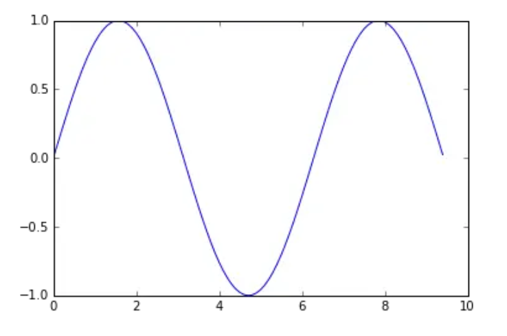
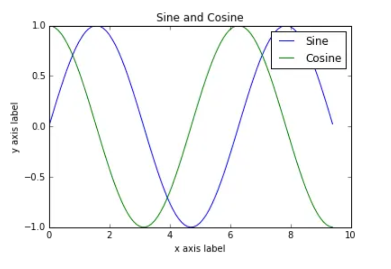
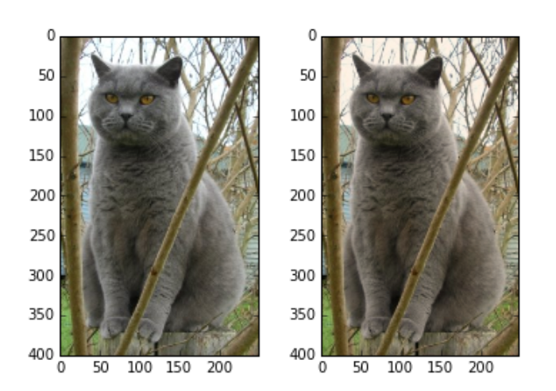

> 参考：[CS231n课程笔记翻译：Python Numpy教程](https://zhuanlan.zhihu.com/p/20878530?refer=intelligentunit)、[Python Numpy Tutorial (with Jupyter and Colab)](https://cs231n.github.io/python-numpy-tutorial/)

## Python

### 1. 字符串

对象的一些用法

```python
s = "hello"
print s.capitalize()  # 大写首字母; prints "Hello"
print s.upper()       # 转化成大写; prints "HELLO"
print s.rjust(7)      # 右边填充成7个字符的长度; prints "  hello"
print s.center(7)     # 填充成7个字符的长度并居中; prints " hello "
print s.replace('l', '(ell)')  # 替换所有匹配; prints "he(ell)(ell)o"
print '  world '.strip()  # 去除空白字符; prints "world"
```

### 2. 列表

想要在循环体内访问每个元素的指针，可以使用内置的 **enumerate** 函数

```python
animals = ['cat', 'dog', 'monkey']
for idx, animal in enumerate(animals):
    print '#%d: %s' % (idx + 1, animal)
# Prints "#1: cat", "#2: dog", "#3: monkey", each on its own line
```

**列表推导**

```python
nums = [0, 1, 2, 3, 4]
squares = [x ** 2 for x in nums]
print squares   # Prints [0, 1, 4, 9, 16]
```

```python
nums = [0, 1, 2, 3, 4]
even_squares = [x ** 2 for x in nums if x % 2 == 0]
print even_squares  # Prints "[0, 4, 16]"
```

### 3. 字典

一些基本的用法

```python
d = {'cat': 'cute', 'dog': 'furry'}  # Create a new dictionary with some data
print d['cat']       # Get an entry from a dictionary; prints "cute"
print 'cat' in d     # Check if a dictionary has a given key; prints "True"
d['fish'] = 'wet'    # Set an entry in a dictionary
print d['fish']      # Prints "wet"
# print d['monkey']  # KeyError: 'monkey' not a key of d
print d.get('monkey', 'N/A')  # Get an element with a default; prints "N/A"
print d.get('fish', 'N/A')    # Get an element with a default; prints "wet"
del d['fish']        # Remove an element from a dictionary
print d.get('fish', 'N/A') # "fish" is no longer a key; prints "N/A"
```

用键来进行迭代

```python
d = {'person': 2, 'cat': 4, 'spider': 8}
for animal in d:
    legs = d[animal]
    print 'A %s has %d legs' % (animal, legs)
# Prints "A person has 2 legs", "A spider has 8 legs", "A cat has 4 legs"
```

要同时访问键和对应的值

```python
d = {'person': 2, 'cat': 4, 'spider': 8}
for animal, legs in d.iteritems():
    print 'A %s has %d legs' % (animal, legs)
# Prints "A person has 2 legs", "A spider has 8 legs", "A cat has 4 legs"
```

字典推导

```python
nums = [0, 1, 2, 3, 4]
even_num_to_square = {x: x ** 2 for x in nums if x % 2 == 0}
print even_num_to_square  # Prints "{0: 0, 2: 4, 4: 16}"
```

### 4. 集合

一些简单的操作

```python
animals = {'cat', 'dog'}
print 'cat' in animals   # Check if an element is in a set; prints "True"
print 'fish' in animals  # prints "False"
animals.add('fish')      # Add an element to a set
print 'fish' in animals  # Prints "True"
print len(animals)       # Number of elements in a set; prints "3"
animals.add('cat')       # Adding an element that is already in the set does nothing
print len(animals)       # Prints "3"
animals.remove('cat')    # Remove an element from a set
print len(animals)       # Prints "2"
```

**循环同列表**

集合推导

```python
from math import sqrt
nums = {int(sqrt(x)) for x in range(30)}
print nums  # Prints "set([0, 1, 2, 3, 4, 5])"
```

### 5. 元组

元组是一个值的有序列表（不可改变）。从很多方面来说，元组和列表都很相似。和列表最重要的不同在于，元组可以在字典中用作键，还可以作为集合的元素，而列表不行。例子如下：

```python
d = {(x, x + 1): x for x in range(10)}  # Create a dictionary with tuple keys
print d
t = (5, 6)       # Create a tuple
print type(t)    # Prints "<type 'tuple'>"
print d[t]       # Prints "5"
print d[(1, 2)]  # Prints "1"
```

## Numpy

Numpy 是 Python 中用于科学计算的核心库。它提供了高性能的多维数组对象，以及相关工具。

### 创建数组Array

一个numpy数组是一个由不同数值组成的网格。网格中的数据都是同一种数据类型，可以通过非负整型数的元组来访问。维度的数量被称为数组的阶。我们可以从列表创建数组，然后利用方括号访问其中的元素。

```python
import numpy as np

a = np.array([1, 2, 3])  # Create a rank 1 array
print type(a)            # Prints "<type 'numpy.ndarray'>"
print a.shape            # Prints "(3,)"
print a[0], a[1], a[2]   # Prints "1 2 3"
a[0] = 5                 # Change an element of the array
print a                  # Prints "[5, 2, 3]"

b = np.array([[1,2,3],[4,5,6]])   # Create a rank 2 array
print b                           # 显示一下矩阵b
print b.shape                     # Prints "(2, 3)"
print b[0, 0], b[0, 1], b[1, 0]   # Prints "1 2 4"
```

Numpy 还提供了很多其他创建数组的方法：

```python
import numpy as np

a = np.zeros((2,2))  # Create an array of all zeros
print a              # Prints "[[ 0.  0.]
                     #          [ 0.  0.]]"

b = np.ones((1,2))   # Create an array of all ones
print b              # Prints "[[ 1.  1.]]"

c = np.full((2,2), 7) # Create a constant array
print c               # Prints "[[ 7.  7.]
                      #          [ 7.  7.]]"

d = np.eye(2)        # Create a 2x2 identity matrix
print d              # Prints "[[ 1.  0.]
                     #          [ 0.  1.]]"

e = np.random.random((2,2)) # Create an array filled with random values
print e                     # Might print "[[ 0.91940167  0.08143941]
                            #               [ 0.68744134  0.87236687]]"
```

其他的方法详见[官方文档](https://numpy.org/doc/stable/user/basics.creation.html#arrays-creation)。

### 访问数组

和Python列表类似，numpy数组可以使用切片语法。因为数组可以是多维的，所以**必须为每个维度指定好切片**。

```python
import numpy as np

# Create the following rank 2 array with shape (3, 4)
# [[ 1  2  3  4]
#  [ 5  6  7  8]
#  [ 9 10 11 12]]
a = np.array([[1,2,3,4], [5,6,7,8], [9,10,11,12]])

# Use slicing to pull out the subarray consisting of the first 2 rows
# and columns 1 and 2; b is the following array of shape (2, 2):
# [[2 3]
#  [6 7]]
b = a[:2, 1:3]

# A slice of an array is a view into the same data, so modifying it
# will modify the original array.
print a[0, 1]   # Prints "2"
b[0, 0] = 77    # b[0, 0] is the same piece of data as a[0, 1]
print a[0, 1]   # Prints "77"
```

使用切片来单独提取某一行或者某一列，可以看到使用切片来获取和使用整数来获取，结果会有所区别。

```python
import numpy as np

# Create the following rank 2 array with shape (3, 4)
# [[ 1  2  3  4]
#  [ 5  6  7  8]
#  [ 9 10 11 12]]
a = np.array([[1,2,3,4], [5,6,7,8], [9,10,11,12]])

# Two ways of accessing the data in the middle row of the array.
# Mixing integer indexing with slices yields an array of lower rank,
# while using only slices yields an array of the same rank as the
# original array:
row_r1 = a[1, :]    # Rank 1 view of the second row of a  
row_r2 = a[1:2, :]  # Rank 2 view of the second row of a
print row_r1, row_r1.shape  # Prints "[5 6 7 8] (4,)"
print row_r2, row_r2.shape  # Prints "[[5 6 7 8]] (1, 4)"

# We can make the same distinction when accessing columns of an array:
col_r1 = a[:, 1]
col_r2 = a[:, 1:2]
print col_r1, col_r1.shape  # Prints "[ 2  6 10] (3,)"
print col_r2, col_r2.shape  # Prints "[[ 2]
                            #          [ 6]
                            #          [10]] (3, 1)"
```

#### 整型数组访问

当我们使用切片语法访问数组时，得到的总是原数组的一个子集。整型数组访问允许我们利用其它数组的数据构建一个新的数组：

```python
import numpy as np

a = np.array([[1,2], [3, 4], [5, 6]])

# An example of integer array indexing.
# The returned array will have shape (3,) and 
print a[[0, 1, 2], [0, 1, 0]]  # Prints "[1 4 5]"

# The above example of integer array indexing is equivalent to this:
print np.array([a[0, 0], a[1, 1], a[2, 0]])  # Prints "[1 4 5]"

# When using integer array indexing, you can reuse the same
# element from the source array:
print a[[0, 0], [1, 1]]  # Prints "[2 2]"

# Equivalent to the previous integer array indexing example
print np.array([a[0, 1], a[0, 1]])  # Prints "[2 2]"
```

整型数组访问语法还有个有用的技巧，可以用来选择或者更改矩阵中每行中的一个元素：

```python
import numpy as np

# Create a new array from which we will select elements
a = np.array([[1,2,3], [4,5,6], [7,8,9], [10, 11, 12]])

print a  # prints "array([[ 1,  2,  3],
         #                [ 4,  5,  6],
         #                [ 7,  8,  9],
         #                [10, 11, 12]])"

# Create an array of indices
b = np.array([0, 2, 0, 1])

# Select one element from each row of a using the indices in b
print a[np.arange(4), b]  # Prints "[ 1  6  7 11]"

# Mutate one element from each row of a using the indices in b
a[np.arange(4), b] += 10

print a  # prints "array([[11,  2,  3],
         #                [ 4,  5, 16],
         #                [17,  8,  9],
         #                [10, 21, 12]])
```

#### 布尔型数组访问

布尔型数组访问可以让你选择数组中任意元素。通常，这种访问方式用于选取数组中满足某些条件的元素，举例如下：

```python
import numpy as np

a = np.array([[1,2], [3, 4], [5, 6]])

bool_idx = (a > 2)  # Find the elements of a that are bigger than 2;
                    # this returns a numpy array of Booleans of the same
                    # shape as a, where each slot of bool_idx tells
                    # whether that element of a is > 2.

print bool_idx      # Prints "[[False False]
                    #          [ True  True]
                    #          [ True  True]]"

# We use boolean array indexing to construct a rank 1 array
# consisting of the elements of a corresponding to the True values
# of bool_idx
print a[bool_idx]  # Prints "[3 4 5 6]"

# We can do all of the above in a single concise statement:
print a[a > 2]     # Prints "[3 4 5 6]"
```

更多数组访问内容可查看[官方文档](https://numpy.org/doc/stable/reference/arrays.indexing.html)。

### 数据类型

每个Numpy数组都是数据类型相同的元素组成的网格。Numpy提供了很多的数据类型用于创建数组。当你创建数组的时候，Numpy会尝试猜测数组的数据类型，你也可以通过参数直接指定数据类型，例子如下：

```python
import numpy as np

x = np.array([1, 2])  # Let numpy choose the datatype
print x.dtype         # Prints "int64"

x = np.array([1.0, 2.0])  # Let numpy choose the datatype
print x.dtype             # Prints "float64"

x = np.array([1, 2], dtype=np.int64)  # Force a particular datatype
print x.dtype                         # Prints "int64"
```

更多细节查看[官方文档](https://link.zhihu.com/?target=http%3A//docs.scipy.org/doc/numpy/reference/arrays.dtypes.html)。

### 数组计算

基本数学计算函数会对数组中元素逐个进行计算，既可以利用操作符重载，也可以使用函数方式：

```python
import numpy as np

x = np.array([[1,2],[3,4]], dtype=np.float64)
y = np.array([[5,6],[7,8]], dtype=np.float64)

# Elementwise sum; both produce the array
# [[ 6.0  8.0]
#  [10.0 12.0]]
print x + y
print np.add(x, y)

# Elementwise difference; both produce the array
# [[-4.0 -4.0]
#  [-4.0 -4.0]]
print x - y
print np.subtract(x, y)

# Elementwise product; both produce the array
# [[ 5.0 12.0]
#  [21.0 32.0]]
print x * y
print np.multiply(x, y)

# Elementwise division; both produce the array
# [[ 0.2         0.33333333]
#  [ 0.42857143  0.5       ]]
print x / y
print np.divide(x, y)

# Elementwise square root; produces the array
# [[ 1.          1.41421356]
#  [ 1.73205081  2.        ]]
print np.sqrt(x)
```

和MATLAB不同，*是元素逐个相乘，而不是矩阵乘法。在Numpy中使用dot来进行矩阵乘法：

```python
import numpy as np

x = np.array([[1,2],[3,4]])
y = np.array([[5,6],[7,8]])

v = np.array([9,10])
w = np.array([11, 12])

# Inner product of vectors; both produce 219
print v.dot(w)
print np.dot(v, w)

# Matrix / vector product; both produce the rank 1 array [29 67]
print x.dot(v)
print np.dot(x, v)

# Matrix / matrix product; both produce the rank 2 array
# [[19 22]
#  [43 50]]
print x.dot(y)
print np.dot(x, y)
```

Numpy提供了很多计算数组的函数，其中最常用的一个是**sum**：

```python
import numpy as np

x = np.array([[1,2],[3,4]])

print np.sum(x)  # Compute sum of all elements; prints "10"
print np.sum(x, axis=0)  # Compute sum of each column; prints "[4 6]"
print np.sum(x, axis=1)  # Compute sum of each row; prints "[3 7]"
```

想要了解更多函数，可以查看[文档](https://link.zhihu.com/?target=http%3A//docs.scipy.org/doc/numpy/reference/routines.math.html)。

除了计算，我们还常常改变数组或者操作其中的元素。其中将矩阵转置是常用的一个，在Numpy中，使用**T**来转置矩阵：

```python
import numpy as np

x = np.array([[1,2], [3,4]])
print x    # Prints "[[1 2]
           #          [3 4]]"
print x.T  # Prints "[[1 3]
           #          [2 4]]"

# Note that taking the transpose of a rank 1 array does nothing:
v = np.array([1,2,3])
print v    # Prints "[1 2 3]"
print v.T  # Prints "[1 2 3]"
```

Numpy还提供了更多操作数组的方法，请查看[文档](https://link.zhihu.com/?target=http%3A//docs.scipy.org/doc/numpy/reference/routines.array-manipulation.html)。

### 广播Broadcasting

广播是一种强有力的机制，它让Numpy可以让不同大小的矩阵在一起进行数学计算。我们常常会有一个小的矩阵和一个大的矩阵，然后我们会需要用小的矩阵对大的矩阵做一些计算。

举个例子，如果我们想要把一个向量加到矩阵的每一行，我们可以这样做：

```python
import numpy as np

# We will add the vector v to each row of the matrix x,
# storing the result in the matrix y
x = np.array([[1,2,3], [4,5,6], [7,8,9], [10, 11, 12]])
v = np.array([1, 0, 1])
vv = np.tile(v, (4, 1))  # Stack 4 copies of v on top of each other
print vv                 # Prints "[[1 0 1]
                         #          [1 0 1]
                         #          [1 0 1]
                         #          [1 0 1]]"
y = x + vv  # Add x and vv elementwise
print y  # Prints "[[ 2  2  4
         #          [ 5  5  7]
         #          [ 8  8 10]
         #          [11 11 13]]"
```

对两个数组使用广播机制要遵守下列规则：

1. 如果数组的秩不同，使用1来将秩较小的数组进行扩展，直到两个数组的尺寸的长度都一样。
2. 如果两个数组在某个维度上的长度是一样的，或者其中一个数组在该维度上长度为1，那么我们就说这两个数组在该维度上是**相容**的。
3. 如果两个数组在所有维度上都是相容的，他们就能使用广播。
4. 如果两个输入数组的尺寸不同，那么注意其中较大的那个尺寸。因为广播之后，两个数组的尺寸将和那个较大的尺寸一样。
5. 在任何一个维度上，如果一个数组的长度为1，另一个数组长度大于1，那么在该维度上，就好像是对第一个数组进行了复制。

如果上述解释看不明白，可以读一读[文档](https://link.zhihu.com/?target=http%3A//docs.scipy.org/doc/numpy/user/basics.broadcasting.html)和这个[解释](https://link.zhihu.com/?target=http%3A//scipy.github.io/old-wiki/pages/EricsBroadcastingDoc)。**译者注**：强烈推荐阅读文档中的例子。

支持广播机制的函数是全局函数。哪些是全局函数可以在[文档](https://link.zhihu.com/?target=http%3A//docs.scipy.org/doc/numpy/reference/ufuncs.html%23available-ufuncs)中查找。

下面是一些广播机制的使用：

```python
import numpy as np

# Compute outer product of vectors
v = np.array([1,2,3])  # v has shape (3,)
w = np.array([4,5])    # w has shape (2,)
# To compute an outer product, we first reshape v to be a column
# vector of shape (3, 1); we can then broadcast it against w to yield
# an output of shape (3, 2), which is the outer product of v and w:
# [[ 4  5]
#  [ 8 10]
#  [12 15]]
print np.reshape(v, (3, 1)) * w

# Add a vector to each row of a matrix
x = np.array([[1,2,3], [4,5,6]])
# x has shape (2, 3) and v has shape (3,) so they broadcast to (2, 3),
# giving the following matrix:
# [[2 4 6]
#  [5 7 9]]
print x + v

# Add a vector to each column of a matrix
# x has shape (2, 3) and w has shape (2,).
# If we transpose x then it has shape (3, 2) and can be broadcast
# against w to yield a result of shape (3, 2); transposing this result
# yields the final result of shape (2, 3) which is the matrix x with
# the vector w added to each column. Gives the following matrix:
# [[ 5  6  7]
#  [ 9 10 11]]
print (x.T + w).T

# Another solution is to reshape w to be a row vector of shape (2, 1);
# we can then broadcast it directly against x to produce the same
# output.
print x + np.reshape(w, (2, 1))

# Multiply a matrix by a constant:
# x has shape (2, 3). Numpy treats scalars as arrays of shape ();
# these can be broadcast together to shape (2, 3), producing the
# following array:
# [[ 2  4  6]
#  [ 8 10 12]]
print x * 2
```

广播机制能够让你的代码更简洁更迅速，能够用的时候请尽量使用！

### Numpy 文档

这篇教程涉及了你需要了解的numpy中的一些重要内容，但是numpy远不止如此。可以查阅[numpy文献](https://link.zhihu.com/?target=http%3A//docs.scipy.org/doc/numpy/reference/)来学习更多。

## SciPy

Numpy提供了高性能的多维数组，以及计算和操作数组的基本工具。[SciPy](https://link.zhihu.com/?target=http%3A//docs.scipy.org/doc/scipy/reference/)基于Numpy，提供了大量的计算和操作数组的函数，这些函数对于不同类型的科学和工程计算非常有用。

### 图像操作

SciPy提供了一些操作图像的基本函数。比如，它提供了将图像从硬盘读入到数组的函数，也提供了将数组中数据写入的硬盘成为图像的函数。下面是一个简单的例子：

```python
from scipy.misc import imread, imsave, imresize

# Read an JPEG image into a numpy array
img = imread('assets/cat.jpg')
print img.dtype, img.shape  # Prints "uint8 (400, 248, 3)"

# We can tint the image by scaling each of the color channels
# by a different scalar constant. The image has shape (400, 248, 3);
# we multiply it by the array [1, 0.95, 0.9] of shape (3,);
# numpy broadcasting means that this leaves the red channel unchanged,
# and multiplies the green and blue channels by 0.95 and 0.9
# respectively.
img_tinted = img * [1, 0.95, 0.9]

# Resize the tinted image to be 300 by 300 pixels.
img_tinted = imresize(img_tinted, (300, 300))

# Write the tinted image back to disk
imsave('assets/cat_tinted.jpg', img_tinted)
```

### MATLAB文件

函数**scipy.io.loadmat**和**scipy.io.savemat**能够读写MATLAB文件。具体请查看[文档](https://link.zhihu.com/?target=http%3A//docs.scipy.org/doc/scipy/reference/io.html)。


### 点之间的距离

SciPy定义了一些有用的函数，可以计算集合中点之间的距离。

函数**scipy.spatial.distance.pdist**能够计算集合中所有两点之间的距离：

```python
import numpy as np
from scipy.spatial.distance import pdist, squareform

# Create the following array where each row is a point in 2D space:
# [[0 1]
#  [1 0]
#  [2 0]]
x = np.array([[0, 1], [1, 0], [2, 0]])
print x

# Compute the Euclidean distance between all rows of x.
# d[i, j] is the Euclidean distance between x[i, :] and x[j, :],
# and d is the following array:
# [[ 0.          1.41421356  2.23606798]
#  [ 1.41421356  0.          1.        ]
#  [ 2.23606798  1.          0.        ]]
d = squareform(pdist(x, 'euclidean'))
print d
```

具体细节请阅读[文档](https://link.zhihu.com/?target=http%3A//docs.scipy.org/doc/scipy/reference/generated/scipy.spatial.distance.pdist.html)。

函数**scipy.spatial.distance.cdist**可以计算不同集合中点的距离，具体请查看[文档](https://link.zhihu.com/?target=http%3A//docs.scipy.org/doc/scipy/reference/generated/scipy.spatial.distance.cdist.html)。

## Matplotlib

Matplotlib是一个作图库。这里简要介绍**matplotlib.pyplot**模块，功能和MATLAB的作图功能类似。

### 绘制图形

matplotlib库中最重要的函数是**Plot**。该函数允许你做出2D图形，如下：

```python
import numpy as np
import matplotlib.pyplot as plt

# Compute the x and y coordinates for points on a sine curve
x = np.arange(0, 3 * np.pi, 0.1)
y = np.sin(x)

# Plot the points using matplotlib
plt.plot(x, y)
plt.show()  # You must call plt.show() to make graphics appear.
```

运行上面代码会产生下面的作图：



```python
import numpy as np
import matplotlib.pyplot as plt

# Compute the x and y coordinates for points on sine and cosine curves
x = np.arange(0, 3 * np.pi, 0.1)
y_sin = np.sin(x)
y_cos = np.cos(x)

# Plot the points using matplotlib
plt.plot(x, y_sin)
plt.plot(x, y_cos)
plt.xlabel('x axis label')
plt.ylabel('y axis label')
plt.title('Sine and Cosine')
plt.legend(['Sine', 'Cosine'])
plt.show()
```



可以在[文档](https://link.zhihu.com/?target=http%3A//matplotlib.org/api/pyplot_api.html%23matplotlib.pyplot.plot)中阅读更多关于plot的内容。

### 绘制多个图形

可以使用**subplot**函数来在一幅图中画不同的东西：

```python
import numpy as np
import matplotlib.pyplot as plt

# Compute the x and y coordinates for points on sine and cosine curves
x = np.arange(0, 3 * np.pi, 0.1)
y_sin = np.sin(x)
y_cos = np.cos(x)

# Set up a subplot grid that has height 2 and width 1,
# and set the first such subplot as active.
plt.subplot(2, 1, 1)

# Make the first plot
plt.plot(x, y_sin)
plt.title('Sine')

# Set the second subplot as active, and make the second plot.
plt.subplot(2, 1, 2)
plt.plot(x, y_cos)
plt.title('Cosine')

# Show the figure.
plt.show()
```


关于**subplot**的更多细节，可以阅读[文档](https://link.zhihu.com/?target=http%3A//matplotlib.org/api/pyplot_api.html%23matplotlib.pyplot.subplot)。

### 图像

你可以使用**imshow**函数来显示图像，如下所示：

```python
import numpy as np
from scipy.misc import imread, imresize
import matplotlib.pyplot as plt

img = imread('assets/cat.jpg')
img_tinted = img * [1, 0.95, 0.9]

# Show the original image
plt.subplot(1, 2, 1)
plt.imshow(img)

# Show the tinted image
plt.subplot(1, 2, 2)

# A slight gotcha with imshow is that it might give strange results
# if presented with data that is not uint8. To work around this, we
# explicitly cast the image to uint8 before displaying it.
plt.imshow(np.uint8(img_tinted))
plt.show()
```


