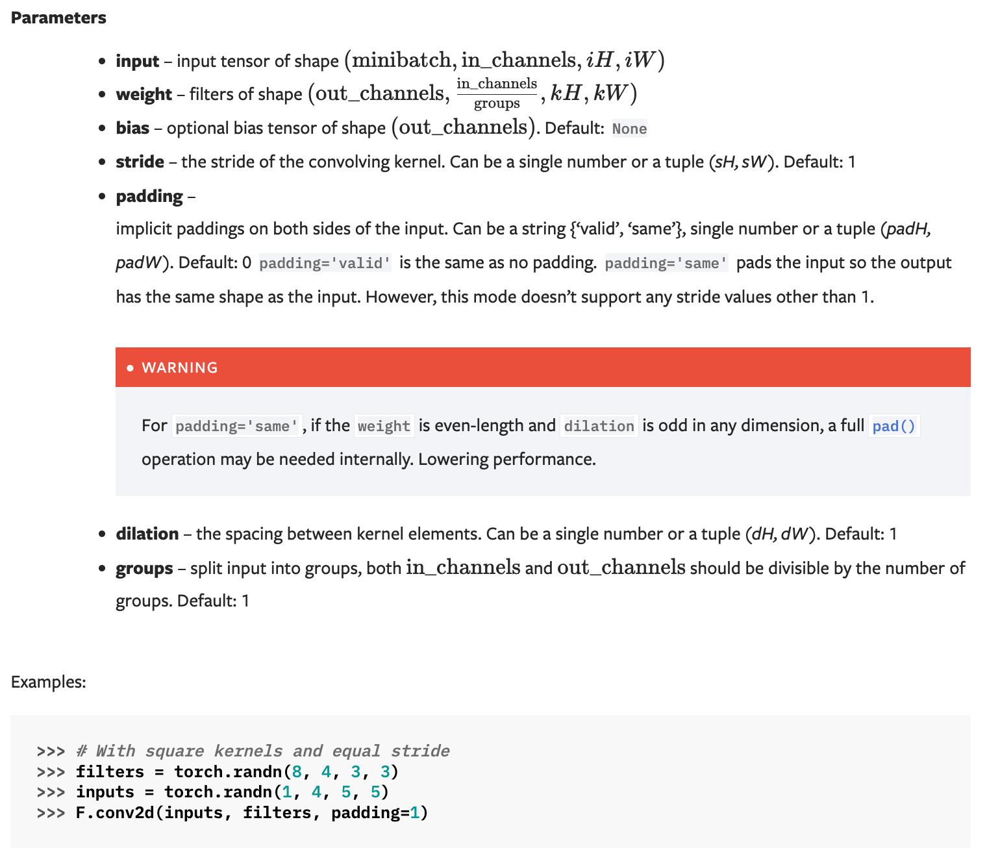
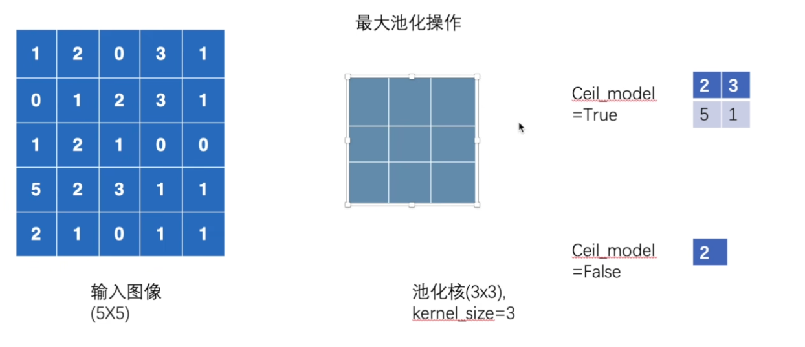
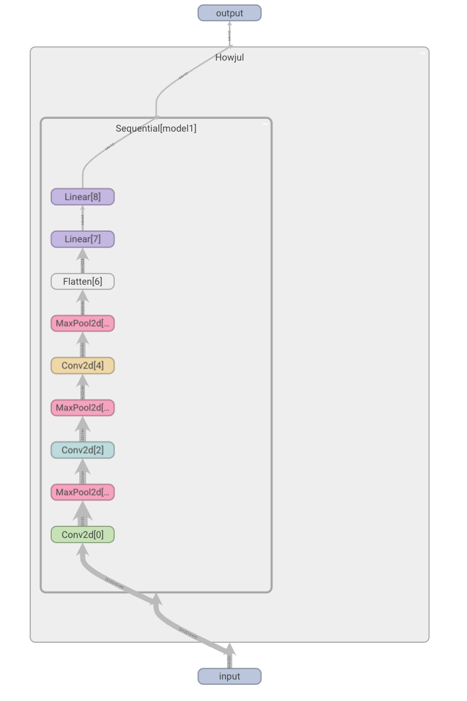
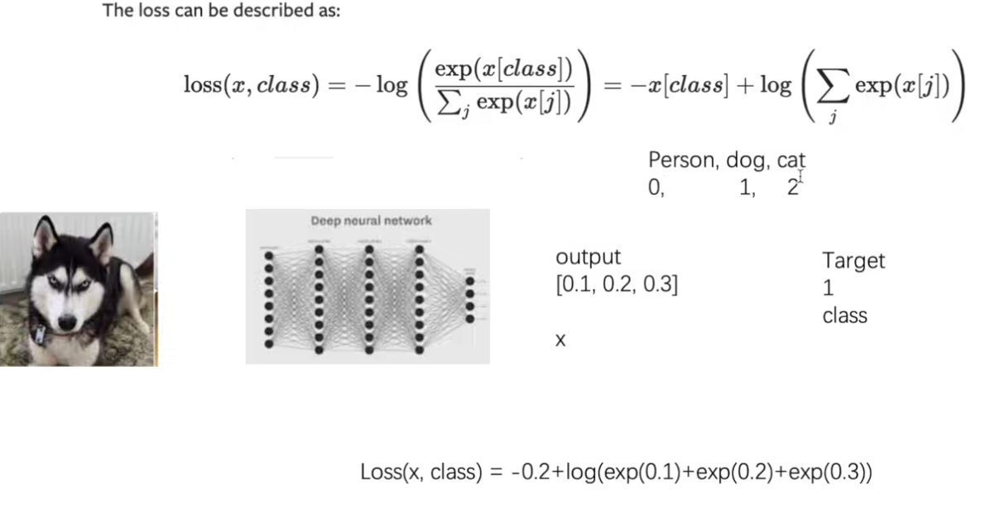
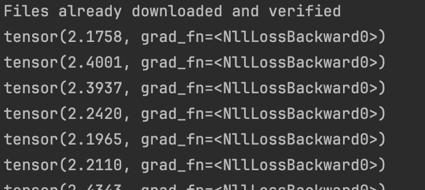

## 7. 神经网络

### 7.1 神经网络基本骨架-nn.Module的使用

[官方说明](https://pytorch.org/docs/stable/nn.html#containers)

代码如下所示，必须要重写forward函数。

```python
import torch
from torch import nn

class Howjul(nn.Module):
    def __init__(self):
        super().__init__()

    def forward(self, input):
        output = input + 1
        return output

howjul = Howjul()
x = torch.tensor(1.0)
output = howjul(x)
print(output)
```

> 7-1-nn_Module.py

### 7.2 卷积操作

[官方说明](https://pytorch.org/docs/stable/nn.html#convolution-layers)

`torch.nn`和`torch.nn.functional`的区别：

- `torch.nn`：平常使用这个就足够了，已经封装好了；
- `torch.nn.functional`：更加精细的操作，用于了解神经网络函数内部的操作，其实和`torch.nn`里面的函数是一一对应的，这里为了讲解，选用`torch.nn.functional`。

本次以[`torch.nn.functional.conv2d`](https://pytorch.org/docs/stable/generated/torch.nn.functional.conv2d.html#torch.nn.functional.conv2d)为例，参数如下：



- input：输入，注意是四维张量
- weight：卷积核，注意也是四维张量
- stride：步长，卷积层每次移动的距离，(1,2)表示横向步长和纵向步长；
- padding：边缘填充

```python
import torch
import torch.nn.functional as F


input = torch.tensor([[1, 2, 0, 3, 1],
                      [0, 1, 2, 3, 1],
                      [1, 2, 1, 0, 0],
                      [5, 2, 3, 1, 1],
                      [2, 1, 0, 1, 1]])

kernel = torch.tensor([[1, 2, 1],
                       [0, 1, 0],
                       [2, 1, 0]])

input = torch.reshape(input, (1, 1, 5, 5))
kernel = torch.reshape(kernel, (1, 1, 3, 3))

output = F.conv2d(input, kernel, stride=1)
print(output)

output2 = F.conv2d(input, kernel, stride=2)
print(output2)

output3 = F.conv2d(input, kernel, stride=1, padding=1)
print(output3)
```

> 7-2-Conv_operation.py

### 7.3 卷积层

以[`torch.nn.Conv2d`](https://pytorch.org/docs/stable/generated/torch.nn.Conv2d.html#torch.nn.Conv2d)为例，这是处理二维图像最常用的函数，参数如下：

- **in_channels** ([*int*](https://docs.python.org/3/library/functions.html#int)) – Number of channels in the input image
- **out_channels** ([*int*](https://docs.python.org/3/library/functions.html#int)) – Number of channels produced by the convolution
  - 输出通道数大于1但是输入通道数为1，那么会生成多个卷积核对输入进行卷积运算
- **kernel_size** ([*int*](https://docs.python.org/3/library/functions.html#int) *or* [*tuple*](https://docs.python.org/3/library/stdtypes.html#tuple)) – Size of the convolving kernel
- **stride** ([*int*](https://docs.python.org/3/library/functions.html#int) *or* [*tuple*](https://docs.python.org/3/library/stdtypes.html#tuple)*,* *optional*) – Stride of the convolution. Default: 1
- **padding** ([*int*](https://docs.python.org/3/library/functions.html#int)*,* [*tuple*](https://docs.python.org/3/library/stdtypes.html#tuple) *or* [*str*](https://docs.python.org/3/library/stdtypes.html#str)*,* *optional*) – Padding added to all four sides of the input. Default: 0
- **padding_mode** ([*str*](https://docs.python.org/3/library/stdtypes.html#str)*,* *optional*) – `'zeros'`, `'reflect'`, `'replicate'` or `'circular'`. Default: `'zeros'`
- **dilation** ([*int*](https://docs.python.org/3/library/functions.html#int) *or* [*tuple*](https://docs.python.org/3/library/stdtypes.html#tuple)*,* *optional*) – Spacing between kernel elements. Default: 1
- **groups** ([*int*](https://docs.python.org/3/library/functions.html#int)*,* *optional*) – Number of blocked connections from input channels to output channels. Default: 1
- **bias** ([*bool*](https://docs.python.org/3/library/functions.html#bool)*,* *optional*) – If `True`, adds a learnable bias to the output. Default: `True`

```python
import torch
import torchvision
from torch import nn
from torch.nn import Conv2d
from torch.utils.data import DataLoader
from torch.utils.tensorboard import SummaryWriter

dataset = torchvision.datasets.CIFAR10("./Dataset",
                                       train=False,
                                       transform=torchvision.transforms.ToTensor(),
                                       download=True)
dataloader = DataLoader(dataset, batch_size=64)


class Howjul(nn.Module):
    def __init__(self):
        super(Howjul, self).__init__()
        self.conv1 = Conv2d(in_channels=3, out_channels=6, kernel_size=3, stride=1, padding=0)

    def forward(self, x):
        x = self.conv1(x)
        return x


howjul = Howjul()
print(howjul)

writer = SummaryWriter("logs")
step = 0
for data in dataloader:
    imgs, targets = data
    output = howjul(imgs)
    print(imgs.shape)
    print(output.shape)
    # torch.Size([64, 3, 32, 32])
    writer.add_images("input", imgs, step)
    # torch.Size([64, 6, 30, 30]) -> [xxx, 3, 30, 30]
    # tensorboard无法显示六通道，所以要进行reshape
    # 输出shape的第一个值可以使用-1，函数自动进行计算
    output = torch.reshape(output, (-1, 3, 30, 30))
    writer.add_images("output", output, step)
    step = step + 1
```

> 7-3-Conv.py

### 7.4 最大池化的使用

以[`torch.nn.MaxPool2d`](https://pytorch.org/docs/stable/generated/torch.nn.MaxPool2d.html#torch.nn.MaxPool2d)为例，参数为：

- **kernel_size** ([*Union*](https://docs.python.org/3/library/typing.html#typing.Union)*[*[*int*](https://docs.python.org/3/library/functions.html#int)*,* [*Tuple*](https://docs.python.org/3/library/typing.html#typing.Tuple)*[*[*int*](https://docs.python.org/3/library/functions.html#int)*,* [*int*](https://docs.python.org/3/library/functions.html#int)*]**]*) – the size of the window to take a max over
- **stride** ([*Union*](https://docs.python.org/3/library/typing.html#typing.Union)*[*[*int*](https://docs.python.org/3/library/functions.html#int)*,* [*Tuple*](https://docs.python.org/3/library/typing.html#typing.Tuple)*[*[*int*](https://docs.python.org/3/library/functions.html#int)*,* [*int*](https://docs.python.org/3/library/functions.html#int)*]**]*) – the stride of the window. Default value is `kernel_size`
- **padding** ([*Union*](https://docs.python.org/3/library/typing.html#typing.Union)*[*[*int*](https://docs.python.org/3/library/functions.html#int)*,* [*Tuple*](https://docs.python.org/3/library/typing.html#typing.Tuple)*[*[*int*](https://docs.python.org/3/library/functions.html#int)*,* [*int*](https://docs.python.org/3/library/functions.html#int)*]**]*) – Implicit negative infinity padding to be added on both sides
- **dilation** ([*Union*](https://docs.python.org/3/library/typing.html#typing.Union)*[*[*int*](https://docs.python.org/3/library/functions.html#int)*,* [*Tuple*](https://docs.python.org/3/library/typing.html#typing.Tuple)*[*[*int*](https://docs.python.org/3/library/functions.html#int)*,* [*int*](https://docs.python.org/3/library/functions.html#int)*]**]*) – a parameter that controls the stride of elements in the window
- **return_indices** ([*bool*](https://docs.python.org/3/library/functions.html#bool)) – if `True`, will return the max indices along with the outputs. Useful for [`torch.nn.MaxUnpool2d`](https://pytorch.org/docs/stable/generated/torch.nn.MaxUnpool2d.html#torch.nn.MaxUnpool2d) later
- **ceil_mode** ([*bool*](https://docs.python.org/3/library/functions.html#bool)) – when True, will use ceil instead of floor to compute the output shape

如下图为一个最大池化的例子，就是在原来的图像中，每3x3的像素选最大的那个像素，如果Ceil_model为False，那么如果不足3x3的尺寸则会舍弃。



```python
import torch
from torch import nn
from torch.nn import MaxPool2d

input = torch.tensor([[1, 2, 0, 3, 1],
                      [0, 1, 2, 3, 1],
                      [1, 2, 1, 0, 0],
                      [5, 2, 3, 1, 1],
                      [2, 1, 0, 1, 1]], dtype=torch.float32)

input = torch.reshape(input, (-1, 1, 5, 5))
print(input.shape)


class Howjul(nn.Module):
    def __init__(self):
        super(Howjul, self).__init__()
        self.maxpool1 = MaxPool2d(kernel_size=3, ceil_mode=True)

    def forward(self, input):
        output = self.maxpool1(input)
        return output


howjul = Howjul()
output = howjul(input)
print(output)
```

最大池化的作用：保留数据的特征的同时把数据量减小。

与之前的结合，对数据集进行处理

```python
import torch
import torchvision
from torch import nn
from torch.nn import MaxPool2d
from torch.utils.data import DataLoader
from torch.utils.tensorboard import SummaryWriter

dataset = torchvision.datasets.CIFAR10("./Dataset",
                                       train=False,
                                       transform=torchvision.transforms.ToTensor(),
                                       download=True)
dataloader = DataLoader(dataset, batch_size=64)


class Howjul(nn.Module):
    def __init__(self):
        super(Howjul, self).__init__()
        self.maxpool1 = MaxPool2d(kernel_size=3, ceil_mode=True)

    def forward(self, input):
        output = self.maxpool1(input)
        return output


howjul = Howjul()

writer = SummaryWriter("logs_maxpool")
step = 0

for data in dataloader:
    imgs, labels = data
    writer.add_images("Input", imgs, step)
    output = howjul(imgs)
    writer.add_images("Output", output, step)
    step = step + 1

writer.close()
```

运行效果如下，可以看出池化层产生了类似马赛克的效果


> 7-4-nn_Pooling.py
>
> 7-4-nn_Pooling_dataset.py

### 7.5 非线性激活

比较常见的是 [`torch.nn.ReLU`](https://pytorch.org/docs/stable/generated/torch.nn.ReLU.html#torch.nn.ReLU) 和 [`torch.nn.Sigmoid`](https://pytorch.org/docs/stable/generated/torch.nn.Sigmoid.html#torch.nn.Sigmoid)，代码演示以ReLU为例

```python
import torch
from torch import nn
from torch.nn import ReLU

input = torch.tensor([[1, -0.5],
                      [-1, 3]])

output = torch.reshape(input, (-1, 1, 2, 2))
print(output.shape)


class Howjul(nn.Module):
    def __init__(self):
        super(Howjul, self).__init__()
        self.relu1 = ReLU(inplace=False) # 不进行原地替换

    def forward(self, x):
        output = self.relu1(x)
        return output


howjul = Howjul()
output = howjul(input)
print(output)
```

输出结果为：

```
torch.Size([1, 1, 2, 2])
tensor([[1., 0.],
        [0., 3.]])
```

我们再使用sigmoid函数对数据集进行变换

```python
import torch
import torchvision
from torch import nn
from torch.nn import ReLU, Sigmoid
from torch.utils.data import DataLoader
from torch.utils.tensorboard import SummaryWriter

dataset = torchvision.datasets.CIFAR10("./Dataset",
                                       train=False,
                                       transform=torchvision.transforms.ToTensor(),
                                       download=True)
dataloader = DataLoader(dataset, batch_size=64)


class Howjul(nn.Module):
    def __init__(self):
        super(Howjul, self).__init__()
        self.relu1 = ReLU(inplace=False)  # 不进行原地替换
        self.sigmoid1 = Sigmoid()

    def forward(self, x):
        output = self.sigmoid1(x)
        return output


howjul = Howjul()

writer = SummaryWriter("logs_relu")
step = 0
for data in dataloader:
    imgs, labels = data
    writer.add_images("Input", imgs, step)
    output = howjul(imgs)
    writer.add_images("Output", output, step)
    step = step + 1
writer.close()
```

输出结果为：


> 7-5-nn_Relu.py
>
> 7-5-nn_Relu_dataset.py

### 7.6 线性层及其他层介绍

其他层：

- [Padding Layers](https://pytorch.org/docs/stable/nn.html#padding-layers)：进行填充的层

- [Normalization Layers](https://pytorch.org/docs/stable/nn.html#normalization-layers)：对输入采用正则化，采用正则化可以加快神经网络的训练速度
- [Dropout Layers](https://pytorch.org/docs/stable/nn.html#dropout-layers)：训练过程中，随机地把一些input变成0，防止过拟合

特定网络结构：

- [Recurrent Layers](https://pytorch.org/docs/stable/nn.html#recurrent-layers)：有RNN、LSTM等，是一些特定的网络结构
- [Transform Layers](https://pytorch.org/docs/stable/nn.html#transformer-layers)：也是特定的网络结构
- [Sparse Layers](https://pytorch.org/docs/stable/nn.html#sparse-layers)：主要用于自然语言处理

---

线性层 [Linear Layers](https://pytorch.org/docs/stable/nn.html#linear-layers)

```python
torch.nn.Linear(in_features, out_features, bias=True, device=None, dtype=None)
```

$$g_1 = (k_1 \times x_1 + b_1)+(k_2 \times x_2 + b_2) + ...$$

$b$ 就是如上函数参数中的 bias ，$g$ 就是输出，$x$ 就是输入。


对于每个 $x$ 的权重 $k$ 和偏移 $b$ ，会按照如下的方式进行确定

我们以 vgg16 为例，在最后的时候4096变成了1000，就是采用了线性层进行变换


```python
import torch
import torchvision
from torch import nn
from torch.nn import Linear
from torch.utils.data import DataLoader

dataset = torchvision.datasets.CIFAR10("./Dataset", train=False, transform=torchvision.transforms.ToTensor(), download=True)
dataloader = DataLoader(dataset, batch_size=64)


class Howjul(nn.Module):
    def __init__(self):
        super(Howjul,self).__init__()
        self.linear1 = Linear(196608, 10)

    def forward(self, x):
        x = self.linear1(x)
        return x


howjul = Howjul()

for imgs, labels in dataloader:
    print(imgs.shape)
    # output = torch.reshape(imgs, (1, 1, 1, -1))
    output = torch.flatten(imgs)  # 把输入展成一行
    print(output.shape)
    output = howjul(output)
    print(output.shape)
```

> 7-6-nn_Linear.py

### 7.7 搭建小实战和Sequential的使用

[torch.nn.Sequential](https://pytorch.org/docs/stable/generated/torch.nn.Sequential.html#torch.nn.Sequential) ，是一类容器，比 torch.nn.Module 更加简单，直接看如下例子即可，

```python
# Using Sequential to create a small model. 
model = nn.Sequential(
          nn.Conv2d(1,20,5),
          nn.ReLU(),
          nn.Conv2d(20,64,5),
          nn.ReLU()
        )

# Using Sequential with OrderedDict.
model = nn.Sequential(OrderedDict([
          ('conv1', nn.Conv2d(1,20,5)),
          ('relu1', nn.ReLU()),
          ('conv2', nn.Conv2d(20,64,5)),
          ('relu2', nn.ReLU())
        ]))
```

接下来我们实现如下所示的网络结构


对于第一个卷积层，输入通道为3，输出通道为32，卷积核为5，要保持尺寸仍然为32x32，那么我们需要进行如下计算，因为不进行空洞卷积，所以 dilation 为1，我们要求的是 padding 和 stride ，我们把 stride 设置为1，那么 padding 就是2。


最后的神经网络定义代码如下所示：

```python
class Howjul(nn.Module):
    def __init__(self):
        super(Howjul, self).__init__()
        self.conv1 = Conv2d(3, 32, 5, padding=2)
        self.maxpool1 = MaxPool2d(2)
        self.conv2 = Conv2d(32, 32, 5, padding=2)
        self.maxpool2 = MaxPool2d(2)
        self.conv3 = Conv2d(32, 64, 5, padding=2)
        self.maxpool3 = MaxPool2d(2)
        self.flatten = Flatten()
        self.linear1 = Linear(1024, 64)
        self.linear2 = Linear(64, 10)

    def forward(self, x):
        x = self.conv1(x)
        x = self.maxpool1(x)
        x = self.conv2(x)
        x = self.maxpool2(x)
        x = self.conv3(x)
        x = self.maxpool3(x)
        x = self.flatten(x)
        x = self.linear1(x)
        x = self.linear2(x)
        return x
```

也可以是使用 Sequential 函数，使代码更加简洁

```python
class Howjul(nn.Module):
    def __init__(self):
        super(Howjul, self).__init__()
        self.model1 = Sequential(
            Conv2d(3, 32, 5, padding=2),
            MaxPool2d(2),
            Conv2d(32, 32, 5, padding=2),
            MaxPool2d(2),
            Conv2d(32, 64, 5, padding=2),
            MaxPool2d(2),
            Flatten(),
            Linear(1024, 64),
            Linear(64, 10)
        )

    def forward(self, x):
        x = self.model1(x)
        return x
```

然后可以使用 tensorboard 来使得过程可视化

```python
howjul = Howjul()
input = torch.ones((64, 3, 32, 32))
output = howjul(input)
print(output.shape)

writer = SummaryWriter("logs_seq")
writer.add_graph(howjul, input)
writer.close()
```

结果如下



> 7-7-nn_Sequential.py

### 7.8 损失函数与反向传播

损失函数一方面可以计算实际输出和目标之间的差距，另一方面可以为我们更新输出提供一定的依据（反向传播）比如计算出梯度。

[Loss Functions](https://pytorch.org/docs/stable/nn.html#loss-functions) 官方文档，在使用损失函数的时候，只需要注意自己的需求和输入输出即可。

[**L1Loss**](https://pytorch.org/docs/stable/generated/torch.nn.L1Loss.html#torch.nn.L1Loss)：直接对应的绝对值差进行相加或者取平均

```python
inputs = torch.tensor([1, 2, 3], dtype=torch.float32)
targets = torch.tensor([1, 2, 5], dtype=torch.float32)

inputs = torch.reshape(inputs, (1, 1, 1, 3))
targets = torch.reshape(targets, (1, 1, 1, 3))

loss = L1Loss(reduction='mean')
result = loss(inputs, targets) # 结果为0.6667

loss2 = L1Loss(reduction='sum')
result = loss(inputs, targets) # 结果为2.
```

[**MSELoss**](https://pytorch.org/docs/stable/generated/torch.nn.MSELoss.html#torch.nn.MSELoss)：对应的绝对值差的平方

```python
loss3 = MSELoss(reduction='mean')
result = loss3(inputs, targets) # 结果为1.3333
```

[**CrossEntropyLoss**](https://pytorch.org/docs/stable/generated/torch.nn.CrossEntropyLoss.html#torch.nn.CrossEntropyLoss)：在训练分类问题中比较有用，实际计算如下图所示



```python
x = torch.tensor([0.1, 0.2, 0.3])
y = torch.tensor([1])
x = torch.reshape(x, (1, 3))
loss4 = CrossEntropyLoss()
result = loss4(x, y) # 结果为1.1019
```

以下为实际的例子，读入 CIFAR10 数据集，输出每个类别的可能性，然后与实际的 label 进行比对。

```python
import torchvision
from torch import nn
from torch.nn import Sequential, Conv2d, MaxPool2d, Flatten, Linear
from torch.utils.data import DataLoader

dataset = torchvision.datasets.CIFAR10("./Dataset", train=False, transform=torchvision.transforms.ToTensor(), download=True)
dataloader = DataLoader(dataset, batch_size=1)


class Howjul(nn.Module):
    def __init__(self):
        super(Howjul, self).__init__()
        self.model1 = Sequential(
            Conv2d(3, 32, 5, padding=2),
            MaxPool2d(2),
            Conv2d(32, 32, 5, padding=2),
            MaxPool2d(2),
            Conv2d(32, 64, 5, padding=2),
            MaxPool2d(2),
            Flatten(),
            Linear(1024, 64),
            Linear(64, 10)
        )

    def forward(self, x):
        x = self.model1(x)
        return x


loss = nn.CrossEntropyLoss()
howjul = Howjul()
for data in dataloader:
    imgs, labels = data
    output = howjul(imgs)
    result_loss = loss(output, labels)
    print(result_loss)
    result_loss.backward()  # 可以计算出梯度
```

结果如下：



> 7-8-LossFunc.py
>
> 7-8-LossFunc_network.py

### 7.9 优化器

pytorch 的优化器主要集中在 `torch.optim` 中，官方文档[点此](https://pytorch.org/docs/stable/optim.html)。

优化器使用方法如下，先对梯度进行清零，然后使输入经过神经网络模型进行输出，然后计算输出和目标之间的误差，然后调用 `backward` 来计算梯度，然后调用优化器的 `step` 函数来更新参数。

```python
for input, target in dataset:
    optimizer.zero_grad()
    output = model(input)
    loss = loss_fn(output, target)
    loss.backward()
    optimizer.step()
```

接下来就是具体的优化算法了，但是具体优化算法需要具体学习，一般需要给算法需要优化的参数的列表和学习速率（ learning rate ）。

如下是代码样例：

```python
import torch
import torchvision
from torch import nn
from torch.nn import Sequential, Conv2d, MaxPool2d, Flatten, Linear
from torch.utils.data import DataLoader

dataset = torchvision.datasets.CIFAR10("./Dataset", train=False, transform=torchvision.transforms.ToTensor(), download=True)
dataloader = DataLoader(dataset, batch_size=1)


class Howjul(nn.Module):
    def __init__(self):
        super(Howjul, self).__init__()
        self.model1 = Sequential(
            Conv2d(3, 32, 5, padding=2),
            MaxPool2d(2),
            Conv2d(32, 32, 5, padding=2),
            MaxPool2d(2),
            Conv2d(32, 64, 5, padding=2),
            MaxPool2d(2),
            Flatten(),
            Linear(1024, 64),
            Linear(64, 10)
        )

    def forward(self, x):
        x = self.model1(x)
        return x


loss = nn.CrossEntropyLoss()
howjul = Howjul()
optim = torch.optim.SGD(howjul.parameters(), lr=0.01)
for epoch in range(20):
    running_loss = 0.0
    for data in dataloader:
        imgs, labels = data
        output = howjul(imgs)
        result_loss = loss(output, labels)
        optim.zero_grad()  # 清除梯度信息
        result_loss.backward()  # 计算出梯度
        optim.step()  # 对每个参数进行优化
        running_loss += result_loss
    print("Epoch: {}/{} Loss: {}".format(epoch+1, 20, running_loss))
```

结果如下，可以看到 Loss 之和在不断变小

```
Files already downloaded and verified
Epoch: 1/20 Loss: 18687.427734375
Epoch: 2/20 Loss: 16134.6591796875
Epoch: 3/20 Loss: 15481.9697265625
```

> 7-9-optim.py

> 参考：Enl_Z，小土堆教程