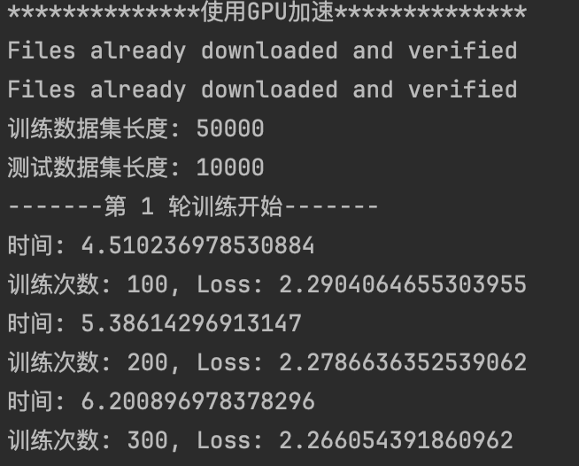
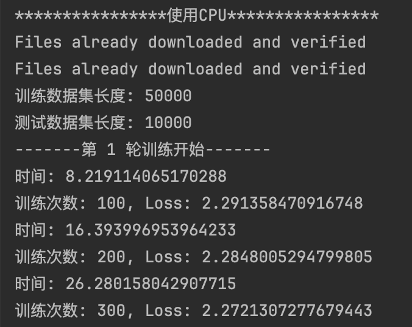

## 8. 模型训练

### 8.1 现有网络模型的使用及修改

我们以 torchvision 为例，通过[官方文档](https://pytorch.org/vision/stable/models.html)查看 torchvision 所拥有的模型，包括用于分类的网络模型，用于语义分割的网络模型，关于目标检测的网络模型。

为了下载 ImageNet 数据集，我们需要通过指令`pip3 install scipy` 来安装 scipy 包，但是这个 ImageNet 这个数据集太大了，不适合用来作演示，所以我们还是使用 CIFAR10。

因 CIFAR10 有10类，而 vgg 默认可以分1000类，所以我们需要对原有的 vgg 模型进行修改，这里可以分为两种方式，第一种方式是直接在后面再添加一个线性层：

```python
vgg16_true.classifier.add_module("add_linear", nn.Linear(1000, 10))
```

第二种方式是把最后一个线性层进行修改

```python
vgg16_false.classifier[6] = nn.Linear(4096, 10)
```

> 8-1-model_pretrained.py

### 8.2 网络模型的保存和读取

保存方法

```python
vgg16 = torchvision.models.vgg16(pretrained=False)
# 保存方式1：不仅保存了网络模型的机构，还保存了网络模型的参数
torch.save(vgg16, 'vgg16_method1.pth')

# 保存方式2：只保存模型参数（官方推荐），因为更加轻便小巧
torch.save(vgg16.state_dict(), 'vgg16_method2.pth')
```

读取方法

```python
# 对应保存方式1
model = torch.load("vgg16_method1.pth")
print(model)

# 对应保存方式2
vgg16 = torchvision.models.vgg16(pretrained=False)
vgg16.load_state_dict(torch.load("vgg16_method2.pth"))
print(vgg16)
```

> 8-2-model_save.py
>
> 8-2-model_load.py

### 8.3 完整的模型训练思路（以 CIFAR10 为例）


我们需要完成如上所示的模型构建，那么我们进行如下代码的书写，然后运行此文件可以进行输出格式的测试。

```python
# model.py
import torch
from torch import nn


# 搭建神经网络
class Howjul(nn.Module):
    def __init__(self):
        super(Howjul, self).__init__()
        self.model = nn.Sequential(
            nn.Conv2d(3, 32, 5, 1, 2),
            nn.MaxPool2d(2),
            nn.Conv2d(32, 32, 5, 1, 2),
            nn.MaxPool2d(2),
            nn.Conv2d(32, 64, 5, 1, 2),
            nn.MaxPool2d(2),
            nn.Flatten(),
            nn.Linear(64*4*4, 64),
            nn.Linear(64, 10)
        )

    def forward(self, x):
        x = self.model(x)
        return x


if __name__ == '__main__':
    howjul = Howjul()
    # 指定 input 为64个样本3通道，长和宽为32x32
    input = torch.ones((64, 3, 32, 32))
    output = howjul(input)
    # 输出应为[64, 10]，64为样本数量，10为类别数目
    print(output.shape)
```

测试完 model 之后，我们进行模型的训练和测试

```python
# 8-3-train.py
import torchvision
from torch import nn
from torch.utils.data import DataLoader
from torch.utils.tensorboard import SummaryWriter

from model import *

# 准备数据集
train_data = torchvision.datasets.CIFAR10("./Dataset", train=True, transform=torchvision.transforms.ToTensor(), download=True)
test_data = torchvision.datasets.CIFAR10("./Dataset", train=False, transform=torchvision.transforms.ToTensor(), download=True)

# length 长度
train_data_size = len(train_data)
test_data_size = len(test_data)
print("训练数据集长度: {}".format(train_data_size))
print("测试数据集长度: {}".format(test_data_size))

# 利用 dataloader 来加载数据集
train_dataloader = DataLoader(train_data, batch_size=64)
test_dataloader = DataLoader(test_data, batch_size=64)

# 创建网络模型
howjul = Howjul()

# 损失函数
loss_fn = nn.CrossEntropyLoss()

# 优化器
learning_rate = 1e-2
optimizer = torch.optim.SGD(howjul.parameters(), lr=learning_rate)

# 设置训练网络的一些参数
# 记录训练次数
total_train_step = 0
# 记录测试次数
total_test_step = 0
# 训练轮数
epoch = 10

# 添加 tensorboard
writer = SummaryWriter("logs_train")

for i in range(epoch):
    print("-------第 {} 轮训练开始-------".format(i+1))

    # 训练步骤
    for data in train_dataloader:
        imgs, labels = data
        outputs = howjul(imgs)
        loss = loss_fn(outputs, labels)

        # 优化器优化模型
        optimizer.zero_grad()
        loss.backward()
        optimizer.step()

        total_train_step += 1
        if total_train_step % 100 == 0:
            print("训练次数: {}, Loss: {}".format(total_train_step, loss.item()))
            writer.add_scalar("train_loss", loss.item(), total_train_step)

    # 测试步骤
    total_test_loss = 0
    # 表示 with 里面的代码没有梯度，保证不会进行参数优化
    with torch.no_grad():
        for data in test_dataloader:
            imgs, labels = data
            outputs = howjul(imgs)
            loss = loss_fn(outputs, labels)
            total_test_loss += loss.item()  # item()可以将一个类型转化为数字
    print("整体测试集上的Loss: {}".format(total_test_loss))
    writer.add_scalar("test_loss", total_test_loss, total_test_step)
    total_test_step += 1

    torch.save(howjul, "howjul_{}.pth".format(i))
    print("模型已保存")

writer.close()
```

我们可以通过 tensorboard 可视化 Loss 下降的曲线。

接下来我们要将输出转化为分类，并进行准确率的判定，首先我们定义某个输出如下所示，也就是第1张图片是第1类的概率为0.1，是第2类的概率为0.2，第2张图片第1类的概率为0.3，是第2类的概率为0.4，由于没有进行归一化，所以概率相加并不为1。

```python
outputs = torch.tensor([[0.1, 0.2],
                        [0.3, 0.4]])
```

接下来，0表示一列一列看选出一列中最大的数值的位置，1表示一行一行看选出一行中最大的数值所在的位置。

```python
print(outputs.argmax(1))  # 输出为[1,1]
```

接下来将输出和目标进行比较，最后打印出对应位置相等的个数，也就是预测正确的个数。

```python
preds = outputs.argmax(1)
targets = torch.tensor([0, 1])
print((preds == targets).sum())
```

那么接下来我们对于原来的流程进行优化，添加对于测试集正确率的计算，可以与之前的代码进行比较。

```python
# 测试步骤
total_test_loss = 0
total_accuracy = 0
# 表示 with 里面的代码没有梯度，保证不会进行参数优化
with torch.no_grad():
    for data in test_dataloader:
        imgs, labels = data
        outputs = howjul(imgs)
        loss = loss_fn(outputs, labels)
        total_test_loss += loss.item()  # item()可以将一个类型转化为数字
        accuracy = (outputs.argmax(1) == labels).sum()
        total_accuracy += accuracy.item()

print("整体测试集上的Loss: {}".format(total_test_loss))
print("整体测试集上的正确率: {}".format(total_accuracy/test_data_size))
writer.add_scalar("test_loss", total_test_loss, total_test_step)
writer.add_scalar("test_accuracy", total_accuracy/test_data_size, total_test_step)
total_test_step += 1
```


预期输出结果如下：

```
Files already downloaded and verified
Files already downloaded and verified
训练数据集长度: 50000
测试数据集长度: 10000
-------第 1 轮训练开始-------
训练次数: 100, Loss: 2.2881598472595215
训练次数: 200, Loss: 2.2874011993408203
训练次数: 300, Loss: 2.2684872150421143
训练次数: 400, Loss: 2.200000524520874
训练次数: 500, Loss: 2.101607322692871
训练次数: 600, Loss: 1.9931621551513672
训练次数: 700, Loss: 2.0327138900756836
整体测试集上的Loss: 320.2647122144699
整体测试集伤的正确率: 0.2716
模型已保存
-------第 2 轮训练开始-------
训练次数: 800, Loss: 1.882991909980774
训练次数: 900, Loss: 1.8687623739242554
```

在训练步骤和测试步骤开始的时候，有时需要添加 `howjul.train()` 和 `howjul.eval()` 。

> 8-3-train.py
>
> model.py
>
> 8-3-test2.py

### 8.4 GPU训练

第一种方式是找到**网络模型、数据（输入和标注）、损失函数**这三个变量，然后调用 `.cuda()` 即可，注意看如下代码。但是如果是 m1 芯片就无法调用该方法，可以放到 google colab 中进行尝试。

```python
import torch
import torchvision
from torch import nn
from torch.utils.data import DataLoader
from torch.utils.tensorboard import SummaryWriter
import time

# 是否使用gpu加速
gpu_on = 0
if gpu_on and torch.cuda.is_available():
    print("**************使用GPU加速**************")
else:
    print("****************使用CPU****************")

# 准备数据集
train_data = torchvision.datasets.CIFAR10("./Dataset", train=True, transform=torchvision.transforms.ToTensor(), download=True)
test_data = torchvision.datasets.CIFAR10("./Dataset", train=False, transform=torchvision.transforms.ToTensor(), download=True)

# length 长度
train_data_size = len(train_data)
test_data_size = len(test_data)
print("训练数据集长度: {}".format(train_data_size))
print("测试数据集长度: {}".format(test_data_size))

# 利用 dataloader 来加载数据集
train_dataloader = DataLoader(train_data, batch_size=64)
test_dataloader = DataLoader(test_data, batch_size=64)


# 创建网络模型
class Howjul(nn.Module):
    def __init__(self):
        super(Howjul, self).__init__()
        self.model = nn.Sequential(
            nn.Conv2d(3, 32, 5, 1, 2),
            nn.MaxPool2d(2),
            nn.Conv2d(32, 32, 5, 1, 2),
            nn.MaxPool2d(2),
            nn.Conv2d(32, 64, 5, 1, 2),
            nn.MaxPool2d(2),
            nn.Flatten(),
            nn.Linear(64*4*4, 64),
            nn.Linear(64, 10)
        )

    def forward(self, x):
        x = self.model(x)
        return x
howjul = Howjul()
if torch.cuda.is_available() and gpu_on:
    howjul = howjul.cuda()

# 损失函数
loss_fn = nn.CrossEntropyLoss()
if torch.cuda.is_available() and gpu_on:
    loss_fn = loss_fn.cuda()

# 优化器
learning_rate = 1e-2
optimizer = torch.optim.SGD(howjul.parameters(), lr=learning_rate)

# 设置训练网络的一些参数
# 记录训练次数
total_train_step = 0
# 记录测试次数
total_test_step = 0
# 训练轮数
epoch = 10

# 添加 tensorboard
writer = SummaryWriter("logs_train")
start_time = time.time()
for i in range(epoch):
    print("-------第 {} 轮训练开始-------".format(i+1))

    # 训练步骤开始
    howjul.train()
    for data in train_dataloader:
        imgs, labels = data
        if torch.cuda.is_available() and gpu_on:
            imgs = imgs.cuda()
            labels = labels.cuda()
        outputs = howjul(imgs)
        loss = loss_fn(outputs, labels)

        # 优化器优化模型
        optimizer.zero_grad()
        loss.backward()
        optimizer.step()

        total_train_step += 1
        if total_train_step % 100 == 0:
            end_time = time.time()
            print("时间: {}".format(end_time - start_time))
            print("训练次数: {}, Loss: {}".format(total_train_step, loss.item()))
            writer.add_scalar("train_loss", loss.item(), total_train_step)

    # 测试步骤开始
    howjul.eval()
    total_test_loss = 0
    total_accuracy = 0
    # 表示 with 里面的代码没有梯度，保证不会进行参数优化
    with torch.no_grad():
        for data in test_dataloader:
            imgs, labels = data
            if torch.cuda.is_available() and gpu_on:
                imgs = imgs.cuda()
                labels = labels.cuda()
            outputs = howjul(imgs)
            loss = loss_fn(outputs, labels)
            total_test_loss += loss.item()  # item()可以将一个类型转化为数字
            accuracy = (outputs.argmax(1) == labels).sum()
            total_accuracy += accuracy.item()

    print("整体测试集上的Loss: {}".format(total_test_loss))
    print("整体测试集上的正确率: {}".format(total_accuracy/test_data_size))
    writer.add_scalar("test_loss", total_test_loss, total_test_step)
    writer.add_scalar("test_accuracy", total_accuracy/test_data_size, total_test_step)
    total_test_step += 1

    torch.save(howjul, "howjul_{}.pth".format(i))
    # torch.save(howjul.state_dict(), "howjul_{}.pth".format(i))
    print("模型已保存")

writer.close()
```

第二种方式是调用 `.to(device)` ，也就是先定义一个设备，然后再对**网络模型、数据（输入和标注）、损失函数**这三个变量调用 `.to(device)` 。这里苹果芯片可以调用 `device = torch.device("mps")` 。

```python
import torch
import torchvision
from torch import nn
from torch.utils.data import DataLoader
from torch.utils.tensorboard import SummaryWriter
import time

# 是否使用gpu加速
gpu_on = 1
if gpu_on and (torch.cuda.is_available() or torch.backends.mps.is_available()):
    print("**************使用GPU加速**************")
    # 定义设备
    device = torch.device("mps" if torch.backends.mps.is_available() else "cuda")
else:
    print("****************使用CPU****************")

# 准备数据集
train_data = torchvision.datasets.CIFAR10("./Dataset", train=True, transform=torchvision.transforms.ToTensor(), download=True)
test_data = torchvision.datasets.CIFAR10("./Dataset", train=False, transform=torchvision.transforms.ToTensor(), download=True)

# length 长度
train_data_size = len(train_data)
test_data_size = len(test_data)
print("训练数据集长度: {}".format(train_data_size))
print("测试数据集长度: {}".format(test_data_size))

# 利用 dataloader 来加载数据集
train_dataloader = DataLoader(train_data, batch_size=64)
test_dataloader = DataLoader(test_data, batch_size=64)


# 创建网络模型
class Howjul(nn.Module):
    def __init__(self):
        super(Howjul, self).__init__()
        self.model = nn.Sequential(
            nn.Conv2d(3, 32, 5, 1, 2),
            nn.MaxPool2d(2),
            nn.Conv2d(32, 32, 5, 1, 2),
            nn.MaxPool2d(2),
            nn.Conv2d(32, 64, 5, 1, 2),
            nn.MaxPool2d(2),
            nn.Flatten(),
            nn.Linear(64*4*4, 64),
            nn.Linear(64, 10)
        )

    def forward(self, x):
        x = self.model(x)
        return x
howjul = Howjul()
howjul.to(device)

# 损失函数
loss_fn = nn.CrossEntropyLoss()
loss_fn.to(device)

# 优化器
learning_rate = 1e-2
optimizer = torch.optim.SGD(howjul.parameters(), lr=learning_rate)

# 设置训练网络的一些参数
# 记录训练次数
total_train_step = 0
# 记录测试次数
total_test_step = 0
# 训练轮数
epoch = 10

# 添加 tensorboard
writer = SummaryWriter("logs_train")
start_time = time.time()
for i in range(epoch):
    print("-------第 {} 轮训练开始-------".format(i+1))

    # 训练步骤开始
    howjul.train()
    for data in train_dataloader:
        imgs, labels = data
        imgs = imgs.to(device)
        labels = labels.to(device)
        outputs = howjul(imgs)
        loss = loss_fn(outputs, labels)

        # 优化器优化模型
        optimizer.zero_grad()
        loss.backward()
        optimizer.step()

        total_train_step += 1
        if total_train_step % 100 == 0:
            end_time = time.time()
            print("时间: {}".format(end_time - start_time))
            print("训练次数: {}, Loss: {}".format(total_train_step, loss.item()))
            writer.add_scalar("train_loss", loss.item(), total_train_step)

    # 测试步骤开始
    howjul.eval()
    total_test_loss = 0
    total_accuracy = 0
    # 表示 with 里面的代码没有梯度，保证不会进行参数优化
    with torch.no_grad():
        for data in test_dataloader:
            imgs, labels = data
            imgs = imgs.to(device)
            labels = labels.to(device)
            outputs = howjul(imgs)
            loss = loss_fn(outputs, labels)
            total_test_loss += loss.item()  # item()可以将一个类型转化为数字
            accuracy = (outputs.argmax(1) == labels).sum()
            total_accuracy += accuracy.item()

    print("整体测试集上的Loss: {}".format(total_test_loss))
    print("整体测试集上的正确率: {}".format(total_accuracy/test_data_size))
    writer.add_scalar("test_loss", total_test_loss, total_test_step)
    writer.add_scalar("test_accuracy", total_accuracy/test_data_size, total_test_step)
    total_test_step += 1

    torch.save(howjul, "howjul_{}.pth".format(i))
    # torch.save(howjul.state_dict(), "howjul_{}.pth".format(i))
    print("模型已保存")

writer.close()
```

结果展示：可以看到使用GPU可以在速度上有明显的提升。





> 8-4-train_gpu_1.py
>
> 8-4-train_gpu_2.py

### 8.5 完整的模型验证思路

其实就是利用已经训练好的模型，然后给他提供输入，注意，使用 gpu 训练出来的模型不能使用 `torch.load("xxx.pth")` 来运行。需要添加参数 `torch.load("xxx.pth", map_location=torch.device("cpu"))`。具体的思路可以看[B站土堆教程](https://www.bilibili.com/video/BV1hE411t7RN?p=32&vd_source=42c86408cc4dbfc276d7f1c599a9d974)。

```python
import torch
import torchvision
from PIL import Image
from torch import nn

image_path = "Dataset/train/ants_image/0013035.jpg"
image = Image.open(image_path)
print(image)

# 如果是png格式的图片是四通道
image = image.convert("RGB")

transform = torchvision.transforms.Compose([torchvision.transforms.Resize((32, 32)),
                                            torchvision.transforms.ToTensor()])

image = transform(image)
print(image.shape)


class Howjul(nn.Module):
    def __init__(self):
        super(Howjul, self).__init__()
        self.model = nn.Sequential(
            nn.Conv2d(3, 32, 5, 1, 2),
            nn.MaxPool2d(2),
            nn.Conv2d(32, 32, 5, 1, 2),
            nn.MaxPool2d(2),
            nn.Conv2d(32, 64, 5, 1, 2),
            nn.MaxPool2d(2),
            nn.Flatten(),
            nn.Linear(64*4*4, 64),
            nn.Linear(64, 10)
        )

    def forward(self, x):
        x = self.model(x)
        return x


model = torch.load('howjul_0.pth')
print(model)

image = torch.reshape(image, (1, 3, 32, 32))
model.eval()
with torch.no_grad():
    output = model(image)
print(output)

print(output.argmax(1))
```

> 8-5-test.py

### 8.6 看看开源项目

[土堆教程](https://www.bilibili.com/video/BV1hE411t7RN?p=33&vd_source=42c86408cc4dbfc276d7f1c599a9d974)

> 参考：B站土堆教程


