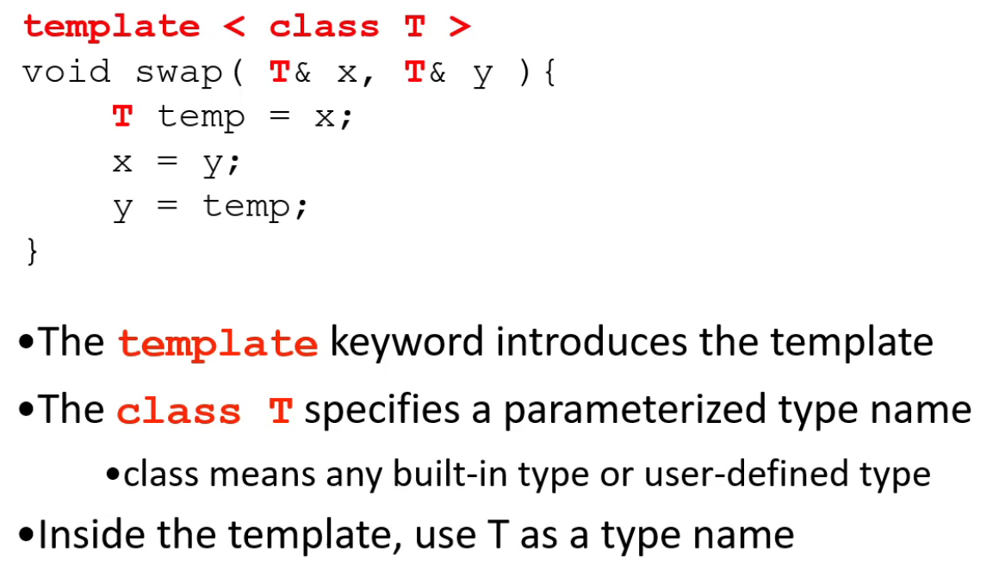
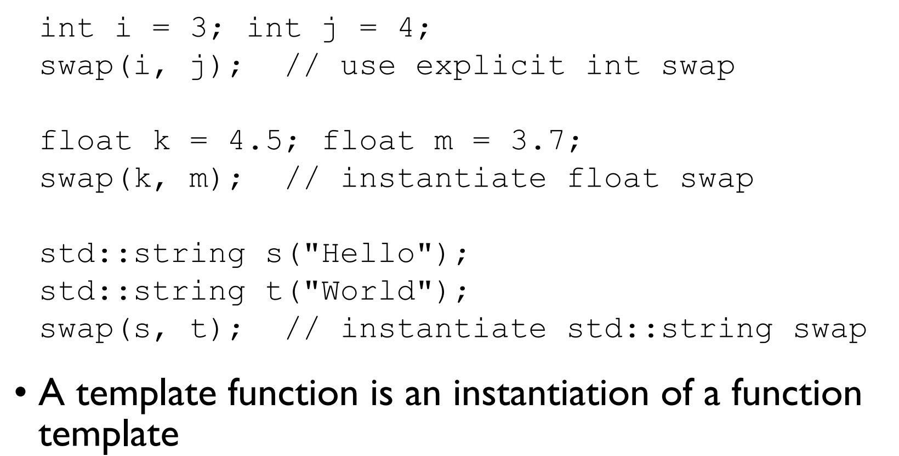
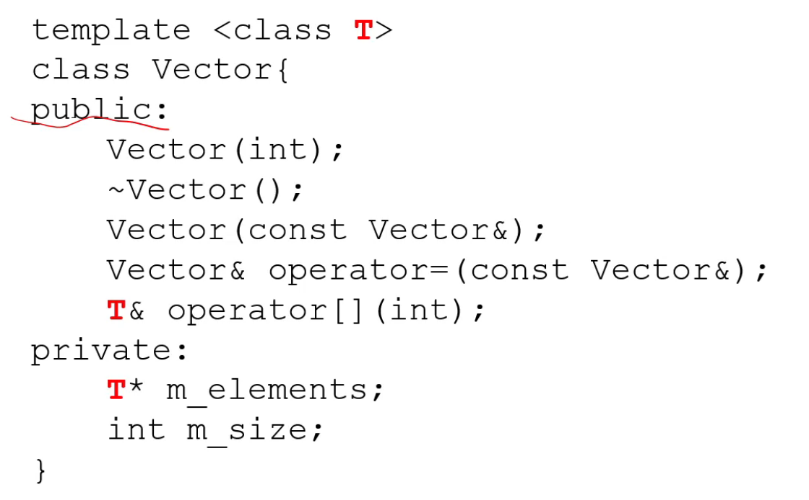
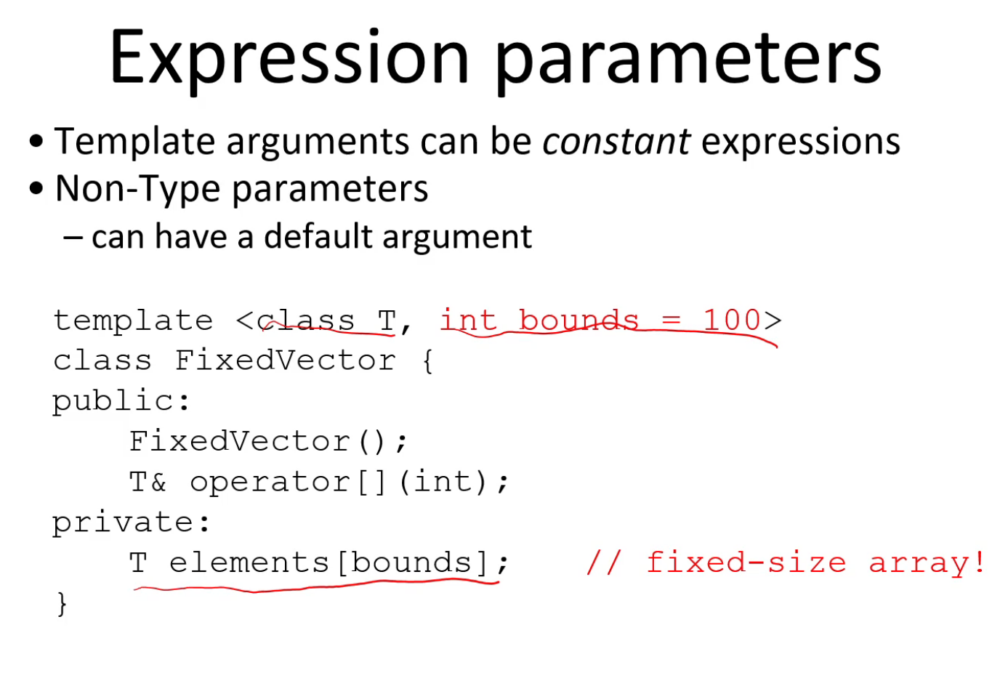
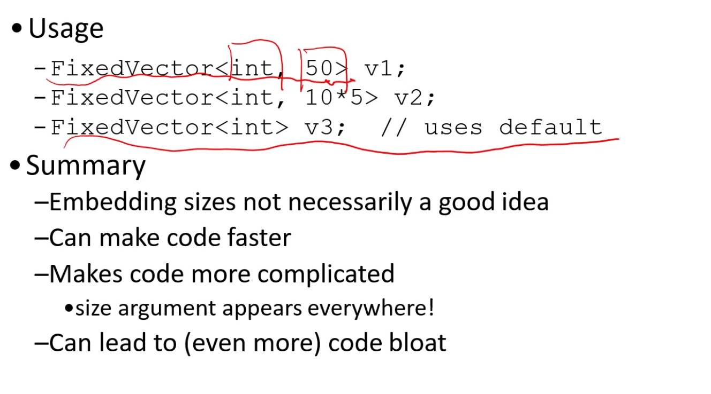
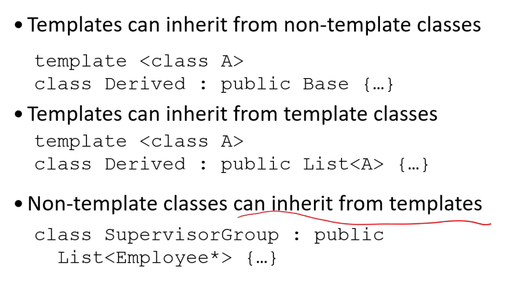
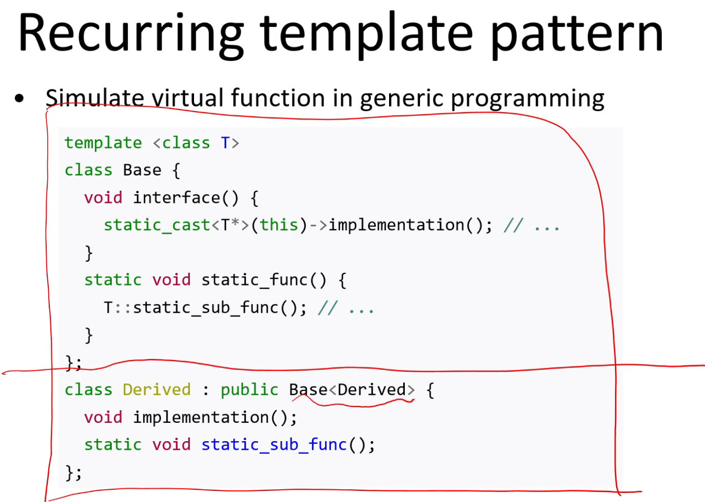
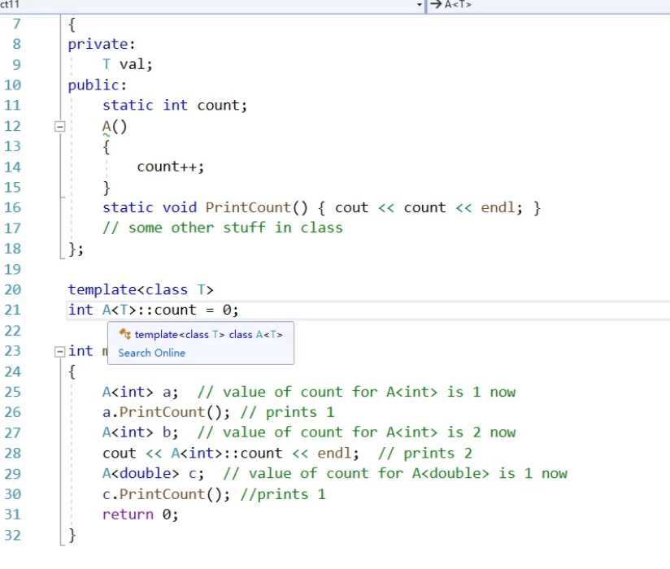

### 1. Templates
#### 1.1 Function templates

以下只是声明

- T 可以定义表示：
  - 函数参数类型；
  - 函数返回类型；
  - 定义函数内部的变量；

#### 1.2 Template instantiation(模版实例化)

- Types are substituted into template
- New body of function or class definition is created（syntax errors, type checking）
- Specialization -- a version of a template for a 

**模版函数是一个实例化的函数模版**

#### 1.3 函数选择

- 函数选择上，先找完全符合的函数定义，再找能对应上的函数模版；
- 如果都没有，再找隐式转化后的函数定义；（函数模版对隐式类型转换较为严苛，函数模版不让进行隐式类型转换）
- tips：如果小数，默认是double，如果要是float，要在后面加f；
- 如果没有参数的情况，可能要进行指定；

#### 1.4 Class templates

- Templates can use multiple types；
- 可以嵌套；
- 类型可以非常复杂；

#### 1.5 Templats and inhertance

用子类来实例化父类，用模版来实现虚函数；

#### 1.6 一些比较难的东西

和静态变量的一些组合；

