### 1. Copy ctor
#### 1.1 函数返回的拷贝构造
- 如果不优化的话会拷贝两次：
    - 第一次是发生在return的地方，把本地的对象拷贝到预留的空间里；
    - 第二次把预留空间里的对象拷贝到你要承接的main函数中的本地变量中；

### 2. 运算符重载

#### 2.1 运算符

- 可以重载的运算符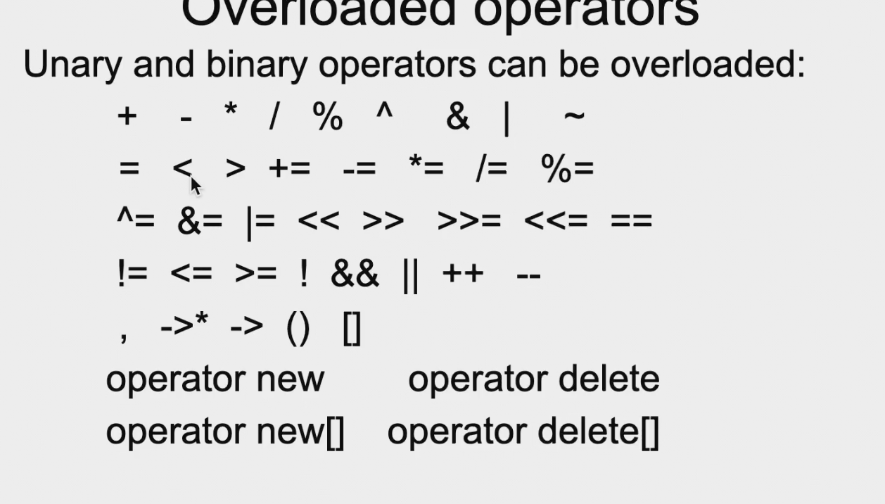
- 不能重载的运算符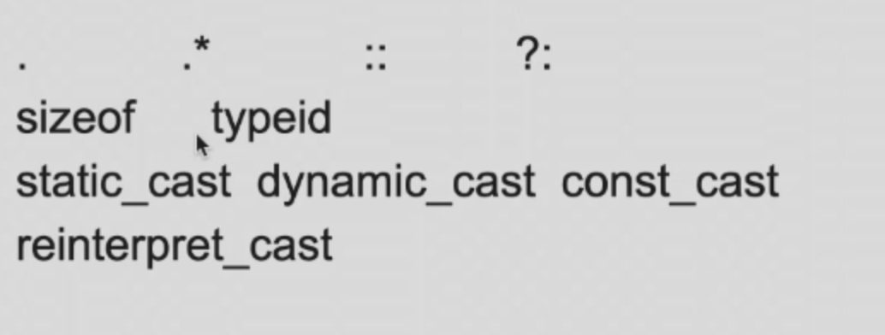

#### 2.2 要求与限制

- 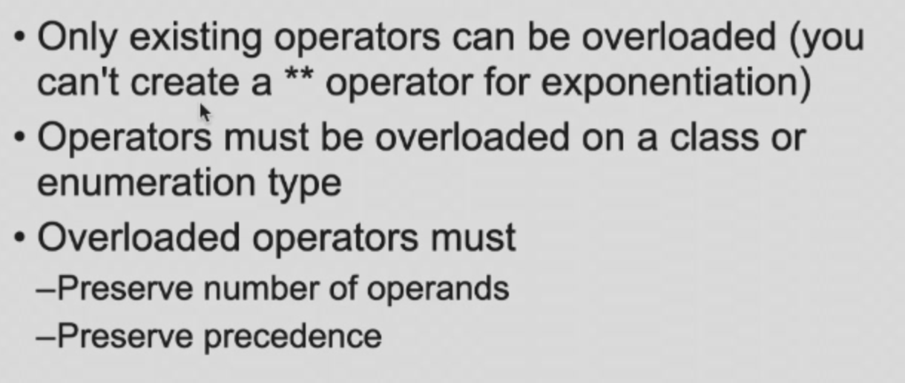

#### 2.3 写法

- 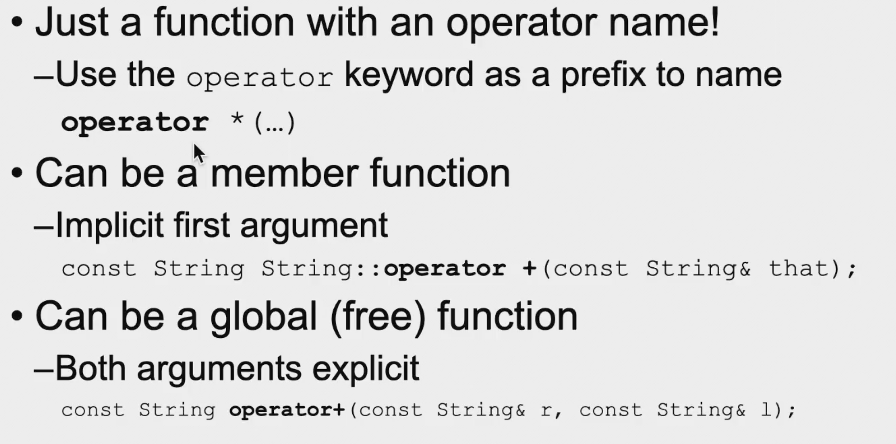

##### member function

- 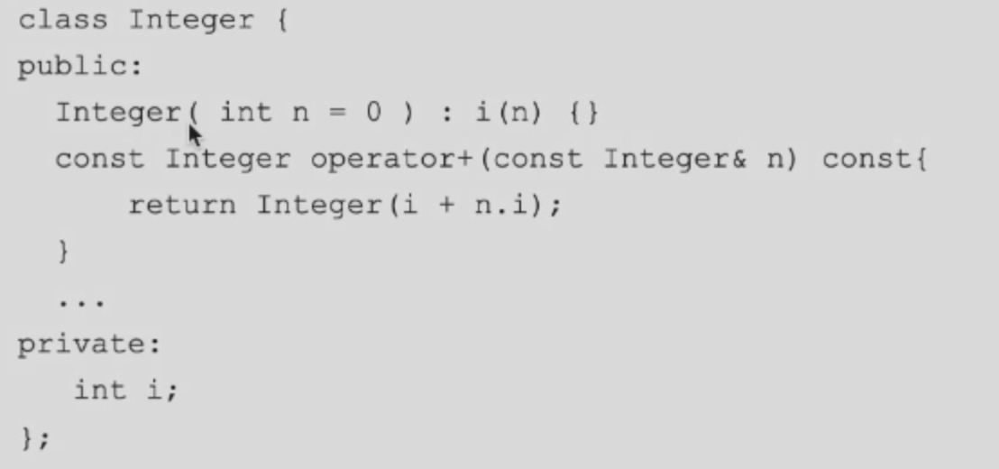
- z = 3 + y 就不行，因为这样就不存在receiver了；

- 双目运算符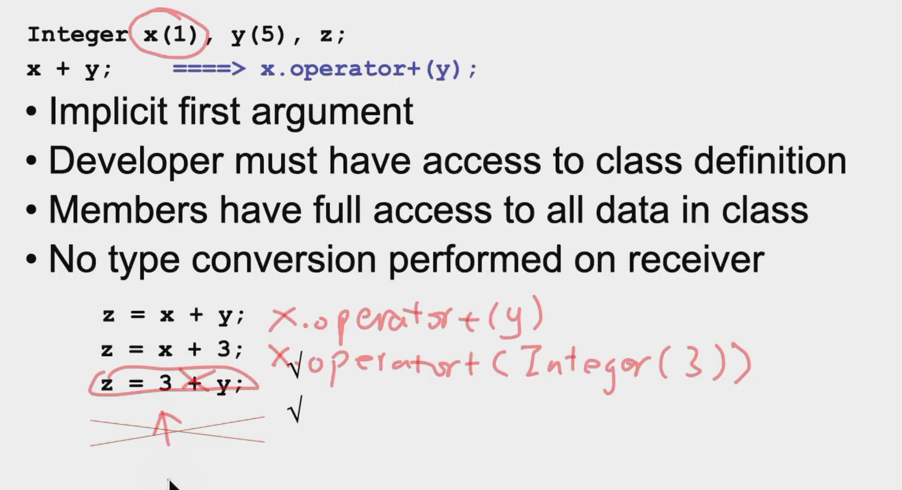
- 单目运算符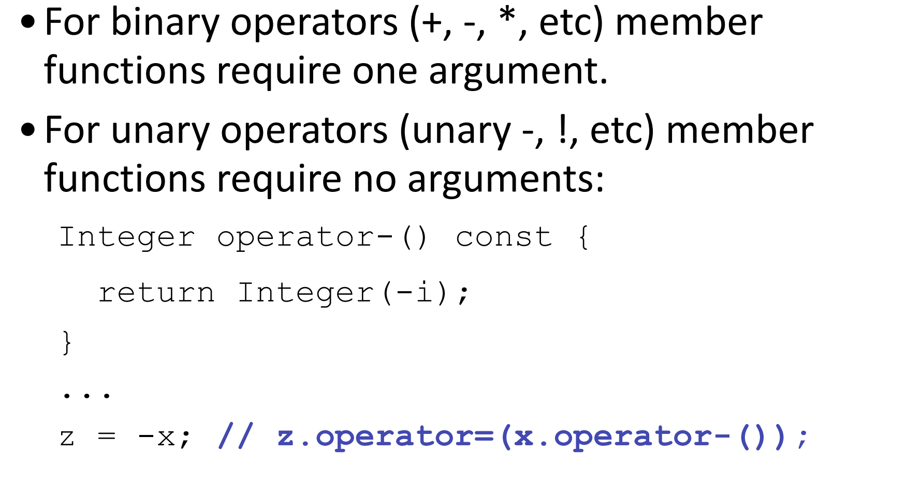

##### global function

- 

- 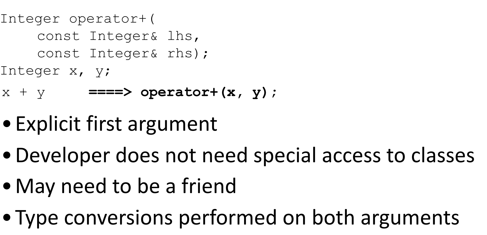

- 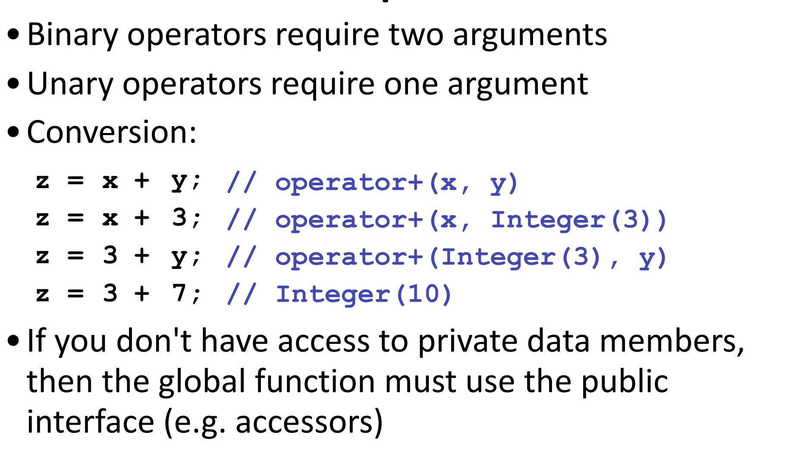

#### 2.4 选择

- 单目运算符成员函数，

- 双目作为非成员（设置为友元函数）；
- 

#### 2.5 一些注意事项

- 如果运算符不会修改运算数，那么传进来的引用是const，作为成员函数也是const；即除了跟赋值相关的，还有两个流运算符，其他都要加const；

- 运算符结果应该返回一个const对象，逻辑运算符则返回bool；

#### 2.6 一些样板

##### 正常的

- 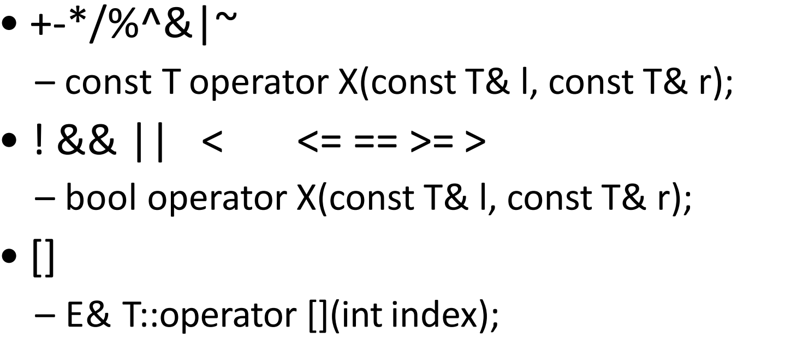

##### 自增自减

- 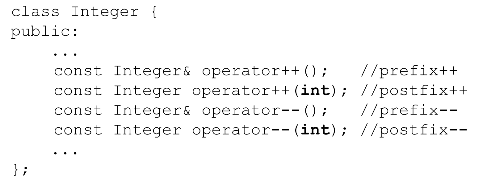

- 

- 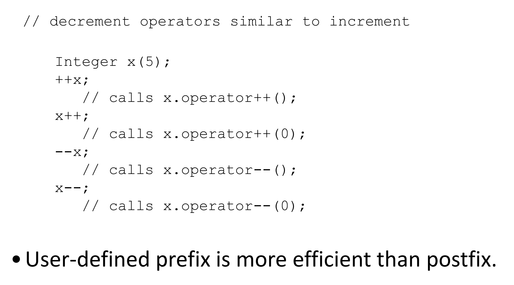

##### 关系运算符

- 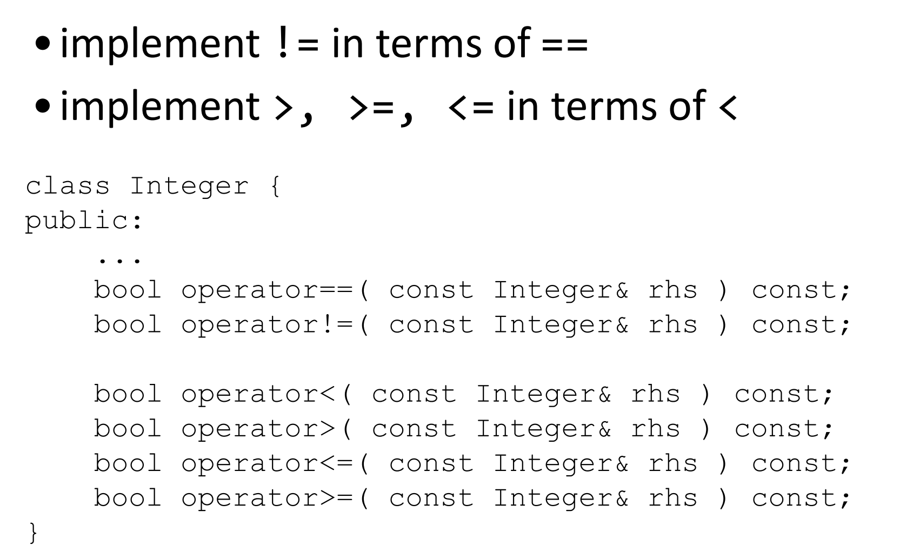

- 互相调用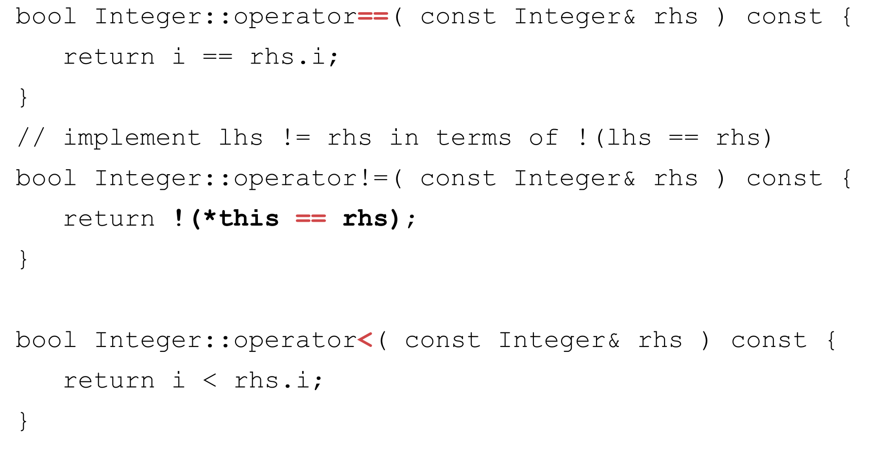

  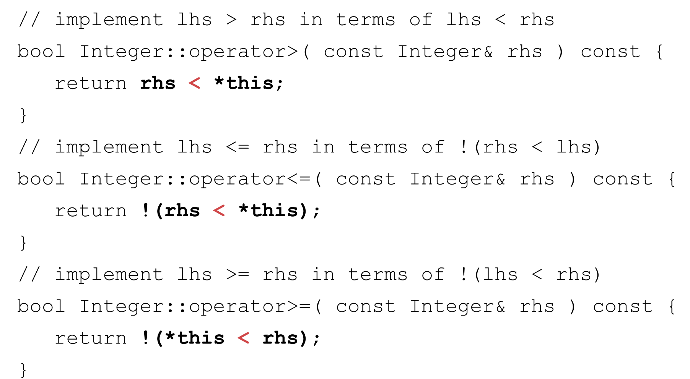

##### []

- 

- 参数类型不一定是整数，返回值是整数；

