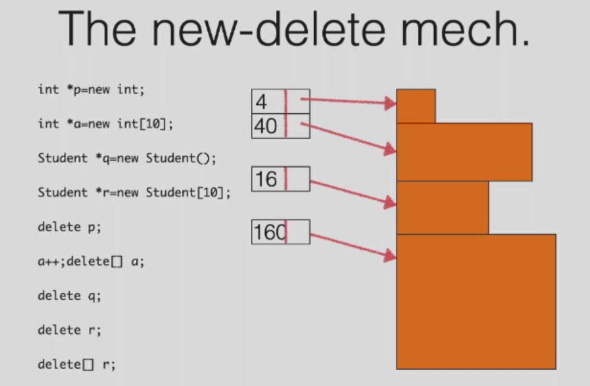
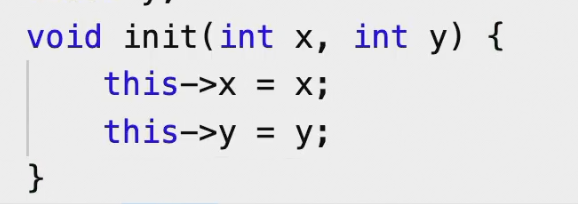

```toc
```

#### 初始化
​		全局变量有确定值，比如int就是0；

​		与全局变量相对的是本地变量，本地变量没有初始值，内存里是什么就是什么；

​		但是如果是一个类，比如string，由默认构造函数初始化；
#### 动态内存分配
​		new、delete 是运算符，和加减乘除地位相同；

​		对于对象来说，new 和 malloc 不一样，new 会调用构造函数进行初始化；和 delete 相对， delete 会调用析构函数；



​		delete 只是把那一块从表中取出，其实内存中没变，所以如果 a++，再 delete 则会异常；

​		如果是对象，则 delete 先调用析构函数，再去表中取出；

​	delete 空指针没有关系，对于 new 来说内存不够不会返回 NULL ，只是会抛出异常；

#### 引用
1. 定义一个引用必须要绑定，声明不需要；
2. 一经绑定，不能解绑；
3. 


4. 指针不能指向引用，但是引用可以引用指针；引用不能用数组，但是数组可以被引用；

#### class
##### ::resolver

单单的两个::，表示不属于任何人，表示是自由的；


##### this

自己给自己赋值；


给成员变量赋值；



#### 面向对象
数据是别人所不能直接接触到的，只能提供接口；
