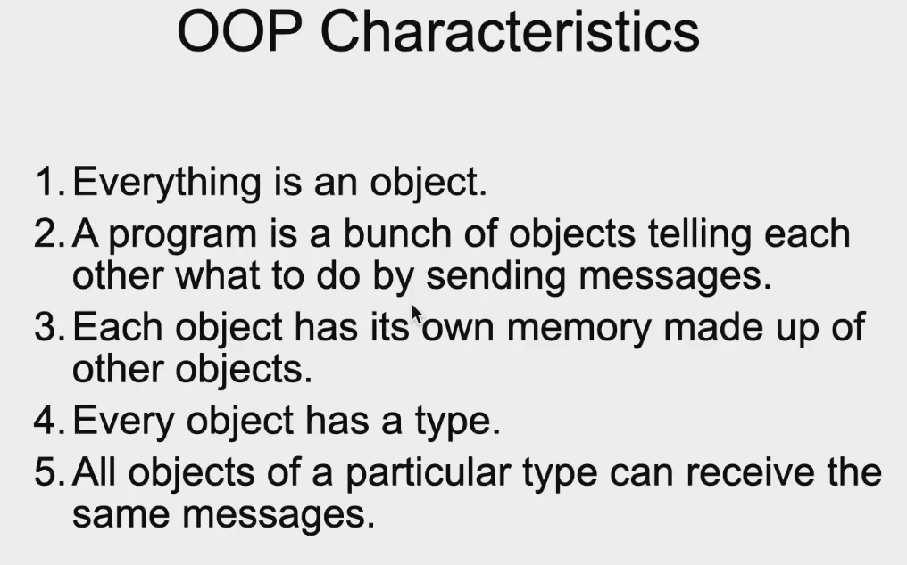
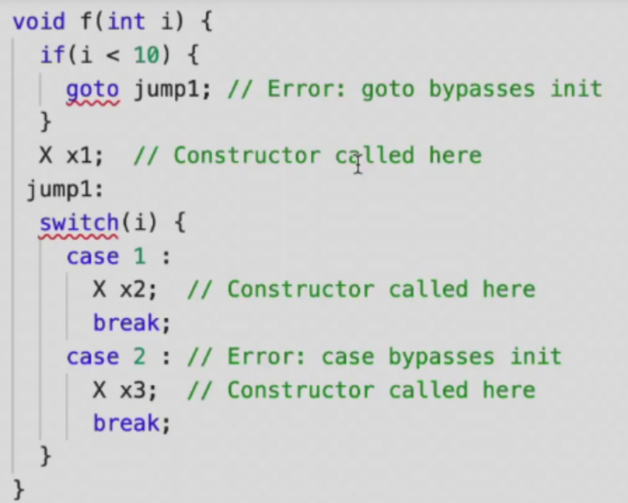

#### 面向对象

第五点，其实反向更加重要，能够接收相同的message的对象是同个类型的；

#### constructor
没有返回类型，和类同名；

构造函数是初始化函数，是在分配空间之后进行的，对象已经存在了；

有构造函数，必须用构造函数初始化，没有构造函数，并且成员变量是public，才能像结构那样初始化；

The default constructor是自己写的无参的默认构造函数，而不是系统给的默认构造函数；

比如上图的这三种情况，如果构造函数已经有了，而且没有定义默认构造函数，那这样写是错的；

#### destructor
发生在对象空间回收之前，先构造的后析构；

###### 例子

只要进了函数，x1的空间就有了，但是跳过了X x1导致构造函数没有被调用，所以报错；

#### Definition of a class
所以应该有三个文件，类的声明一个文件，类的定义一个文件，main单独一个文件；

