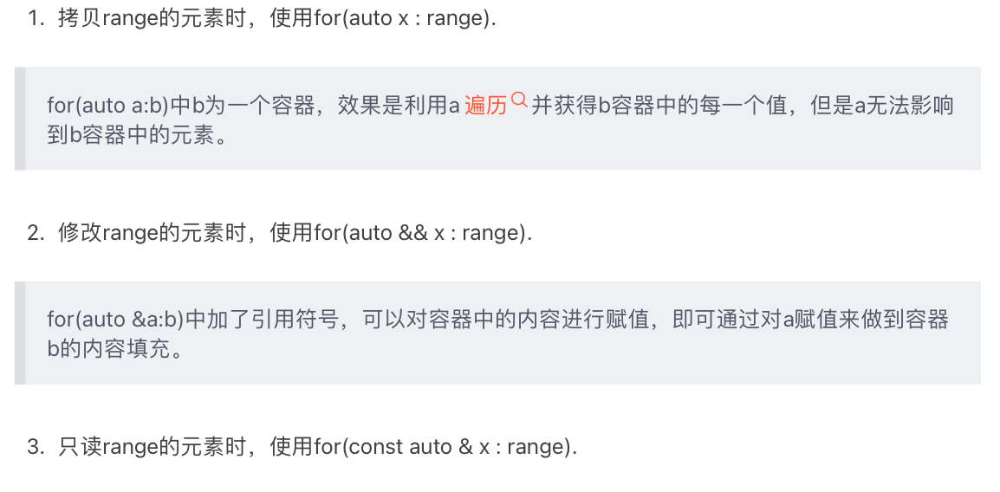
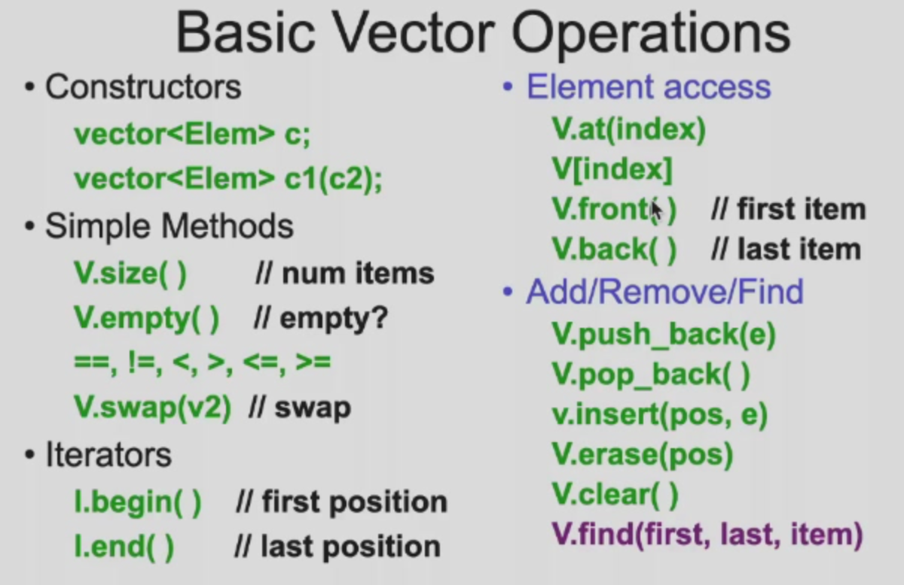
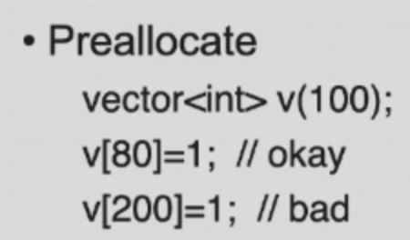
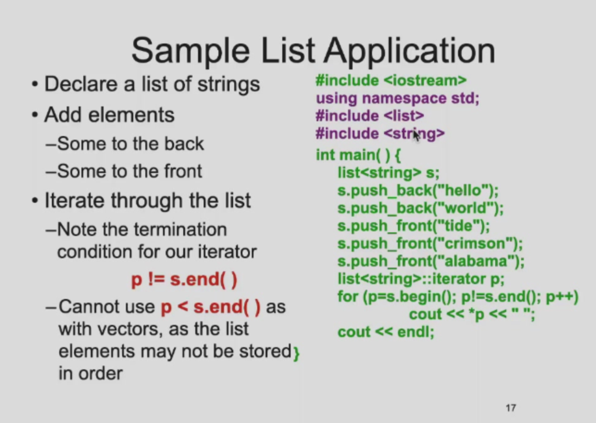
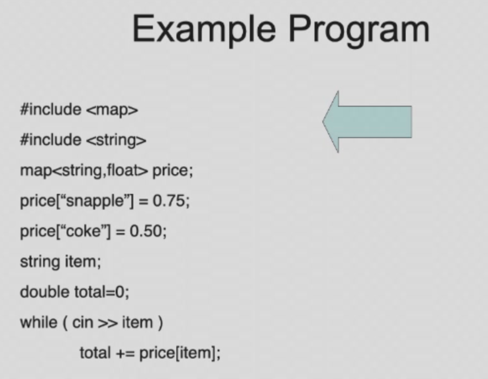
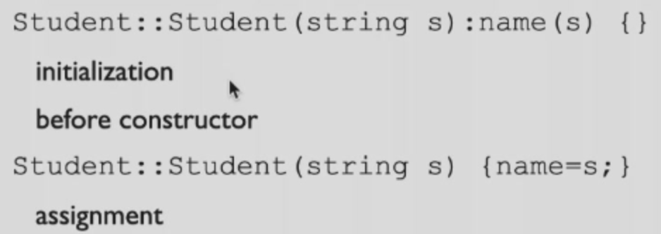

#### 超纲写法
`for(auto k : x)`

#### Basic Vector Operations

- insert 和 erase 是用 iterator 来使用的；
- V.at(index) 和 V[index] 是一样的，而且会在越界时抛出异常；

#### 一些特殊操作

- 将对象放入对象容器中，对象容器中的对象其实只是clone，改变原来的对象并不能改变容器中的对象；

- 不通过 push_back 或者 insert 而扩展的内存不一定是有效的，比如直接赋值，他不会报错，但是不会算在 size() 里面；

- 也可以直接给vector指定大小；

#### List

- 相比于vector可以两边进行插入删除，但是迭代器不能用大于小于；

#### Map

### Object Interactive
- 本地变量：生存期和作用域都是本函数；
- 静态本地变量：生存期是程序运行就在，作用域还是函数本身；
- 成员变量：作用域是类内部，生存期是跟着对象；

#### Initialization vs. assignment

####  Function overloading

别忘了自动类型转换，会往复杂的走；

上文前三个都报错；

如果把 short 改成 int ，那么只有第三个报错，因为第一个会自动转化，第二个刚刚好，第三个虽然是long，但是实际的数值可以放入int，产生歧义；

#### 默认参数

默认参数不能写在函数定义的地方！！，只能写在函数声明的地方； 

函数自己不知道自己有默认值，只是编译器骗了函数；

#### C++ access control

public

private

protected

#### Friends

Friend 的声明必须放在授权方的大括号里面！！要写在对象的声明里面；

#### class vs. struct

唯一的区别就是class默认private，而struct默认public；