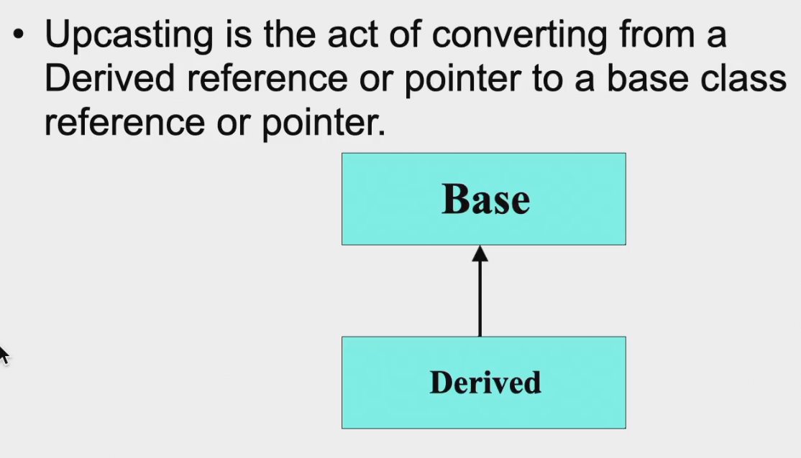
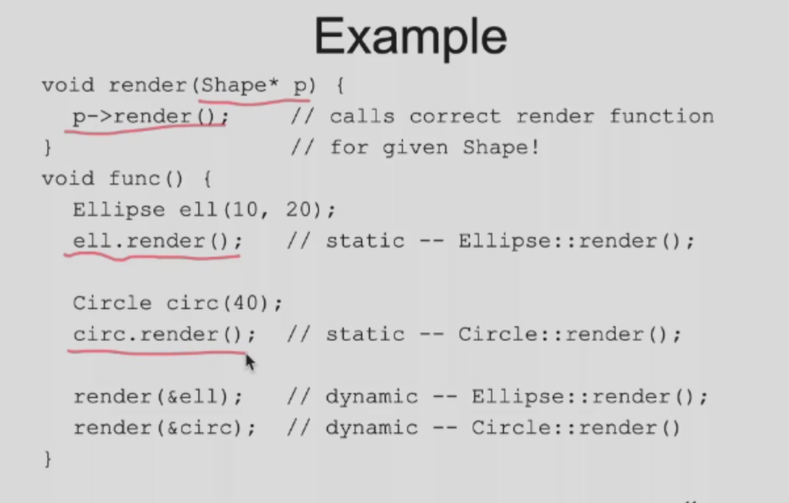
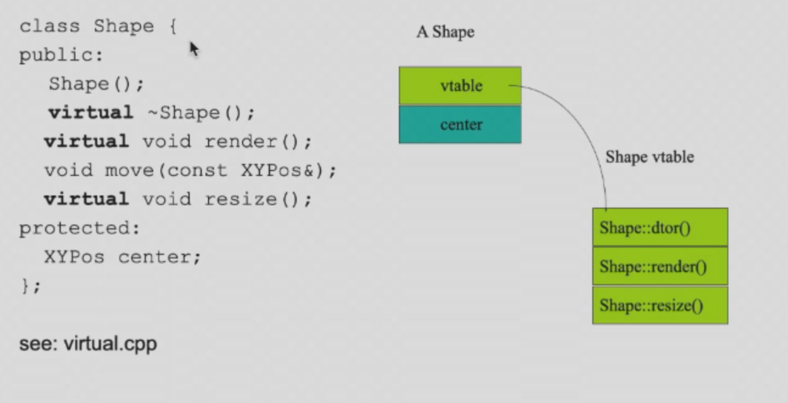

```toc
```
### 1. Inheritrnce
- 父类public的东西，子类也是public；父类protected的东西，子类变成了private；
- protected的东西只能被子类访问；
- 子类在初始化的时候，先调用父类构造函数进行初始化（很可能有private，只能由父类构造函数初始化）；
- 子类对象里面第一个部分是父类的对象；
- 如果是private继承，那么父类所有的public到子类也变成了private，那就不是oop意义上的继承了；

### 2. Polymorphism 多态

#### 2.1 Up-casting

- 把指向子类 对象的指针，指向父类对象；把子类对象引用绑定给父类对象；
- ps: sizeof在编译的时候就进行了计算；



#### 2.2 使用

- virtual 关键字，告诉编译器，这个函数子类可能存在override（覆盖）的版本；
- 看如下图，Shape星 p叫做**多态变量**，有两个类型，Shape星 就是他的声明类型（也叫做静态类型），动态类型就可能是任意的子类中的某个；



#### 2.3 发生条件（重要！czp讲的）

1. Upcast: take an object  of the derived class as an object of the base one.
2. Dynamic binding: 前面要加virtual.

总结：只要是通过基类指针或基类引用调用虚函数的语句，一定是多态，一定会查表；

#### 2.4 实现方法



- 一旦一个类里面有virtual，那么存储空间的前八个字节就会存放一个指针，指向vtable；
- 针对这个东西，老师讲了一个神奇的例子，就是在构造函数里面，使用这种虚函数，这时候虚函数调用的是这个构造函数所在的类，因为那个vtable是构造函数执行的时候，编译器放进去的；
- 一旦构造出来后，vtable就不会变了，也不会通过别的对象的赋值来改变；