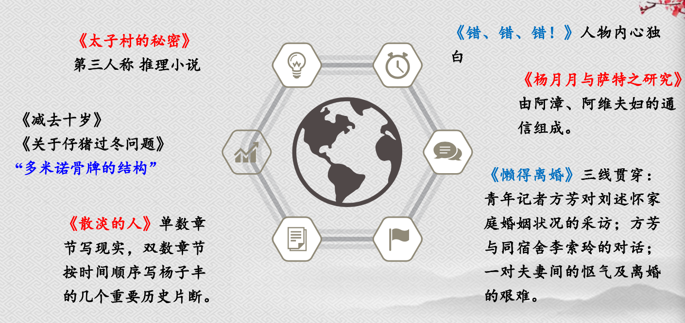

### 一、谌容简介
七十年代开始写小说，《万年青》《光明与黑暗》《永远是春天》；1980年发表中篇小说《人到中年》，通过对眼科医生陆文婷的生活的工作的表现，反映了知识分子的境遇和追求，引起了强烈的反响；

### 二、谌容的创作分期
- **20世纪70年代创作初期**：《万年青》（江春旺 黄光 “包产到户”）、《光明与黑暗》（第一部）、《永远是春天》；
- **20世纪80年代前期创作成熟期**：《人到中年》《太子村的秘密》《真真假假》《散淡的人》《奔向未来》（把人的悲喜剧放在一定的历史范畴，探索决定人物命运的历史渊源，写出揭示更深刻、更本质的历史面貌的作品。）；
- **20世纪80年代中后期、90年代及以后创作上的变化期**：《减去十岁》《懒得离婚》《死河》《天伦之乐》；
- 一以贯之的是对社会人生的关注，反映社会矛盾和社会热点；

### 三、作品介绍

#### 《人到中年》

##### 1. 写作背景与主体思想

“文革”结束后，**中年知识分子的境遇**成为中国社会的一个普遍问题。谌容在作品中较早地反映了这个问题，开拓了文学创作的主题。

通过中年眼科女医生陆文婷极低的生活待遇和因长年超负荷运转导致心肌梗塞几近死亡的悲剧，以及她周围一些处境相似的知识分子的遭际，揭示知识分子的生存窘况，围绕落实知识分子政策提出了尖锐的社会问题。

##### 2. 人物塑造

陆文婷无私奉献、谦抑克己，是一位**物质极度匮乏而精神却无比富有、平凡而又高尚**的知识分子形象，涵括了一代中年知识分子的共同遭遇，具有深刻的思想价值和社会意义。

##### 3. 结构特点

《人到中年》以陆文婷突发的病情为经线，以其18年的生活为纬线，将她病危时恍惚中的意识活动与抢救过程中的现实活动穿插并行，运用时序颠倒、空间跳跃的意识流手法，将传统的情节结构与意识流的心理结构有机统一。

#### 《减去十岁》

- “时间焦虑”急切心态
- “情绪把握上欠妥当”
- “换了一个极小的角度来重新反思‘文革’......借助对过去的批判来颂扬今天生活的美好，是一曲有点特别的现实赞歌......对否定“文革”这一公众心理的迎合。”
