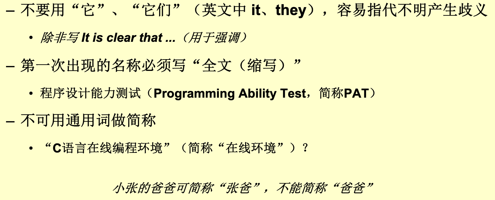
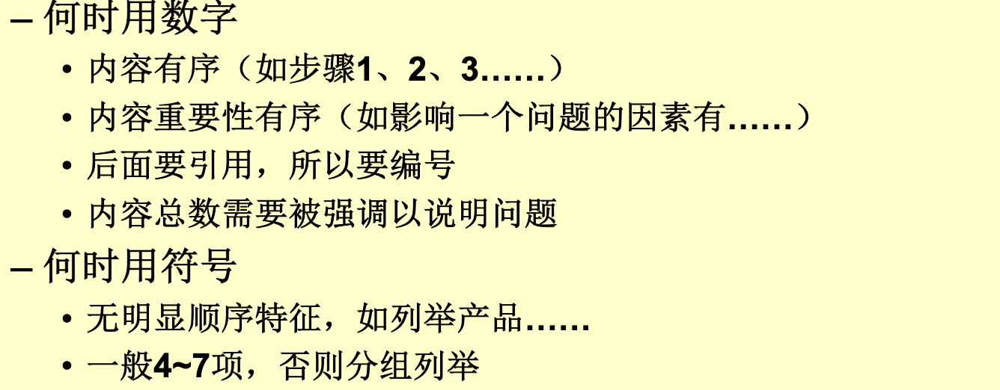
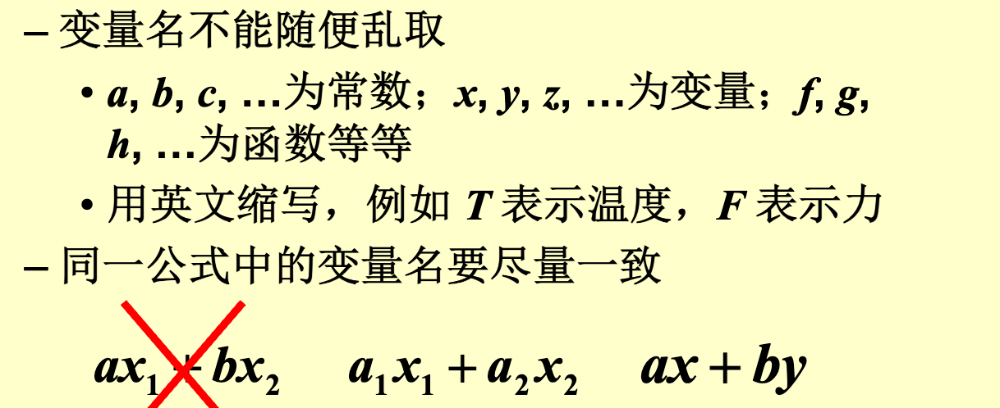
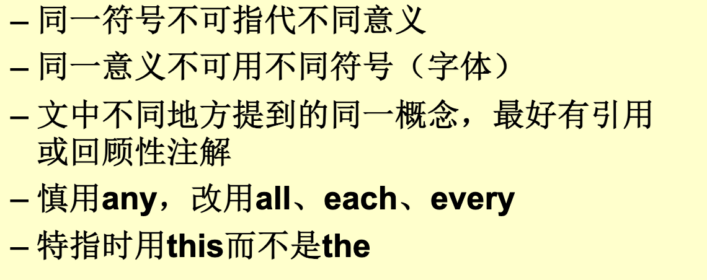
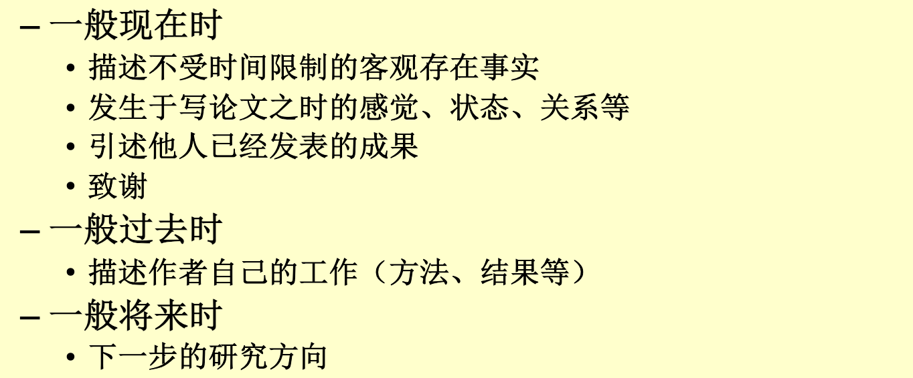
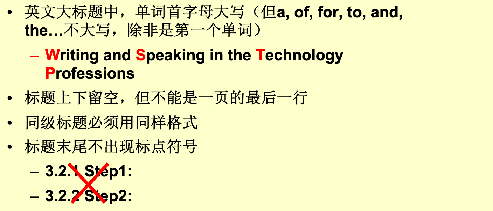
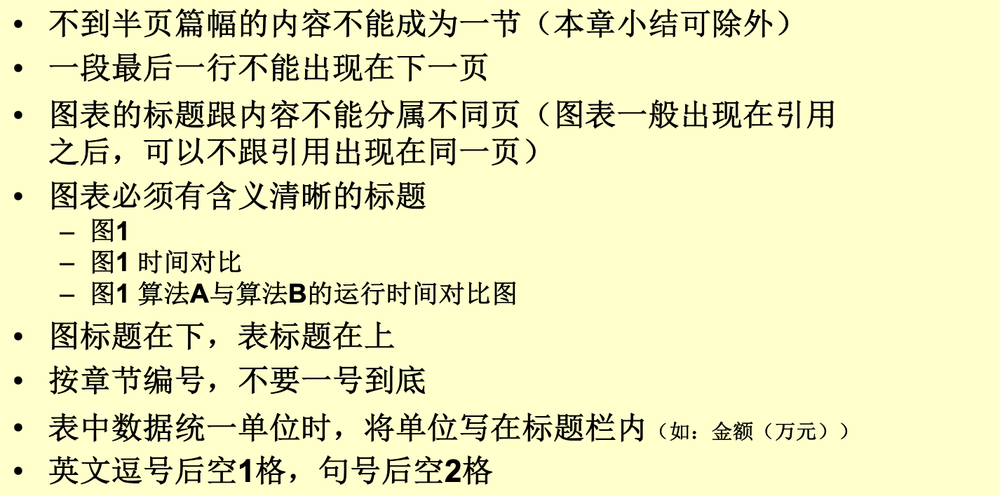
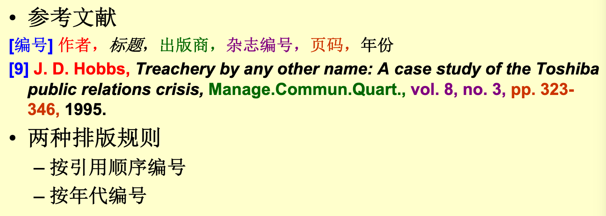

### 内容组织

**基本原则**

- 架子必须先搭对
- 同一章节里填入紧密相关的内容

**动手写之前问自己几个问题**

- 到底想写什么？*常见问题：没啥可写；或想写得太多*
- 写给谁看？*常见问题：外行看不懂，内行嫌啰嗦*
- 逻辑顺序怎样比较顺？*常见问题：按自己工作的顺序写，不是按读者理解的顺序写*

**一段一话题（a single story），应该包含**

- 简短的开场白一开宗明义
- 一段话引导出下面的讨论
- 重点内容
- 围绕主题展开论证
- 给定论+给解释
- 结论性结尾
- Make a point！

**不得不切分时，下一段开头要显示与上一段的关系**（On the other hand... At the mean time...使用这些作为开头时，表示还在论证上一段的论点）

**只有一句话不能成为一段**

---

Spring框架例子：
（*需要有明确的观点*）Spring是一个开源框架，它由Rod Johnson 创建，是为了解决企业应用开发的复杂性而创建的（*两个“创建”*）。Spring的用途不仅限于服务器端的开发，~~从简单性、可测试性和松耦合的角度而言~~（*简单性、可测试性和松耦合不是看问题的角度，而是Spring本身的特性*），~~任何Java应用都可以从Spring中受益~~（*汉语没有这种说法*）。因为Spring有简单性、可测试性和松耦合特点，所以任何Java应用都可以使用Spring。

好的内容组织：观点证据结论观点证据结论如此递归重复

---

**引述为先**：写文章要有意义，而写出有意义的文章，不仅需要阐明论题，更需要点明在回应哪一场更广泛的对话，你已经加入了一场对话，要及时解释自己在回应什么。

> 最近，许多计算机科学家认为...
> 现在人们经常忽视...
> Y和Z最近尖锐批评了...,理由是...

**开宗明义**：提出中心论点不应太晚，开篇先简要总结要回应的意见，之后再详细展开。

> **“标准”观点：**
>
> 中国人一贯认为…（人定胜天）
> 传统观点认为…
> 常识告诉我们…
> 关于X的标准看法是…
> 常言道…
> 在我的一生中，我经常听到这样一种说法：你大概会认为…
> 许多人认定…

> **以你说为他说**
>
> 我一直以为
> 我小的时候认为
> 虽然我现在应该有了更多的了解，但是我还是不禁会认为我既认为，又相信

> **引入争议**
>
> 在讨论…的问题中，一个争议点是…。虽然有些人认为…，但也有人提出…，甚至有人认为…。我自己的观点是…
>
> 关于…这个主题，大多数人认为…。但是，共识之外是…这个问题。有些人坚信…，其他人则认为…

> **回顾句**
>
> 如前所述，我的结论是，…的支持者不能同时保留两方面主张。他们宣称…，但他们的另一个主张…是与其矛盾的

> **他认为：归纳之术**
>
> 归纳他人论点是基本写作技法之一，有效地归纳他人说过的话很重要（错误1：针对主题自行发挥，不提及其他论点和内容；错误2：只知道归纳，没有自己的声音）
>
> 好的归纳要在引述和聚焦之间求得平衡

---

> 课内讨论9：试就“三星期成为大数据领域专家”这个命题的可行性作出分析

---

### 语法修辞

- 科学论文论文必须客观

- 科学论文必须严谨：不要用“有趣”、“很好”、“较多”、“好很多”……

- 不可默认“他”（he），该用“读者”（readers）、“人们”（people，one）

- 注意文字的可读性：
  - 提高句子的内聚性，一句话只说一件事
  - 
  - 
  - 函数名：用特殊字体来写函数名，或者加双引号，对于函数是否在名字后面加括号，看具体情况，如果你是想指明特定的某几个参数的函数，那么带括号和参数，如果你想指的是全部的重载函数，那么不加。
  - 第三人称：最好使用第三人称而不用第二人称（祈使句)。

- 列表：能使用列表就使用列表。对于工作可以细粒度的划分，在目录中占据较大的篇幅。整个列表最好不要超过一页。

- 数学相关

  - 
  - 

  - the虽然是定惯词，但是比如the cat还可以指代猫这类动物，所以最好使用this

  - 最好不要使用拉丁。use "also known as" instead of "aka", use "that is" or "to be specific" instead of "i.e.", use "for example" instead of "e.g.", and use "in other words" or "namely" instead of "viz." 

- 英文论文常用时态

  - 
  - 

### 排版惯例

> 科技写作中，可以使用英文标点来写中文。

---

> 课内讨论10：给定某学长毕业论文第一版，请列出其存在的问题

---

### 邮件礼节

- 给不熟的人发邮件
  - 标题必须完整、准确，但不要把内容全写标题里！
  - 抬头有尊称，结尾要署名！初次联系一定留下自己身份和联系方式
  - 收件人和抄送人要区分对待，甚至收件人中的顺序、抄送人中的顺序有时候也要讲究
- 合理使用回复、抄送和转发
  - 相同一个主题，多使用引用、转发、回复（便于识别、检索、回忆，避免新开一个邮件）
  - 不同的主题，千万不要为了省下输入收件人的方便（或者多位收件人、转发人、抄送人），直接用回复或者转发

---

> 个人作业3：文档评审2

---

