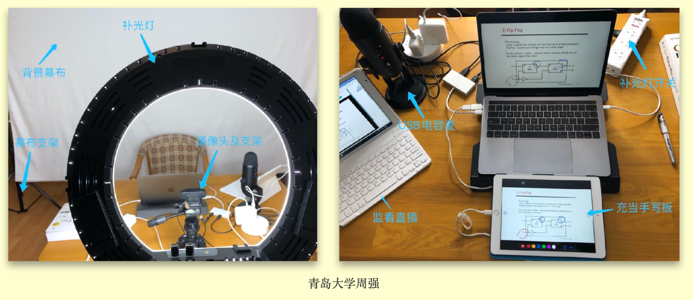
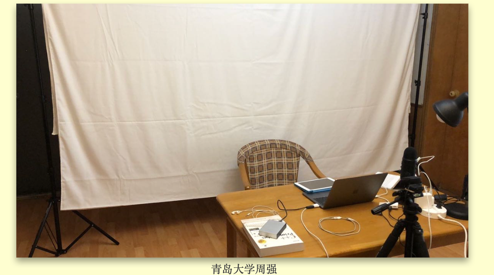
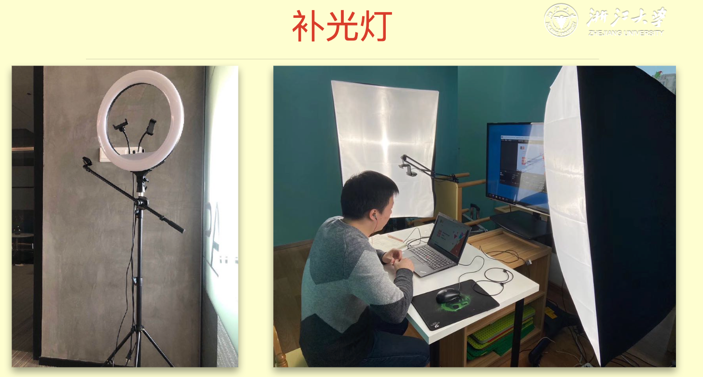
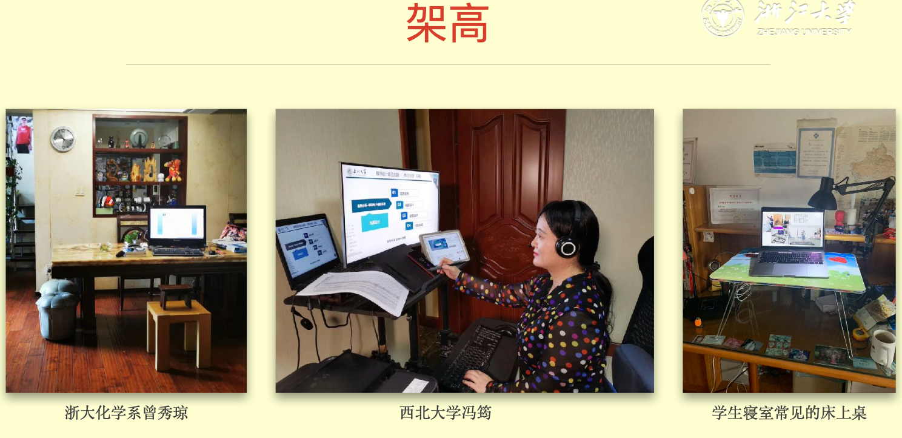
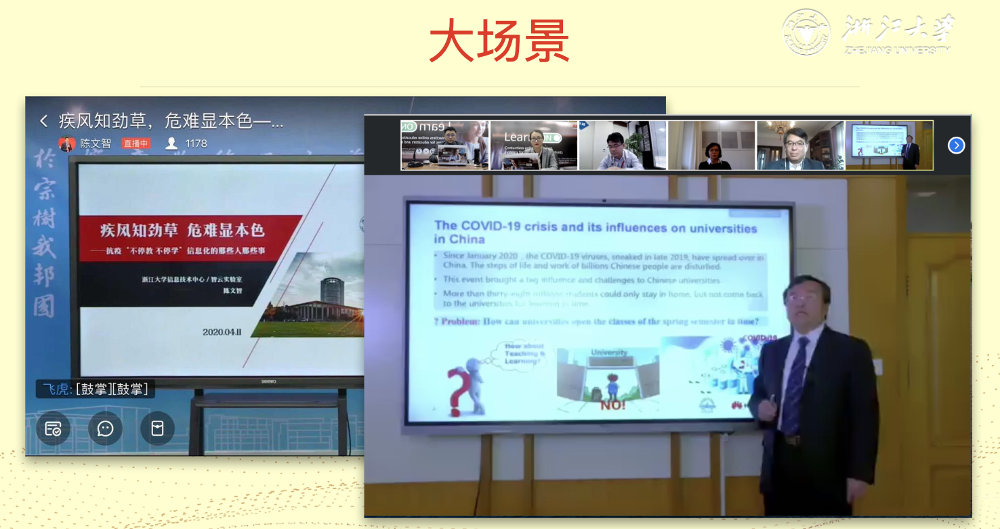
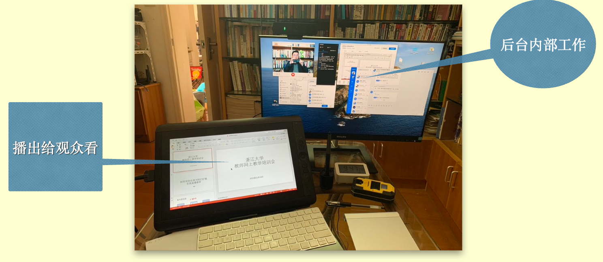
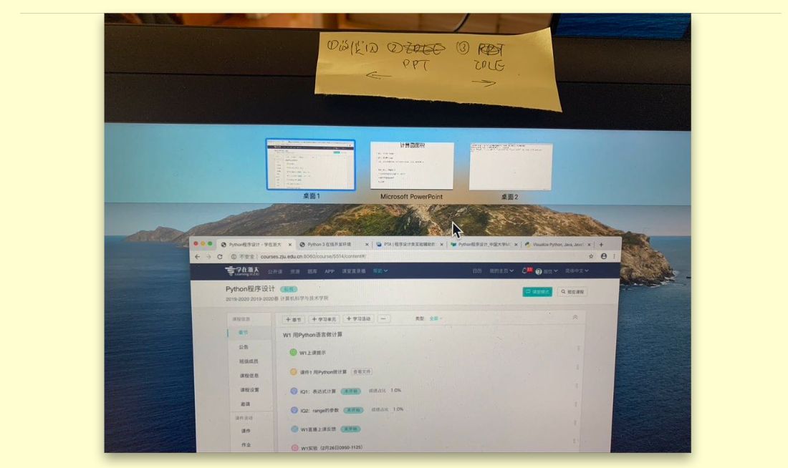

## 演讲的基本技巧

### 1 流程控制

#### 1.1 内容筛选

长报告易，短报告难

要点：讲故事，讲听众想听的话

- 45分钟报告：讲重点内容，讲故事、举例子、讲证明，引导出结论。
- 20分钟报告：讲重点内容，举例少而精，直接给出结论。
- 10分钟报告：重点内容都要提到，讲最亮点，一句话结论。
- 毕业答辩（10分钟）：讲干货，不讲背景；讲方案，不讲细节；展示实验图表，不展示数据。
    - 我的工作是在哪里完成的，主要是为了解决什么问题
    - 工作分哪几块内容，其中哪部分是重点，哪里是难点
    - 每一块展开介绍。简单的模块一句带过。重点部分讲使用的技术、算法。讲关键点（如果不讲就等于什么都没做的内容，是关键内容）
    - 最后展示实验结果

#### 1.2 时间规划

**按内容划分**

- 全部内容分类
- 每部分内容用多少时间（一般平均一页ppt一分钟）
- 例如毕业答辩：开场白30s，工作内容概况1min，重要模块1-2个每个3-4min，实验结果展示1-2分钟，总结与展望30s

**按时间划分**

- 长报告：时间进行到一半的时候应该讲到哪里，当还剩下10min时候应该讲到哪里
- 10分钟报告：每分钟要讲完多少内容
    - 正式用时一般会比排练用时短
    - 毕业答辩练习到12分钟讲完为宜

#### 1.3 节奏设计

- 不要在开场讲重要的事情
- 每10分钟以内设计一次变节奏
    - 简单停顿
    - 语速、语气突变
    - 互动提问：毕业答辩时不要问老师，任何答辩都不要问评审
    - 幽默搞笑

#### 1.4 回答问题

- 报告前尽可能预设问题，准备好回答
- 埋伏问题：但不要埋没了亮点
- 面对不友好的问题
    - 务必保持礼貌
    - 淡定客观，简短回答
    - 迅速将注意力转向其他广大听众
- 听不清楚、不确定的问题
    - 先重复，再回答
    - 回答后问“不只是否回答了您的问题”
    - 太纠结的问题台下沟通
- 不知为不知
    - 回去考虑一下再回答

### * 演讲技巧

- 根据观众做设计
- 讲故事不喊口号
- 50分钟和30分钟的演讲的不同
- 如何调整节奏（时间过半，内容过半）

---

> 讨论题14：分析演讲中存在的问题

---

### * 参加线上会议/演讲

> 器材、姿势、桌面

#### 想好参会的形态

- 电脑屏幕为主（ppt、软件操作）还是人像为主？
- 板书的比例/重要性大吗？
- 坐着讲还是站着讲？
- 不同的形态决定了场地、器材和直播模式

#### 器材

- 有笔记本电脑，电脑有摄像头和话筒，就够了
- 可以加：外接的话筒、摄像头、手写板
- 最好能用一块平板或手机来检查自己的输出
- 摄像头
    - 笔记本屏幕的观看的⻆度和摄像头的拍摄⻆度未必一致（把笔记本架高站立讲课或放低埋头讲课都OK）
    - 更需要注意的是光线，平时看书打字的光线对于摄像头可能是糟糕的，要保证脸部的均匀照明
    - 适合自己工作的位置未必是适合直播的位置
        - 你的背后是什么？小房间比大房间好！
        - 背景不好？挂块床单！
        - 其实小头像里看不清楚细节
    - 不要开美颜
    - 
    - 
    - 
    - 
    - 

- 光线
    - 人工光线好于自然光线
    - 绝对避免背光
    - 灯光应从高处打下来，避免眼镜反光
    - 最好多个光源
- 不需要操作电脑的，也可以用三脚架高架外接的摄像头，用遥控器（鼠标/激光笔）翻ppt的⻚
- 话筒
    - 小房间的话，笔记本自带的话筒足够好了
    - 如果上课过程有较多的敲键盘的动作，或者房间太大，需要用外接的话筒
        - 或者是外接的键盘，把笔记本放在一个有缓冲的东西上面，比如垫几本书
    - 领夹话筒很好，但是不建议戴耳麦
        - 戴着耳机讲话不适应，而且长时间难受，可以挂在脖子上不戴上耳朵
        - 不要直接对着话筒讲话（吐气）
    - 自己监视直播情况的iPad或手机在开始直播后不要发出声音，耳机也不要出声，会造成回声
- 回声
    - 避免光滑墙壁，书、窗帘都很好用，必要时挂布
    - 话筒尽量靠近嘴，不超过50cm，必要时用领夹
        - 太近的话筒会录进呼吸声
        - 直播画面中出现话筒没有问题
    - 不要头戴耳机讲课没
        - 经过训练戴耳机说话声音会变化
        - 有的耳机在说话时会和皮肤摩擦发出声音
- 手写板
    - 带有触屏的笔记本电脑，如Surface Pro
    - macOS用USB连接iPad，用QuickTime的影片录制功能，可以将iPad上的屏幕投到电脑屏幕上
    - 用手写板起到替代鼠标的作用（用笔在板上写，眼睛看屏幕）
    - 直接在ppt播放界面上书写
    - 或开一个绘图软件（如Windows自带的画笔）
  
- 电脑桌面
    - 注意清理电脑桌面，不要给观众看到不必要的东西，关闭不必要的软件
    - ppt宜采用浅底色、等线字体，最好能改成宽屏16:9的，右上角留白
    - 屏幕分辨率适当降一些，如采用720p而不是屏幕的原始分辨率
    - 演示软件操作时尽量做局部放大动作
- 多屏幕
- 两个显示器
    - 用小显示器直播，因为直播不需要很高分辨率 （720p够了）
    - 用大显示器工作，顺便把摄像头架在大显示器上
    - 如果大显示器上显示的是ppt的备注，那么看着大显示器上的备注，正好就是对着摄像头，观众看过来，就是你眼睛盯着他在看
- 多屏幕切换
- 注意安全
    - 直播过程中尽量不打开网页，因为很多网页会出现不可测的内容
    - 不要使用有很多弹窗的浏览器
    - 不要一开机就开始直播，因为很多弹窗都是在开机后几分钟内出现
    - 将自己电脑桌面清理干净，不要放跟会议无关的文件和软件
    - 会议内容提前拷贝到桌面或者在桌面建快捷方式
    - 如果用到视频或者音频播放器，提前清理播放列表或历史播放记录
    - 会议前退出不必要的聊天软件等
    - 如果有条件，用一台新的不安装非必要软件的电脑参会
- 同学建群测试

### 2 仪态与肢体语言

#### 2.1 衣着、气质与开场白

- 衣着得体（有领子）
- 气质自信，面带微笑
- 开讲前把器材环境调整到最舒适的状态（不要对着话筒吹气和“喂喂喂”）
- 做好应急准备

---

- 开场白：问候全场听众
    - 目光接触：我的报告将对您产生意义
    - 微笑:我是善意友好的
    - 问候:你们能正常听到我的声音吧？

#### 2.2 声音

- 音量控制
- 语速控制（重要：有起伏和节奏变化）
- 让听众听到你的唇动（看不到嘴唇+语速很快=听不懂）

#### 2.3 肢体语言

> 抱西瓜和切西瓜

- 表情
- 手势
    - 开放邀请的姿态
    - 不要指小屏幕
    - 不要指点听众
- 身体移动
    - 与表达的内容一致
    - 不要乱摇晃、频繁来回走动，不要神经质动作
    - 不要站死不动
- 引导听众视线（注意力）
    - 不要朗诵投影的文字内容
- 保持目光接触
    - 照顾到某个角落
    - 不要长时间盯着一个人
- 不同国家的肢体语言不同，出国演讲最好问问有没有禁忌

#### 2.4 情绪

- 紧张（不要在台上念书面稿）
- 幽默感

---

>小组作业：开题答辩

---
