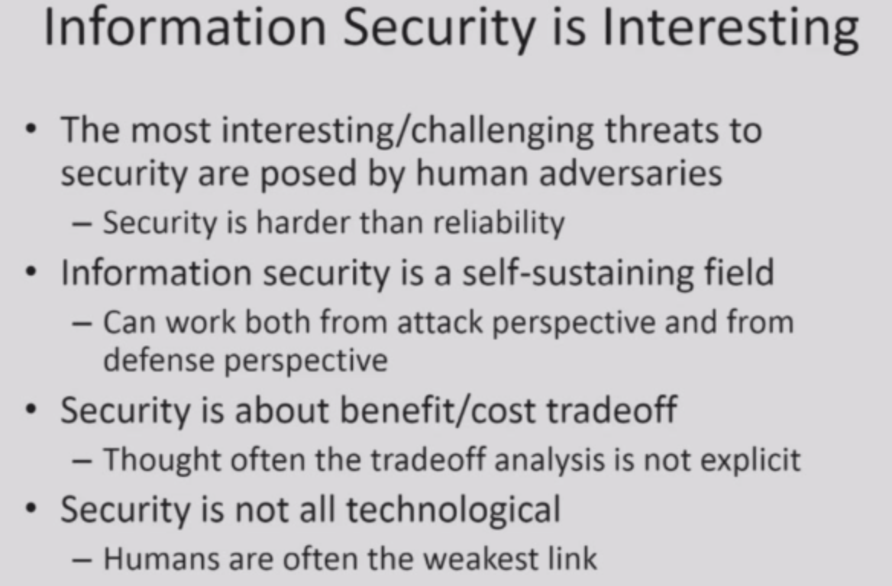
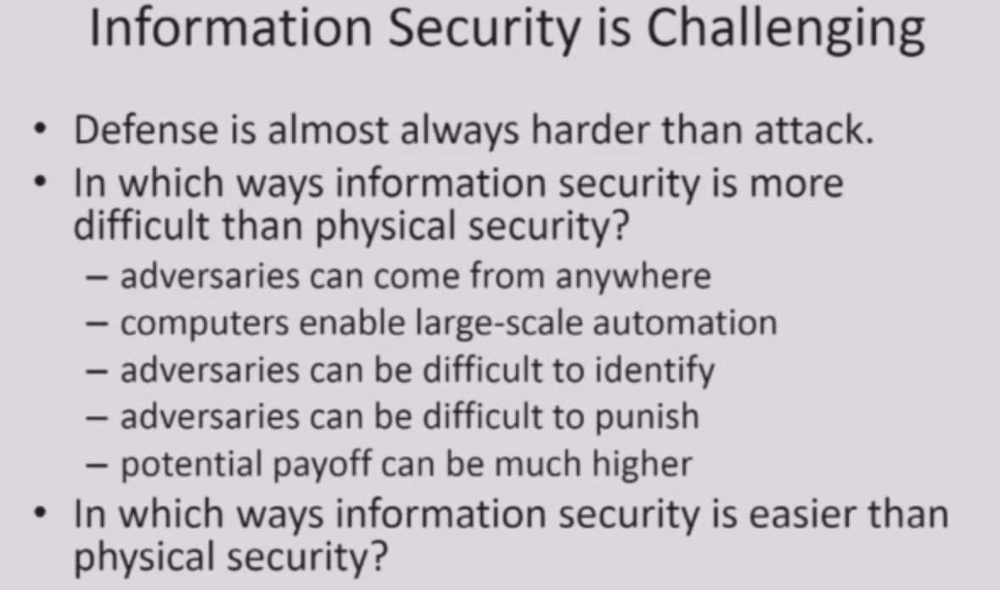

#### Topics

- Access control：访问控制，首先你拿不到；

- Using crypto for data protextion：对数据进行加密或进行模糊处理；

    - 就算是拿到了，也得不到数据；

    - 会造成性能上的损失；

- Data privacy；

#### What is Information(Computer) Security

- **Security** = 保护desireble properties在intelligent adversaries的攻击之下；
    - Desirable properties：了解需要哪些properties；
    - Intelligent adversaries：需要了解/模拟对手，始终考虑对手。

- **安全的目标或性质**：机密性（Confidentiality，没授权的人不能用）、完整性（Integrity）、可用性（Availability，授权的人一定能用）。

- **隐私**：首先需要统一一个主体，才能进行一些解释。一旦主体被确定后，别人通过普通手段不能访问，只能自己访问。
- **安全不是最重要的**：现实中要以可用性为主，所以设计的原则是尽量保证高效性。
- 
- 物理安全比信息安全成本更大，消耗更多；

### Access Control

访问控制是普遍的，不管在硬件还是软件层面（应用，数据库，OS）上；

**原则**：

1. Economy of mechanism，设计的越简单越便宜越好；
2. Fail-safe defaults：默认选项是不能被访问的；
3. Complete mediation：每次访问都必须监测访问权限；
4. Open design：算法被知道没关系，只要密钥没有被泄露，就不会暴露；
5. Sepeation of privilege：权限分离，细化更多的锁。比如浙大的系统只需要一个用户密码全部可以访问，不太安全；
6. Least privilege：最小权限，每个程序和每个用户都应该使用完成作业所需的最少权限进行操作；
7. Least common mechanism：最大限度地减少多个用户通用且所有用户都依赖的机制数量；
8. Psychological acceptability：心理可接受性，其实就是可用性。人机界面的设计应便于使用，用户对其保护目标的心理形象应与机制相匹配。
