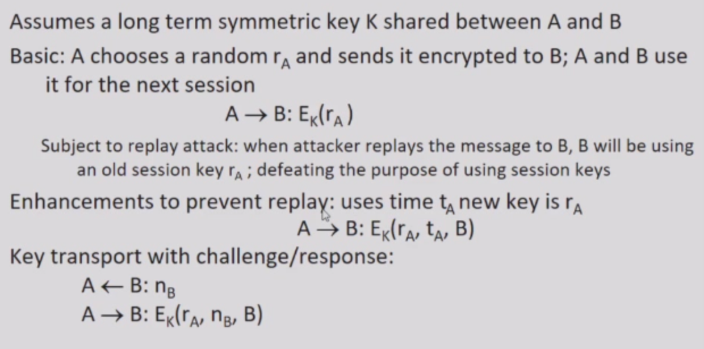
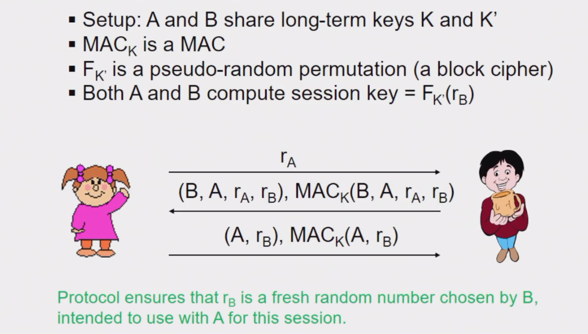
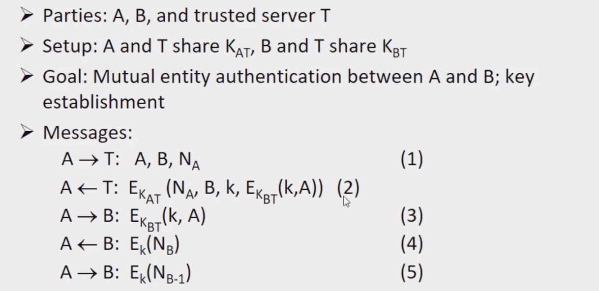
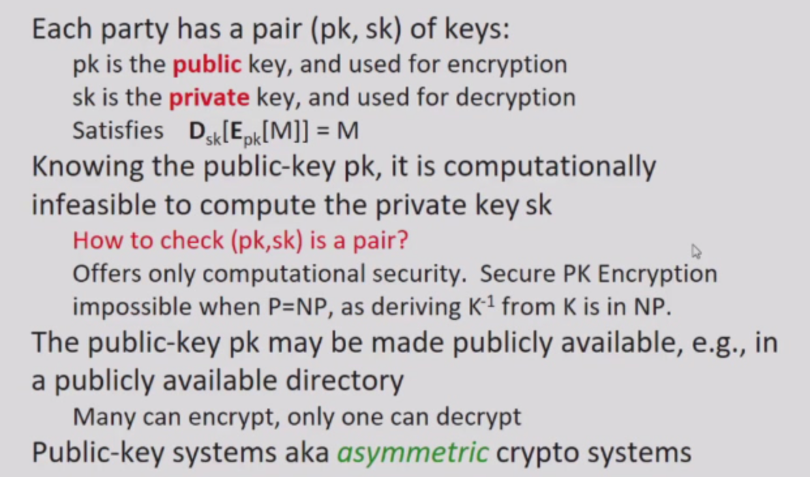
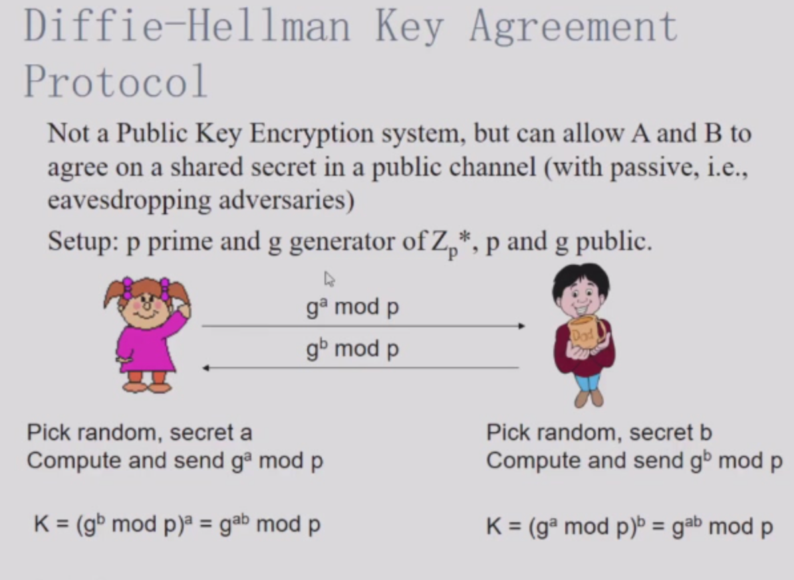
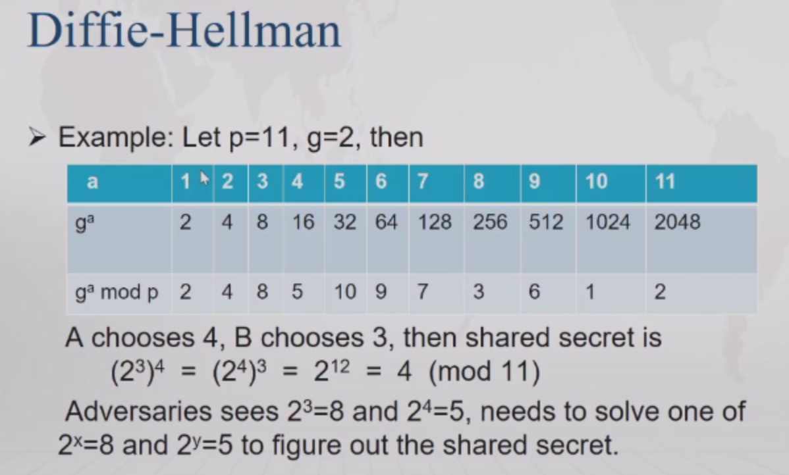
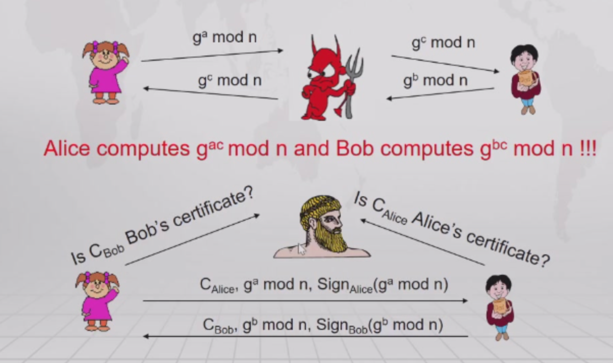

### 基础密钥传输协议

PAKE，即Password-authenticated key agreement，密码认证秘钥协商。在密码学中，PAKE是指：

- 两方或多方进行交互
- 基于一方或多方知悉某一共享密码建立的密码学密钥

PAKE的一个重要属性是：

- 窃听者或者中间人无法在不与其他方互动的情况下暴力破解密码

Long-term key：这是长期的密钥，我们以这个密钥作为种子，使用随机函数生成临时密钥进行加密，这样就算临时密钥被破解也不会心疼。

### 认证密钥交换协议(AKEP2)

通过协商之后，共享了$r_B$，之后他们使用$F_k(r_B)$来作为会话密钥。

### Needham-Schroeder Shared-Key Protocol

当用户增多，共享的消息需要N(N-1)个密钥，这是一个极大的开销。所以我们确定一个可信第三方，我们把A的长期密钥和B的长期密钥都发给这个可信第三方，当AB要建立会话的时候，由可信第三方来创建会话密钥。

A通过$N_A$来检验消息是不是T发来的，然后解密得到k和$E_{k_{BT}}(k,A)$。k就是第三方给A和B的共享信息。

### Public Key Cryptography

之前只有共享秘密的人才能合理的加密，现在任何人都可以给自己加密，只是只能够自己解密。 

大数分解问题是难的，离散对数也是很难的，根据公钥算出私钥是很困难的过程

攻击者看得到信道中的$g^a,g^b$，攻击者推知$g^{ab}$是很困难的。

几类困难的数学问题，这几个问题是可以相互推导的，如果一个人可以解决DL问题，那么也可以解决CDH，如果可以解决CDH，那么也可以解决DDH。所以难度上DLG>CDH>DDH。

采用证书的方式来防止中间人攻击。下面那幅图是可信第三方

非对称加密一般用来传递密钥，以此来建立共享密钥，之后通过对称加密来进行通信，因为对称加密效率更高。