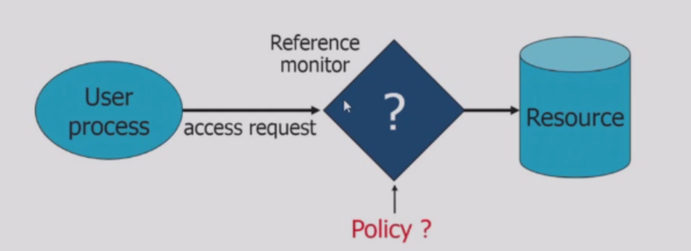
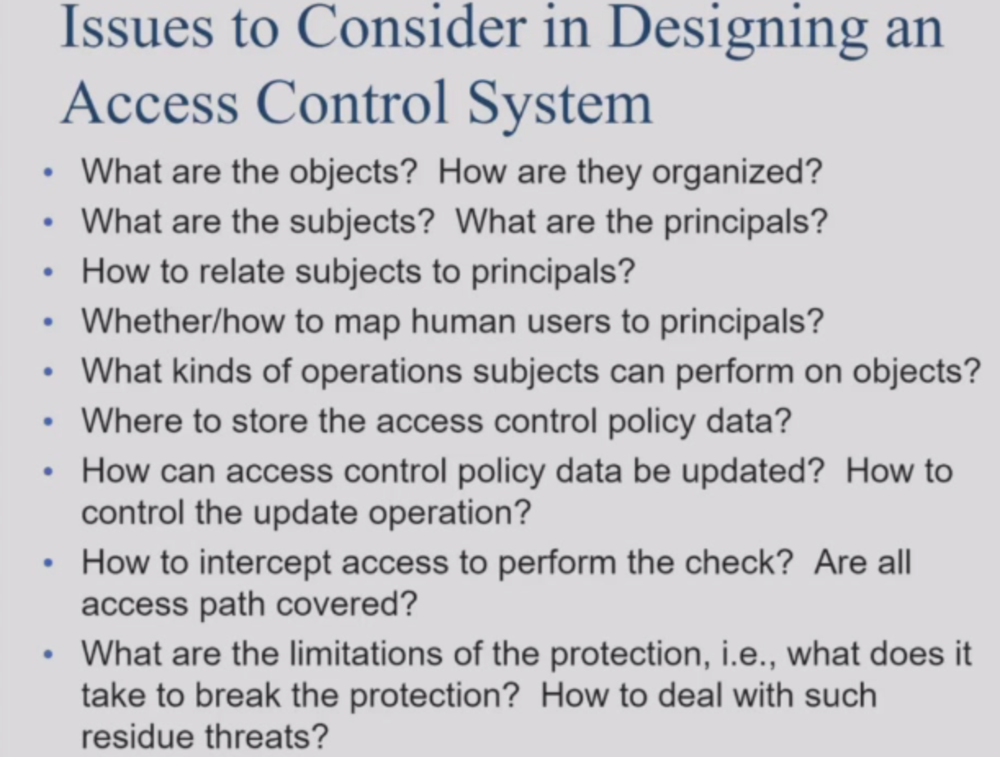

##  1. 概述

DAC（Discretionary Access Control），自主访问控制，核心内容是**进程理论上所拥有的权限与执行它的用户的权限相同**，如下是大体的访问控制模型：

## 2. 六个设计 access control system 的原则

- 提供足够的安全性且有非常高的可用性，而不是高安全性但低可用性；
- 提供政策（policy），而不仅仅是机制（mechanism）；
- 具有明确的安全目标，在实现目标的同时简化策略规范；
- 不需要严格的最小权限，以足够好的最低特权为目标，旨在最大限度地减少政策规范；
- 仔细设计处理异常的方法政策模型，为全局MAC策略规则设计异常机制最小化攻击面；
- 在策略规范中使用熟悉的抽象界面，提高设计的心理可接受性；

## 3. 访问控制模型

**Access Matrix Model**

- subjects，主体；object（and subjects），客体；rights，权限；

**Users and Principal** 

- subject是一个应用程序，代表某个principal进行操作；

- principal是policy授予访问权限所针对的实体；一个principal可以操作很多的subject，principal可以看成一个人的账户；

- 一个user可以有很多的principal，但是一个principal一般只和一个user有关联，这确保了用户行为的问责机制；

- 访问是由process（subjects）来perform的；

- 系统需要一个日志去看到每个subject在干什么事情；

**Objects**

- Object是subject可以在其上执行操作的任何东西（由权利介导），通常object是被动的，例如文件、目录（或文件夹）、内存段等。但是，subjects（即process）也可以是object，并对其进行操作，例如终止、挂起、恢复、发送进程间通信等。

### Unix中的访问控制模型

**UNIX访问控制的基本概念：用户、组、文件、进程**

- 每个用户帐户都有一个唯一的UID，UID 0表示超级用户（系统管理员），一个用户帐户可以属于多个组，subject是process，与uid/gid pairs相关联，例如，（euid，egid）、（ruid，rgid），（suid，sgid）。object是文件。

**Object的组织**

!!! note
    
    所有权被分成三类，即：文件的拥有者，文件的所属组，其他人；

    1.文件的拥有者：也称为属主，标记为u，默认情况下，创建文件的用户就是其属主；

    2.文件的所属组：也称为属组，标记为g，除了属主之外，还可以被哪些用户共同拥有。由于这样的用户可能不止一个，所以不方便用某个用户名来标识，因此以组的方式来标识。

    3.其他人：标记为o，除了文件的属主和属组之外的其他所有使用者的统称。

- 在UNIX中，几乎所有object都被建模为文件，文件按层次结构排列，文件在目录中，目录也是一种文件。
- 每个object都有，owner、group和12个许可位（rwx for owner，rwx for group，rwx for others，suid、sgid、stick）。

- 纯文件的权限就是rwx。
- 目录的权限：read表示能够展示文件夹里面的文件名，execution表示能够遍历文件夹（访问子文件夹），write表示能够新建或者删除文件（你想要删除一个文件或者重命名一个文件，只需要有目录的write权限即可，不需要有这个文件的任何权限，因为文件在文件夹中其实就是一个指针，只需要把指针删掉，我们就找不到这个文件了，就相当于删除）。
    - 对于移动而言，文件不需要任何权限即可被移动到指定文件夹中（前提是该文件夹权限足够），文件夹最低需要可写权限才能被移动到文件夹中，而被移入文件的文件夹可以被移入文件的最低权限是可写可执行（wx）。

!!! note
    
    **1.读权限：**

    1)对于目录来说，拥有读权限的用户可以浏览该目录中的文件名；如果同时拥有执行权限，则该用户可以查看目录的元数据，目录中的文件名及这些文件的元数据信息。

    2)对于非目录文件来说，拥有读权限的用户在对存放该文件的目录有读权限和执行权限的前提下可以查看该文件的内容。

    **2.写权限：**

    1)对于目录来说，拥有写权限的用户必须要同时拥有执行权限，才可以在该目录中新建、修改和删除文件名

    2)对于非目录文件来说，拥有写权限的用户在对存放该文件的目录有读权限和执行权限的前提下可以在该文件的末尾追加内容；如果想要修改和删除该文件内容，必须同时拥有读权限

    ** 3.执行权限：**

    1)对于目录来说，执行权限是最最基本的权限了。拥有执行权限的用户可以在路径表示中引用此目录，并且如果该用户同时拥有读权限，便可以进入到此目录中，可以查看目录的元数据。

    2)对于非目录的文件来说，拥有执行权限的用户可以将此文件当作命令来执行，也就是说可以把这个文件直接载入内存，让其运行起来成为进程或者通过其他的解释工具将他里面保存的命令、语句解释出来并执行。在ext系列和xfs文件系统中，对于非目录文件的执行权限限制还是非常大的。除非用户明确为之分配，否则系统绝不会为这些非目录文件添加执行权限的。

**三组权限位**

- 如果用户是文件的所有者，那就是owner；
- 如果用户在文件所属的组别之中，那就是group；
- 否则就是other；

**另外三个权限位**

!!! note

    前提：进程有属主和属组；文件有属主和属组；

    - 任何一个可执行程序文件能不能启动为进程：取决于发起者对程序文件是否拥有执行权限；
    - 启动为进程之后，其进程的属主为发起者；进程的属组为发起者所属的组；
    - 进程访问文件时的权限，取决于进程的发起者；

- suid权限作用于文件属主，sgid权限作用于属组上，sticky权限作用于other其他上。

- suid作用：让普通用户临时拥有该文件的属主的执行权限，suid权限只能应用在二进制可执行文件（命令）上，而且suid权限只能设置在属主位置上。
- sgid作用：sgid权限一般应用在目录上，当一个目录拥有sgid权限时，任何用户在该目录下创建的文件的属组都会继承该目录的属组。作用在二进制程序上时，执行sgid权限的程序时，此用户将继承此程序的所属组权限。
- sticky作用：sticky权限一般针对目录来设置，作用是只允该目录下的文件的创建者删除自己的创建的文件，不允许其他人删除文件。（root用户除外，因为root用户是超级管理员），而且sticky权限只能设置在other位置上。

**另外一些琐碎**

- 所有者可以更改权限位；
- 管理员可以更改所有者；

**UNIX访问控制系统具有**：

- 自由裁量的政策规范（确定哪些user可以访问哪些对象）、策略执行组件（确定主体（进程）代表哪个用户采取行动）；

**每个进程都有三个user ID和三个group ID：**

- ruid，real user id，用于在系统中标识一个用户是谁，当用户使用用户名和密码成功登录后一个UNIX系统后就唯一确定了他的RUID。永远不会变——当一个用户登录系统之后，该shell的ruid就是该用户了。从该shell产生的所有进程都会继承ruid，即该用户。
- euid，effective user ID，用于系统决定用户对系统资源的访问权限，通常情况下等于RUID。如果user1的可执行文件设置了suid位，且该文件可被user2执行，那么user2执行时，该进程的euid是user1，而ruid是user2。因为user2登录后去执行，所以ruid是user2；因为user1设置了suid位且该文件是user1的，所euid是user1。那么，euid和ruid什么时候不一样呢？答：只有上述的这一种情况，即，某可执行文件设置了suid位，然后由非owner用户来执行。
- suid，saved user ID，用于对外权限的开放。跟RUID及EUID是用一个用户绑定不同，它是跟文件绑定而不是跟用户绑定。

- 三个GID同理；

!!! example

    当一个进程在执行一个有uid的程序时，可以暂时放弃privilege，做法是从其euid中删除特权用户ID，但将其存储在suid中，稍后进程可以通过在suid中恢复euid来恢复特权；

## 4. 问题思考

