## 1. 现代密码学概述

现代密码学：对安全地进行数字信息和事务处理、分布式计算所需技术的科学研究 the study of mathematical techniques for securing digital information, systems, and distributed computations against adversarial attacks。

现代密码学和经典密码学之间一个非常重要的区别是使用者，以前的使用者主要是军方和智囊团，现代对于密码学的应用更加广泛。

在对称密钥加密的情形中，双方共享一些密码信息，称为密钥。当然这里默认通信方可以用某种秘密的方式建立初始的的共享密钥。

**Kerckhoffs原理**：即使对手知道加密方式，只要对手不获得密钥，密文都是安全的。

**加密的语法**：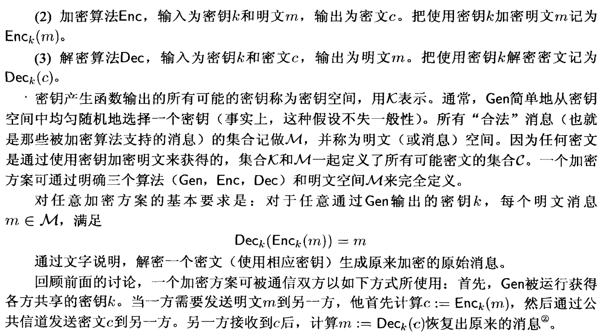

### 现代密码学的原则

**现代密码学的原则**：强调定义、假设和证明是现代密码学与经典密码学的区别。

- 原则1 —— 形式定义(Formal Definitions)
- 原则2 —— 精确假设(Precise Assumptions)
- 原则3 —— 安全性证明(Proofs of Security)

#### Principal 1: Formal Definitions

**解决任何密码学问题的第一步是公式化的表述和精确的安全定义**。形式化的安全定义是设计、使用或者研究任何密码学原语或者协议的基本先决条件。

- Design：如果没有对于设计的定义，就不知道什么时候设计成功；
- Usage：如果没有对使用的定义，就不知道什么方案是满足条件且效率最高的。
- Study：当我们比较两个不同的方案时，需要知道他们各自提供了怎样的安全性。

**如何定义安全？**

- 首先定义什么是不安全的
- 定义对手拥有什么权限
- 如果特定能力的对手无法实现特定的破解，则给定任务的加密方案是安全的

!!! info "威胁模型" 

    - Ciphertext-only attack：唯密文攻击，这是最基本的攻击，即对手只观察一个密文（或多个密文），并试图确定相应的明文（或者多个明文）。
    - Known-plaintext attack：已知明文攻击，对手能够学习一个或多个使用相同密钥加密生成的明文/密文对。目标是确定其他密文对应的明文。
    - Chosen-plaintext attack：选择明文攻击。在这种攻击中，对手可以选定明文，并知道对应的加密得到的密文。目标是确定其他密文对应的明文。
    - Chosen-ciphertext attack：选择密文攻击，对手甚至可以选择密文并得到相应的明文。对手的目的依旧是确定其他密文的明文（其明文不能直接得到）。

    防范密码学攻击方式的难易程度：选择密文攻击   >  选择明文攻击   >  已知明文攻击    >    唯密文攻击

    四种密码攻击方式中破解难易度：唯密文攻击   >  已知明文攻击   >  选择明文攻击    >    选择密文攻击

#### Principal 2: Precise Assemptions

大部分现代密码学的构造方案不可能证明为无条件安全。所以安全依赖于某种假设，第二个原则就是：**假设必须被精确地陈述**。这里有三个原因：

- 验证假设的正确性，为了强调某些假设的可信程度，有必要对假设进行研究，假设检查得越仔细且测试没有反例，假设的可信程度越高。但这一切都是建立在拥有对假设内容的精确陈述。
- 对多个方案进行比较，如果两个方案效率相等且第一个方案假设更弱，则选择第一个方案，因为有可能发现第二个假设是错的，而第一个假设仍然正确。如果被两个方案使用的假设是不可比的，那么选择那个被研究得更加彻底的假设。
- 对安全证明的帮助，若方案的安全性不能被无条件地证明，即必须依赖某个假设，那么就必须要有一个精确的假设。

#### Principal 3: Proofs of Security

经验表明，密码学和计算机安全中依靠直觉将是灾难性的。

## 2. Perfectly Secret Encryption

### 2.1 Definitions

#### 完善保密加密

密文不会泄露任何明文信息，对手截获一个密文不能得到任何关于明文的信息。窃听到密文后推测出明文的后验概率与窃听前推测出明文的先验概率一致。

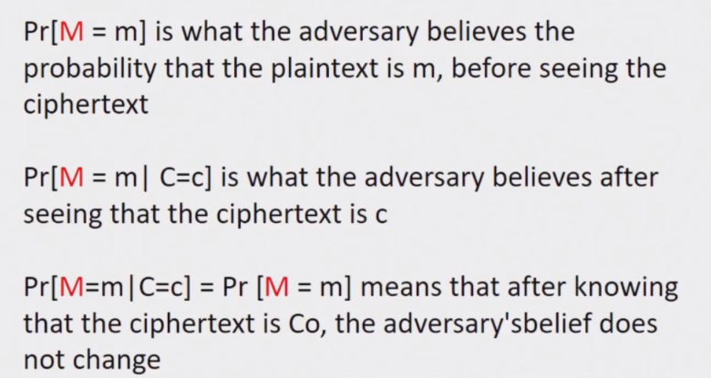

**完善保密加密的引理**

加密不同明文得到相同密文的概率是一样的，则被称为完善保密加密。

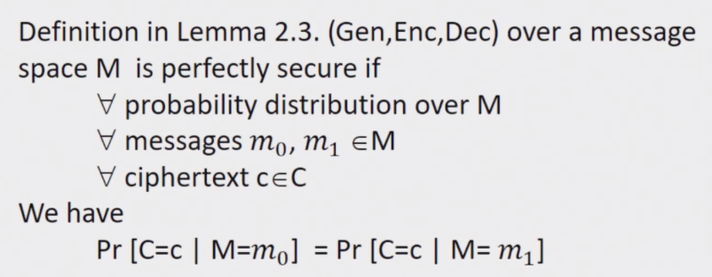

证明：

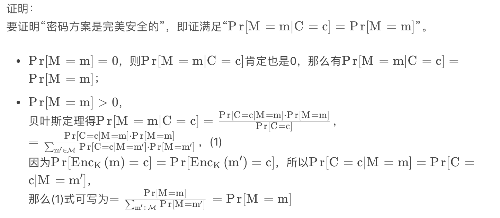

#### 完美不可区分性

利用如上的引理来得到一个完善保密加密的等价陈述：密文的概率分布独立于明文。也就是说用$C(m)$表示加密明文m时的密文分布，然后对于每一个m，$C(m_0)$和$C(m_1)$的分布是相同的。我们称此为完美不可区分行，因为它意味着不可能区分$m_1$和$m_0$的密文（因为不管是$m_1$还是$m_0$密文的分布都是一样的）

#### 对手不可区分性

定义一个实验：

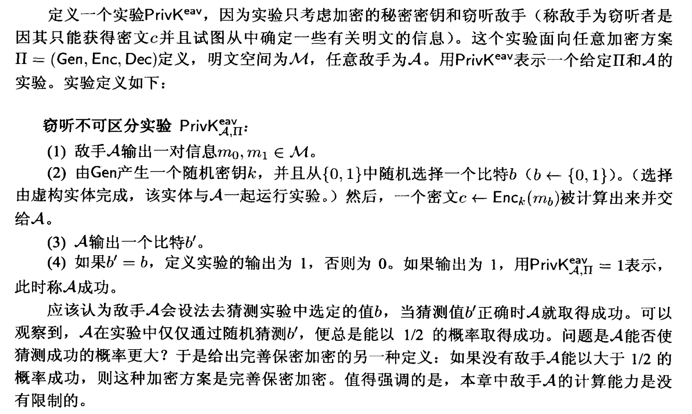

因此有定义：

### 2.2 The One-Time Pad

!!! info "Vignere加密"

    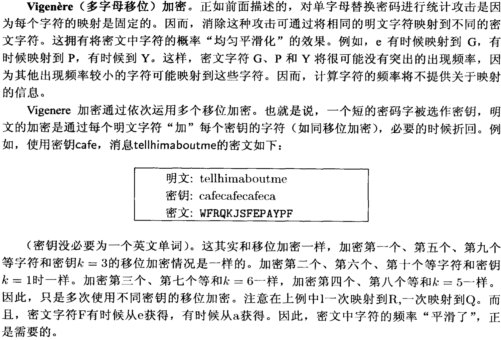

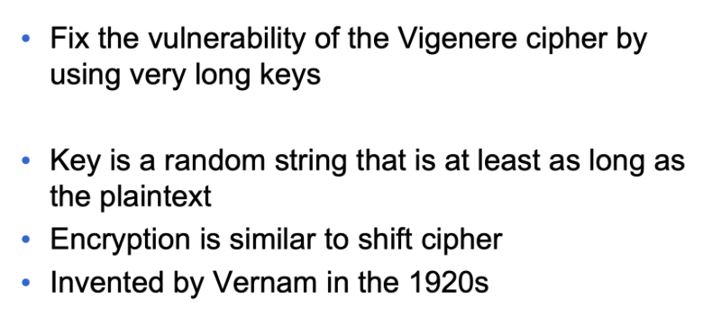

一次一密就是密钥只用一次的时候才是安全的，**一次一密算法**：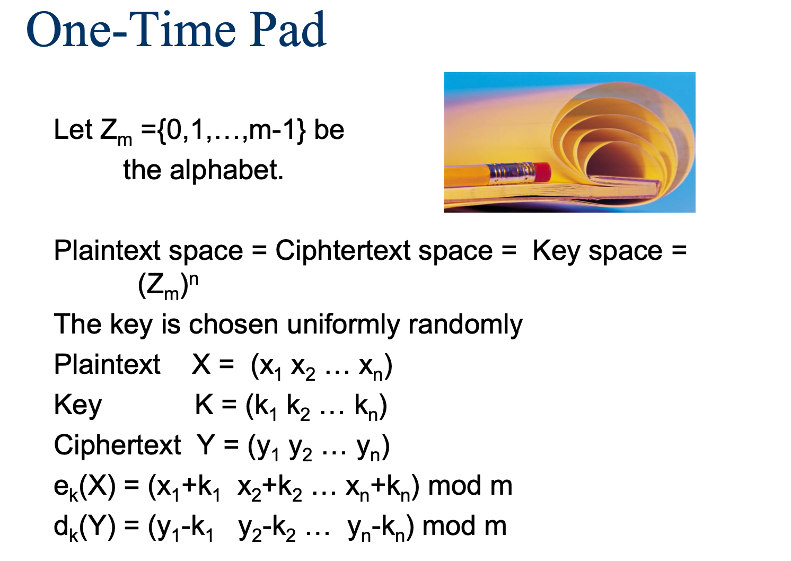or

**证明一次一密算法是完善保密加密**：

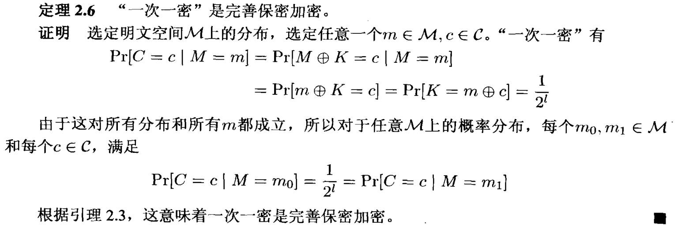

在一次一密算法中。密钥不能是从某个地方随机找出来的，必须是随机生成的，因为从某个地方找出来的密钥可能已经被使用过，而一个密钥也不能被使用两遍。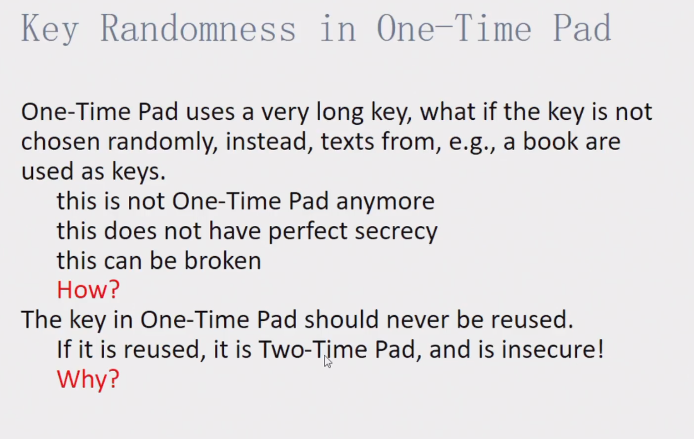

### 2.3 Limitations of Perfect Secrecy

所有的完善保密加密方案，它的密钥空间至少和明文空间一样大。如果密钥空间由固定长度的密钥组成，明文空间由固定长度的明文组成，则意味着密钥至少要和明文一样长。

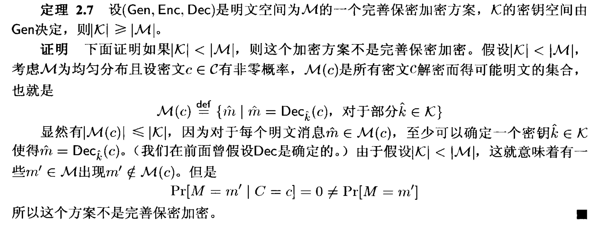

## 3. Computational Security

完善保密加密的实现过于困难且开销太大，我们对要求进行一定程度上的放松。

- 只在有限（计算受限）的对手面前能够保持安全，也就是说对抗只能在可行的时间内进行；
- 敌人只能有很小的概率成功攻破加密方案（我们可以忽略它实际发生的情况）；

**具体方法**

通过明确限定攻击运行在一定时间内的最大成功概率来量化安全性：某个方案$(t, ε)$——每个攻击周期（最多为t）只有s的概率能够成功。

示例：使用n位密钥的强加密方案可能预期是$(t,t/2^n)$。$N=128$，$t=2^{60}$，则$ε=2^{-68}$。

这个衡量方法对对称加密方案更有意义。

**可忽略的成功概率**

现代密码学允许：能以非常小的概率被攻破的方案，仍被认为是“安全的”。考虑多项式运行时间是可行的，类似地，认为概率为多项式倒数时是显著的。因此，对某个（正）多项式$p$，如果一个敌手能够成功地攻破该方案的概率为$1/p(n)$，则该方案被认为是不安全的。但是，对任意多项式$p$，如果攻破该方案的概率渐进小于$1/p(n)$，则认为该方案是安全的。

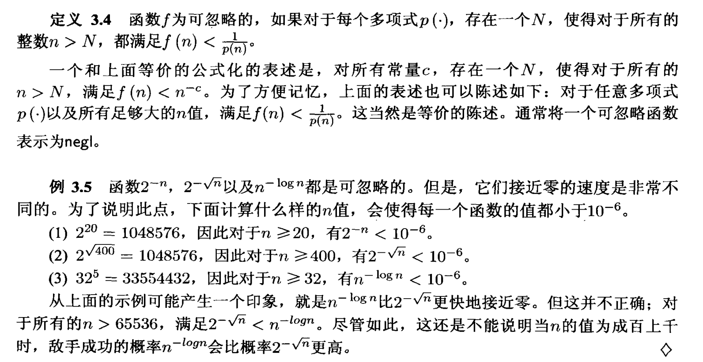

