### 4. 舵机工作原理

#### 4.1 模拟舵机

通过不同PWM脉冲，控制位置和角度；电机一般和齿轮组一起工作进行驱动；点位器是为了检测当前的角度信息，反馈到控制电路，所以这是全闭环控制；标准舵机有三条控制线，分别为电源线、地线和控制线；控制线连接到控制芯片上。

#### 4.2 舵机位置控制

舵机转动角度由PWM（脉冲宽度调制）信号的占空比来实现；PWM周期为20ms，脉宽分布在0.5-2.5ms之间；不同脉宽对应不同角度，为线性变化；

#### 4.3 电机+减速器

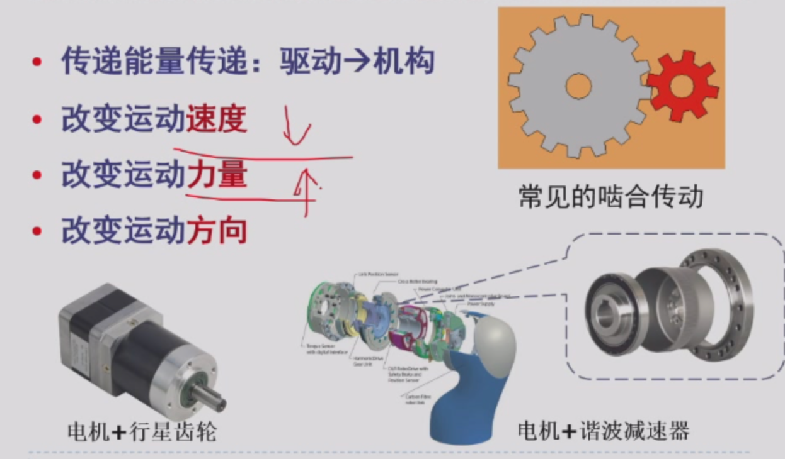

## 机器人设计与传动-1

### 0. 概述

The Design Process: As a Flow Chart（流程图）

首先明确用户需求，然后分解问题（用户需求，功能分解，用户条件等），概念设计，初步设计（形成一些图纸和模型），细节设计，最后形成设计文档；

分解和迭代是必不可少的；

problen：在传动机构中，由旋转运动变成直线运动的机构有哪些？

### 1. 机器人机构的组成

#### 1.1 机器人机构的组成

- 设计的流程：明确执行机构、确定传动方式、设计导向机构、结构设计、优化分析、组装与测试；先明确电机大小（选型），然后选减速器（也就是从执行机构下手），然后按顺序往下进行设计；

- 传动机构的性能要求：
    - 转动惯量：传动机构的质量和转动惯量应尽量小。否则，机构的负载会增大；系统响应会降低；固有频率会降低，易产生谐振；
    - 刚度（越大越好）：伺服系统动力损失小（变形损失能量小）；频率要高，超出机构的频带宽度，使之不易产生共振；闭环系统更加稳定；
    - 阻尼：阻尼越大，振动的振幅就越小，衰减也越快。但大阻尼会使系统稳态误差增大、精度降低。共振区域阻尼越大越好；远离共振区域阻尼越小越好；
    - 其他：摩擦小、抗振性好、传动间隙小等。

- 减速比：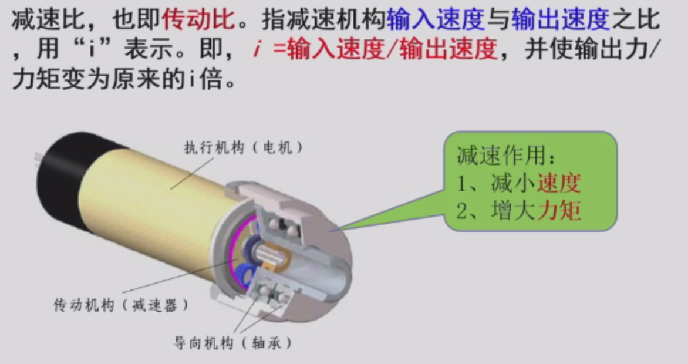

- 强度与刚度：刚度和强度没有关系，比如玻璃，强度小刚度大；比如很薄的钢板，强度高刚度小；刚度与结构设计（比如“工字型”）有关系；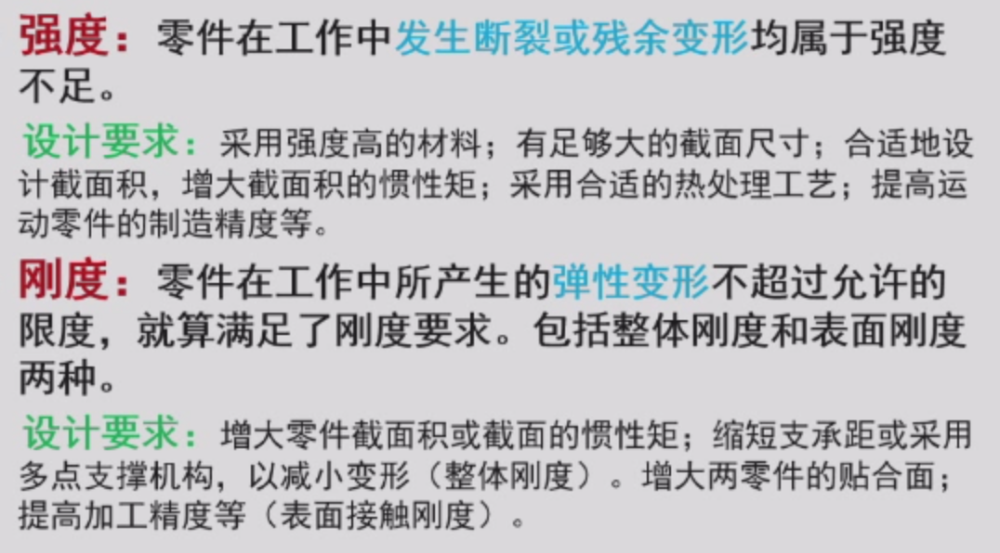

- 刚体的自由度：比如**手臂有三个关节，七个自由度**（肩关节前后、左右、旋转，手肘前后、旋转，手腕前后、左右、旋转），**机械手一般有六个自由度**；**空间有六个自由度**（xyz和绕着他们旋转），所以六个自由度代表可以到达空间中的任何位置；**人的腿有六个自由度**；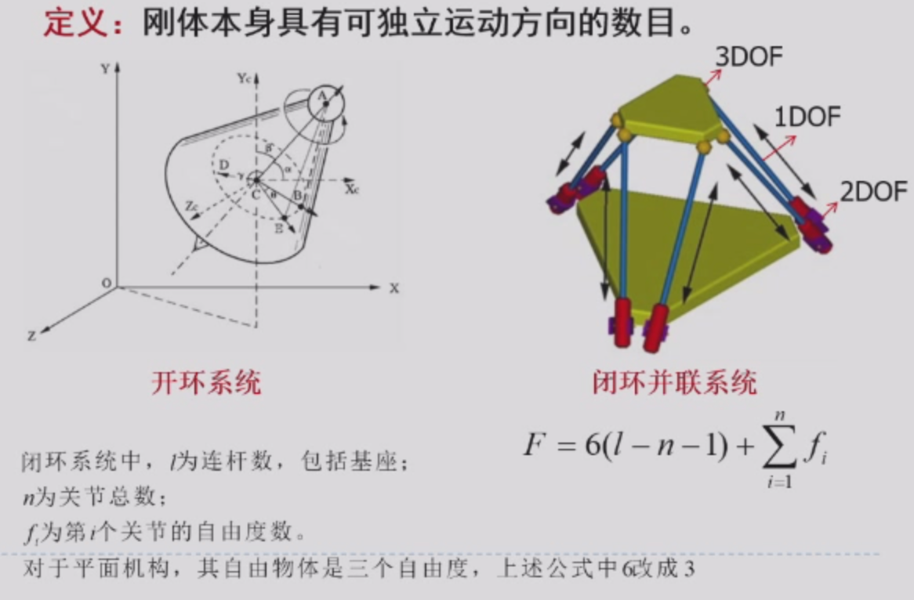

- 支撑和导向机构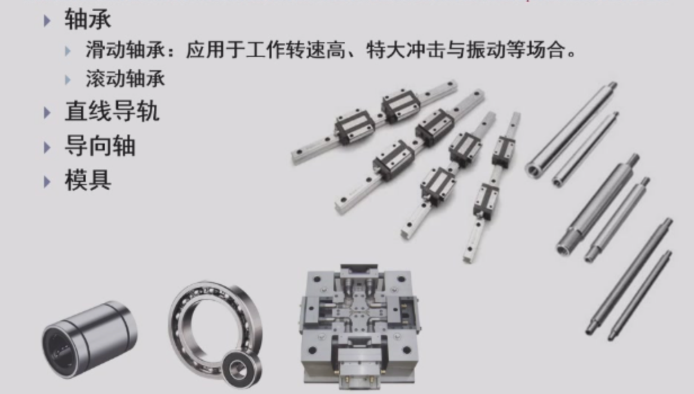

### 3. 齿轮传动

齿轮传动是指由齿轮副传递运动和动力的装置，它是现代各种设备中应用最广泛的一种机械传动方式。优点：传动比较准确、效率高、结构紧凑、工作可靠、寿命长。

很多器件都是一个轴套两个齿轮。

齿形——渐开线：一个圆形，一支笔绕着圆做纯滚动运动，笔尖的轨迹就是渐开线；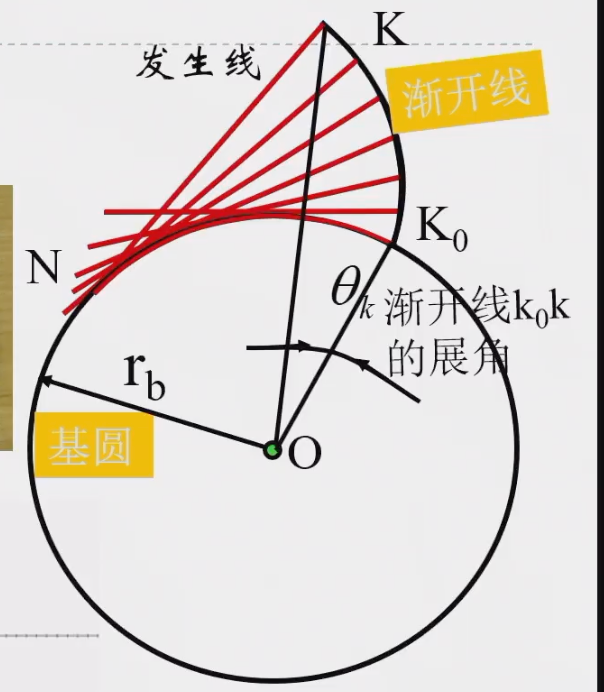

#### 术语

- 齿顶圆就是外面的圆，齿根圆就是里面的圆。

- 基圆不太重要，其实就是生成这个齿轮圆弧所需要的基准圆。

- 齿距和齿厚都在分度圆上。同一圆周上，pi = si + ei；

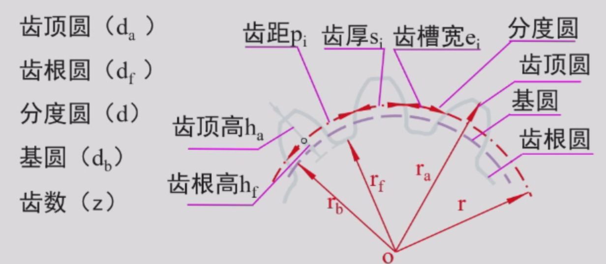

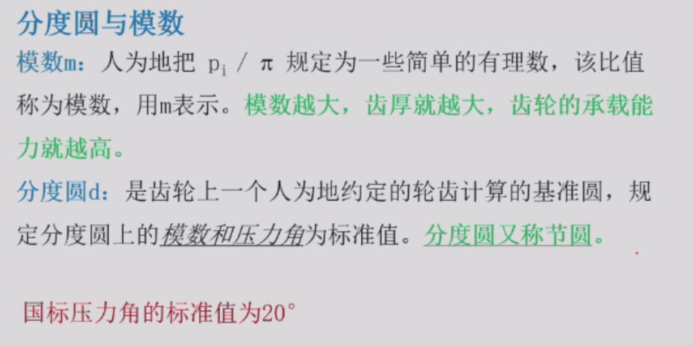

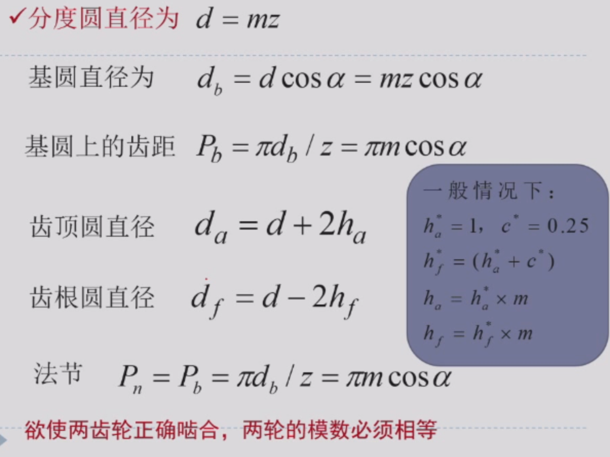

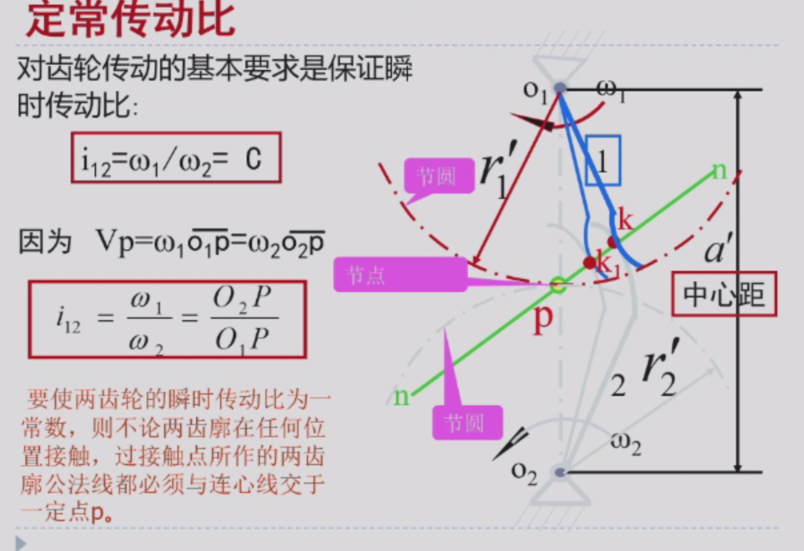

- 中心距就是两个分度圆的半径和

#### 齿轮材料及选择原则 

#### 齿轮传动方式

- 斜齿轮：比较平稳，承重比较好；
- 锥齿轮：可以改变运行方向；
- 齿轮齿条：由旋转变成直线运行；
- 蜗轮蜗杆：带不动负载，有锁定功能，比如汽车的车窗，不是旋转变成直线运动，而是旋转变旋转；

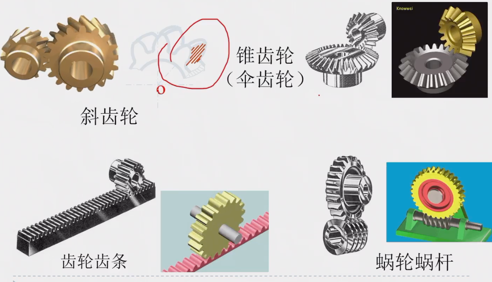

- 内啮合齿轮：转动方向一致；
- 外啮合齿轮：转动方向内外相反；

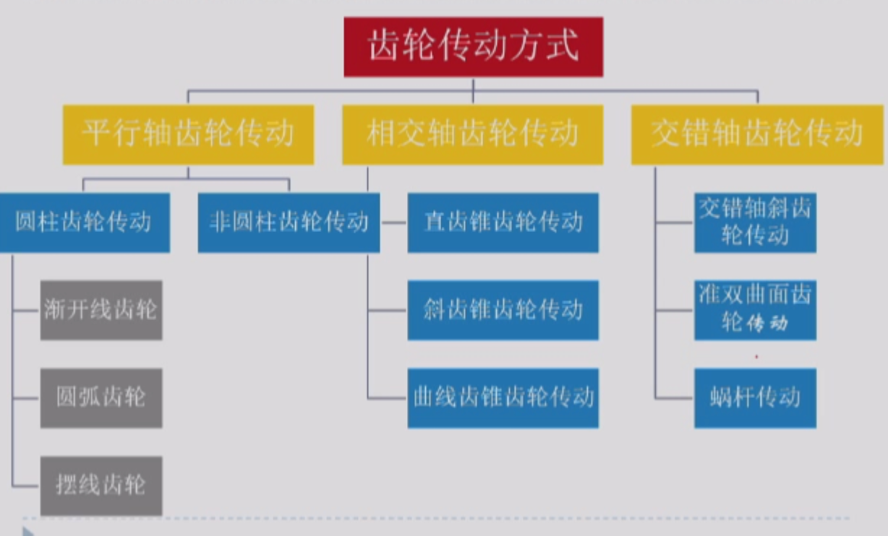

#### 齿轮轮系（大于两个齿轮）

分为定轴轮系和周转轮系；

- 定轴轮系，传动的时候所有的齿轮的几何轴线都是固定的。

- 定轴齿轮箱：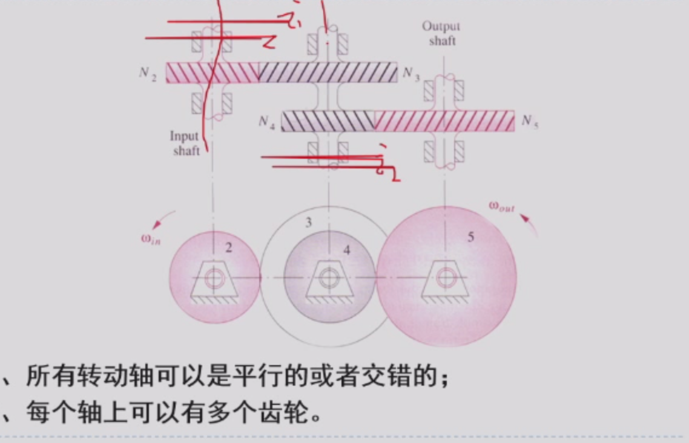
