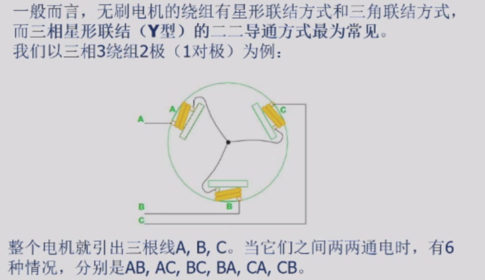
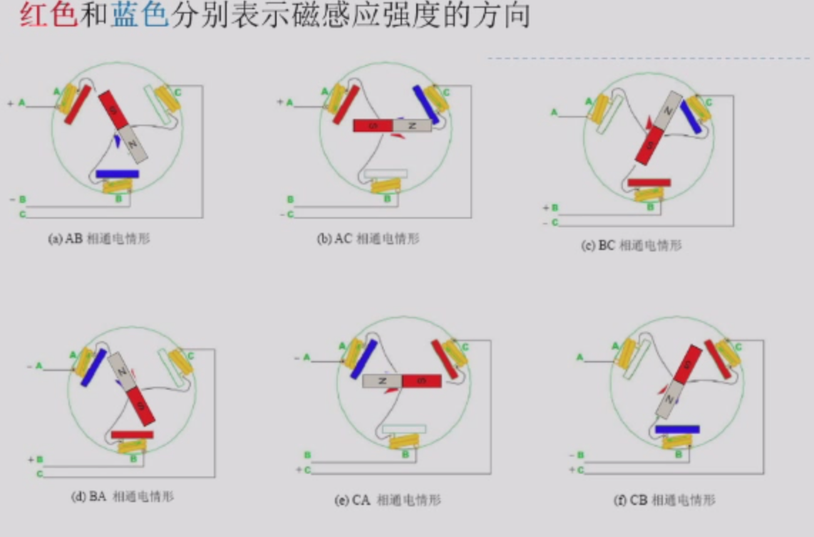
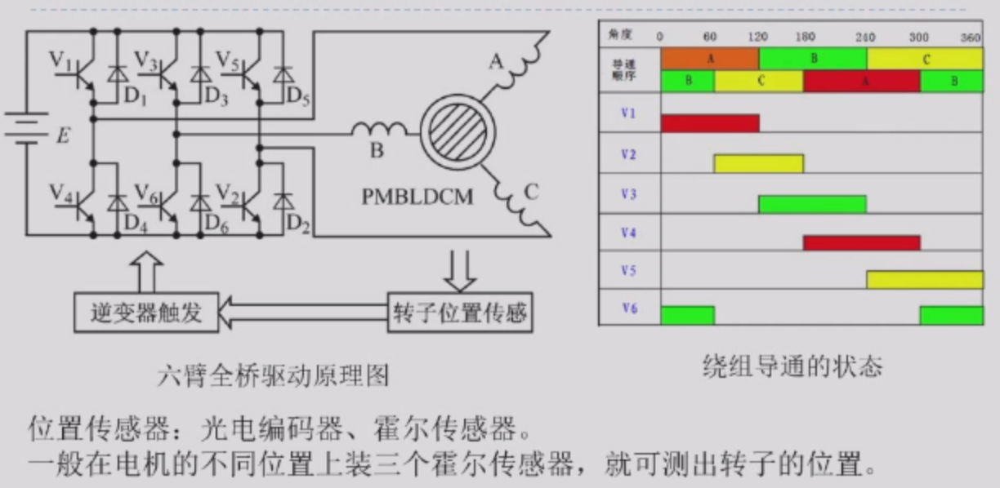
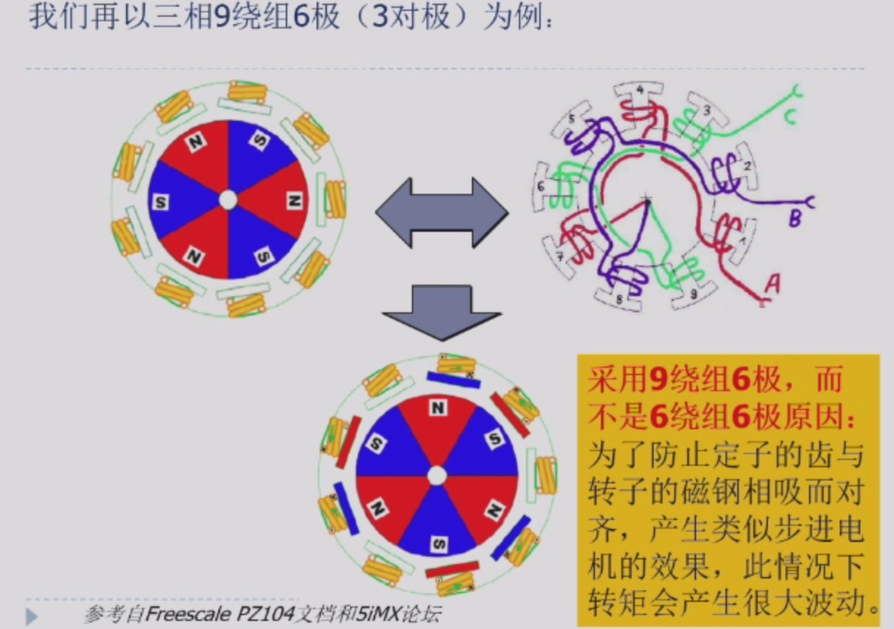
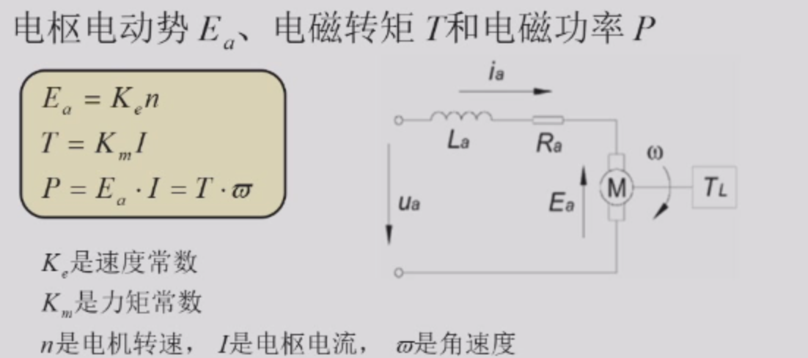
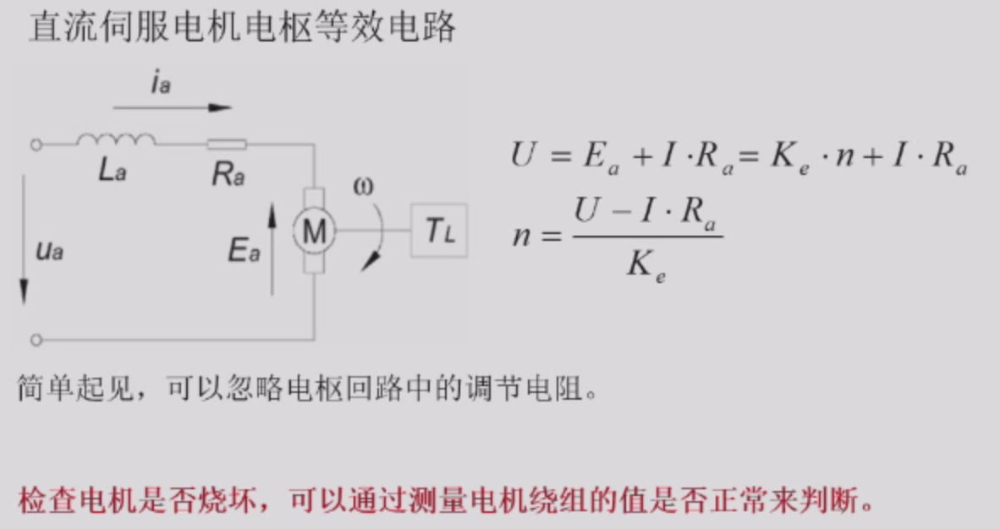
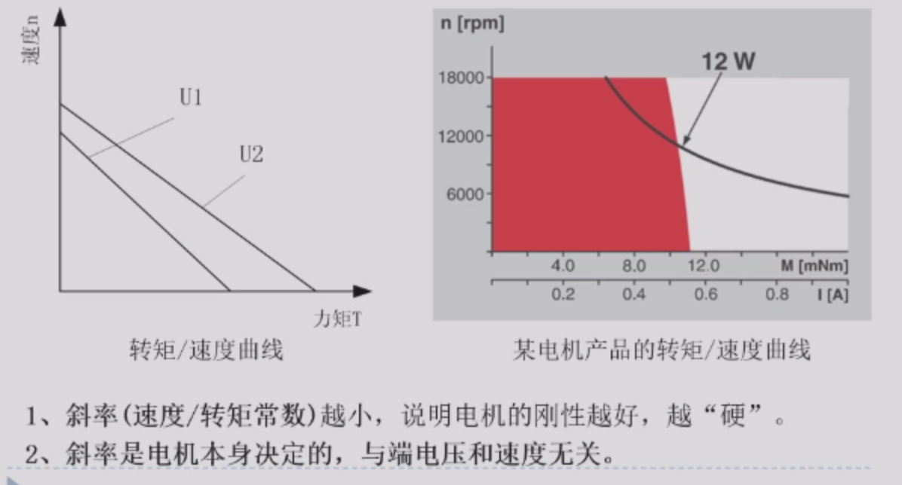
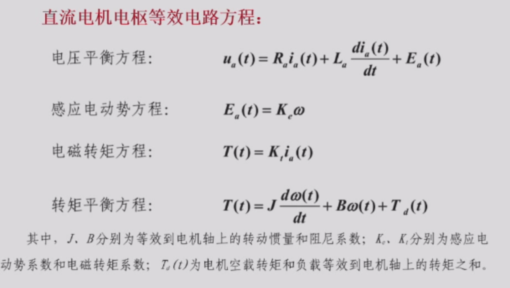
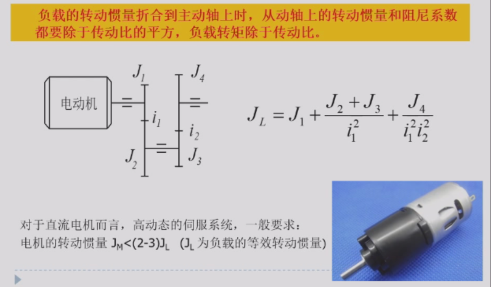
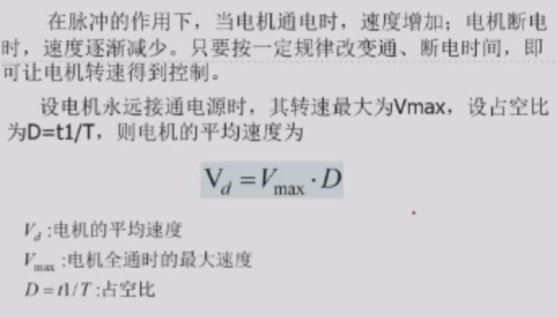

- 机器人系统框图
```
机器人机构 + 控制器 => 执行器 => 传感器
|			        |
++++++++++++++++++++
 						
电源模块 指示模块
```
- 功能模块介绍
- 动作：行进与转弯、平台升降、抓取物品、释放物品；
- 目标：用基本的驱动来完成复杂的动作；
### 1. 驱动
#### 1.1 电机驱动（基础）

- 电机是日常生活中最常用和最普遍的驱动方式；
- 优点：控制调节简单、稳定性较好；
- 缺点：力矩小、刚度低，常常需要配合减速器使用（一般情况下一分钟转几千转）；
- 典型应用：工业机器人（机械手）、服务机器人（机器狗）等；

#### 1.2 气动驱动（基础）

- 气压驱动以空气压缩为动力源，也是机器人驱动的一种重要形式。气动式主要是气缸、气阀、管路等元件组成；
- 优点：气源获得方便、成本低、动作快；
- 缺点：输出功率小，体积大。一般而言。其工作噪声较大、控制精度较差。
- 典型应用：袋鼠机器人；

#### 1.3 液压驱动

- 液压式主要有液压缸、液压马达、阀等组成；
- 优点：重量轻、尺寸小、动作平稳、快速性好、产生的力/力矩非常大；
- 缺点：易漏油、维护困难；不确定性和非线性因素多。控制和校正不如电气式方便；
- 应用：在机器人中的应用较少，但正在逐步增加；

#### 1.4 新型驱动

- 软体机器人的驱动方式主要取决于所使用的智能材料，生命力会非常强（因为踩不坏）一般有：
  - 介电弹性体（DE）
  - 形状记忆合金（SMA）
  - 形状记忆聚合物（SMP）
  - 离子聚合物金属复合材料（IPMC）

### 2. 直流电机
- 比较：
  - 直流电机：可以输出力矩和速度，如小车的直线运动、转弯等，需要驱动芯片以及控制方式；
  - 舵机：用于角度、位置伺服，如机械手转动，PWM波控制；

#### 2.1 直流有刷电机
有刷直流电机结构及工作原理：


#### 2.2 无刷直流电机
无刷直流电机结构及工作原理：


##### 无刷直流电机结构（必考！）



（这个图片螺线管不是很清晰）




### 3. 物理量

#### 3.1 三个重要的物理量

转速只跟电压有关，转矩只跟电流有关；



#### 3.2 转矩和转速的关系



老师以电机磨牙为例；

### 4. 电机控制与仿真




### 5. 转动惯量的匹配



最后讲了一个传感器（环境因素）对电机的影响的例子，要对环境不敏感，要让减速比大一点。
### 6. 直流电机PWM调速（3.17）

用改变电机电枢电压接通与断开的时间占空比来控制电机转速的方法，成为脉冲宽度调制（PWM）；

t1时有电压，转速就上升，t2电压为0，转速就下降；




> 得到结论：
>
> - 电机的转速与电机电枢电压成正比，而电机电枢电压与控制波形的占空比成正比；
> - 电机的速度与占空比成比例，占空比越大，电动机转得越快，当占空比等于1时，电机转速最大。
>
> （舵机完完全全使用PWM控制；）