# 实验1 - 动态分支预测
###  1. 实验目的
- 了解分支预测原理 
- 实现以 BHT 和 BTB 为基础的动态分支预测 
### 2. 实验环境 
- HDL：Verilog
- IDE：Vivado 
- 开发板：NEXYS A7
### 3. 实验原理
#### 3.1 BHT
`branch-history table(BHT)`，用来决定是否进行跳转。

本次实验使用 2-bit 来表示历史跳转信息，从而提高预测的准确性。状态机如下图所示。

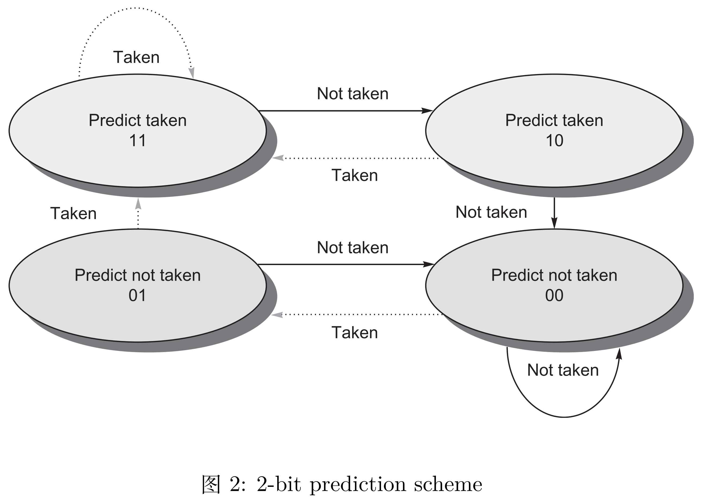

我是用哈希表来实现`BHT`的数据结构，对于一个`PC`的值（先右移两位，因为`PC`的值总是4的倍数），取`PC[7:6]`为tag，取`PC[5:0]`为`index`，因为`index`有6位，所以哈希表的长度就是64，所以对于`BHT`的定义如下：

```verilog
reg [3:0] BHT[0:63];//BHT:[3:2]tag,[1:0]status
```


#### 3.2 BTB

`branch-target buffer(BTB)`，用来保存预测的分支跳转目标地址，解决往哪里跳转的问题。

我同样是通过哈希表来实现`BTB`的数据结构，定义如下：

```verilog
reg [9:0] BTB[0:63];//BTB:[9:8]tag,[7:0]PC
```

左边记录的是访问过的分支指令的`PC`的`tag`，也就是说通过`index`和`tag`来共同确定当前`PC`的值，表的右边记录的是分支指令的目标地址。

#### 3.3 分支预测流程

在 5 段流水线中使用 BHT 和 BTB 进行分支预测的流程如下图所示。所有的代码逻辑都是根据如下来流程图来设计实现的。

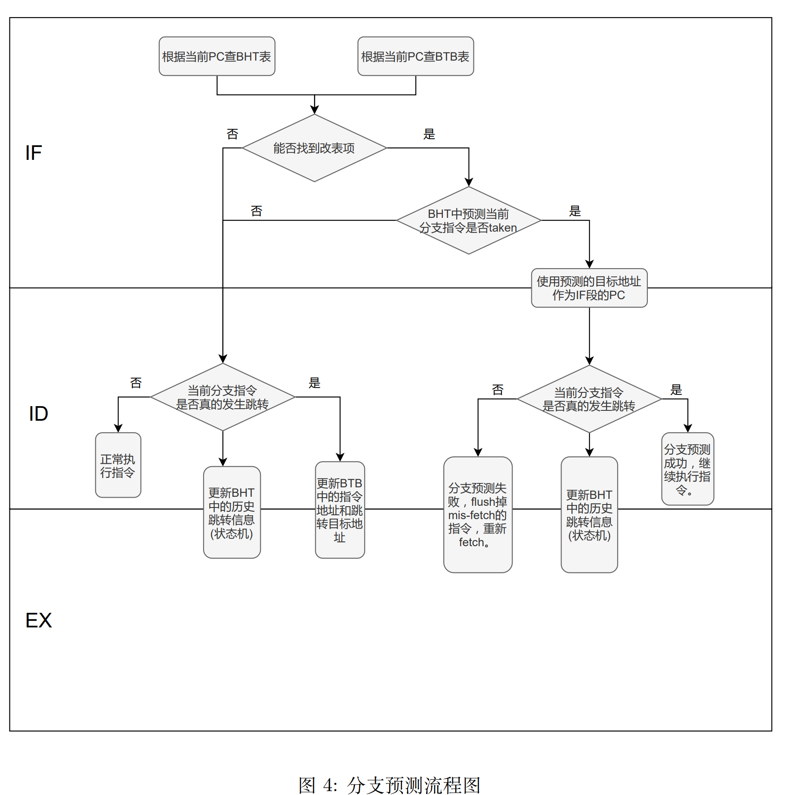

### 4. 具体实现

#### 4.1 接口

使用的是新框架，首先弄清楚这个框架的基本架构，通过`datapath`的接口推断出我们所要实现的函数接口，对于接口的描述已经在代码中注释，不再赘述：

```verilog
module Branch_Prediction(
    input clk,
    input rst,

    input[7:0] PC_Branch,//当前指令的PC
    output taken, //预测是否要跳转
    output reg [7:0] PC_to_take, //表中跳转的目标地址的PC

    input J,//指示当前在ID阶段的指令是否是跳转指令（包括J型指令等）
    input Branch_ID,//来自CtrlUnit模块，Branch是否真的跳转
    input[7:0] PC_to_branch, //跳转目标地址，BTB表中存储
    output reg refetch //预测失败，重新获取
    );
```

#### 4.2 变量信号

- 为了代码直观，把`PC_Branch`重命名为`cur_PC`；
- `find_BHT`，表示在IF阶段在`BHT`中找到了对应的条目；`find_BTB`，表示在IF阶段在`BTB`中找到了对应的条目；`find_BHT_ID`，`find_BTB_ID`，记录的是上一次的情况；
- `status_BHT`记录从BHT中读取出来的两位状态信息；
- `refetch_ID`记录上一次的`refetch`情况，用于判断下一次的`refetch`；
- `PC_to_take_ID`记录上一次的预测地址，和真正的跳转地址做比较，用于判断下一次的`refetch`；

```verilog
wire[7:0] cur_PC;    assign cur_PC = PC_Branch;
reg [3:0] BHT[0:63];//BHT:[3:2]tag,[1:0]status
reg [9:0] BTB[0:63];//BTB:[9:8]tag,[7:0]PC

wire [5:0] index_IF;    reg [5:0] index_ID;
wire [1:0] tag_IF;      reg [1:0] tag_ID;
reg find_BHT, find_BTB, find_BHT_ID, find_BTB_ID;

reg [1:0] status_BHT_IF;  reg [1:0] status_BHT_ID;
reg refetch_ID;
reg [7:0] PC_to_take_ID;
integer i;

assign taken = status_BHT_IF[1] & find_BTB;
assign index_IF = cur_PC[5:0];
assign tag_IF = cur_PC[7:6];
```

#### 4.3 代码逻辑

##### 4.3.1 读取BHT和BTB的值，并判断refetch

这一部分因为只是读取操作，所以放在一起。

读取两个表的代码比较好理解，首先用`index`进行查找，再与查找到的内容进行比对，如果`tag`的相同，则表示查找成功，`find_BHT`和`status_BHT_IF`进行相应的赋值操作（注意，因为`BHT`和`BTB``tag`的初始化都是零，也就是说如果读入的`PC`的`tag`也是0，就算他是第一次被读到，也会被判定为查找成功）。

```verilog
				if(BHT[index_IF][3:2] == tag_IF)//find in BHT
   			begin
            find_BHT <= 1'b1;
            status_BHT_IF <= BHT[index_IF][1:0];
        end
        else
        begin
            find_BHT <= 1'b0;
            status_BHT_IF <= 2'b0;
        end

        if(BTB[index_IF][9:8] == tag_IF)//find in BTB
        begin
            find_BTB <= 1'b1;
            PC_to_take <= BTB[index_IF][7:0];
        end
        else
        begin
            find_BTB <= 1'b0;
            PC_to_take <= 8'b0;
        end

```

关于`refetch`如何赋值，分为三种情况。如果之前做过`refetch`，那就不做了。此外，使用`BTB`预测成功并且跳转的位置就是`PC_to_take_ID`（加`PC_to_branch == PC_to_take_ID`的原因是，比如`jalr`，可能表中的目标地址和实际跳转的不相同），也不用`refetch`。还有就是本来不跳转也预测不跳转（或者根本没找到），不用`refetch`。

除了以上三种情况之外，其他情况全部都要进行`refetch`。

```verilog
      if(refetch_ID || ((status_BHT_ID[1] & find_BTB_ID & find_BHT_ID) && Branch_ID && PC_to_branch == PC_to_take_ID) || ((~(status_BHT_ID[1] & find_BTB_ID)) && (~Branch_ID)))
        begin
           refetch <= 1'b0;
        end
        else
        begin
           refetch <= 1'b1;
        end
```

##### 4.3.2 更新BHT和BTB

这一部分需要用到时序，所以在`always@(posedge clk or posedge rst)`，`rst`不再赘述，把所有在ID阶段的信号置零，并把`BHT`和`BTB`置零；

首先，把IF段的一些信号给记录下来：

```verilog
    begin
        index_ID <= index_IF;
        tag_ID <= tag_IF;
        find_BHT_ID <= find_BHT;
        find_BTB_ID <= find_BTB;
        status_BHT_ID <= status_BHT_IF;
        refetch_ID <= refetch;
        PC_to_take_ID <= PC_to_take;
```

然后开始更新`BHT`和`BTB`，这一部分是完全按照实验书的流程图里来的。

- 预测分支跳转
  - 预测成功：按照状态表进行状态的转化，即改变`BHT`的后两位，并且将`PC_to_branch`赋给`BTB`（注意，预测成功并不意味着一定能跳转到正确的位置，所以就算是预测成功也要更新`BTB`）；
  - 预测失败：按照状态表进行状态的转化，因为没有跳转，所以就不需要更新`BTB`了；


```verilog
        if(find_BHT_ID && status_BHT_ID[1] == 1'b1)//预测分支跳转
        begin
            if(Branch_ID)//跳转预测成功
            begin
                BHT[index_ID][0] = 1'b1;
                BTB[index_ID] <= {tag_ID, PC_to_branch};//跳转而且预测成功不一定跳转到正确的地址
            end
            else//跳转但没跳
            begin
                if(status_BHT_ID == 2'b10)
                begin
                    BHT[index_ID][1:0] = 2'b00;
                end
                else
                begin
                    BHT[index_ID][1:0] = 2'b10;
                end
            end
        end
```

- 预测不跳转
  - 预测失败：进行相应的状态转化，并且更新`BTB`的值；
  - 预测成功：进行相应的状态转化；


```verilog 
else if(find_BHT_ID && status_BHT_ID[1] == 1'b0)//预测不跳转
        begin 
            if(Branch_ID)//预测没跳但是跳了
            begin
                if(status_BHT_ID == 2'b00)
                begin
                    BHT[index_ID][1:0] = 2'b01;
                end
                else
                begin
                    BHT[index_ID][1:0] = 2'b11;
                end
                BTB[index_ID] <= {tag_ID, PC_to_branch};
            end
            else
            begin
                BHT[index_ID][1:0] = 2'b00;
            end
        end
```

- 没有在表中找到相对应的条目：
  - 如果指令跳转：记录数据，进行`BHT`和`BTB`相应条目的初始化；
  - 如果指令不跳转却是跳转指令：更新`BHT`，不进行`BTB`的记录，也就是说只有在真的跳转的时候才会去更新`BTB`；

```verilog
else //没有查找到
        begin
            if(Branch_ID)
            begin
                BHT[index_ID] <= {tag_ID, 2'b10};
                BTB[index_ID] <= {tag_ID, PC_to_branch};
            end
            else if(J)
            begin
                BHT[index_ID] <= {tag_ID, 2'b01};
            end
        end
    end
```

### 5. 仿真与结果验证

#### 5.1 仿真

以如下指令为例进行展示，这条指令的`tag=2’b11`，`index=6’b001100`目标地址PC的记录位数为`8'b11001111=2'hcf`；

```assembly
80000330:	00c5e663          	bltu	a1,a2,8000033c <__udivsi3+0x38>
```

下表为一些执行的基本信息，可以与仿真截图对照，从而验证结果（BHT和BTB都是本次指令结束后的状态）：

| 时间/ns | BHT  | BTB  | 预测   | 实际   | refretch | 加速效果       |
| ------- | ---- | ---- | ------ | ------ | -------- | -------------- |
| 129     | 1101 | 000  | /      | 不跳转 | 否       | /              |
| 143     | 1111 | 3cf  | /      | 跳转   | 是       | /              |
| 153     | 1110 | 3cf  | /      | /      | /        | 这条指令被修正 |
| 211     | 1100 | 3cf  | 跳转   | 不跳转 | 是       | 减速           |
| 227     | 1101 | 3cf  | 不跳转 | 跳转   | 是       | 减速           |
| 277     | 1111 | 3cf  | 不跳转 | 跳转   | 是       | 减速           |
| 411     | 1111 | 3cf  | 跳转   | 跳转   | 否       | 加速           |
| 421 | 1110 | 3cf | 跳转 | 不跳转 | 是 | 减速 |
| 477 | 1111 | 3cf | 跳转 | 跳转 | 否 | 加速 |

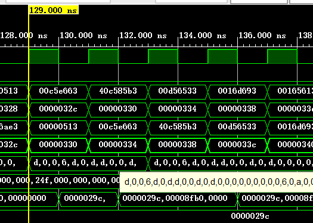

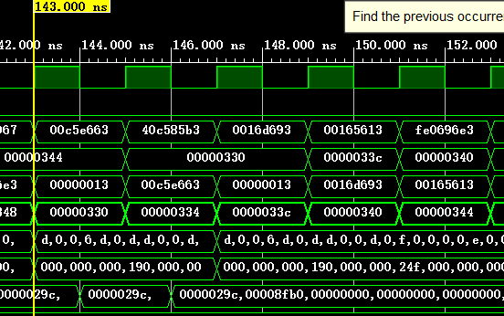

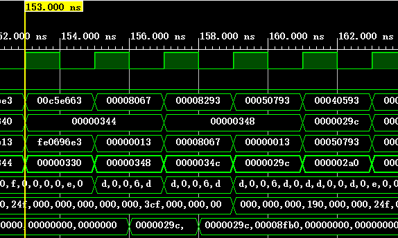

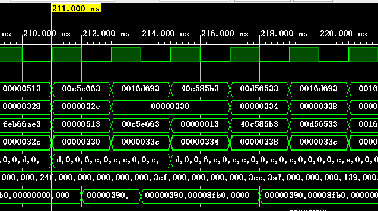

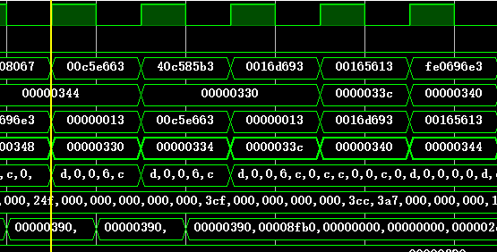

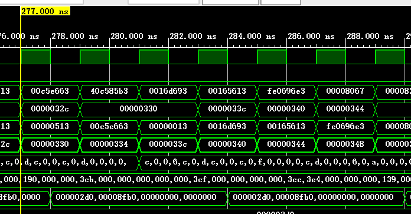

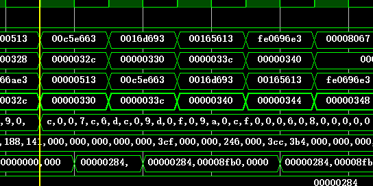

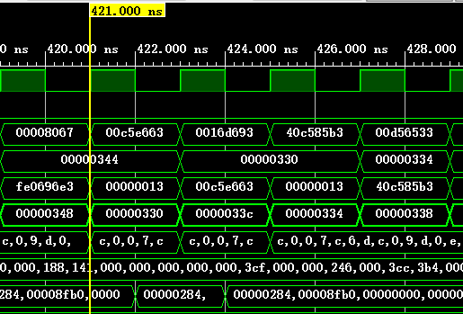

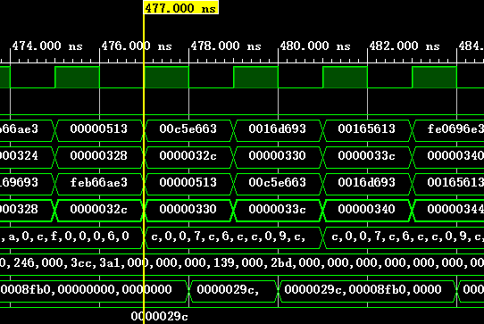

总体来看，得到运行完全部程序的总时间约为42.701us，对比原来程序运行同样的结果，明显减少时间；


#### 5.2 上板结果

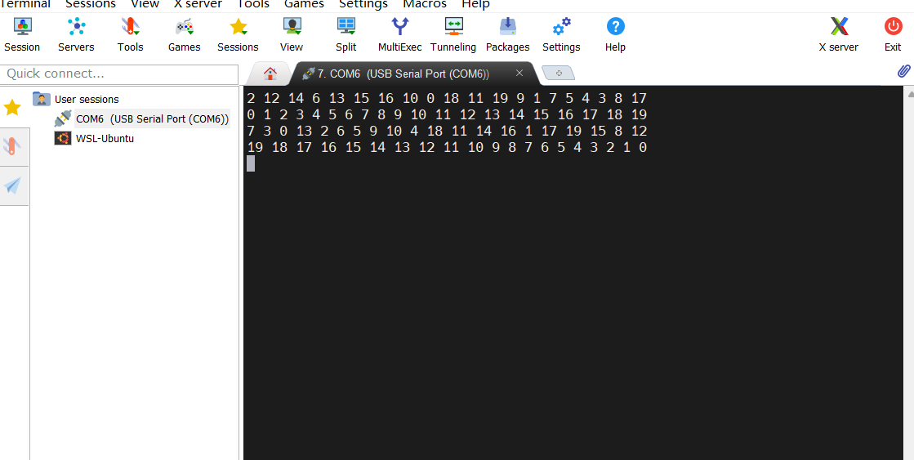

### 6. 思考题

1. 在报告里分析分支预测成功和预测失败时的相关波形。

```
这部分其实在5.1的仿真分析中已经有了较好的体现。如果预测成功，那么BHT会根据状态机进行相应的变化，程序会正确运行下去，而BTB不会发生变化（如果不是第一次的话）；如果预测失败，那么BHT仍然会进行相应的变化，程序会refretch，并对之前错误的预测指令进行flush。
```

2. 在正确实现 BTB 和 BHT 的情况下，有没有可能会出现 BHT 预测分支发生跳转，也就是 branch taken，但是 BTB 中查不到目标跳转地址，为什么？

```
不可能，如果确实发生了跳转，那么BTB会保存跳转的地址和tag，之后taken肯定会找到BTB的位置，而如果未发生跳转，此时只会在BHT表中记录tag，不会记录BTB。这是第一次读到指令的情况。
而若下一次进入，假设上一次是不跳转的，如果这一次仍然不跳转，那么taken不会成立，如果发生跳转，此时状态机变成了11，存储了BTB的地址，但是因为本次不会taken（taken = status_BHT_IF[1] & find_BTB），所以也不会出现问题。
```

3. 前面介绍的 BHT 和 BTB 都是基于内容检索，即通过将当前 PC 和表中存储的 PC 比较来确定分支信息存储于哪一表项。这种设计很像一个全相联的 cache，硬件逻辑实际上会比较复杂，那么能否参考直接映射或组相联的 cache 来简化 BHT/BTB 的存储和检索逻辑？请简述你的思路。

```
若采用直接映射，规定对应的index到对应的地址。比如令1-16全部映射到cache的第一块，17-32全部吧映射到cache的第二块......如果访问对应的index，将下次跳转的地址存入BTB表，这样做可以直接查询到对应的index下有没有记录地址。
若采用组相联映射，将对应index下不同tag的地址存在一个模块，根据最新跳转的地址信息替换掉原来的信息，不断更新。
```

4. 分析代码：
```
addi t0, x0, 100
loop1:
addi t1, x0, 100
loop2:
addi t2, x0, 100
loop3:
addi t2, t2, -1
bne t2, x0, loop3
addi t1, t1, -1
bne t1, x0, loop2
addi t0, t0, -1
bne t0, x0, loop1
```
第一次进入和出loop3会失败三次，之后每次进入loop3只会失败一次，所以会失败10002次；

|      |      |       | 原状态 | 预测 | 实际 | 现状态 | 预测 |
| ---- | ---- | ----- | ------ | ---- | ---- | ------ | ---- |
| 1    | 1    | loop3 | 00     | no   | yes  | 01     | 失败 |
| 1    | 2    | loop3 | 01     | no   | yes  | 11     | 失败 |
| 1    | 3    | loop3 | 11     | yes  | yes  | 11     | 成功 |
| 1    | 100  | loop3 | 11     | yes  | no   | 10     | 失败 |
| 2    | 1    | loop3 | 10     | yes  | yes  | 11     | 成功 |
| 2    | 100  | loop3 | 11     | yes  | no   | 10     | 失败 |
| 3    | 1    | loop3 | 10     | yes  | yes  | 11     | 成功 |
| 3    | 100  | loop3 | 10     | yes  | no   | 11     | 失败 |
|      |      |       |        |      |      |        |      |

每次进入和出loop3都会失败2次，而loop3会进行10000次，所以会失败20000次；

|      |      |       | 原状态 | 预测 | 实际 | 现状态 | 预测 |
| ---- | ---- | ----- | ------ | ---- | ---- | ------ | ---- |
| 1    | 1    | loop3 | 0      | no   | yes  | 1      | 失败 |
| 1    | 2    | loop3 | 1      | yes  | yes  | 1      | 成功 |
| 1    | 100  | loop3 | 1     | yes  | no   | 0     | 失败 |
| 2    | 1    | loop3 | 0    | no | yes  | 1     | 失败 |
| 2    | 2    | loop3 | 1      | yes  | yes  | 1      | 成功 |
| 2    | 100  | loop3 | 1     | yes  | no   | 0     | 失败 |

其他几个循环的情况和loop3的情况类似；

### 7. 实验感想
本次实验经过长久的考量还是选择使用了新的框架，纠结了好几天，最后发现自己的框架MEM阶段才跳转，本来就是在是否跳转算出来之后再跳转的，再改的话，估计又是另一个lab0了，还是算了。新框架看着吓人，其实也还行（可能是我只看了datapath的缘故），当然那些hazard似乎还是没有看得太明白，不过不太影响lab本身，代码依照着那个流程图原模原样的写，马上就写完了，然后就开始调试了，中间还是发现了挺多的问题的，比如说预测成功并不意味着跳转一定成功，因为BTB存着的不一定是真正的这次的跳转地址，另外，因为BTB和BHT初始化等于0，所以当PC的tag为0的时候，即使是第一次出现也会被当作找到，当然还有一些小问题。最后在综合的时候，还因为top.v（框架里有两个top.v）弄错了，一直没成功，好在最后有惊无险，在分析的时候做了很多的表格，这下对分支预测可熟悉了太多了。
