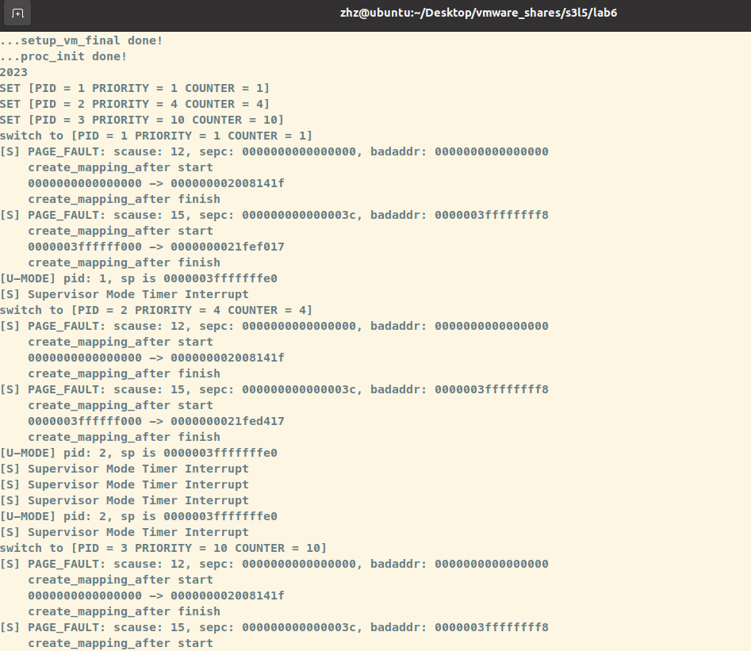
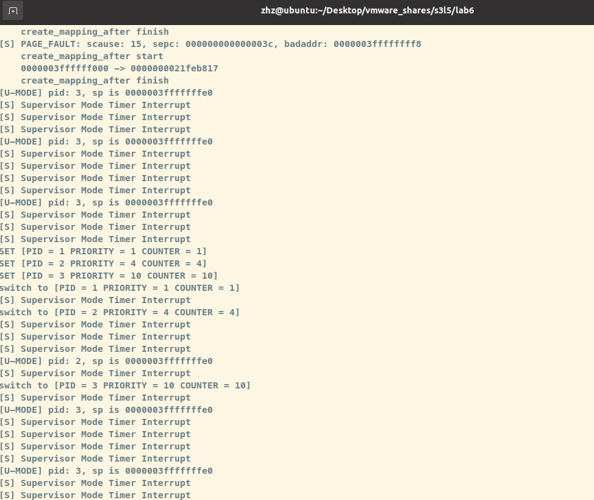
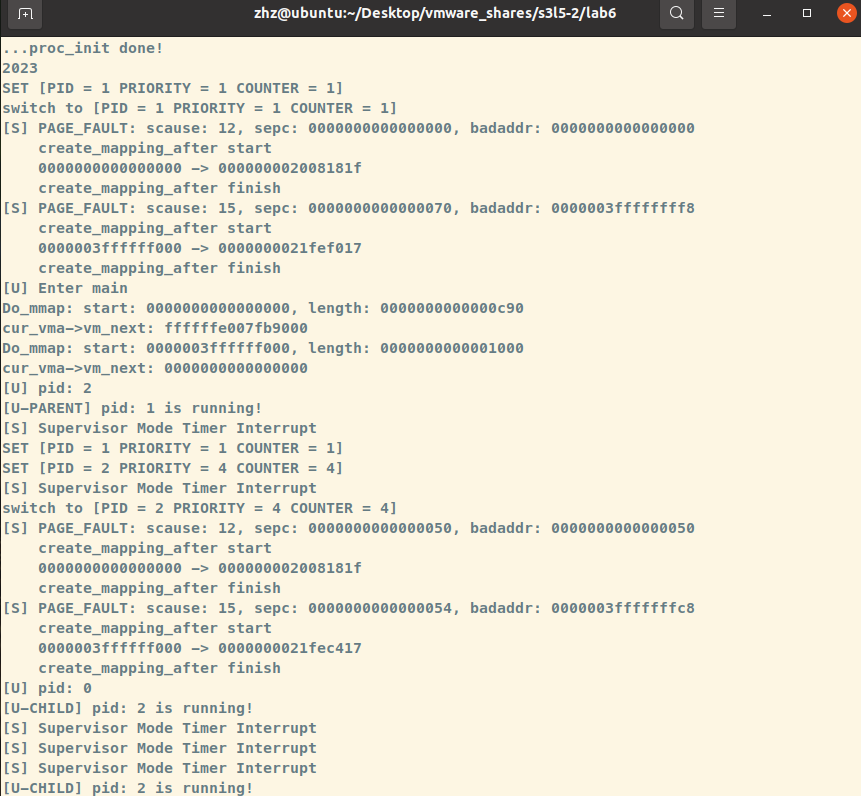
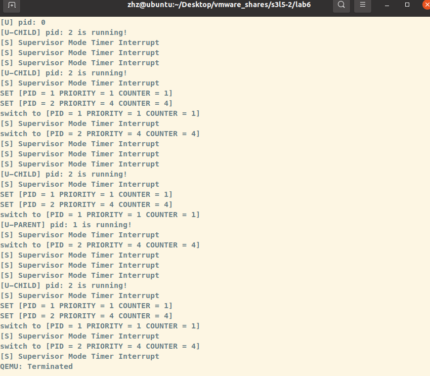
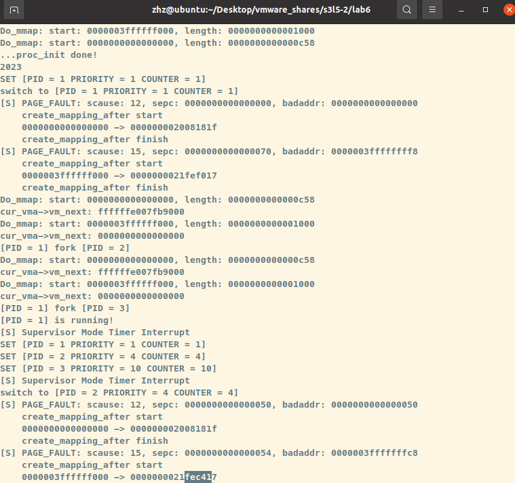
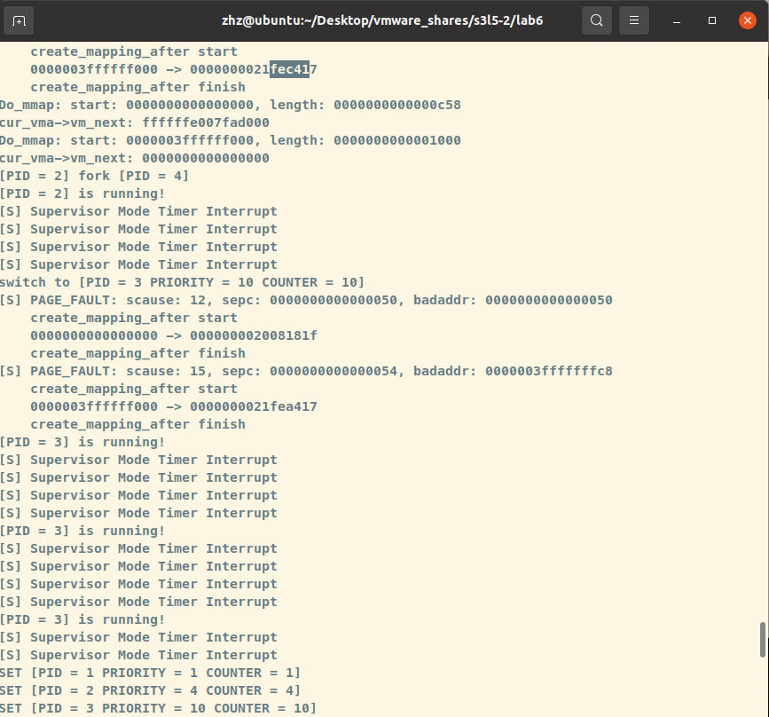
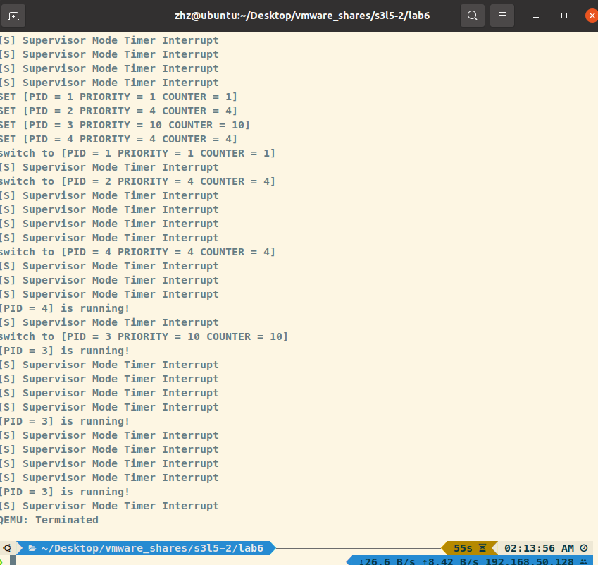
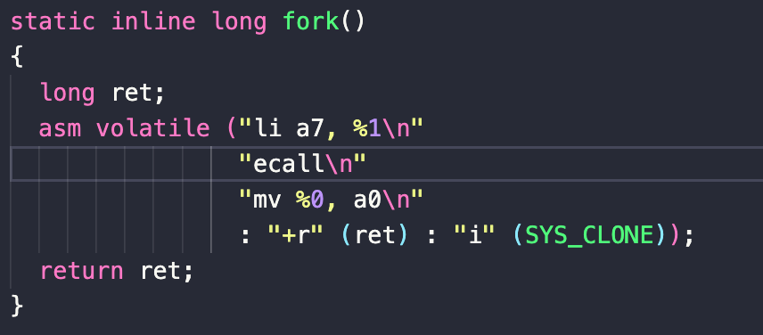

# 实验 5：RV64 缺页异常处理以及 fork 机制

## 1. 实验目的

- 通过 **vm_area_struct** 数据结构实现对进程**多区域**虚拟内存的管理。
- 在 **Lab4** 实现用户态程序的基础上，添加缺页异常处理 **Page Fault Handler**。
- 为进程加入 **fork** 机制，能够支持通过 **fork** 创建新的用户态进程。

## 2. 实验环境

- Ubuntu 20.04
- VMware

## 3. 背景知识

- [浙江大学23年春夏系统三实验指导](https://parfaity.gitee.io/sys3lab-2023-stu/lab5/)

## 4. 实验步骤

### 4.1 准备工作

- 此次实验基于 lab4 同学所实现的代码进行。
- 从 repo 同步 user 文件夹，并替换上个实验的 user 文件夹。
- 在 `user/getpid.c` 中设置了三个 `main` 函数。在实现了 `Page Fault` 之后第一个 `main` 函数可以成功运行。在实现了 `fork` 之后其余两个 `main` 函数可以成功运行。

### 4.2 实现虚拟内存管理功能

#### `proc.h` 

每一个 vm_area_struct 都对应于进程地址空间的唯一区间。

```c
/* vm_area_struct vm_flags */
#define VM_READ     0x00000001
#define VM_WRITE    0x00000002
#define VM_EXEC     0x00000004

struct vm_area_struct {
    struct mm_struct *vm_mm;    /* The mm_struct we belong to. */
    uint64 vm_start;          /* Our start address within vm_mm. */
    uint64 vm_end;            /* The first byte after our end address 
                                    within vm_mm. */

    /* linked list of VM areas per task, sorted by address */
    struct vm_area_struct *vm_next, *vm_prev;

    uint64 vm_flags;      /* Flags as listed above. */
};

struct mm_struct {
    struct vm_area_struct *mmap;       /* list of VMAs */
};

struct task_struct {
	...
    struct mm_struct *mm;
};
```

#### `proc.c`

- 为了支持 `Demand Paging`（见 4.3），我们需要支持对 `vm_area_struct` 的添加，查找。

- `find_vma`函数：实现对`vm_area_struct`的查找
  - 根据传入的地址 `addr`，遍历链表 `mm` 包含的 vma 链表，找到该地址所在的 `vm_area_struct`。
  - 如果链表中所有的 `vm_area_struct` 都不包含该地址，则返回 `NULL`。

```c
/*
* @mm          : current thread's mm_struct
* @address     : the va to look up
*
* @return      : the VMA if found or NULL if not found
*/

struct vm_area_struct *find_vma(struct mm_struct *mm, uint64 addr){
    if(mm == NULL) return NULL;
    struct vm_area_struct *cur_vma = mm->mmap;
    if(cur_vma == NULL) return NULL;
    while(cur_vma->vm_next){
        if(addr >= cur_vma->vm_start && addr < cur_vma->vm_end) return cur_vma;
        cur_vma = cur_vma->vm_next;
    }
    if(addr >= cur_vma->vm_start && addr < cur_vma->vm_end) return cur_vma;
    return NULL;
}
```

- `do_mmap`函数：实现`vm_area_struct`的添加
  - 新建 `vm_area_struct` 结构体，根据传入的参数对结构体赋值，并添加到 `mm` 指向的 vma 链表中。
  - 需要检查传入的参数 `[addr, addr + length)` 是否与 vma 链表中已有的 `vm_area_struct` 重叠，如果存在重叠，则需要调用 `get_unmapped_area` 函数寻找一个其它合适的位置进行映射。

```c
/*
 * @mm     : current thread's mm_struct
 * @addr   : the suggested va to map
 * @length : memory size to map
 * @prot   : protection
 *
 * @return : start va
*/

uint64 do_mmap(struct mm_struct *mm, uint64 addr, uint64 length, int prot){
    struct vm_area_struct *new_vma = (struct vm_area_struct *)kalloc();
    new_vma->vm_mm = mm;
    new_vma->vm_flags = prot;
    struct vm_area_struct *cur_vma_of_mm = mm->mmap;
    printk("Do_mmap: start: %lx, length: %lx\n", addr, length);
    if(cur_vma_of_mm == NULL){
        //列表中没有节点
        mm->mmap = new_vma;
        new_vma->vm_start = addr;
        new_vma->vm_end = addr + length;
        new_vma->vm_prev = NULL;
        new_vma->vm_next = NULL;

        return new_vma->vm_start;

    }else if(addr < cur_vma_of_mm->vm_start && cur_vma_of_mm->vm_start - addr > length){
        //可以在列表的最前端插入
        cur_vma_of_mm->vm_prev = new_vma;
        
        mm->mmap = new_vma;
        new_vma->vm_start = addr;
        new_vma->vm_end = addr + length;
        new_vma->vm_prev = NULL;
        new_vma->vm_next = cur_vma_of_mm;

        return new_vma->vm_start;

    }else if(addr < cur_vma_of_mm->vm_start && cur_vma_of_mm->vm_start - addr <= length){
        //直接和第一个块重叠
        addr = get_unmapped_area(mm, length);

        //找出新的地址后，寻找插入的位置并插入
        while(cur_vma_of_mm->vm_next){
            if(addr >= cur_vma_of_mm->vm_end && addr < cur_vma_of_mm->vm_next->vm_start) break;
            cur_vma_of_mm = cur_vma_of_mm->vm_next;
        }

        cur_vma_of_mm->vm_next = new_vma;
        if(cur_vma_of_mm->vm_next) cur_vma_of_mm->vm_next->vm_prev = new_vma;
        
        new_vma->vm_start = addr;
        new_vma->vm_end = addr + length;
        new_vma->vm_prev = cur_vma_of_mm;
        new_vma->vm_next = cur_vma_of_mm->vm_next;

        return addr;
    }else{
        //剩下的情况都是addr比第一个结点起始地址大的情况
        //寻找冲突，修改addr，如果没有冲突则不会修改
        while(cur_vma_of_mm->vm_next){
            if(addr < cur_vma_of_mm->vm_end){
                addr = get_unmapped_area(mm, length);
                break;
            }else if(addr < cur_vma_of_mm->vm_next->vm_start && length > cur_vma_of_mm->vm_next->vm_start - addr){
                addr = get_unmapped_area(mm, length);
                break;
            }
            cur_vma_of_mm = cur_vma_of_mm->vm_next;
        }

        if(addr < cur_vma_of_mm->vm_end && cur_vma_of_mm->vm_next == NULL) addr = get_unmapped_area(mm, length);//如果跟最后一块重叠

        //类似的处理和第一块重叠的情况，寻找插入位置并插入
        cur_vma_of_mm = mm->mmap;
        while(cur_vma_of_mm->vm_next){
            if(addr >= cur_vma_of_mm->vm_end && addr < cur_vma_of_mm->vm_next->vm_start) break;
            cur_vma_of_mm = cur_vma_of_mm->vm_next;
        }

        struct vm_area_struct *next_vma = cur_vma_of_mm->vm_next;
        cur_vma_of_mm->vm_next = new_vma;
        if(next_vma) cur_vma_of_mm->vm_next->vm_prev = new_vma;
        
        new_vma->vm_start = addr;
        new_vma->vm_end = addr + length;
        new_vma->vm_prev = cur_vma_of_mm;
        new_vma->vm_next = next_vma;

        return addr;
    }
}
```

- `get_unmapped_area`函数：用于解决`do_mmap`中`addr`与已有 vma 重叠的情况

  - 我们采用最简单的暴力搜索方法来寻找未映射的长度为 `length`（按页对齐）的虚拟地址区域。
  - 从 `0` 地址开始向上以 `PGSIZE` 为单位遍历，直到遍历到连续 `length` 长度内均无已有映射的地址区域，将该区域的首地址返回。

```c
uint64 get_unmapped_area(struct mm_struct *mm, uint64 length){
    struct vm_area_struct *cur_vma = mm->mmap;
    uint64 addr = 0;
    if(cur_vma->vm_start >= length) return addr;
    else{
        while(cur_vma->vm_next){
            if(cur_vma->vm_next->vm_start - cur_vma->vm_end >= length) return cur_vma->vm_end; 
            cur_vma = cur_vma->vm_next;
        }
        return cur_vma->vm_end;
    }
}
```

### 4.3 Page Fault Handler

* `Demand Paging`
    * 在调用 `do_mmap` 映射页面时，我们不直接对页表进行修改，只是在该进程所属的 `mm->mmap` 链表上添加一个 `vma` 记录。
    * 当我们真正访问这个页面时，会触发缺页异常。在缺页异常处理函数中，我们需要根据缺页的地址，找到该地址对应的 `vma`，根据 `vma` 中的信息对页表进行映射。
* 修改 `task_init` 函数代码，更改为 `Demand Paging`
    * 删除之前实验中对 `U-MODE` 代码，栈进行映射的代码
    * 调用 `do_mmap` 函数，为进程的 vma 链表添加新的 `vm_area_struct` 结构，从而建立用户进程的虚拟地址空间信息，包括两个区域：
        * 代码区域, 该区域从虚拟地址 `USER_START` 开始，大小为 `uapp_end - uapp_start`， 权限为 `VM_READ | VM_WRITE | VM_EXEC`
        * 用户栈，范围为 `[USER_END - PGSIZE, USER_END)` ，权限为 `VM_READ | VM_WRITE`

```c
...
for(int i = 1; i < task_num/*NR_TASKS*/; i++){
    	task[i] = (struct task_struct*)kalloc();
    	// 其中每个线程的 state 为 TASK_RUNNING, counter 为 0, 
    	// priority 使用 rand() 来设置, pid 为该线程在线程数组中的下标。
    	task[i]->state = TASK_RUNNING;
    	task[i]->counter = 0;
    	task[i]->priority = rand() % (PRIORITY_MAX - PRIORITY_MIN + 1) + PRIORITY_MIN;
    	task[i]->pid = i;
    	
    	// 为 task[1] ~ task[NR_TASKS - 1] 设置 `thread_struct` 中的 `ra` 和 `sp` ,
    	// 其中 `ra` 设置为 __dummy （见 4.3.2）的地址， `sp` 设置为 该线程申请的物理页的高地址
    	task[i]->thread.ra = (uint64)__dummy;
    	task[i]->thread.sp = (uint64)(task[i]) + PGSIZE;
    	
        //sys3-lab5
        task[i]->mm = (struct mm_struct *)kalloc();
        task[i]->mm->mmap = NULL;
    	//sys3-lab4
    	
    	task[i]->thread.sepc = USER_START;
    	task[i]->thread.sstatus = csr_read(sstatus);
    	task[i]->thread.sstatus &= ~(1<<8); 
    	task[i]->thread.sstatus |=  0x00040020;//(1 << 5) | (1 << 18);
        csr_write(sstatus, task[i]->thread.sstatus);//
    	task[i]->thread.sscratch = USER_END;
    	
    	unsigned long u_mode_stack = (unsigned long)kalloc();
        task[i]->thread_info = (struct thread_info *)kalloc();
        task[i]->thread_info->user_sp = u_mode_stack + PGSIZE;
    	unsigned long pagetable_v = (unsigned long)kalloc();
    	for(int i = 0; i < 512; i++){
    	  *((unsigned long*)((unsigned long*)pagetable_v + i)) = swapper_pg_dir[i]; 
    	}
    	
    	//create_mapping_after((unsigned long*)pagetable_v, USER_START, (unsigned long)uapp_start - PA2VA_OFFSET, (unsigned long)uapp_end - (unsigned long)uapp_start, 31);
    	//create_mapping_after((unsigned long*)pagetable_v, USER_END - PGSIZE, u_mode_stack - PA2VA_OFFSET, PGSIZE, 23);
    	
        unsigned long cur_satp = csr_read(satp);
    	cur_satp = (cur_satp >> 44) << 44 | ((pagetable_v - PA2VA_OFFSET) >> 12);
    	task[i]->pgd = (unsigned long *)cur_satp;

        //sys3-lab5
        do_mmap(task[i]->mm, USER_END - PGSIZE, PGSIZE, VM_READ | VM_WRITE);
        do_mmap(task[i]->mm, USER_START, (unsigned long)uapp_end - (unsigned long)uapp_start, VM_READ | VM_WRITE | VM_EXEC);
    }
...
```

* 实现 Page Fault 的检测与处理
    * 修改`trap.c`，添加捕获 Page Fault 的逻辑。
    * 当捕获了 `Page Fault` 之后，需要实现缺页异常的处理函数  `do_page_fault`。
    * 在最后利用 `create_mapping` 对页表进行映射时，需要对 Bad Address 进行判断。若 Bad Address 在用户态代码段的地址范围内（即 `USER_START` 开始的一段内存），则需要将其映射到 `uapp_start` 所在的物理地址；若是其它情况，则用 `kalloc` 新建一块内存区域，并将 Bad Address 所属的页面映射到该内存区域。

```c
extern struct task_struct *current;
extern char uapp_start[];
extern char uapp_end[];

void do_page_fault(struct pt_regs *regs, unsigned long scause, unsigned long sepc) {
    /*
    1. 通过 stval 获得访问出错的虚拟内存地址（Bad Address）
    2. 通过 scause 获得当前的 Page Fault 类型
    3. 通过 find_vm() 找到对应的 vm_area_struct
    4. 通过 vm_area_struct 的 vm_flags 对当前的 Page Fault 类型进行检查
        4.1 Instruction Page Fault      -> VM_EXEC
        4.2 Load Page Fault             -> VM_READ
        4.3 Store Page Fault            -> VM_WRITE
    5. 最后调用 create_mapping 对页表进行映射
    */
    unsigned long bad_address = csr_read(stval);
	printk("[S] PAGE_FAULT: scause: %d, sepc: %lx, badaddr: %lx\n", scause, sepc, bad_address);
	struct vm_area_struct *cur_vma = find_vma(current->mm, bad_address);
	if(cur_vma == NULL){
		do_mmap(current->mm, bad_address, PGSIZE, 0);
		cur_vma = find_vma(current->mm, bad_address);
	}

	int perm = 0;
	switch(scause){
		case 12: 
			cur_vma->vm_flags |= VM_EXEC; 
			perm = 0b10001 | (cur_vma->vm_flags << 1); 
			break;
		case 13:
			cur_vma->vm_flags |= VM_READ; 
			perm = 0b10001 | (cur_vma->vm_flags << 1); 
			break;
		case 15:
			cur_vma->vm_flags |= VM_WRITE; 
			perm = 0b10001 | (cur_vma->vm_flags << 1); 
			break;
		default:
			break;
	}

	unsigned long *pgtbl = (unsigned long *)((((unsigned long)current->pgd & 0xfffffffffff) << 12) + PA2VA_OFFSET);

	if(bad_address >= USER_START && bad_address < (USER_START + (unsigned long)uapp_end - (unsigned long)uapp_start)){
		create_mapping_after(pgtbl, cur_vma->vm_start, (unsigned long)uapp_start - PA2VA_OFFSET, (unsigned long)uapp_end - (unsigned long)uapp_start, 31);
	}else if(cur_vma->vm_start == USER_END - PGSIZE){
		create_mapping_after(pgtbl, USER_END - PGSIZE, current->thread_info->user_sp - PGSIZE - PA2VA_OFFSET, PGSIZE, 23);
	}else{
		unsigned long address = (unsigned long)kalloc();
		create_mapping_after(pgtbl, cur_vma->vm_start, address - PA2VA_OFFSET, PGSIZE, perm);
	}
	
	return;
}

```

### 4.4 实现 fork()

- 修改 `task_init` 函数中修改为仅初始化一个进程，之后其余的进程均通过 `fork` 创建。

* 修改 `task_struct` 增加结构成员 `trapframe`。`trapframe` 成员用于保存异常上下文，当我们 `fork` 出来一个子进程时候，我们将父进程用户态下的上下文环境复制到子进程的 `trapframe` 中。当子进程被调度时候，我们可以通过 `trapframe` 来恢复该上下文环境。

* fork() 所调用的 syscall 为 `SYS_CLONE`，系统调用号为 220，所以在`syscall.h`中作相应的声明。

* 实现 `clone` 函数的相关代码如下， 为了简单起见 `clone` 只接受一个参数 `pt_regs *`。
```c
void forkret() {
    ret_from_fork(current->trapframe);
}

uint64 do_fork(struct pt_regs *regs) {
	...
}

uint64 clone(struct pt_regs *regs) {
    return do_fork(regs);
}
```

* 实现 `do_fork` 
    * 参考 `task_init` 创建一个新的子进程，设置好子进程的 state, counter, priority, pid 等，并将该子进程正确添加至到全局变量 `task` 数组中。子进程的 counter 可以先设置为0，子进程的 pid 按照自定的规则设置即可（例如每 fork 一个新进程 pid 即自增）。
    * 创建子进程的用户栈，将子进程用户栈的地址保存在 `thread_info->user_sp` 中，并将父进程用户栈的内容拷贝到子进程的用户栈中。
    * 正确设置子进程的 `thread` 成员变量。
        * 在父进程用户态中调用 `fork` 系统调用后，`task` 数组会增加子进程的元数据，子进程便可能在下一次调度时被调度。当子进程被调度时，即在 `__switch_to` 中，会从子进程的 `thread` 等成员变量中取出在 `do_fork` 中设置好的成员变量，并装载到寄存器中。
        * 设置 `thread.ra` 为 `forkret`，设置 `thread.sp`, `thread.sscratch` 为子进程的内核栈 sp，设置 `thread.sepc` 为父进程用户态 `ecall` 时的 pc 值。
        * 类似 `task_init`，设置 `thread.sstatus`。
        * 同学们在实现这部分时需要结合 `trap_frame` 的设置，先思考清楚整个流程，再进行编码。
    * 正确设置子进程的 `pgd` 成员变量，为子进程分配根页表，并将内核根页表 `swapper_pg_dir` 的内容复制到子进程的根页表中，从而对于子进程来说只建立了内核的页表映射。
    * 正确设置子进程的 `mm` 成员变量，复制父进程的 vma 链表。
    * 正确设置子进程的 `trapframe` 成员变量。将父进程的上下文环境（即传入的 `regs`）保存到子进程的 `trapframe` 中。
        * 由于我们希望保存父进程在用户态下的上下文环境，而在进入 `trap_handler` 之前我们将 用户态 sp 与 内核态 sp 进行了交换，因此需要修改 `trapframe->sp` 为父进程的 用户态 sp。
        * 将子进程的 `trapframe->a0` 修改为 0。
    * 注意，对于 `sepc` 寄存器，可以在 `__switch_to` 时根据 `thread` 结构，随同 `sstatus`, `sscratch`, `satp` 一起设置好，也可以在 `ret_from_fork` 里根据子进程的 `trapframe` 设置。同时需要正确设置 `sepc + 4`。 选择自己喜欢的实现方式即可。
    * 返回子进程的 pid。

```c
uint64 do_fork(struct pt_regs *regs) {
    current->trapframe = regs;

    int i = task_num;
    task[i] = (struct task_struct*)kalloc();
    task[i]->state = TASK_RUNNING;
    task[i]->counter = 0;
    task[i]->priority = rand() % (PRIORITY_MAX - PRIORITY_MIN + 1) + PRIORITY_MIN;
    task[i]->pid = i;
    	
    task[i]->thread.ra = (uint64)forkret; // 设置 thread.ra 为 forkret
    task[i]->thread.sp = (uint64)(task[i]) + PGSIZE; // 设置 thread.sp, thread.sscratch 为子进程的内核栈 sp
    	
    //sys3-lab5
    task[i]->mm = (struct mm_struct *)kalloc();
    task[i]->mm->mmap = NULL;
    
    task[i]->thread.sepc = regs->sepc; //父进程用户态 ecall 时的 pc 值
    task[i]->thread.sstatus = csr_read(sstatus);
    task[i]->thread.sstatus &= ~(1<<8);
    task[i]->thread.sstatus |=  0x00040020;//(1 << 5) | (1 << 18);
    csr_write(sstatus, task[i]->thread.sstatus);//
    task[i]->thread.sscratch = (uint64)task[i] + PGSIZE; // 设置 thread.sp, thread.sscratch 为子进程的内核栈 sp
    	
    unsigned long u_mode_stack = (unsigned long)kalloc();
    task[i]->thread_info = (struct thread_info *)kalloc();
    task[i]->thread_info->user_sp = u_mode_stack + PGSIZE;
    unsigned long *the_user_stack = ((unsigned long*)(USER_END-PGSIZE));
    for(int a = 0; a < 512; a++){
        ((unsigned long *)u_mode_stack)[a] = the_user_stack[a]; // 拷贝用户栈的内容
    }

    unsigned long pagetable_v = (unsigned long)kalloc();
    for(int a = 0; a < 512; a++){
      *((unsigned long*)((unsigned long*)pagetable_v + a)) = swapper_pg_dir[a]; 
    }
    	 	
    unsigned long cur_satp = csr_read(satp);
    cur_satp = (cur_satp >> 44) << 44 | ((pagetable_v - PA2VA_OFFSET) >> 12);
    task[i]->pgd = (unsigned long *)cur_satp;

    // 正确设置子进程的 mm 成员变量，复制父进程的 vma 链表。
    struct vm_area_struct *cur_vma = current->mm->mmap;
    while(cur_vma){
        do_mmap(task[i]->mm, cur_vma->vm_start, cur_vma->vm_end - cur_vma->vm_start, cur_vma->vm_flags);
        cur_vma = cur_vma->vm_next;
        printk("cur_vma->vm_next: %lx\n", (unsigned long)cur_vma);
    }
    
    // 正确设置子进程的 trapframe 成员变量。将父进程的上下文环境（即传入的 regs）保存到子进程的 trapframe 中。
    task[i]->trapframe = (struct pt_regs *)kalloc();
    //task[i]->trapframe->sstatus = regs->sstatus;

    task[i]->trapframe->x0 = regs->x0;
    task[i]->trapframe->ra = regs->ra; 
    task[i]->trapframe->sp = csr_read(sscratch);   
    task[i]->trapframe->gp = regs->gp;  
    task[i]->trapframe->tp = regs->tp;
    task[i]->trapframe->t0 = regs->t0;   
    task[i]->trapframe->t1 = regs->t1;   
    task[i]->trapframe->t2 = regs->t2; 
    task[i]->trapframe->s0 = regs->s0; 
    task[i]->trapframe->s1 = regs->s1; 
    task[i]->trapframe->a0 = 0; 
    task[i]->trapframe->a1 = regs->a1;
    task[i]->trapframe->a2 = regs->a2; 
    task[i]->trapframe->a3 = regs->a3; 
    task[i]->trapframe->a4 = regs->a4; 
    task[i]->trapframe->a5 = regs->a5;
    task[i]->trapframe->a6 = regs->a6; 
    task[i]->trapframe->a7 = regs->a7;
    task[i]->trapframe->s2 = regs->s2; 
    task[i]->trapframe->s3 = regs->s3;
    task[i]->trapframe->s4 = regs->s4;
    task[i]->trapframe->s5 = regs->s5;
    task[i]->trapframe->s6 = regs->s6; 
    task[i]->trapframe->s7 = regs->s7;
    task[i]->trapframe->s8 = regs->s8;
    task[i]->trapframe->s9 = regs->s9; 
    task[i]->trapframe->s10 = regs->s10; 
    task[i]->trapframe->s11 = regs->s11; 
    task[i]->trapframe->t3 = regs->t3;
    task[i]->trapframe->t4 = regs->t4;
    task[i]->trapframe->t5 = regs->t5;
    task[i]->trapframe->t6 = regs->t6; 
    task[i]->trapframe->sepc = regs->sepc; 

    task_num++;
    return task[i]->pid;
}
```

* 参考 `_trap` 中的恢复逻辑，在 `entry.S` 中实现 `ret_from_fork`，函数原型如下：
    * 注意恢复寄存器的顺序
    * `_trap` 中是从 `stack` 上恢复，这里从 `trapframe` 中恢复

```assembly
ret_from_fork:
    ld t0, 32*8(a0)
    addi t0, t0, 4
    csrw sepc, t0
    
    ld x0, 0(a0)
    ld x1, 1*8(a0)
    ld x2, 2*8(a0)
    ld x3, 3*8(a0)
    ld x4, 4*8(a0)
    ld x5, 5*8(a0)
    ld x6, 6*8(a0)
    ld x7, 7*8(a0)
    ld x8, 8*8(a0)
    ld x9, 9*8(a0)
    ld x11, 11*8(a0)
    ld x12, 12*8(a0)
    ld x13, 13*8(a0)
    ld x14, 14*8(a0)
    ld x15, 15*8(a0)
    ld x16, 16*8(a0)
    ld x17, 17*8(a0)
    ld x18, 18*8(a0)
    ld x19, 19*8(a0)
    ld x20, 20*8(a0)
    ld x21, 21*8(a0)
    ld x22, 22*8(a0)
    ld x23, 23*8(a0)
    ld x24, 24*8(a0)
    ld x25, 25*8(a0)
    ld x26, 26*8(a0)
    ld x27, 27*8(a0)
    ld x28, 28*8(a0)
    ld x29, 29*8(a0)
    ld x30, 30*8(a0)
    ld x31, 31*8(a0)
    ld x10, 10*8(a0)

    sret
```

* 修改 Page Fault 处理：
    * 在之前的 Page Fault 处理中，我们对用户栈 Page Fault 处理方法是用 `kalloc` 自由分配一页作为用户栈并映射到 `[USER_END - PAGE_SIZE, USER_END)` 的虚拟地址。但由 `fork` 创建的进程，它的用户栈已经新建且拷贝完毕，因此 Page Fault 处理时直接为该已经分配的页建立映射即可（通过  `thread_info->user_sp` 来进行判断）。

### 4.5 编译及测试

第一个main()





第二个main()





第三个main()








## 5. 思考题

题目：根据同学们的实现，分析父进程在用户态执行 `fork` 至子进程被调度并在用户态执行的过程，最好能够将寄存器状态的变化过程清晰说明。

- 父进程在用户态执行ecall指令，产生中断
- 进入_ traps，因为是在用户态，所以切换到了内核态的栈，`sp = 0xffffffe007fb5000`，`sscratch = 0x3fffffffc0`
- _traps调用trap_handler()，trap_handler()调用syscall()，syscall()调用clone()，clone()调用do_fork()，do_fork()将子进程的task结构进行初始化。
- 返回到_ traps，从父进程的特权态返回，切换回用户栈`sp = 0x0x3fffffffc0`，`sscratch = 0xffffffe007fb5000`。
- 之后子进程被schedule()调度，因为我们设置子进程`ra = forkret`，所以会直接跳转到我们所写的forkret。而forkret会把寄存器和sepc都设置成原来父进程的值（存储在trapframe），经过forkret中的sret返回到用户态父进程发生中断之后的地方继续运行。但是因为这里没有返回pid，所以子进程所运行的结果和父进程并不同。

## 6. 实验心得

上个实验和这个实验都花了大量的时间，实验之间都是相互关联而螺旋上升的，所以细节越来越多。这次实验遇到的一些坎坷，解决之后来看似乎好像比较平常，但是……在做的过程中，调试总会把你引向某个不是真正导致错误的地方，所以从定位到错误到真正发现错误的根源之间还有很长一段距离：

- do_page_fault()函数pgtbl设置错误导致create_mapping一直在缺页错误。
- ret_from_fork，一定要在最后才恢复a0寄存器，不然立马就越界。
- 第三个main函数里面起码有5个线程，所以要修改NR_TASKS，不然就会产生一些神奇的错误。

我记得还有几个问题来着，但是一时想不起来了，这个实验开始做的时候，完全不知道是怎么运行的，后面在一遍遍的调试中，终于也是差不多了解了这个内核代码的运行逻辑了。
