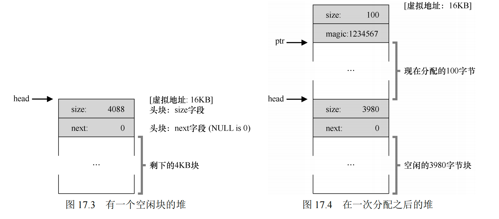
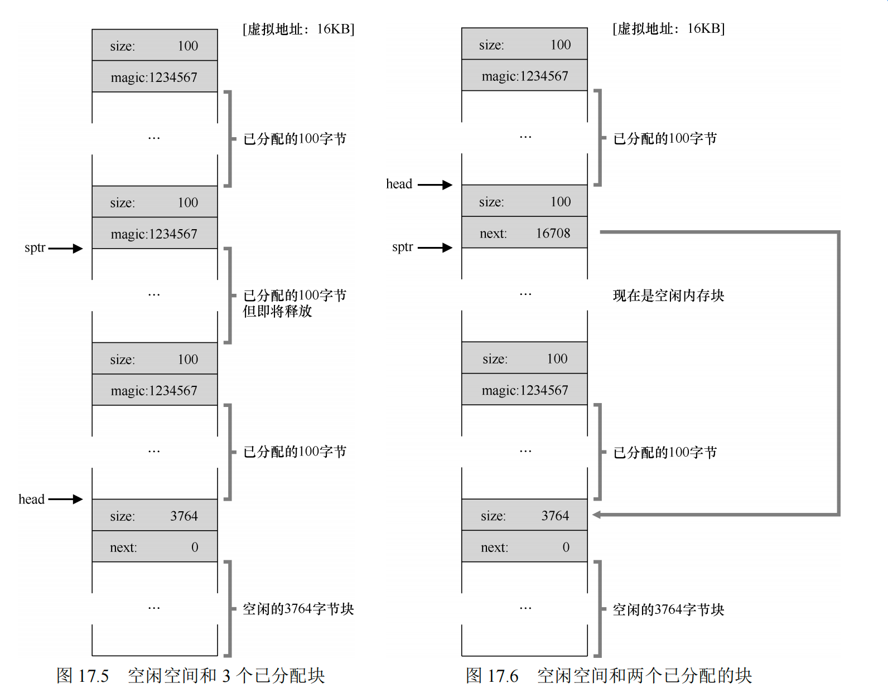
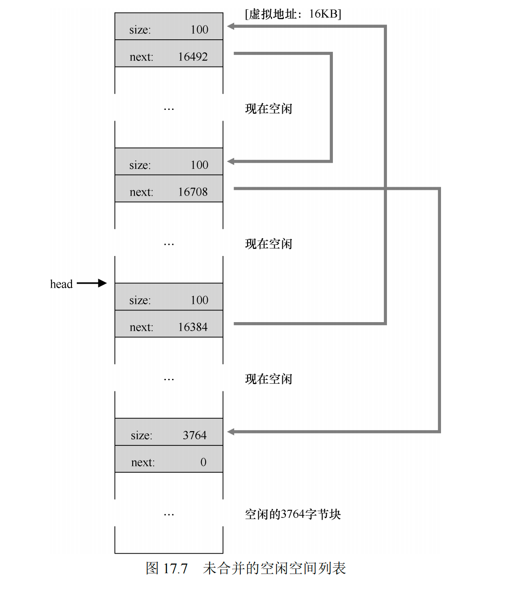
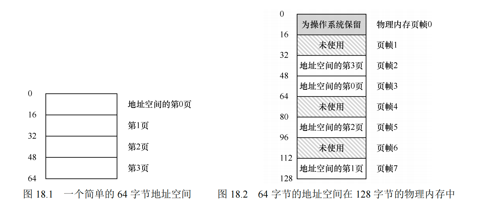
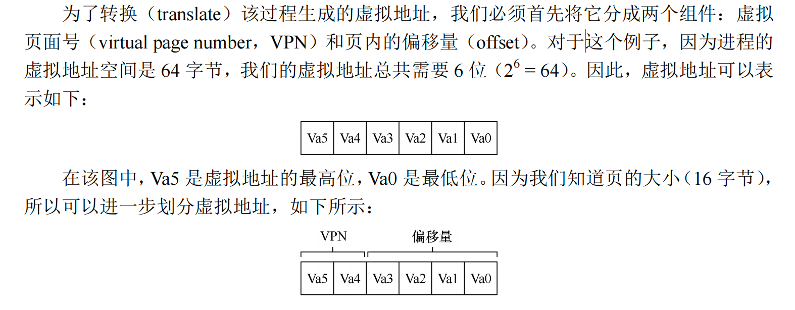
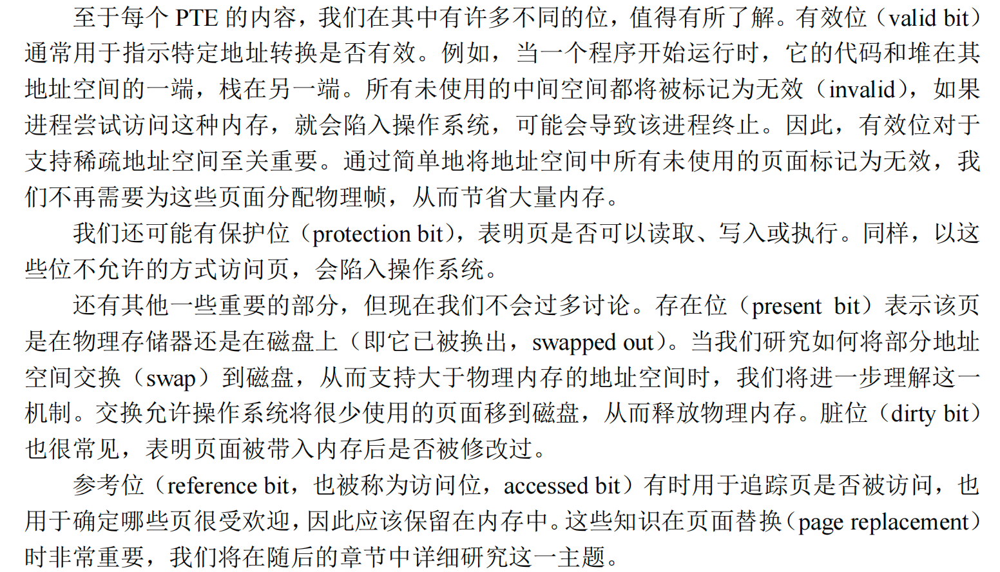
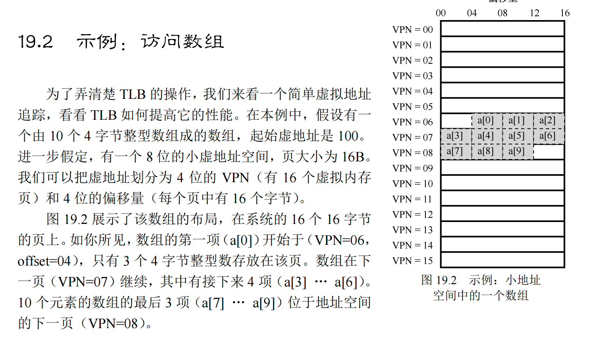
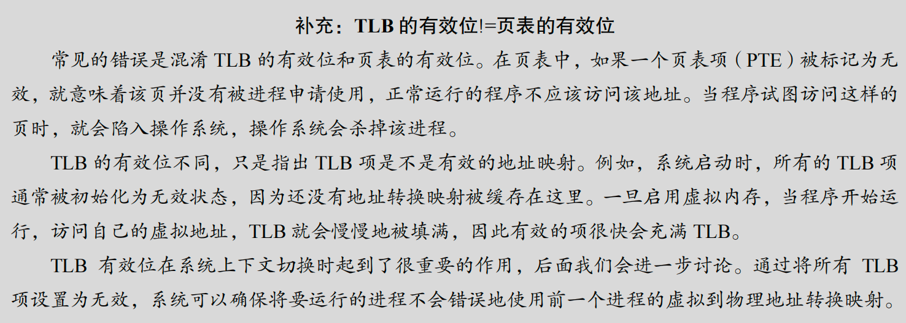
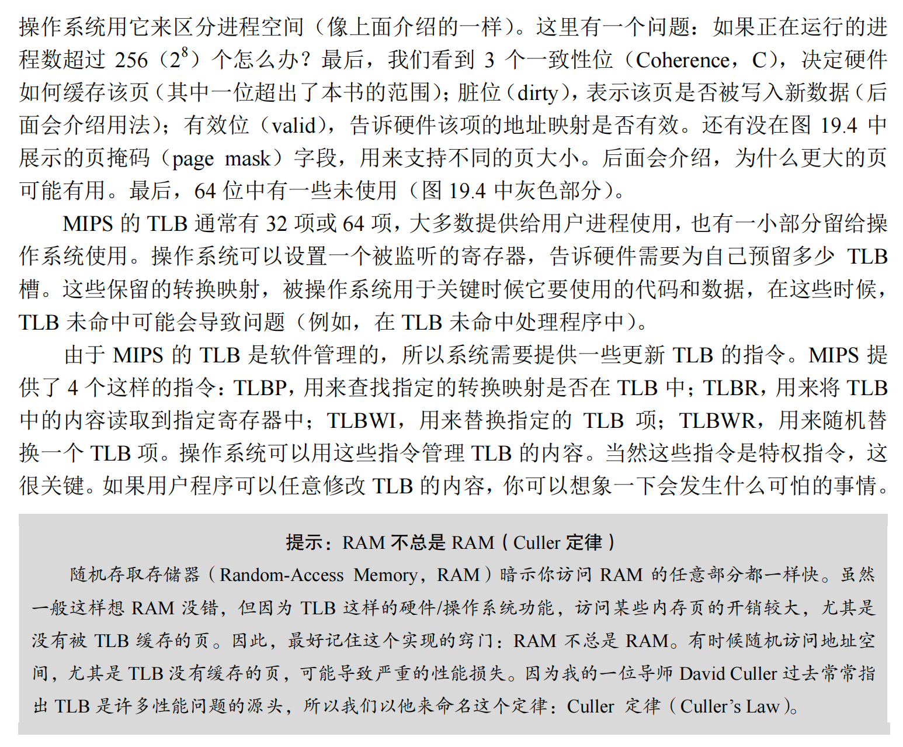

### 第13章 抽象：地址空间

虚拟内存的主要目标

- 透明（transparency）：操作系统实现虚拟内存的方式，应该让运行的程序看不见。
- 效率（efficiency）：操作系统追求虚拟化应该尽可能高效，包括时间上（不会使程序运行变得更慢）和空间上（不需要太多额外的内存来支持虚拟化）。在实现高效率虚拟化时，操作系统将不得不依靠硬件支持，包括TLB这样的硬件功能。
- 保护（protection）：操作系统应该确保进程收到保护，不会受其他进程影响，操作系统本身也不会受进程影响。

### 第14章 插叙：内存操作API

#### 内存类型

- 栈内存（自动内存）：申请和释放操作是由编译器隐式管理的，离开函数时编译器释放内存；
- 堆内存：所有的申请和释放操作都由程序员显式完成，这对用户和系统提出了很大的挑战；

#### malloc()和free()

- 分配区域的大小不会被用户传入，必须由内存分配库本身记录追踪。

#### 常见错误

不再赘述，见《操作系统导论》P93。

### 第15章 机制：地址转换

具体来说，每个CPU需要两个硬件寄存器：基址（base）寄存器和界限（bound）寄存器，有时称为限制（limit）寄存器。这组基址和界限寄存器，让我们能够将地址空间放在物理内存的任何位置，同时又能确保进程只能访问自己的地址空间。

采用这种方式，在编写和编译程序时假设地址空间从零开始。但是，当程序真正执行时，操作系统会决定其在物理内存中的实际加载地址，并将起始地址记录在基址寄存器中。

进程产生的所有内存引用，都会被处理器通过以下方式转换为物理地址：`physical address = virtual address + base`

进程中使用的内存引用都是虚拟地址（virtual address），硬件接下来将虚拟地址加上基址寄存器中的内容，得到物理地址（physical address），再发给内存系统。

将虚拟地址转换为物理地址，这正是所谓的地址转换（address translation）技术。也就是说，硬件取得进程认为它要访问的地址，将它转换成数据实际位于的物理地址。

由于这种重定位是在运行时发生的，而且我们甚至可以在进程开始运行后改变其地址空间，这种技术一般被称为动态重定位（dynamic relocation） 。

如果进程需要访问超过这个界限或者为负数的虚拟地址，CPU将触发异常，进程最终可能被终止。界限寄存器的用处在于，它确保了进程产生的所有地址都在进程的地址“界限”中。

这种基址寄存器配合界限寄存器的硬件结构是芯片中的（每个CPU一对）。有时我们将CPU的这个负责地址转换的部分统称为内存管理单元（Memory Management Unit，MMU）。

在执行过程中大部分时间由硬件控制（CPU），只有当进程行为不当或者正常退出时，操作系统才会介入；当然，在**上下文切换**的时候，也需要把这两个寄存器保存在PCB中。

### 第16章 分段

#### 引入

栈和堆之间，有一大块“空闲”空间。另外，如果剩余物理内存无法提供连续区域来放置完整的地址空间，进程便无法运行。

#### 分段：泛化的基址/界限

**总体思想：**在 MMU 中引入不止一个基址和界限寄存器对，而是给地址空间内的每个逻辑段（segment）一对。一个段只是地址空间里的一个连续定长的区域，在典型的地址空间里有 3 个逻辑不同的段：代码、栈和堆。

#### 我们引用哪个段

**显式方式：**利用虚拟地址的开头几位来标识不同的段，比如之前有三个段，那么就用虚拟地址的前两位来表示。

**例子：**

**隐式（implicit）方式：**硬件通过地址产生的方式来确定段。例如，如果地址由程序计数器产生（即它是指令获取），那么地址在代码段。如果基于栈或基址指针，它一定在栈段。其他地址则在堆段

#### 栈怎么办

栈的地址增长是反向的，所以还需要给硬件增加一位进行记录：

硬件理解段可以反向增长后，这种虚拟地址的地址转换必须有点不同。下面来看一个栈虚拟地址的例子，将它进行转换，以理解这个过程：

在这个例子中，假设要访问虚拟地址 15KB，它应该映射到物理地址 27KB。该虚拟地址的二进制形式是：11 1100 0000 0000（十六进制 0x3C00）。硬件利用前两位（11）来指定段，但然后我们要处理偏移量 3KB。为了得到正确的反向偏移，我们必须从 3KB 中减去最大的段地址：在这个例子中，段可以是 4KB，因此正确的偏移量是 3KB 减去 4KB，即−1KB。只要用这个反向偏移量（−1KB）加上基址（28KB），就得到了正确的物理地址 27KB。用户可以进行界限检查，确保反向偏移量的绝对值小于段的大小。

#### 支持共享

一些只读的内存，可以在进程之间共享，为了支持共享，需要一些额外的硬件支持，这就是保护位（protection bit）。基本为每个段增加了几个位，标识程序是否能够读写该段，或执行其中的代码。通过将代码段标记为只读，同样的代码可以被多个进程共享，而不用担心破坏隔离。

有了保护位，前面描述的硬件算法也必须改变。除了检查虚拟地址是否越界，硬件还需要检查特定访问是否允许。如果用户进程试图写入只读段，或从非执行段执行指令，硬件会触发异常，让操作系统来处理出错进程。

#### 细粒度与粗粒度的分段 

到目前为止，我们的例子大多针对只有很少的几个段的系统（即代码、栈、堆）。我们可以认为这种分段是粗粒度的（coarse-grained），因为它将地址空间分成较大的、粗粒度的块。但是，一些早期系统（如 Multics[CV65, DD68]）更灵活，允许将地址空间划分为大量较小的段，这被称为细粒度（fine-grained）分段。

### 第17章 空闲空间管理

外部碎片：没被分配给程序的碎片化内存。

内部碎片：如果分配程序给出的内存块超出请求的大小，在这种块中超出请求的空间（因此而未使用）就被认为是内部碎片（因为浪费发生在已分配单元的内部）。

#### 17.2 底层机制

##### 分割与合并

这时若申请大于10字节的内存块都会失败，而如果申请小于10字节，内存块会先进行**分割**。

假设要分配1字节的内存：

因此，**合并**就诞生了，在归还一块空闲内存时，仔细查看要归还的内存块的地址以及邻它的空闲空间块。如果新归还的空间与一个原有空闲块相邻（或两个，就像这个例子），就将它们合并为一个较大的空闲块。

比如把刚刚分配的`addr:10 len:11`free()，那么会变成：

##### 追踪已分配空间的大小

大多数分配程序都会在头块（header）中保存一点额外的信息，它在内存中，通常就在返回的内存块之前

##### 嵌入空闲列表

##### 让堆增长

如果堆中的内存空间耗尽，最简单的方式就是返回失败，不过有时候也会向OS申请更大的空间，这通常意味着进行了某种系统调用，让堆增长。

#### 17.3 基本策略

##### 最优匹配

首先遍历整个空闲列表，找到和请求大小一样或更大的空闲块，然后返回这组候选者中最小的一块。

##### 最差匹配 

最差匹配（worst fit）方法与最优匹配相反，它尝试找最大的空闲块，分割并满足用户需求后，将剩余的块（很大）加入空闲列表。

##### 首次匹配

首次匹配（first fit）策略就是找到第一个足够大的块，将请求的空间返回给用户。同样，剩余的空闲空间留给后续请求。

##### 下次匹配

不同于首次匹配每次都从列表的开始查找，下次匹配（next fit）算法多维护一个指针，指向上一次查找结束的位置。其想法是将对空闲空间的查找操作扩散到整个列表中去，避免对列表开头频繁的分割。这种策略的性能与首次匹配很接它，同样避免了遍历查找。

### 第18章 分页：介绍

优点：灵活性、空闲空间管理的简单性；

例如想要申请64字节，可以从物理地址空间的空闲列表中随便拿4页出来即可。

为了记录地址空间的每个虚拟页放在物理内存中的位置，操作系统通常为每个进程保存一个数据结构，称为**页表**（page table）。页表的主要作用是为地址空间的每个虚拟页面保存**地址转换**（address translation），从而让我们知道每个页在物理内存中的位置。注意，页表是每个进程独有的数据结构。

前两位表示页码号，后四位表示偏移量

#### 18.3 列表中究竟有什么

这个列表指的是一个存储虚拟地址（页面）的列表，里面记录了虚拟页面的一些信息，以及映射到的真正的物理页帧号。每个进程拥有一个页表。

#### 18.4 分页也很慢

从虚拟地址到物理地址：

- 提取VPN位；
- 去当前进程的页表所在的物理地址里面去索引出对应的PTE；
- 从PTE中提取PFN（物理帧页），和虚拟地址的偏移量相加。形成所需的物理地址；

（要把内存地址空间切分成大量固定大小的页，而且需要记录这些单元的地址映射信息，而映射信息又存储在物理内存中，所以需要一次额外的内存访问）会导致系统运行速度过慢且占用大量内存。

### 第19章 分页：快速地址转换（TLB）

#### 基本算法
硬件算法的大体流程如下：首先从虚拟地址中提取页号（VPN），然后检查 TLB 是否有该 VPN 的转换映射。如果有，我们有了 TLB 命中（TLB hit），这意味着 TLB 有该页的转换映射。成功！接下来我们就可以从相关的 TLB 项中取出页帧号（PFN），与原来虚拟地址中的偏移量组合形成期望的物理地址（PA），并访问内存，假定保护检查没有失败。

如果 CPU 没有在 TLB 中找到转换映射（TLB 未命中），我们有一些工作要做。在本例中，硬件访问页表来寻找转换映射，并用该转换映射更新 TLB），假设该虚拟地址有效，而且我们有相关的访问权限。上述系列操作开销较大，主要是因为访问页表需要额外的内存引用。最后，当 TLB 更新成功后，系统会重新尝试该指令，这时 TLB 中有了这个转换映射，内存引用得到很快处理。

#### 一个例子

现在我们对所有的值进行遍历访问，这样会有3次miss和7次hit，这得益于空间局部性原理。如果增加一个页的大小，比如一页就能存12个变量，那么只需要一次的miss，后面的9次都是hit。而隔一段时间对数组再进行一次遍历访问，如果时间比较近，那么全部都是hit，这得益于时间局部性原理。

#### 谁来处理 TLB 未命中 

- 硬件全权处理 TLB未命中。为了做到这一点，硬件必须知道页表在内存中的确切位置（通过页表基址寄存器，page-table base register），以及页表的确切格式。发生未命中时，硬件会“遍历”页表，找到正确的页表项，取出想要的转换映射，用它更新 TLB，并重试该指令。

- 更现代的体系结构（都是精简指令集计算机），有所谓的软件管理 TLB（software managed TLB）。发生 TLB 未命中时，硬件系统会抛出一个异常，这会暂停当前的指令流，将特权级提升至内核模式，跳转至陷阱处理程序（trap handler）。接下来你可能已经猜到了，这个陷阱处理程序是操作系统的一段代码，用于处理 TLB 未命中。这段代码在运行时，会查找页表中的转换映射，然后用特别的“特权”指令更新 TLB，并从陷阱返回。

#### TLB的内容

- VPN ｜ PFN ｜ 其他位
- 

#### 上下文切换时候的TLB

TLB 中包含的虚拟到物理的地址映射只对当前进程有效，对其他进程是没有意义的。

如果发生进程间上下文切换，上一个进程在 TLB 中的地址映射对于即将运行的进程是无意义的。硬件或操作系统应该做些什么来解决这个问题呢？

一种方法是在上下文切换时，简单地清空（flush）TLB，这样在新进程运行前 TLB 就变成了空的，但是这样会造成很大的开销。

为了减少这种开销，一些系统增加了硬件支持，实现跨上下文切换的 TLB 共享。比如有的系统在 TLB 中添加了一个地址空间标识符（Address Space Identifier，ASID）。可以把ASID 看作是进程标识符（Process Identifier，PID），但通常比 PID 位数少（PID 一般 32 位，ASID 一般是 8 位）。因此，有了地址空间标识符，TLB 可以同时缓存不同进程的地址空间映射，没有任何冲突。当然，硬件也需要知道当前是哪个进程正在运行，以便进行地址转换，因此操作系统在上下文切换时，必须将某个特权寄存器设置为当前进程的 ASID。

#### TLB的表项

