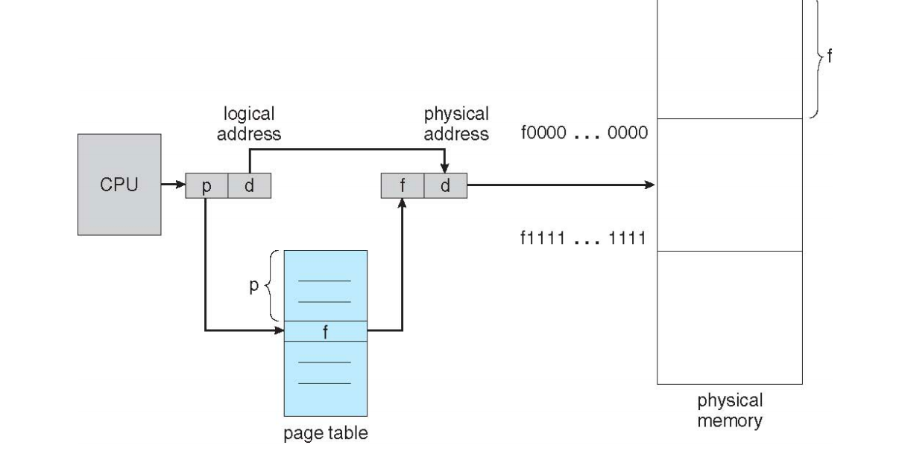
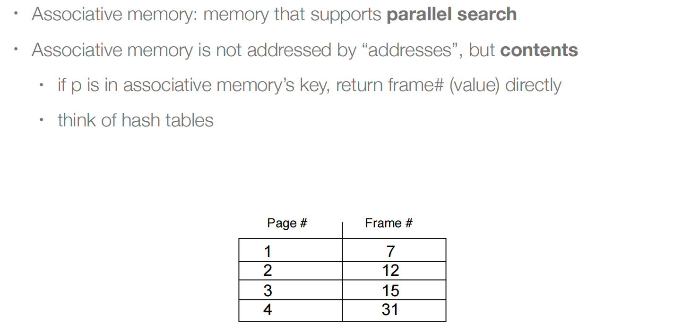
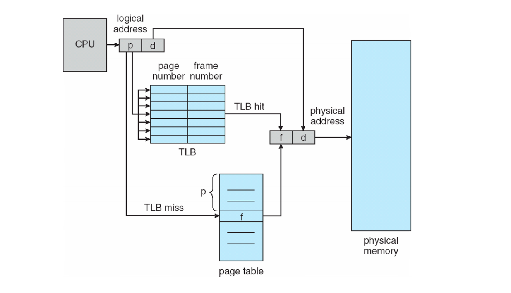
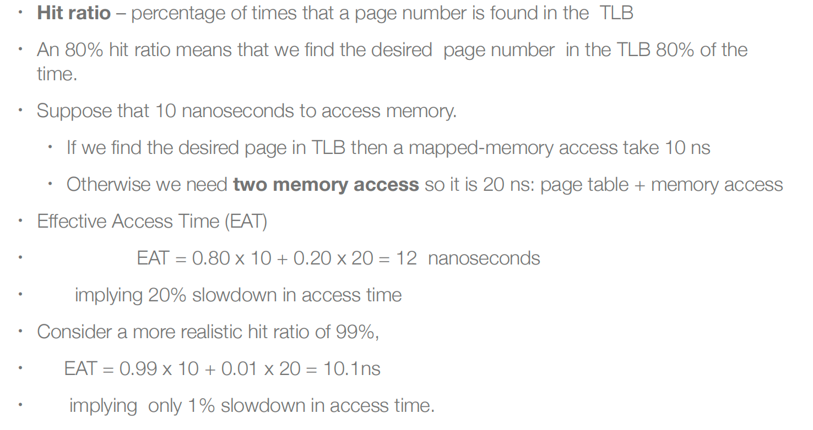
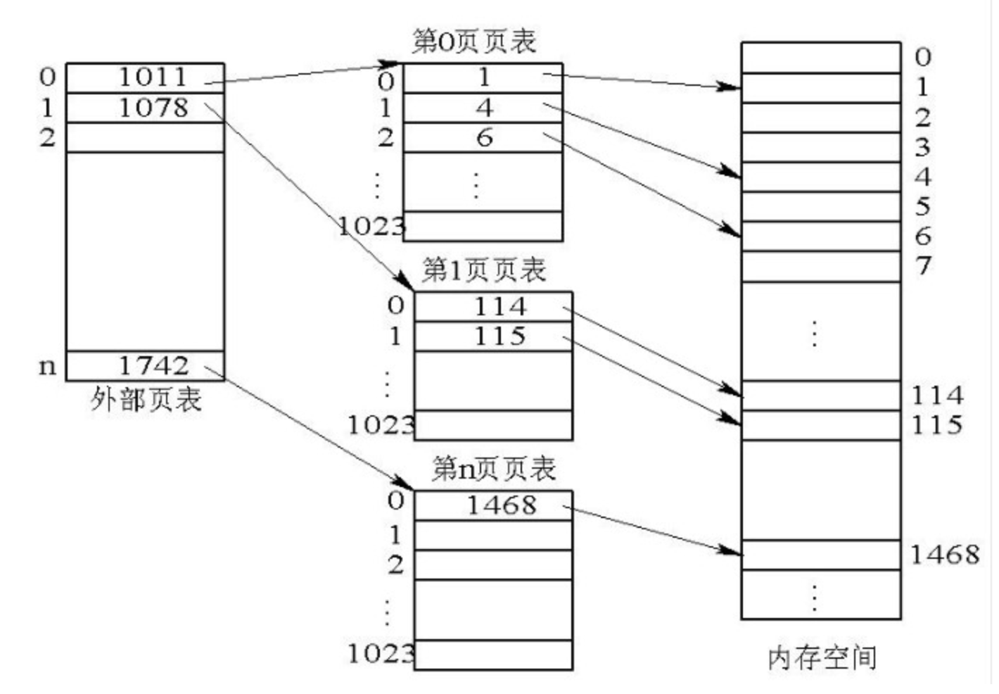
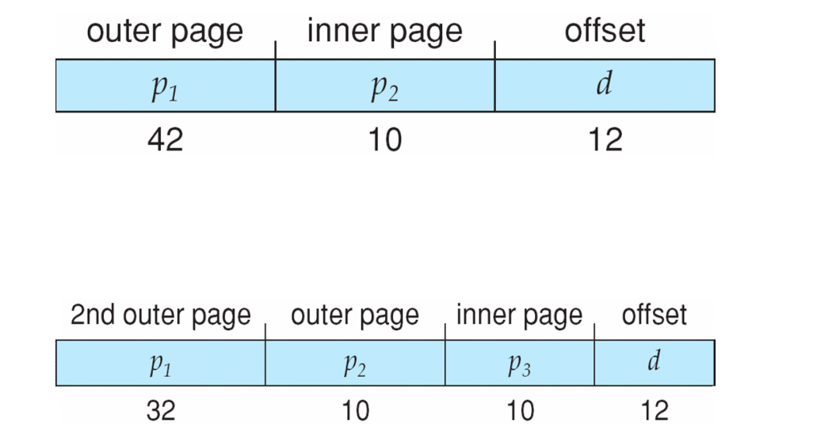
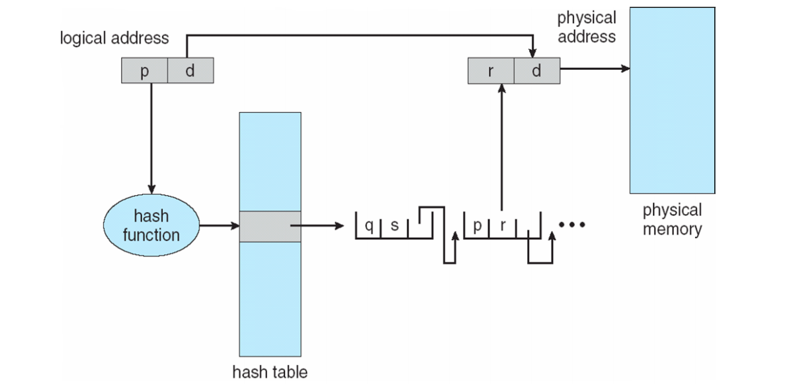
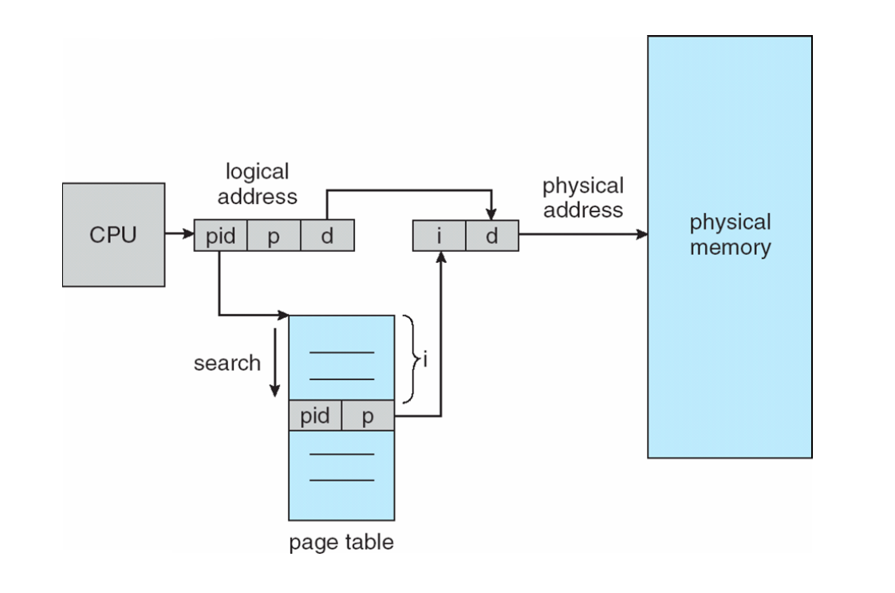
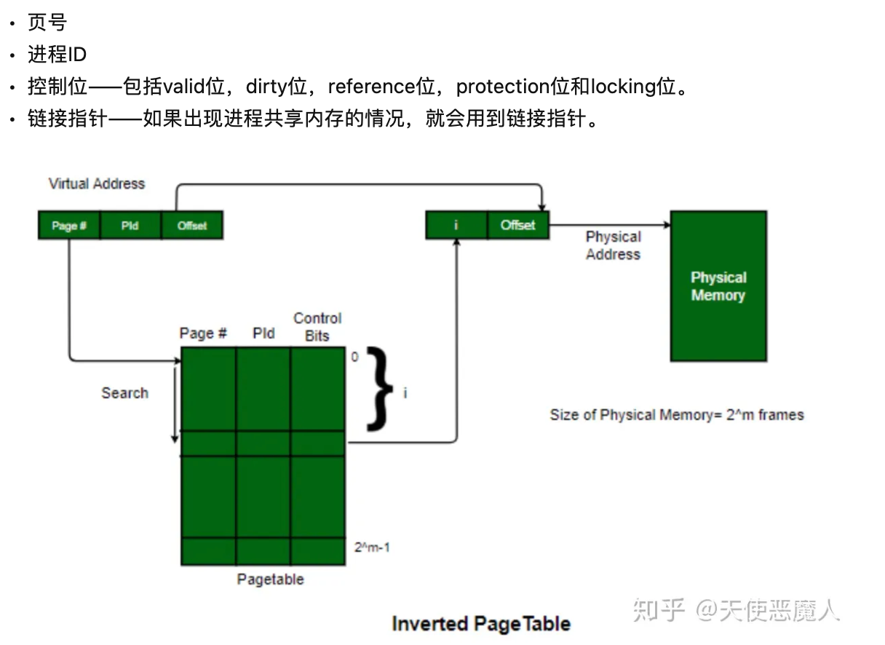

### Paging
#### 地址转换
一个虚拟地址被分为 虚拟页面号（virtual page number，VPN）和页内偏移量（offset）；

通过VPN当作index去数组中查找到页表项，找到页框号f，把p替换掉f，再去物理内存中去寻址。

#### 内部碎片（Internal Fragmentation）

分配一个内存是以page为最小的内存单元，所以就算需要的内存比page小，那还是分配了一个page，这就造成了内部碎片。（最坏的情况：内部碎片大小为`1 frame - 1 byte`）

**思考：**我们希望page比较小，这样粒度变小。这样内部碎片就会变小变少，浪费的空间就变小了。但实际上页的大小是趋向于越来越大的，因为page越小，页表的size就会变大，所以要做一个权衡。

#### Frame Table

需要一个数据结构去记录物理内存（frame）的空闲和分配情况。

#### Hardware Support

**页表存放**：

- **寄存器**：page table放到一系列专门的寄存器里面，这样**查找**会非常快，但缺点是table的**size**会非常小（寄存器的资源有限）而且**上下文切换**的时候也要去save和restore寄存器；
- **内存中的表格**：用一个寄存器（page-table base register (PTBR)）来存放当前进程页表的物理地址，然后去内存中去查找页表项，这样空间大小可以保证。但是这样就需要进行至少两次的**内存访问**；
    - 通过TLB作为页表的cache（存储着几个虚拟地址到物理地址的映射）；

##### TLB

**TLB**：页表的cache，TLB命中一次就能减少一次内存访问的开销。

- 进程切换的时候，把TLB给flush掉来保持TLB和页表的相关性。但这样就会造成冷启动。
- 利用地址空间标识符ASID来标记该项地址属于哪个进程的地址空间，Tag TLB entries with **address-space identifier** (ASID) that uniquely identifies a process。
- 有些映射可以固定，some TLB entries can be **shared** by processes, and fixed in the TLB。

**TLB的实现**：组相连的方式，老师略讲。

**加入TLB后的逻辑图**：

#### Effective Access Time(EAT)

加入TLB后的分页机制的slowdown（较为简单，直接看PPT，容易出考题，正向反向都要会算）

结论：就算有了TLB，分页后还是会变慢。

### Memory Protection

页表中有很多的因为目的不同而设置的保护机制，就在页表项中加入额外的bit。

bit：kernel/user，read/write，exection？，kernel-exection？

因此分页给我们提供了更加灵活的安全保护机制。

### Page(continue)

#### Page Sharing

比如多个进程共享libc的一段代码，这就需要进行内存的共享，所以libc的代码在物理内存中仅放一份，然后把各个进程的虚拟地址都指向同一个物理地址，这样就实现了共享。

当然不同进程一般不会共享libc的data(global variable)，不然如果data共享了，一个进程就可能会影响另一个进程的运行。

#### Structure of Page Table

为了解决页表占用大量空间的问题，需要进行架构上的优化。

##### Hierarchical page table

以32位逻辑地址空间为例，当页面大小为4KB时(12位)，若采用一级页表结构，应具有20位页号；而采用二级页表结构时，再对页表进行分页，使每页中包含$2^{10}$ (即1024)个页表项，最多允许有$2^{10}$个页表分页；或者说，外层页表中的外层页内地址P2为10位，外层页号P1也为10位。

由右图可以看出，在页表的每个表项中存放的是进程的某页在内存中的物理块号，如第0#页存放在1#物理块中；1#页存放在4#物理块中。而在外层页表的每个页表项中，所存放的是某页表分页的首址，如第0#页表是存放在第1011#物理块中。我们可以利用外层页表和页表这两级页表，来实现从进程的逻辑地址到内存中物理地址间的变换。

为了地址变换实现上的方便起见，在地址变换机构中同样需要增设一个外层页表寄存器，用于存放外层页表的始址，并利用逻辑地址中的外层页号，作为外层页表的索引，从中找到指定页表分页的始址，再利用P2作为指定页表分页的索引，找到指定的页表项，其中即含有该页在内存的物理块号，用该块号和页内地址d即可构成访问的内存物理地址。右图示出了两级页表时的地址变换机构。

**优点**：因为并不是所有的页表项都会存在的，前面的外层页表需要$2^{10}\times4$（一个页表项是4字节，因为外层页表指向内层页表的物理地址，而假设物理地址是有32位的，所以4个字节）的空间也就是4KB，而并不是每一个外层页表项都指向一个合法的空间，有些根本用不到，对于没有用到的页表所对应的外层页表的页表项，就不用分配内存了。比如外层页表有N项指向合法的内层页表，那么总共需要$4KB+N\times4KB$的空间即可，而N肯定远远小于1024；

**缺点**：页表变成了多层，就会导致访问内存的次数又会增加，虽然可以通过TLB来减少，但如果TLBmiss了，那么开销会急剧增加。

如今64位系统的划分方式

##### Hashed Page Tables

通过哈希碰撞来减少内存的占用，hash table中存着一个链表，记录着映射到相同位置的地址表项，要去遍历链表来查表项。

可以把page table中的几个表项进行合并，一个表项可以指向很多的物理页，增大了表项（或者说是页的大小）的长度，减少了表项的个数，从而减少了碰撞次数。

##### Inverted Page Table

既然虚拟地址空间通常比物理地址空间大很多，所以反过来，通过物理页框号去寻找虚拟内存的页号（这样多个进程都共用了转置页表，而不是一个进程一张页表），要去遍历搜索表项（这是不切实际的）。

转置页表的内容：