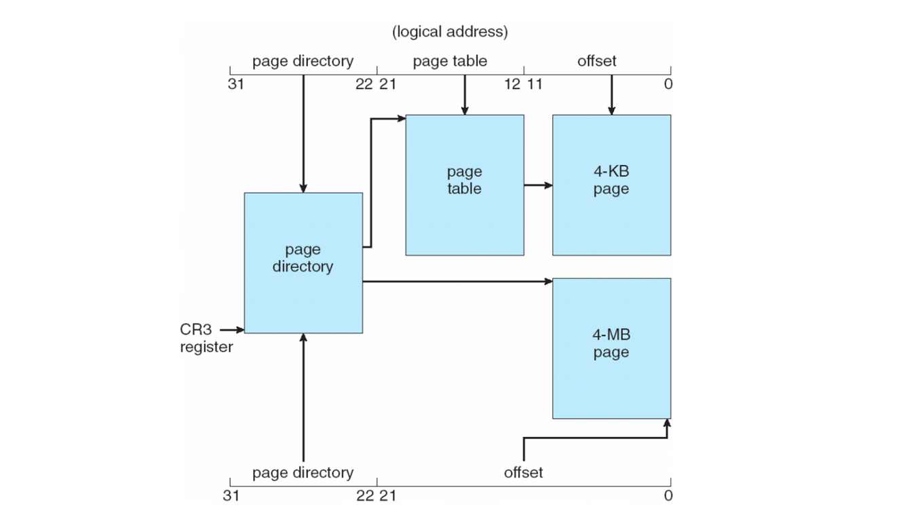

!!! note

    上节课的内容复习了四十分钟......

## Paging

### Swapping

一个进程可以被临时地存放到disk中，然后再从disk中回到memory。程序里面访问的是虚拟地址，而我们只需要把page table的映射关系改一下，所以swap前后物理地址不需要相同。

因为今天物理内存很大，所以平时swap的场景比较少。而在Mobile System里面，没有swap这件事情，因为他空间更小，CPU的吞吐量更小，如果没有空间了直接kill进程。

我们可以swap页，而不是swap整个进程，这样粒度就变小了，可以减少文件传输量，从而减少性能上的开销。

比如进程A的某个page被swap out到disk中，进程B的某些page被swap in进来，当B结束后，又要运行进程A，首先把page out的load进来，再进行运行，运行一段时间后又开始运行进程B，然后又发现进程B的某些page也要去load进来。所以在某些极端的情况下，CPU在不停的swap，而要执行的任务没有什么实际的进展，这种叫做操作系统的颠簸（抖动），主要的原因是系统在运行的进程数量很多，但是内存又很紧张。

### Example

#### The Intel IA-32 Architecture

支持两种不同的内存管理方式，一种是分段，一种是分页。分段其实就是base+offset，分成一个一个段。

我们对逻辑地址和线性地址不作区分

CR3寄存器存储着页目录的地址，我们可以通过页目录去访问二级页表，再从二级页表去访问物理内存，也可以直接去访问4MB的page。（但是需要多加一个bit去指示哪个是指向page哪个是指向二级页表）

如果虚拟地址只有32bit，但是物理地址大于32bit，对于同一个进程，物理地址只能索引32bit；对于不同的进程，我们可以通过仅仅32bit的虚拟地址指向远大于32bit的物理地址。

 page address extension (PAE)：使用 PAE，操作系统从两级线性地址转换移动到三级地址转换。 与其将线性地址拆分为三个单独的字段，用于索引到内存表中，而是拆分为四个单独的字段：一个 2 位位字段、两个 9 位字段和一个与 Intel 体系结构实现的页面大小相对应的 12 位字段 (4 KB) 。（注意，每个page table entry从原来的32bit变成了64bit）

## Linux Paging - RISC-V

SATP寄存器类似Intel的RC3寄存器

Sv39

每个page的大小是$2^{12}$字节

每个page table entry的大小是8字节，用9位去索引这8个字节

页表项存的是下一级页表的物理地址

