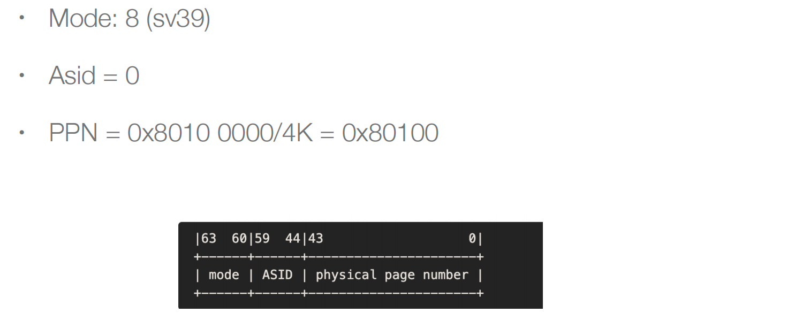
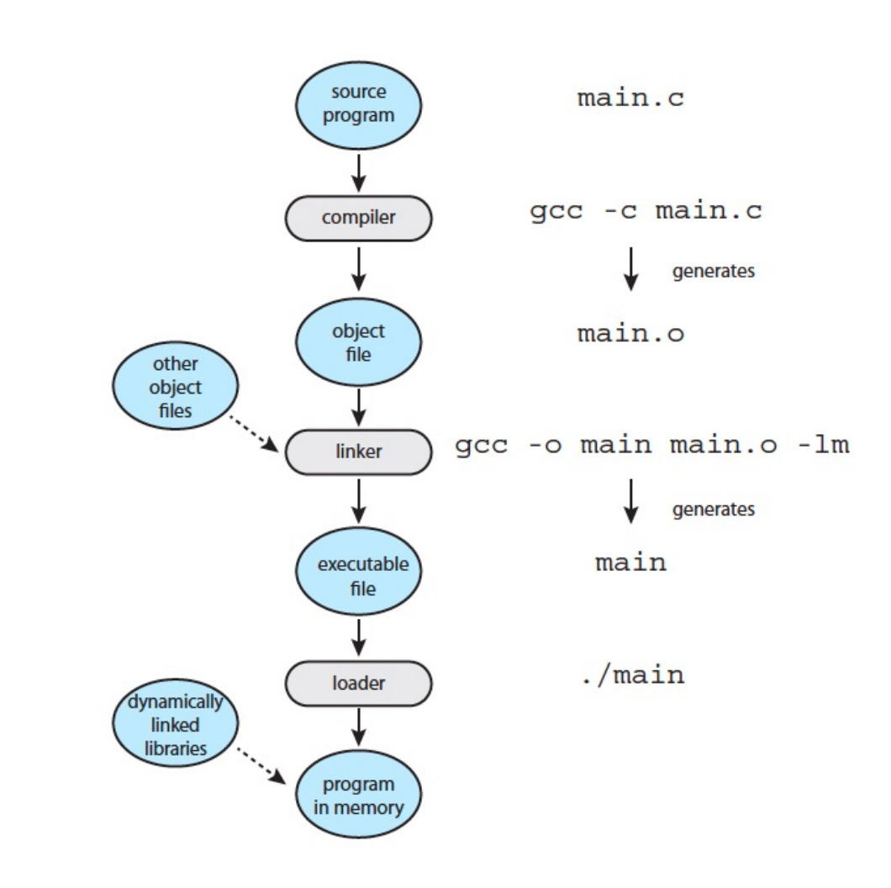

!!! note

    复习了二十分钟

## Linux Paging - RISC-V

SATP寄存器类似Intel的RC3寄存器

### Sv39

每个page的大小是$2^{12}$字节；

每个page table entry的大小是8字节，用9位去索引这8个字节，512个entry乘8（因为页框号PPN有44bit，所以4个字节不够了，需要8个字节），就是4KB，也就是页的大小。

页表项存的是下一级页表的物理地址；

### 一个例子

- VA: 0xffff ffc0 1357 9bdf 

- PA: 0x93779bdf

- The physical address of page table is 0x8010 0000

**SATP：**

**第一级页表：**

取出VA[38:30]，为b’100 0000 00，所以真正的物理地址偏移量为b’1 0000 0000 x 8 bytes = 0x800。所以页表项的物理地址为 0x8010 0000 + 0x800 = 0x8010 0800。假设页表项的值为0x00000000 20040401，**首先rwx全部为0，这是riscv的特殊设计，rwx同时为0，表示指向下一级物理页表而不是物理页**。

**第二级页表：**

取出[53:10] = 0x80101，再取出VPN[1]，为bit[29:21]，为b’0 1001 1010，所以第二个页表项为0x8010 1000 + 0x96x8 = 0x801014b0，假设页表项的值为0x00000000_20040801。

**第三级页表：**

Third-level page table address: 200408 >> 2 << 12 = 0x8010 2000。VPN[0] (bit 20 : bit 12) -> b’1 0111 1001 (0x179)。The page table entry address is 0x80102000 + 0x179x8 = 0x80102bc8。假设页表项的值为0x00000000_24dde40f。那么，V =1 RWX = 111，PPN = 0x24dde4 >> 2 = 0x93779，-> pa = PPN << 12 + page offset = 0x93779bdf

## Linker and Loader

linker: from object files to executable file.

loader: from program to process. 

静态链接的优点是，兼容性好。但是加载时间长。动态链接的优点是，进程之间可以共享。

对于动态链接，自己定义的函数，链接时候还是有的，而libc里面的函数，就不会放到可执行文件中，而是直接进行跳转，跳转到内存的某个地方（libc函数被加载的内存地址）。

动态链接link阶段，对于系统库函数，link会去系统环境变量里面去寻找系统库函数的地址。