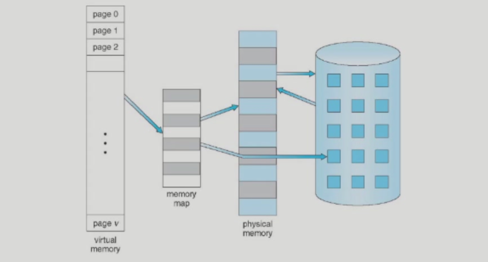
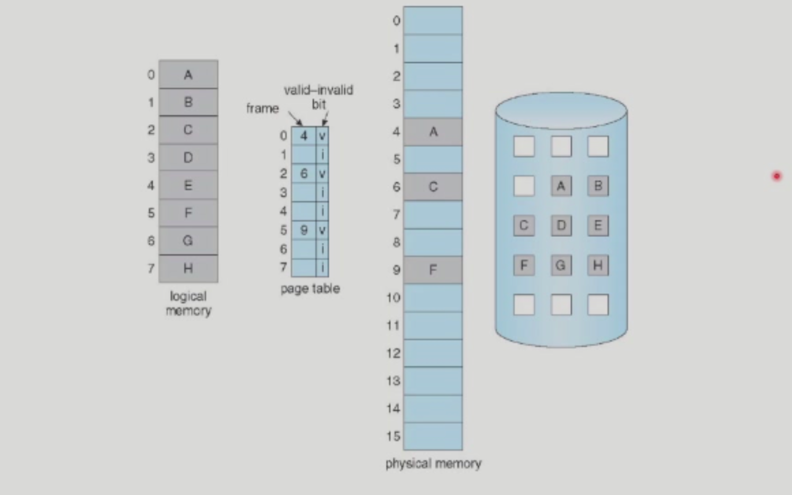
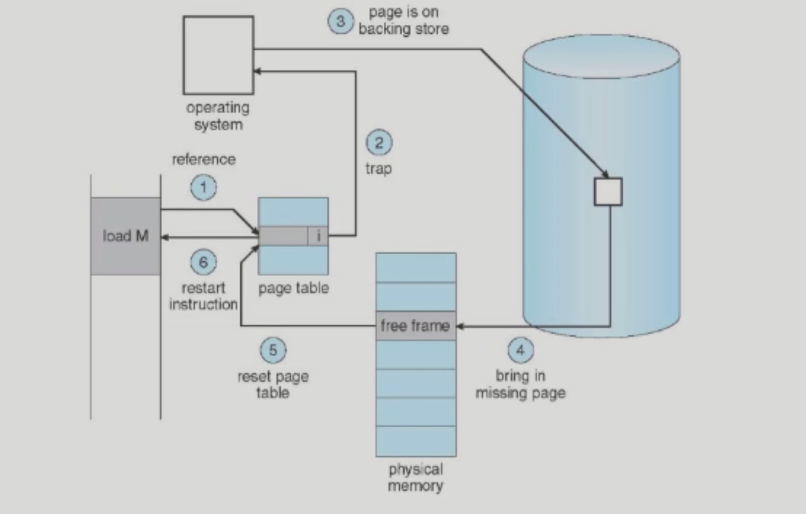
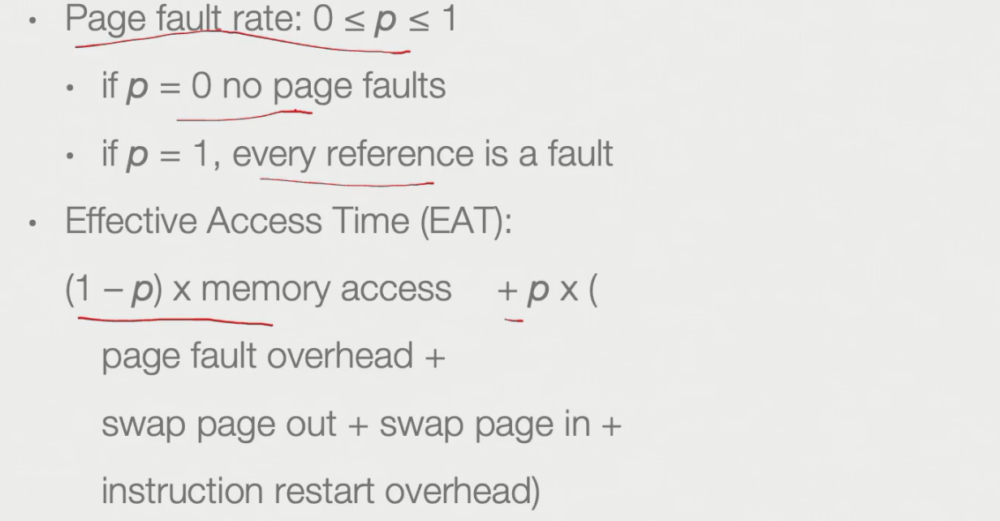
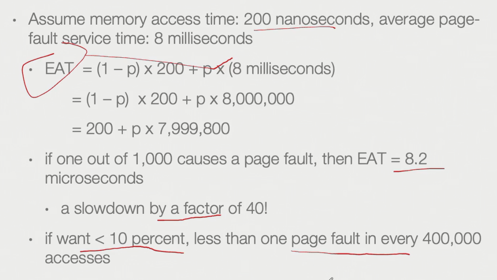

## Virtual Memory

### 背景

- 代码需要在内存中才能执行，但很少需要或同时使用整个程序，比如错误处理代码、异常例程、大型数据结构，这些东西不太可能同时用到。

- 所以我们要考虑执行**部分加载**程序的能力，程序不再受物理内存限制，使程序可能比物理内存大。

- 虚拟内存：将逻辑内存和物理内存区分开来

  - 只需要程序的一部分在内存中程序就可以执行。

    - 逻辑地址空间可能比物理地址空间大得多；

    - 可以同时运行更多程序；

    - 加载或交换进程所需的I/O更少（部分）；

  - 允许多个进程共享内存（例如，共享库）：更好的IPC性能
    
  - 允许更高效的进程分叉（写时复制）
  
- 虚拟内存可以通过demand paging进行实现。

#### VM大于PM

我们通过VA与PA的映射来使VM大于PA，而物理内存中的很多东西都是从second storage（比如disk）中加载进来的；

## Demand Paging

当一个page被访问时候，我们才会真正把page加载到物理内存当中。比如执行代码时，pc去fetch指令发现从虚拟地址到物理地址的映射不存在，才会去把这一页load进来。

page invalid -> abort the operation

page valid but not in memory -> bring it to memory via swapping

Lasy swapper：一个page不会被放到memory中来除非他被需要，缺点是有非常非常多的缺页异常（缺页处理非常耗时）。

Pre_Paging：在引用program所需的全部或部分页面之前，对其进行预分页。它可以减少执行过程中的缺页错误数量，如果未使用预先分页的页面，则会浪费I/O和内存，尽管它减少了页面错误，但总I/O数可能更高。

### Valid-Invalid Bit
每个页表条目都有一个Valid-Invalid Bit：V -> in memory，I -> not in memory。

开始的时候，所有条目的Valid-Invalid Bit都设置为I，在地址转换过程中，如果条目无效，将触发缺页异常。

例子：

### Page Fault

第一次引用不存在的页面将trap到内核：page fault。

操作系统通过查看内存映射来决定：

- 无效引用 → 向流程传递异常，若访问的是灰色区域，是合法的，如果是蓝色区域，那就是不合法的，就是无效的，传递异常（所以操作系统肯定会记录一个进程的合法的空间）；
- 有效但不在内存中 → swap：
  - 获得一个空的物理帧；
  - 通过磁盘操作将页面swap到物理帧中（此时往往会引发进程调度，因为swap比较慢，所以这个进程从running的状态变成block状态）；
  - 设置页表entry以指示向page现在的内存位置；
  - 重新启动导致页面错误的指令；

例子：

---

**极端情况**：启动进程时内存中没有page（也称为pure demand paging）

- 操作系统将指令指针设置为进程的第一条指令，无效页面引发page fault。
- 第一次访问时，每页都被paged in，程序本地化减少了开销。
- 一条指令可以访问多个page -> 多页错误。例如，它们的指令、数据和页表条目。 

Demand paging需要**硬件支持**：

- 具有有效/无效位的页表条目；
- 后备存储器（通常是disk）；
- 指令能正常地restart；

---

**Free-Frame List**

去看一下系统的物理内存还有哪些是空着的，操作系统通常使用一种称为按需零填充（zero-fill-on-demand）的技术来分配空闲帧，即帧的内容在分配之前被清零。当系统启动时，所有可用内存都会放在空闲帧上列表。

---

### Stages in Demand Paging

这是最差情况下，一个Demand Paging会引发很多异常处理过程，进程调度，磁盘读写，所以我们要尽可能地避免缺页产生。

- 1.trap into操作系统
- 2.save用户寄存器和进程状态
- 3.确定中断是否是page fault
- 4.检查页面引用是否合法，并确定页面在磁盘上的位置
- 5.从磁盘向空闲帧发出读取请求（从磁盘的哪里去读取缺失的数据呢？事实上mmap在建立的时候，会先建立VA和file的映射）：
  - 5.1在此设备的队列中等待，直到读取请求得到服务
  - 5.2等待设备seek and/or lantancy time
  - 5.3开始将页面转移到空闲帧
- 6.等待过程中，会进行调度，CPU资源会被分配给其他进程
- 7.得到设备的中断请求，指示中断已经完成
- 8.再做一次寄存器和进程状态（对于其他进程）的保存
- 9.检查这个中断是否是从disk中来的
- 10.修改页表以及其他表格来指明page现在是在memory中的
- 11.等待CPU重新分配资源给进程
- 12.进程得到资源后，restart原来产生缺页错误的指令

### Demand Paging Optimization

#### EAT（有效访问时间）

p就表示缺页的概率

#### 措施

交换空间I/O的速度比文件系统I/O快，即使在同一设备上也是如此。因为以更大的块分配的交换，比文件系统所需的管理更少。举个例子，要访问/f/a.txt，文件系统可能要有很多次IO，那么我们可以把它们写进一个单独的交换分区里面进行IO，这样可以节约时间。

在进程加载时将整个进程的code全部复制到交换空间，这样下一次再去交换的时候就不跟文件系统打交道了，直接和交换分区打交道。这种方法用于较旧的BSD Unix。

但最主要的还是**减少缺页的概率**；

对于只读也，当要被swap out的时候直接清空，不要swap out到disk中，因为不需要。

重点是减少和外部存储（disk）进行交换的次数。

**Copy-on-Write**

父进程在创建子进程之后，两个进程就分道扬镳了。子进程理论上是父进程的精确拷贝，但其实这是没有必要的，子进程之后通过exec()去load要执行的代码，那么这个拷贝就是没有用的。

这时候我们可以使用COW机制，也就是我们在创建子进程的时候并不是真的拷贝了所有物理页，我们让父进程的VA和子进程的VA都指向了同一个PA。

但是这些共享的物理页只能读不能写，然后还需要指明这其实只是临时取消掉写权限，指明这是COW页。无论父进程还是子进程去写物理页都会导致异常，这时候我们额外分配一个新的页出来，把子进程或者父进程要修改的页复制一份过来，在这个新的页开放写权限，将VA指向这个PA，而原来的那个COW页也恢复写权限，这个时候父进程和子进程才是真的分道扬镳。

