!!! success

    复习了将近30min

## Demand Paging

### No frames

我们可以有一个内核线程，去看看空闲的物理内存还有多少，一旦低于某个界限，就进行页替换，维持物理内存的空隙。

找到一些page替换出去，不希望被替换的页马上被用到；最好能选择不写到外部存储的页，这样可以节省时间，而这种页就是只读页，只有被修改过的页才需要被写到磁盘上去。

操作系统维持一个dirty来记录页是否被修改。

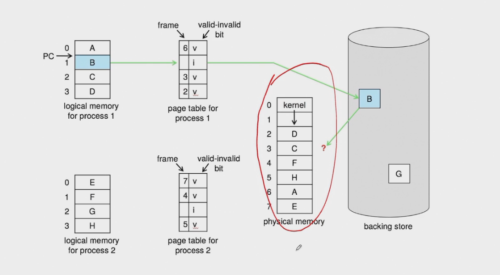

#### Page Fault Handler添加步骤

在disk中找到需要的page所在的位置，找到一个空闲物理帧页（如果没有空闲的物理帧页，那么需要通过一定的替换规则进行替换，如果被替换的帧页是dirty的，还要写回disk中），把需要的page读入帧页中并且更新页表，重新运行刚刚出现缺页异常的指令。

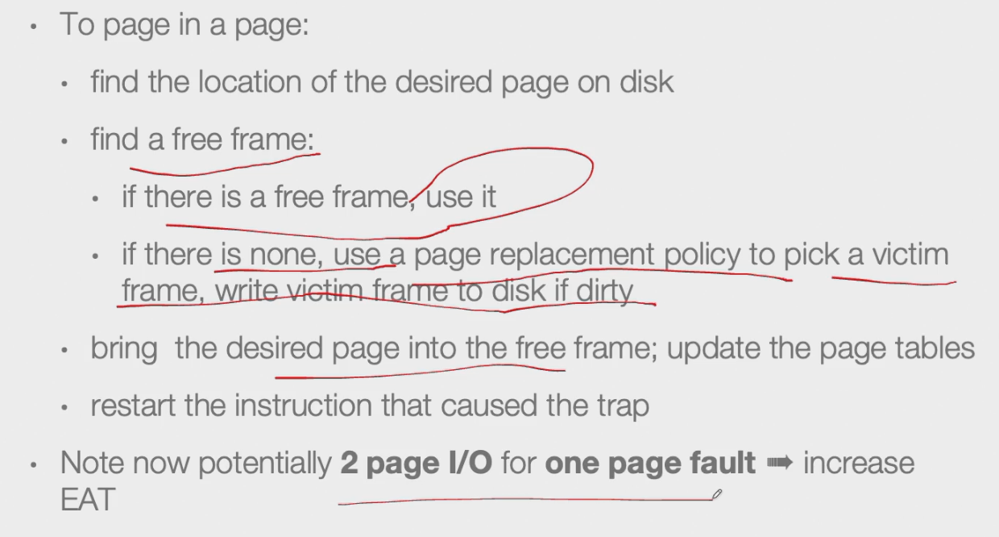

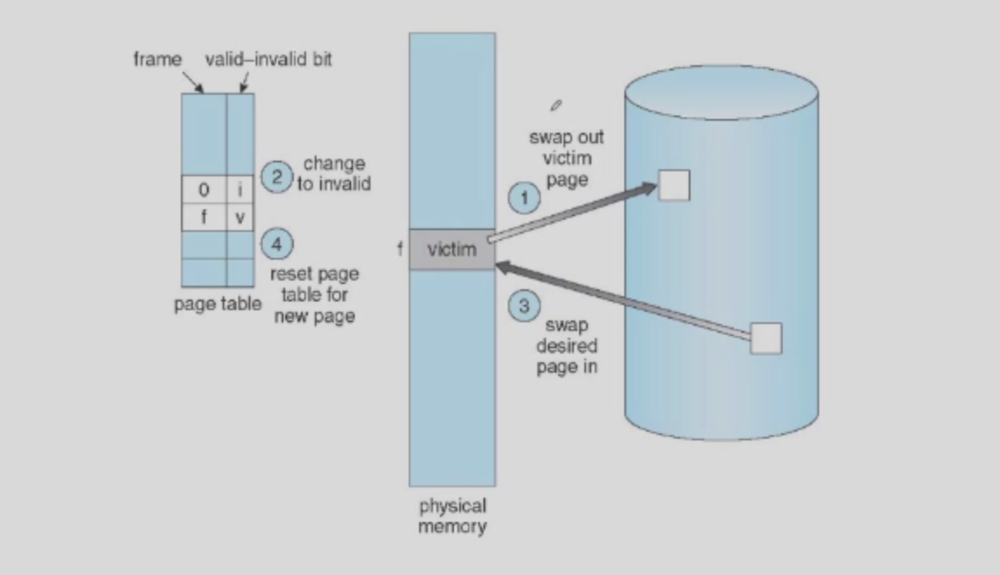

#### 页替换算法

利用访问序列(reference string)来评估算法的效率，在这里我们的访问序列假定为7,0,1,2,0,3,0,4,2,3,0,3,0,3,2,1,2,0,1,7,0,1。

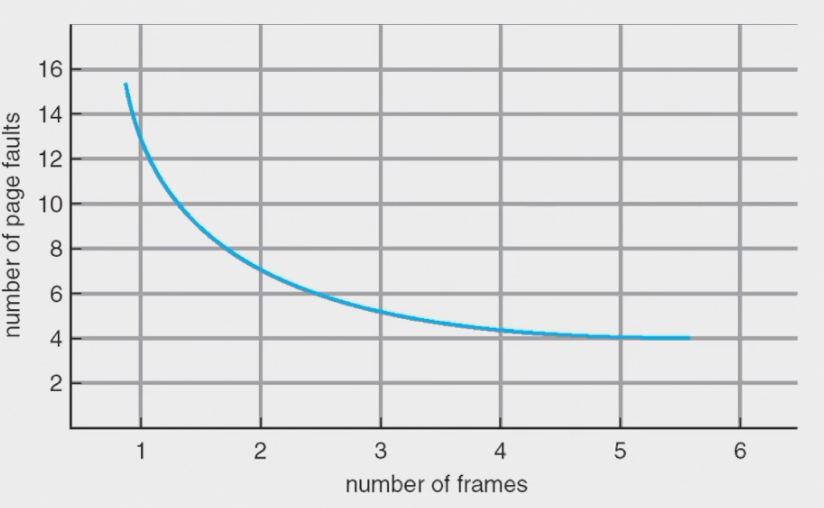

当然不排除某些页替换算法（比如FIFO）可能会打破这个规律，存在某些极端情况，可用物理帧页增多缺页异常也增多。

##### 1. FIFO

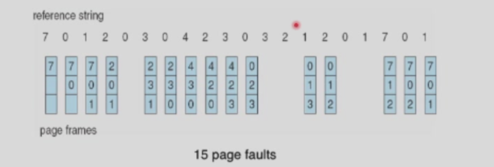

```ad-note
title: Belady's Anomaly

总帧页数增加的情况下，缺页异常反而增加了。


```

---

##### 2. Optimal Algorithm

优化算法替换掉在将来最长时间不会被用到的帧页。这种算法只是理论上的，用来衡量比较其他的算法的效果，实际中是难以实现的。

例子中出现了9次缺页异常。

---

##### 3. LRU(Least recently used)

替换最近不常被使用的物理页，总体上来说这是一个较好的算法而且被高频率使用。LRU和OPT算法都不会有Belady's Anomaly情况出现。

在这个例子中出现了12次缺页异常。

````ad-note
title: LRU的实现方法

1. Counter-based实现：每个页表项都有一个计数器，当页被访问时，就用时钟（不需要绝对时间）来更新计数器。当需要替换的时候，找到计数最小的page进行替换（可以使用最小堆）。
2. Stack-based实现：使用双向链表来维持一个page的栈，当page被访问的时候，就把page放到栈顶，这样每次的更新代价比较高，但是在替换的时候不需要搜索。
```
访问序列：4 7 0 7 1 0 1 2 1 2 7 1 2
4
7 4
0 7 4
7 0 4
1 7 0 4
0 1 7 4
1 0 7 4
2 1 0 7 4
1 2 0 7 4
2 1 0 7 4
7 2 1 0 4
```
实际情况不会采用以上两种算法，因为没有硬件支持
````

---

##### 4. LRU Approximation Implementation

LRU的两个实现方法都有比较高的开销。所以硬件提供一个reference位。

- 每个page有一个reference位，初始为0；
- 当page被访问，硬件把reference位设置为1；
- 页替换的时候就去找reference为0的page（reference都是0的页之间无法分辨先后）；

##### 5. Additional-Reference-Bits Algorithm

每个页只有一个bit，但定期（比如100ms）把所有页的reference bit拷贝过来到最高位并且右移一位，比如每个page维持8bit，这样我们能够在800ms中，以100ms的粒度进行观测。

绝对值越小的就表示很长时间内都没有用到。但是实际上我们也不会用这种算法，因为要定期扫描所有页表项进行保存，开销过大。

---

**4. LRU Implementation**

真正在实际操作中使用的实现方法。如果直接找到0，那就替换掉就结束；如果找到1，把它变成0（不然到最后肯定全部都是1）。

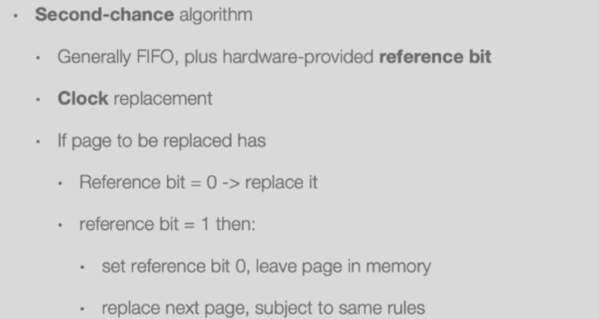

当采用简单 Clock 算法时，只需为每页设置一位访问位，再将内存中的所有页面都通过链接指针链接成一个循环队列。当某页被访问时，其访问位被置 1。置换算法在选择一页淘汰时，只需检查页的访问位。如果是 0，就选择该页换出；若为 1，则重新将它置 0，暂不换出，而给该页第二次驻留内存的机会，再按照 FIFO 算法检查下一个页面。当检查到队列中的最后一个页面时，若其访问位仍为 1，则再返回到队首去检查第一个页面。下图为该算法的流程和示例。由于该算法是循环地检查各页面的使用情况，故称为 Clock 算法。但因该算法只有一位访问位，只能用它表示该页是否已经使用过，而置换时是将未使用过的页面换出去，故又把该算法称为最近未用算法 NRU(Not Recently Used)。

**5. Enhanced Second-Chance ALgorithm**

 主要思想是不希望替换即将访问的page和dirty的page，所以00是最近没有用过而且没有被修改的，这是最好的。如果没有00就替换01……

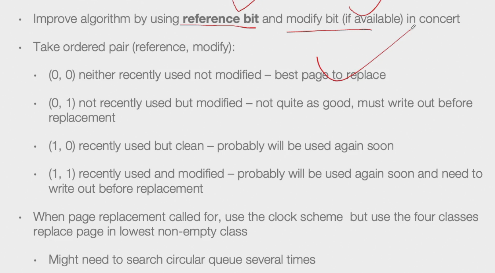

##### 6. LFU(Least Frequently Used)和MFU

LFU：这个缓存算法使用一个计数器来记录条目被访问的频率。通过使用LFU缓存算法，最低访问数的条目首先被移除。这个方法并不经常使用，因为它无法对一个拥有最初高访问率之后长时间没有被访问的条目缓存负责。

最经常使用（MFU）页面置换算法是基于如下论点：具有最小计数的页面可能刚刚被引入并且尚未使用。这个缓存算法最先移除最近最常使用的条目。MRU算法擅长处理一个条目越久，越容易被访问的情况。

##### 7. Page-Buffering Algorithms

虽然 LRU 和 Clock 置换算法都比 FIFO 算法好，但它们都需要一定的硬件支持，并需付出较多的开销，而且，置换一个已修改的页比置换未修改页的开销要大。而页面缓冲算法(PBA)则既可改善分页系统的性能，又可采用一种较简单的置换策略。VAX/VMS 操作系统便是使用页面缓冲算法。它采用了前述的可变分配和局部置换方式，置换算法采用的是FIFO。

该算法规定将一个被淘汰的页放入两个链表中的一个，即如果页面未被修改，就将它直接放入空闲链表中；否则，便放入已修改页面的链表中。须注意的是，这时页面在内存中并不做物理上的移动，而只是将页表中的表项移到上述两个链表之一中。

空闲页面链表，实际上是一个空闲物理块链表，其中的每个物理块都是空闲的，因此，可在其中装入程序或数据。当需要读入一个页面时，便可利用空闲物理块链表中的第一个物理块来装入该页。当有一个未被修改的页要换出时，实际上并不将它换出内存，而是把该未被修改的页所在的物理块挂在自由页链表的末尾。如何维持空闲链表呢，看[[#No frames]]，有一个内核线程专门去完成这个事情。

类似地，在置换一个已修改的页面时，也将其所在的物理块挂在修改页面链表的末尾。利用这种方式可使已被修改的页面和未被修改的页面都仍然保留在内存中。当该进程以后再次访问这些页面时，只需花费较小的开销，使这些页面又返回到该进程的驻留集中。

当被修改的页面数目达到一定值时，例如 64 个页面，再将它们一起写回到磁盘上，从而显著地减少了磁盘 I/O 的操作次数。一个较简单的页面缓冲算法已在 MACH 操作系统中实现了，只是它没有区分已修改页面和未修改页面。

### 一些琐碎

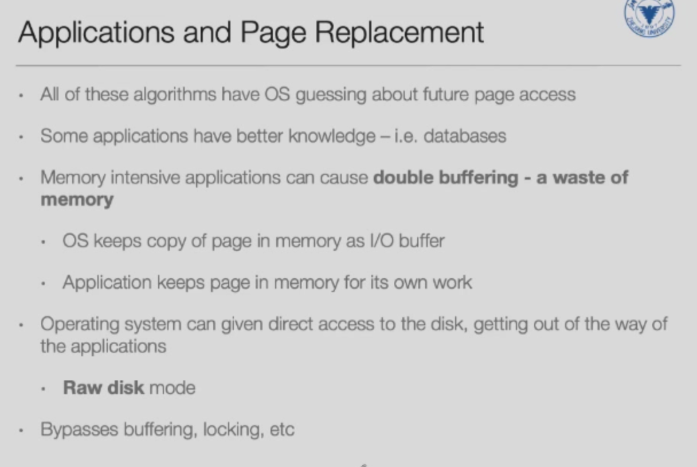

#### 帧页分配策略

比如系统有100个帧页，有5个进程，每个进程20个，当进程中的物理帧页不够了，是自己直接开始替换还是去整个系统的100个帧页里去找空闲帧页。

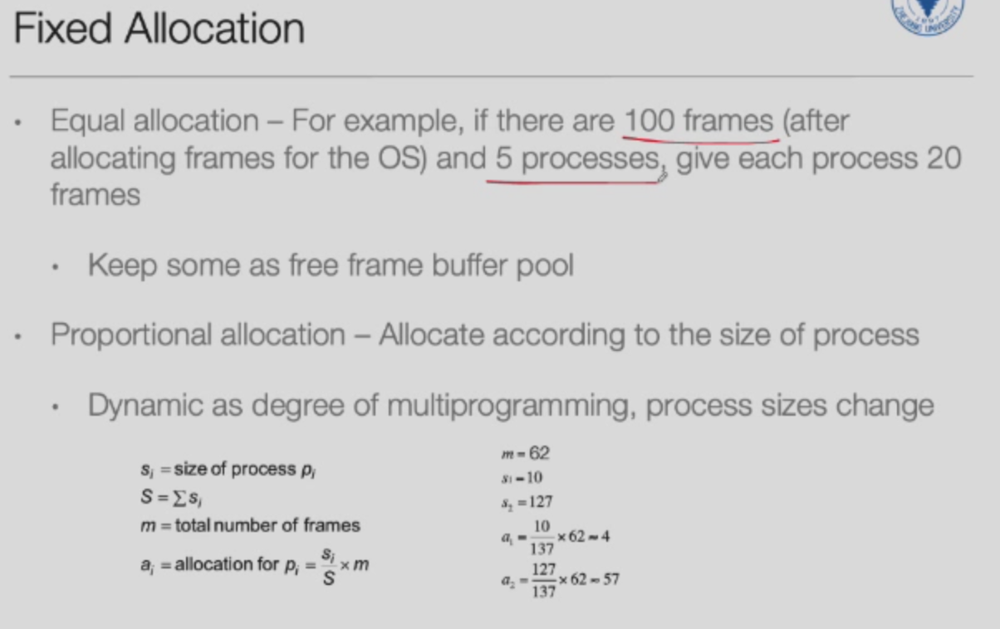

Global站在全局来看，内存使用效率最高，但是这样每个进程的效率会受到其他进程的影响。而Local预先分配好，缺点是全局来看不是最优的。

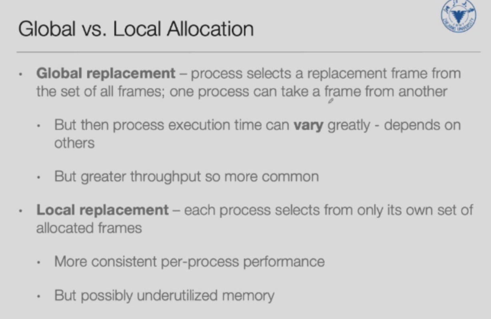

Peclaiming pages页回收：讲的仍然是[[#No frames]]

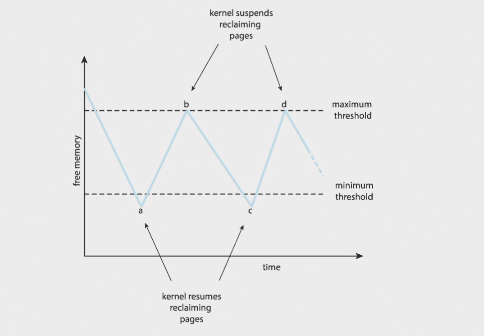

系统的内存降低到一定的程度之后，一方面把一些page替换出去，如果还是不够，可以把一些进程直接kill掉，OOM就是对进程进行打分，决定谁先被kill。

