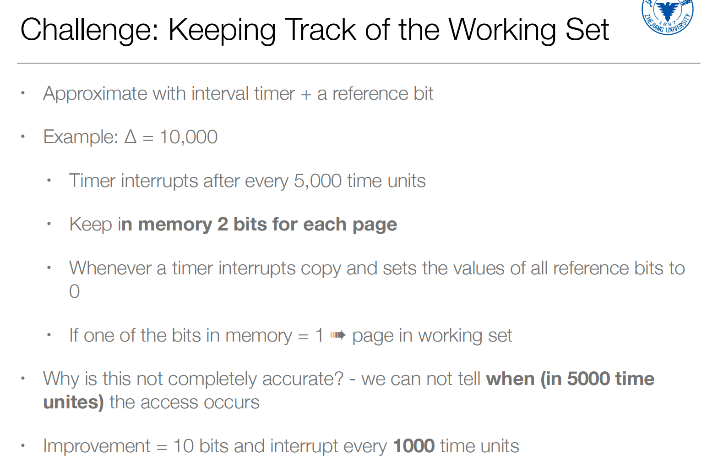
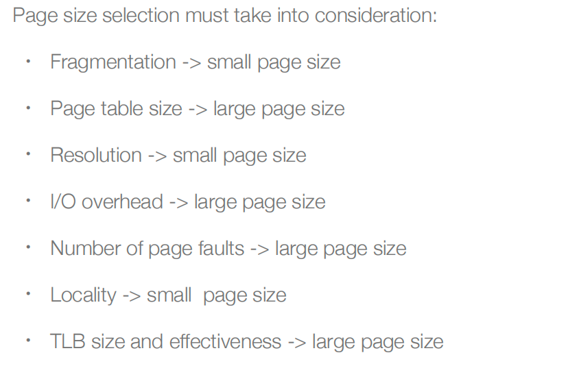
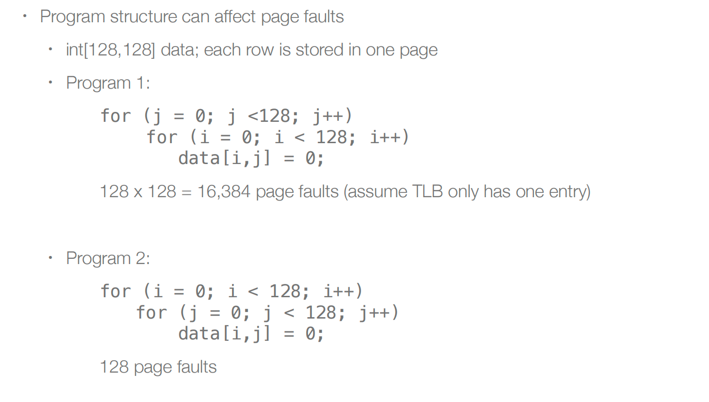
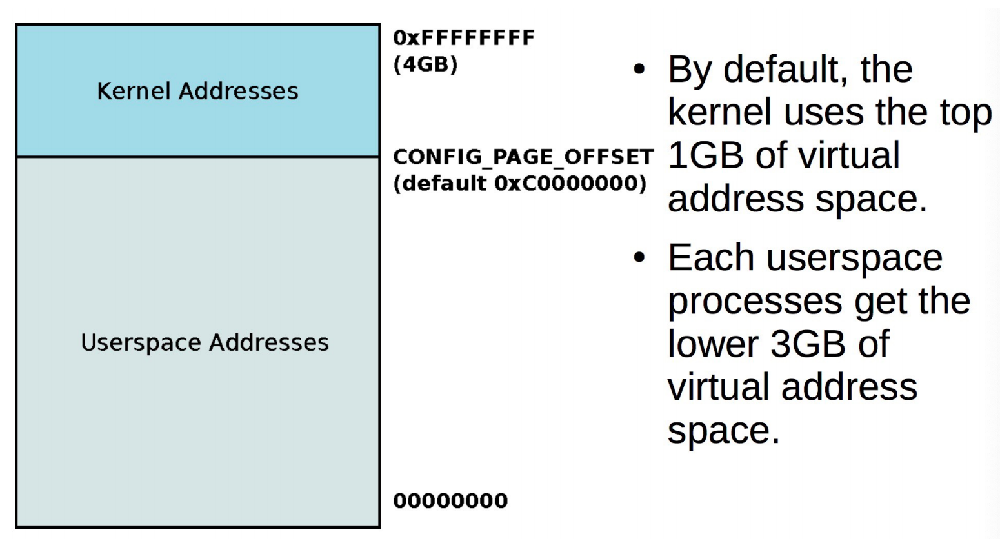
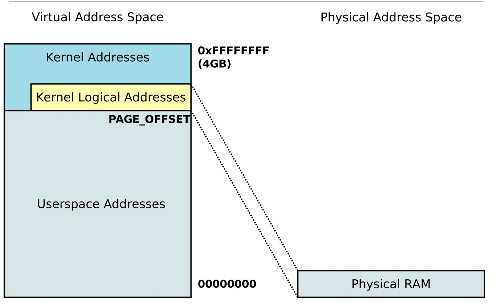
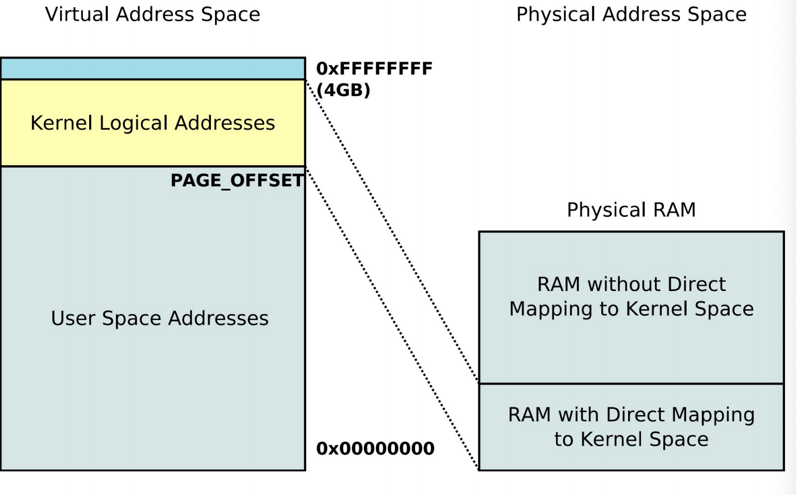

## Demand Paging

### Major and minor page faults

- Major: 页面已被引用，但没有在内存中，需要从外面swap in进来
- Minor: 缺页只是因为page table映射不存在，但页面在内存中存在

大部分的page fault都是因为Minor而不是Major，因为进程之间可以共享一些内存并且有专门的回收机制，所以major类型的page fault会大幅减少。这是好事，因为我们只需要修改一下映射即可。

### NUMA

**NUMA理解：**

所谓物理内存，就是安装在机器上的，实打实的内存设备（不包括硬件cache），被CPU通过总线访问。在多核系统中，如果物理内存对所有CPU来说没有区别，每个CPU访问内存的方式也一样，则这种体系结构被称为Uniform Memory Access(UMA)。

如果物理内存是分布式的，由多个cell组成（比如每个核有自己的本地内存），那么CPU在访问靠近它的本地内存的时候就比较快，访问其他CPU的内存或者全局内存的时候就比较慢，这种体系结构被称为Non-Uniform Memory Access(NUMA)。

---

在分配内存的时候倾向于分配和当前所在的CPU的memory离得较近的地址。

### 抖动（Thrashing）

当一个系统没有足够的page，page fault rate 会上升。page fault大多都是内核在处理，系统大部分时间都在进行页替换，操作系统以为load的进程数量太少了，所以又load了更多的进程，又加剧了缺页的情况。系统大部分时间用于缺页处理，浪费大量资源在处理缺页异常，不断地swap in和swap out，没有足够的时间处理用户态进程。

发生原因：total size of locality（在一个时间窗口里面进程需要去access的内存页面的集合） > total memory size，系统内存太小了。

**怎么解决**：

方法一：在做页替换的时候只管自己的进程，一个进程只能使用某些页，这样系统就能减少全局抖动，但是可能会发生局部抖动。

方法二：在一个时间窗口里，一个进程所需要reference page的数量，工作集就是往回看多少秒（时间窗口），在这个时间段内去access的物理页。
- 工作集窗口（Δ）：如果设置得特别小，工作集就定义不准确；如果设置得特别大，那就没有意义，因为我们想看局部时间。
- 进程 $p_i$ 的工作集（$WSS_i$）：在最近的Δ中引用的页面总数（随时间变化）。
- 总工作集： $D =∑WSS_i$，如果$D$大于内存，那么suspend或者swap某些进程（假设Δ设置合理）。
- 

- 怎么去追踪工作集是一个问题。使用reference位进行记录，然后定时拷贝reference位，再清空reference位

方法三：通过缺页异常发生的频率来判断系统内存压力，这比WSS方法更加直接。事实上，**缺页异常频率的上升代表着新的locality的开始**，因为它代表着前面的一些页面失效了，局部性发生了迁移。

### Kernel Memory Allocation

内核内存分配与用户态内存不同，它通常从空闲内存池分配。
内核为不同大小的结构请求内存->最小化由于碎片造成的浪费。
某些内核内存需要在物理上是连续的，比如对于IO设备来说，如果不是IOMMU系统，那么DMA不通过MMU，直接访问物理内存，这需要物理内存连续。

为了更好地管理内存，操作系统有着多个层级的内存分配系统

#### Buddy System

目的：最底层的内存分配机制，伙伴系统，很快地分配出需求大小的连续的物理帧页（**注意伙伴分配系统最小的粒度就是页**）。

原理：先将需求向上取到2的幂，然后二分chunk，直到满足需求

例子：

优点：它可以快速地将未使用的块合并成更大的块，也可以更快地分配物理内存页。

缺点：internal fragmentation（内部碎片），例如33k变成64k。

#### Slab Allocator

目的：满足内核里面需要频繁使用size较小的内存的对象。

原理：一个slab由一个或者多个连续页组成，然后将这个slab分成同样大小的objects。每种大小的object对应一个slab。当slab用完之后，会向伙伴系统去要内存。同样类型的slab之间用链表相连接，被使用过的slab先被使用。

优点：没有碎片化和快速的内存分配。某些对象字段可能可重用的；有时候不需要重新初始化。

缺点：因为有round up，所以还是会存在内部碎片。会降低系统的安全性，因为动态内存分配都是去slab里面分配，容易预测动态内存分配的地址。

### 琐碎

#### Prepaging

为了减少在进程启动时出现的大量缺页异常，提前读入一些进程所可能需要的内存页，但是如果这些内存页不被使用，那就浪费了。

这里有一个考量是要提前准备多少，太多会浪费，太少又起不到作用。

#### Page Size（重要）

IO请求希望一次性拿更多数据，所以需要page size更大。

每个TLB entry能够reach的内存size越大，所以TLB需要page size更大。

#### TLB Reach

TLB里面存的entry数量乘以每个entry能访问的内存大小

#### Program Structure

#### I/O interlock

有一些页不能被swap out，需要锁定在内存中，比如DMA正在访问的内存。

## Linux Virtual Memory

这一部分也可以看成是对整个虚拟内存的复习。

### Virtual Addresses - Linux

用户态和内核态在同一个虚拟内存空间中。

对于每个进程的页表，页表的最顶端的一些entry全部都指向内核地址，这样在用户态陷入内核态的时候就不需要切换页表。

内核中有一个叫CONFIG_PAGE_OFFSET的选项，用来控制虚拟地址空间的切分方式，常用的是1G-3G（32位系统）。

---

然而在1G的内存虚拟地址空间中，还分成两个部分，黄色的内核逻辑地址和真正的物理内存一一映射，这样可以保证不管是虚拟地址还是物理地址都是连续的（方便用户使用）。

而对于上面的蓝色的部分，这一块地址是用于虚拟地址连续但是物理地址可以不连续的分配请求。

这样分成两个部分可以用于满足不同的内存分配请求，前者物理地址连续虚拟地址连续，虚拟地址连续物理地址不一定连续。

---

大内存的空间下，896MB的一一映射和128MB的虚拟地址连续物理地址不一定连续的映射。

### 两种指令

kmalloc：物理地址连续，主要用于分配小内存
vmalloc：虚拟地址连续，物理地址不连续
分配器就是slab，最底下的page allocator就是伙伴系统来分配页

