## 1. File System Interface

### File System Mounting

一个文件系统需要先挂载(mount)才能进行访问。这是一个运行时的信息，内存中存在着一个挂载表来记录关系。

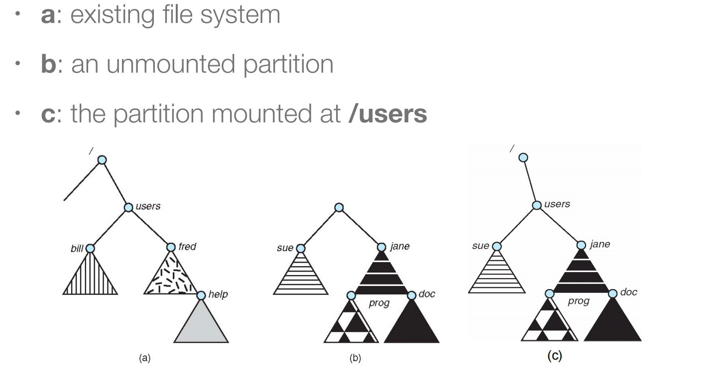

### Protection

对于文件的访问需要一些控制，在linux里面采用了**DAC**的控制方式。

**ACL**

对于每个文件和目录，额外指定一个访问控制信息表。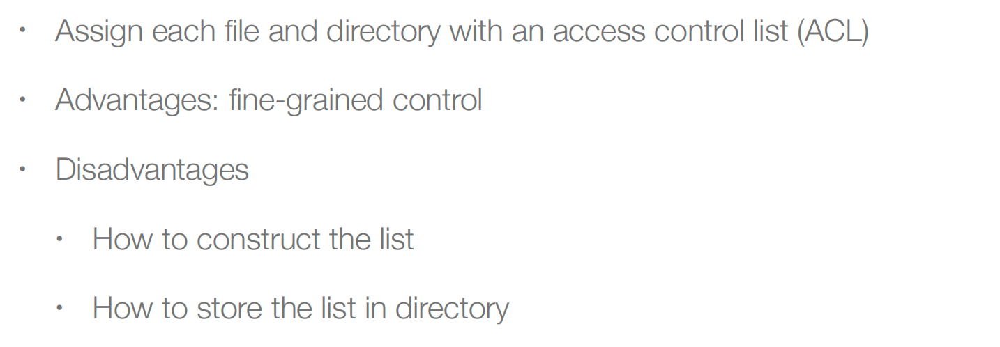

**Unix Access Control**

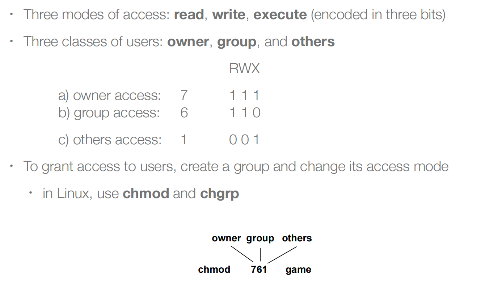

!!! example
  
    现在权限如下，我们想让test用户也能拥有读写权限。

    把test用户添加到os组里去，缺点是人为扩大了test用户的权限，因为我们将test用户加入os组之后，文件系统的任何os组的文件都可以拥有os组级别的操作。

    我们通过acl，对文件和目录进行细粒度的权限设置

    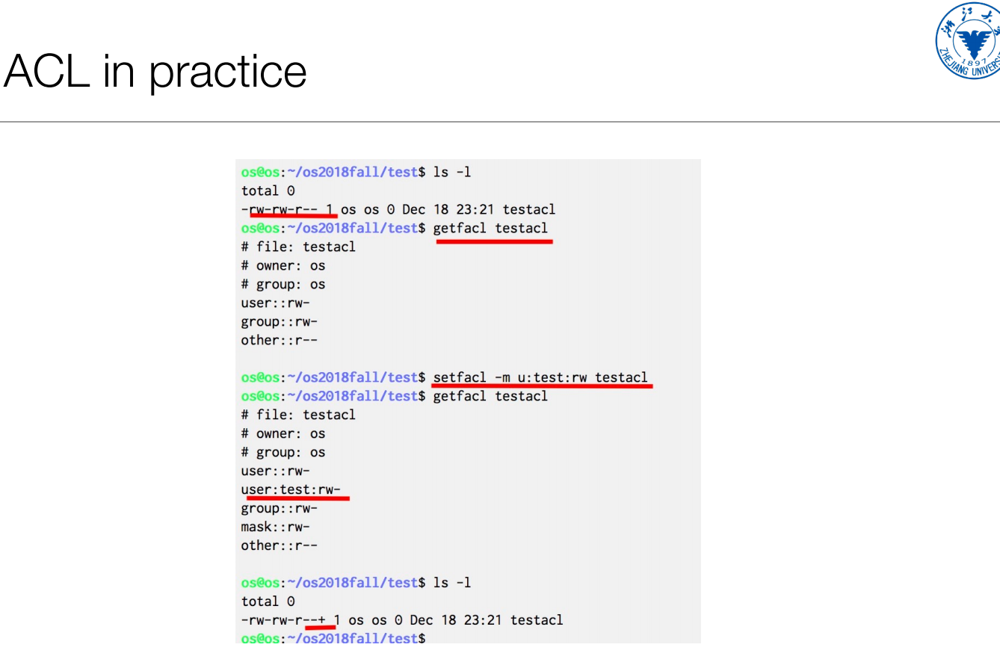

    因此通过Unix Access Control和acl的组合，来实现任意复杂的权限控制。

    acl缺点：
        - acl占用空间
        - acl在复杂的权限控制方面，还是比较复杂的，构建acl和管理acl都比较复杂

## 2. File and Directory in Practice

### Two Key Abstractions

目录也是一种文件，他保存着简单的文件名和文件描述符的映射关系。

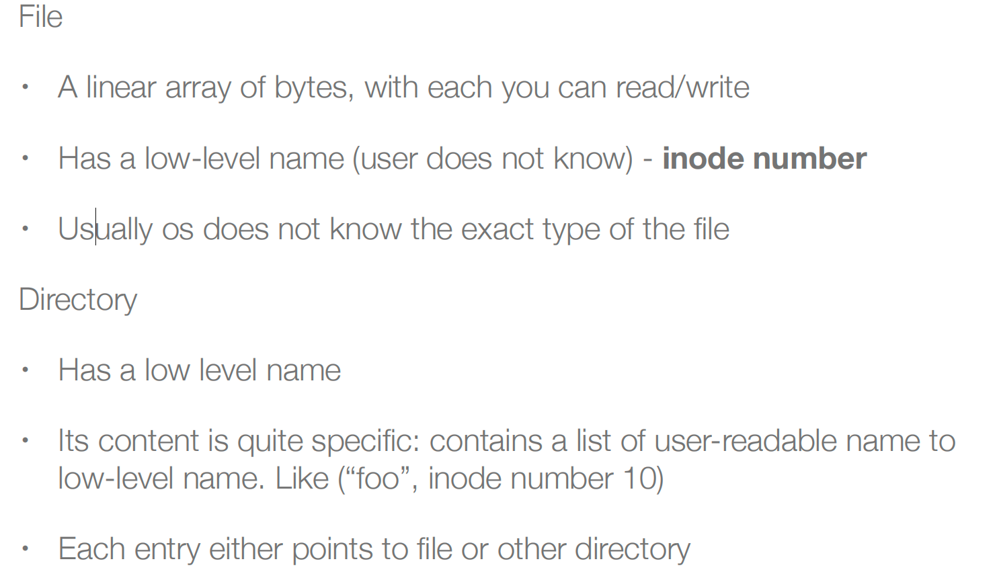

### 文件系统接口

#### 1. 创建文件

实际上创建一个文件，我们需要分配一个新的FCB，用来存储inode结构。然后相关的目录要更新相应的文件名和inode指针。

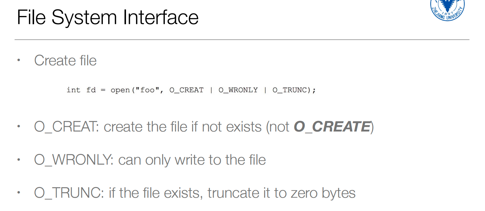

函数open()接受一些不同的标志。在本例中，程序创建文件（O_CREAT），只能写入该文件，因为以（O_WRONLY）这种方式打开，并且如果该文件已经存在，则首先将其截断为零字节大小，删除所有现有内容（O_TRUNC）。

!!! example "cat命令"

    三个特殊的文件描述符，0是stdin，1是stdout，2是stderr，这三个文件描述符在进程创建时操作系统就会给定。

    如下图所示就是cat命令具体的一些system call。
    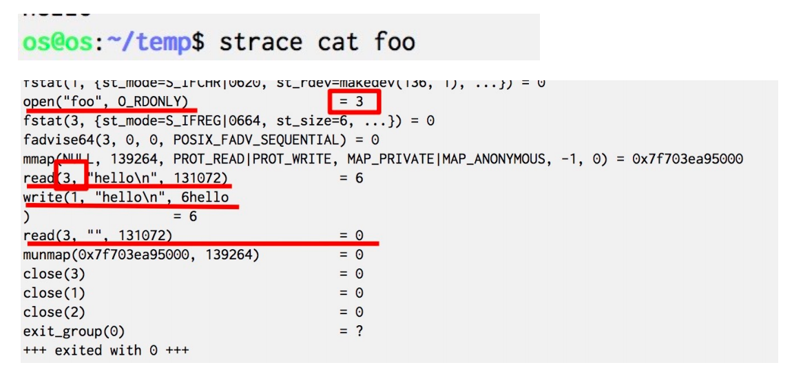
  

#### 2. 不按顺序读写文件

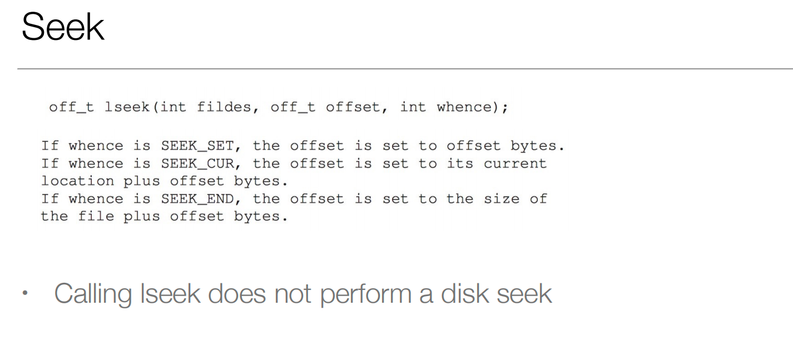

第一个参数是熟悉的（一个文件描述符）。第二个参数是偏移量，它将文件偏移量定位到文件中的特定位置。第三个参数，由于历史原因而被称为 whence，明确地指定了搜索的执行方式。

从这段描述中可见，对于每个进程打开的文件，操作系统都会跟踪一个“当前”偏移量，这将决定在文件中读取或写入时，下一次读取或写入开始的位置。因此，打开文件的抽象包括它具有当前偏移量，偏移量的更新有两种方式。第一种是当发生 *N* 个字节的读或写时，*N* 被添加到当前偏移。因此，每次读取或写入都会隐式更新偏移量。第二种是明确的lseek，它改变了上面指定的偏移量。按系统默认，当打开一个文件时，除非指定O_APPEND选择项，否则该位移量被设置为0。

通常文件的写比文件的读更快，因为对于写一个文件只需要写到buffer上，不一定立马写入磁盘。

#### 3. 用fsync()立即写入 

大多数情况下，当程序调用 write()时，它只是告诉文件系统：请在将来的某个时刻，将此数据写入持久存储。出于性能的原因，文件系统会将这些写入在内存中缓冲（buffer）一段时间（例如 5s 或 30s）。在稍后的时间点，写入将实际发送到存储设备。从调用应用程序的角度来看，写入似乎很快完成，并且只有在极少数情况下（例如，在 write()调用之后但写入磁盘之前，机器崩溃）数据会丢失。

但是，有些应用程序需要的不只是这种保证。例如，在数据库管理系统（DBMS）中，开发正确的恢复协议要求能够经常强制写入磁盘。

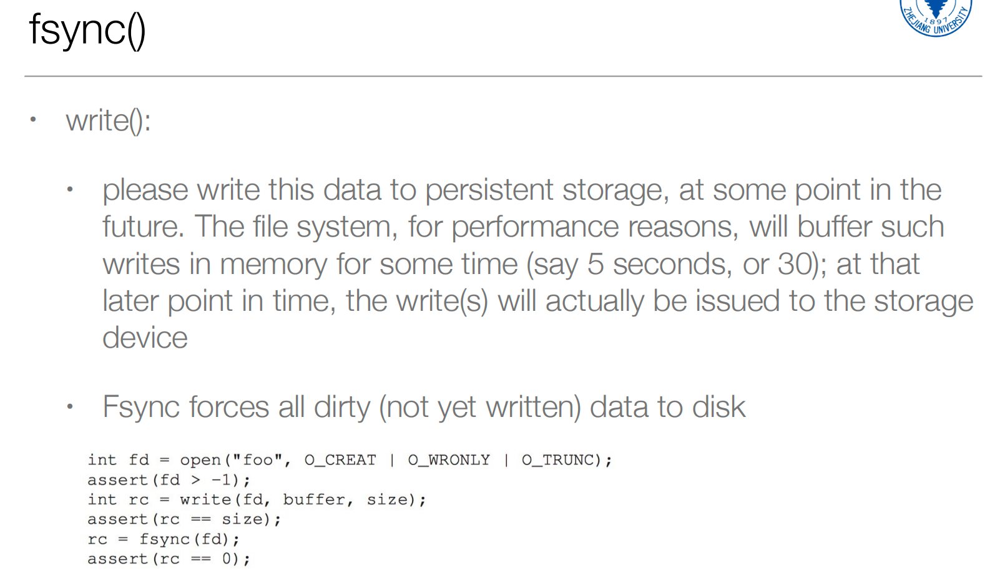

为了支持这些类型的应用程序，大多数文件系统都提供了一些额外的控制 API。在 UNIX中，提供给应用程序的接口被称为 fsync(int fd)。当进程针对特定文件描述符调用 fsync()时，文件系统通过强制将所有脏（dirty）数据（即尚未写入的）写入磁盘来响应，针对指定文件描述符引用的文件。一旦所有这些写入完成，fsync()例程就会返回。

有趣的是，这段代码并不能保证你所期望的一切。在某些情况下，还需要 fsync()包含foo 文件的目录。添加此步骤不仅可以确保文件本身位于磁盘上，而且可以确保文件（如果新创建）也是目录的一部分。

#### 4. 获取文件信息

除了文件访问之外，我们还希望文件系统能够保存关于它正在存储的每个文件的大量信息。我们通常将这些数据称为文件元数据（metadata）。要查看特定文件的元数据，我们可以使用 stat()或 fstat()系统调用。这些调用将一个路径名（或文件描述符）添加到一个文件中，并填充一个 stat 结构，如下所示：

你可以看到有关于每个文件的大量信息，包括其大小（以字节为单位），其低级名称（即inode 号），一些所有权信息以及有关何时文件被访问或修改的一些信息，等等。

#### 5. 删除文件

我们删除一个文件，我们调用的系统调用其实是unlink

#### 6. 创建目录

空目录也有两个enrty，一个是.，指向自己，一个是..，指向父节点。

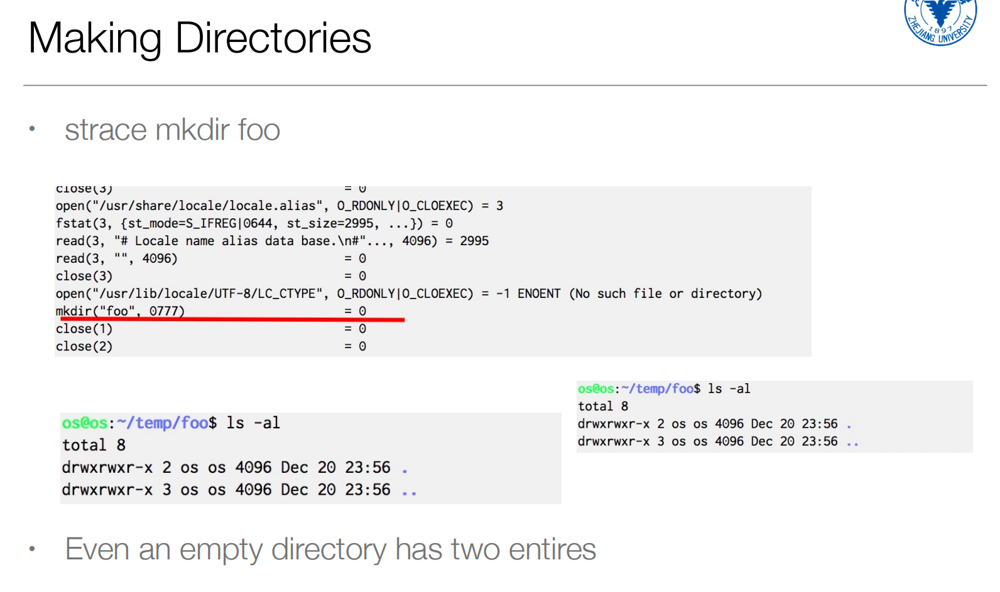

#### 7. 读取目录

由于目录只有少量的信息（基本上，只是将名称映射到 inode 号，以及少量其他细节），程序可能需要在每个文件上调用stat()以获取每个文件的更多信息，例如其长度或其他详细信息。实际上，这正是 ls 带有-l 标志时所做的事情。请试着对带有和不带有-l 标志的 ls 运行 strace，自己看看结果。

!!! note  "Why removing a file calls unlink(重要!)"

    **硬链接**

    对于硬连接来说，其实只是多了一个别名，删除了硬连接的名字只会使得文件的metedata的counter减1，当counter为0的时候，文件才会真的被删除。硬连接的不同文件名指向的是同一个inode，他们的文件描述符什么的都是一样的。
    
    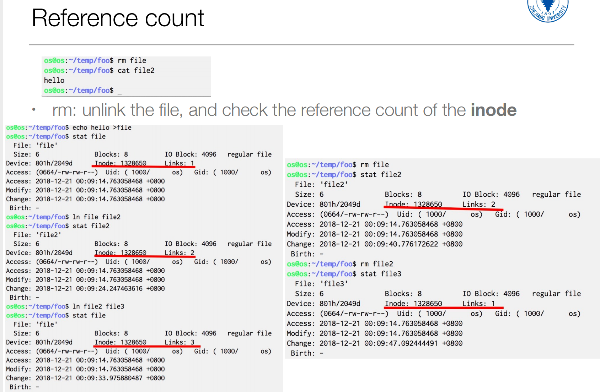

    **符号链接**

    还有一种非常有用的链接类型，称为符号链接（symbolic link），有时称为软链接（soft link）。事实表明，硬链接有点局限：你不能创建目录的硬链接（因为担心会在目录树中创建一个环）。你不能硬链接到其他磁盘分区中的文件（因为 inode 号在特定文件系统中是唯一的，而不是跨文件系统），等等。因此，人们创建了一种称为符号链接的新型链接。

    软链接文件格式的第一个字符是"l"，这是不同于原文件的另一种文件类型，拥有自己的inode。删除名为 file 的原始文件会导致符号链接指向不再存在的路径名。

    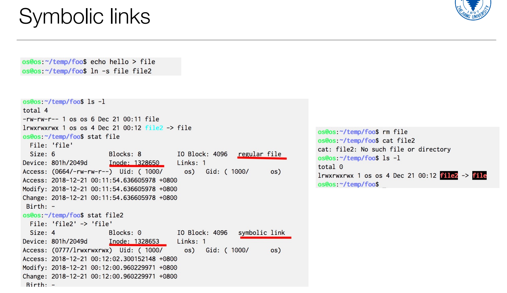

#### 8. 挂载文件系统

## 3. File System Implementation

一个操作系统可以支持多个文件系统。文件系统是磁盘上的概念，就算没有操作系统，文件系统依然存在。文件系统其实就是一种去解读磁盘上二进制文件的方式。

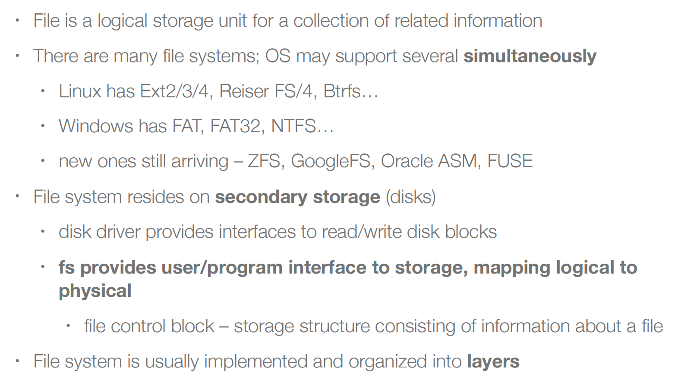

### Layered File System

Device driver是真正的跟外设打交道的，从磁盘去读写数据。Basic file system掩盖了外设和内存读取数据之间的不一致，里面主要有buffer和cache。File organization module（文件组织模块），记录磁盘中哪些disk是空闲的，哪些是已经被分配的。

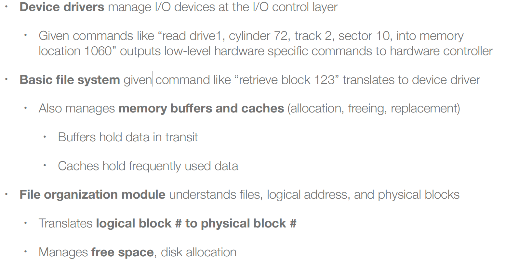

Logical file system，逻辑文件系统是将文件的名字和文件的存储位置等信息进行映射的模块，如何去组织文件和目录在磁盘上的存放方式，以及如何去管理文件和目录访问权限，这里就使用了inode，inode就是一个结构，存储着文件的一些元信息。

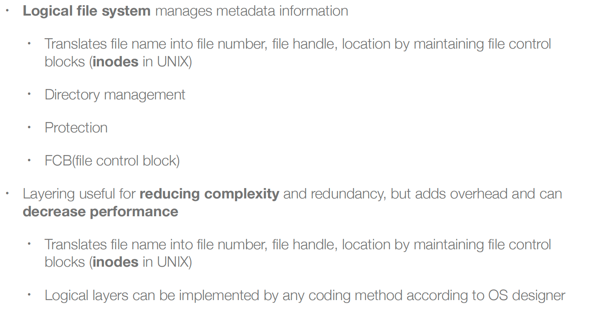

### File-System Implementation

partition == volume == file system storage space

文件系统需要维持on-disk和in-memory两个结构，on-disk是为了数据存储，in-memory用于数据访问。

#### On-disk Structure

**boot control block**：有些磁盘可以被作为操作系统的加载分区，需要存储的是操作系统镜像的位置。

**volume control block(superblock)**：存的是文件系统的元信息，文件系统的格式、数据block的大小、inode存储区域、free list存储区域等。这个块很重要，事先约定好superblock的存储位置。

**directory structure**：一个文件名字和inode号的列表。

**per-file file control block(FCB)**：包括很多文件的细节信息。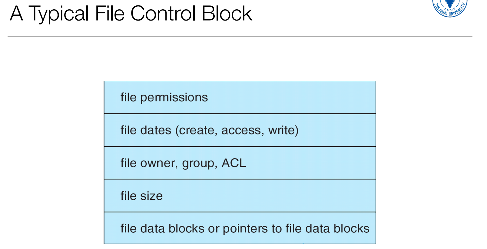

我们需要预留给inode多少的空间，如果预留太少，那么有可能inode已经耗尽，但是磁盘空间还有大量剩余。

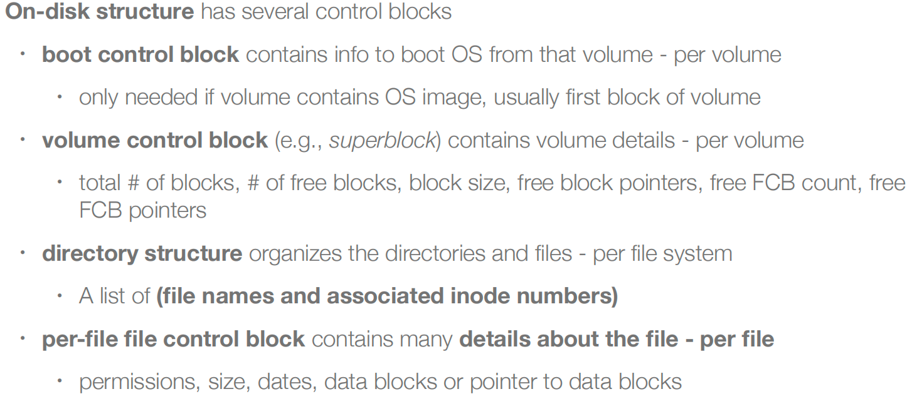

#### In-Memory Structure

**Mount table**：当前的文件系统挂载的路径。

**system-wide open-file table**：对于每一个被打开的文件，都会把这个文件的inode加载到内存中。如果一个文件被多个进程打开，也只会在表中存一份inode，因为这是全局的表。每一个entry指向一个文件控制块。

**per-process open-file table**：存储着指向全局表某个entry的指针。

**I/O Memory Buffers**：disk和内存之间建立缓冲区。

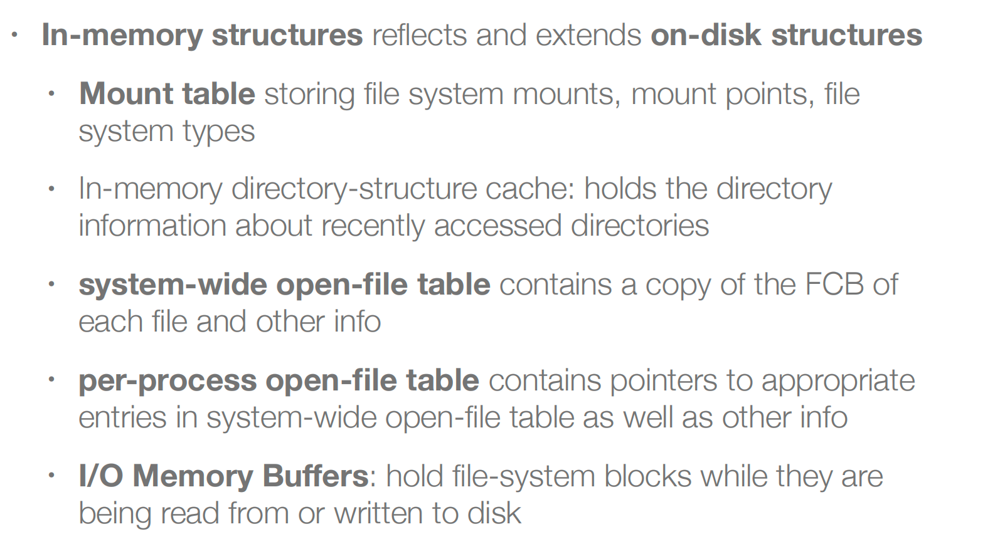

#### open()

首先确定这个文件是否被别的进程打开，如果是的，那么create a Per-Process Open-File table entry pointing to the existing System-Wide Open-File Table；如果没有，也就是文件是第一次被打开，search the directory for the file name; once found, place the FCB in the System-Wide Open-File Table。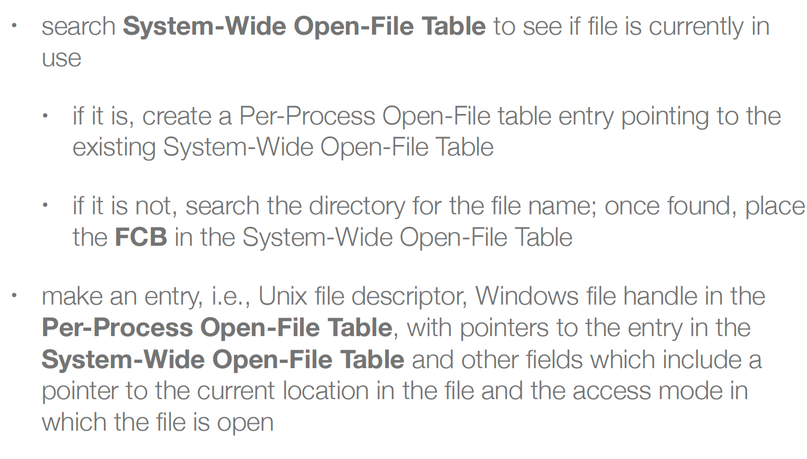

引用计数加一，要返回fd，之后在这个进程中都用fd来操作文件。fd就是进程级别的概念。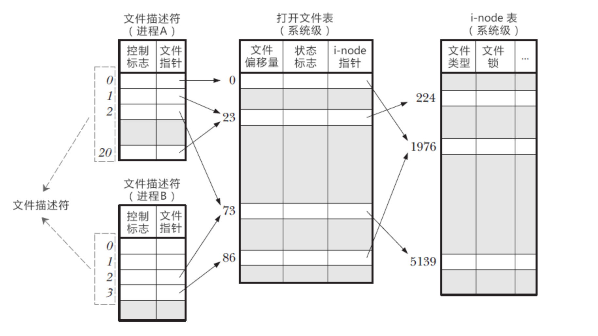

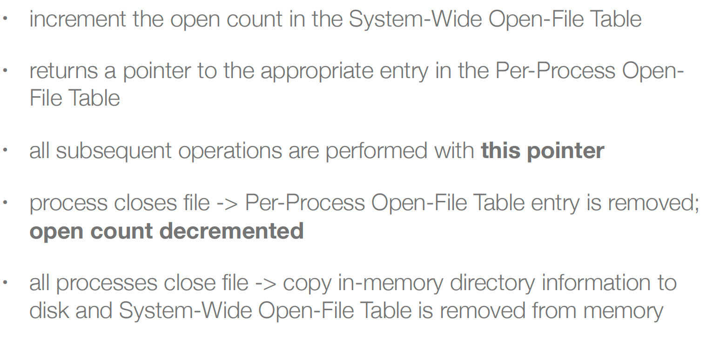

比如一个inode，他用来存储data的block可能只有三个，而其他的都用来存储元信息。那么data就有最大文件的size，比如三个block，一个block只有4K，那么文件最多只能32K。

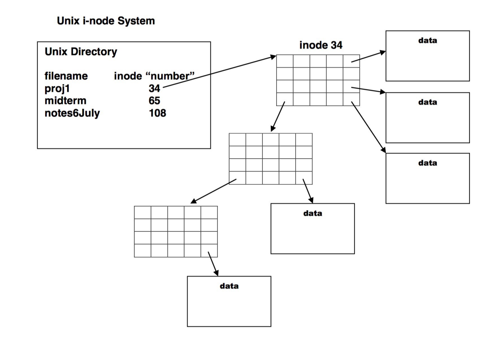