## Review

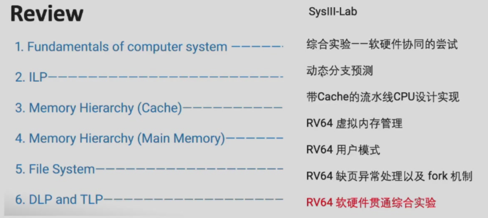

## Knowledge

他们本身都是图灵机。

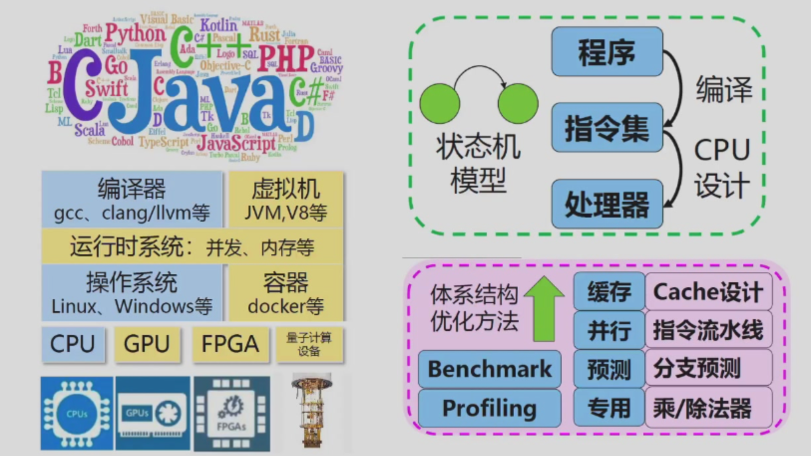

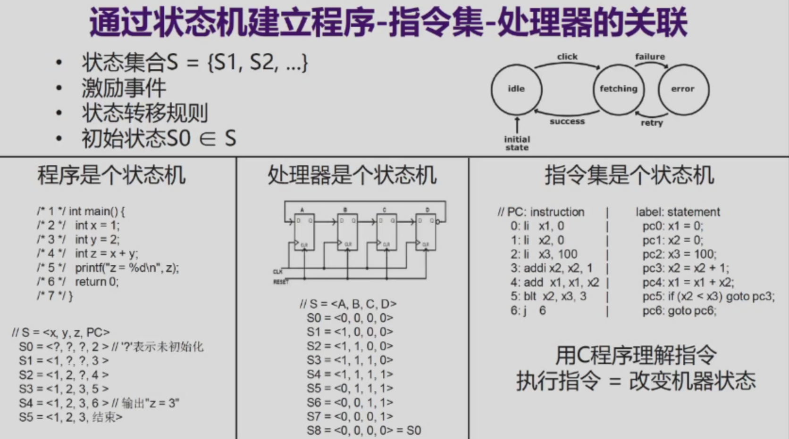

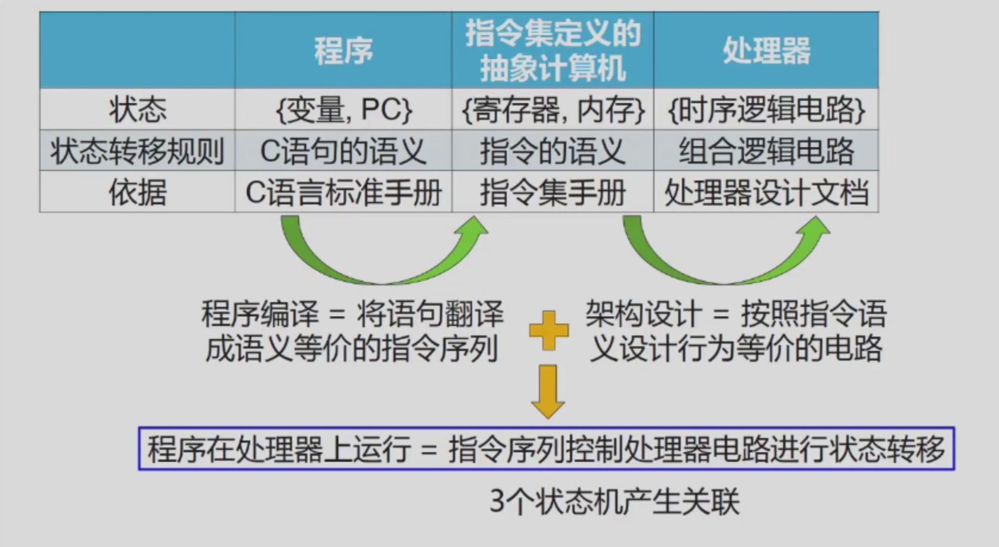

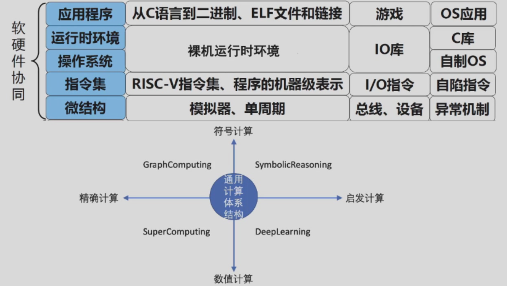

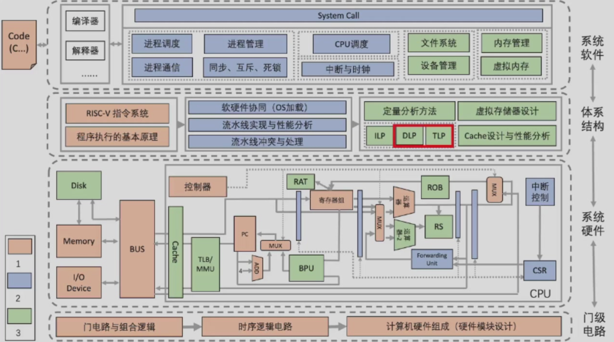

## DLP and TLP

### FLynn分类法

Flynn于1972年提出了计算平台的Flynn分类法，主要根据指令流和数据流来分类，共分为四种类型的计算平台，S就是单，M就是多，I就是指令，D就是数据流。

单指令流单数据流机器（SISD）：SISD机器是一种传统的串行计算机，它的硬件不支持任何形式的并行计算，所有的指令都是串行执行。并且在某个时钟周期内，CPU只能处理一个数据流。因此这种机器被称作单指令流单数据流机器。早期的计算机都是SISD机器，如冯诺依曼架构。

单指令流多数据流机器（SIMD)

SIMD是采用一个指令流处理多个数据流。这类机器在数字信号处理、图像处理、以及多媒体信息处理等领域非常有效Intel处理器实现的MMXTM、SSE（Streaming SIMD Extensions）、SSE2及SSE3扩展指令集，都能在单个时钟周期内处理多个数据单元。也就是说我们现在用的单核计算机基本上都属于SIMD机器。

多指令流单数据流机器（MISD）

MISD是采用多个指令流来处理单个数据流。由于实际情况中，采用多指令流处理多数据流才是更有效的方法，因此MISD只是作为理论模型出现，没有投入到实际应用之中。

多指令流多数据流机器（MIMD）

MIMD机器可以同时执行多个指令流，这些指令流分别对不同数据流进行操作。最新的多核计算平台就属于MIMD的范畴，例如Intel和AMD的双核处理器等都属于MIMD。

### Vector Processor & Scalar Processor

标量处理器：标量处理器一次只处理一个数据，常见的数据类型有整型、浮点型等。标量处理器属于单指令单数据（SISD）一类。

向量处理器：向量处理器中，一条指令同时操作多个数据（SIMD）。

**流水线进行向量运算**

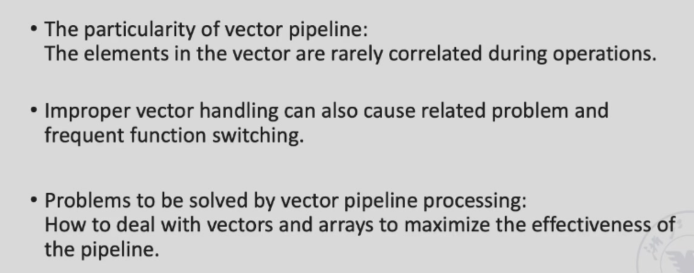

例子：要求$D = A \times (B + C)$，$A，B，C，D$是长度为N的向量。

- **1）Horizontal processing method**

水平加工方法，矢量计算是在一行中从左到右水平执行的。有2N次的功能切换。

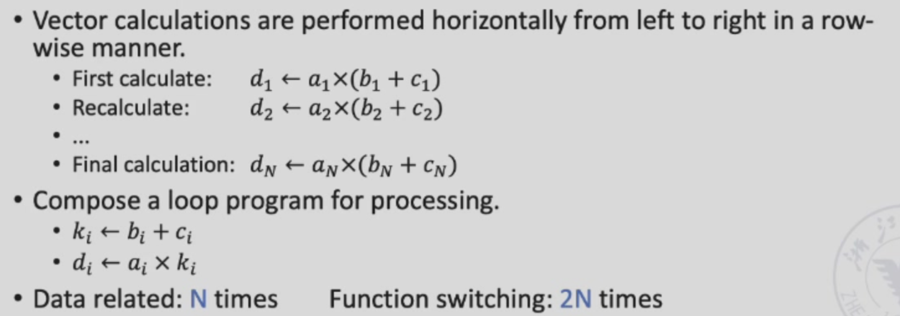

- **2） Vertical processing method**

垂直加工方法，矢量计算是以列的方式从上到下垂直执行的。如果长度N很大，一次性无法放下N，那么会出现问题。

- **3） Vertical and horizontal processing method (group processing method)**

纵横加工法（成组加工法），水平处理和垂直处理的结合，把向量分成若干组，分别进行垂直加工算法。

我们把长度N分成S+1组，每组n个元素，组内纵向，组间横向

### CRAY-1

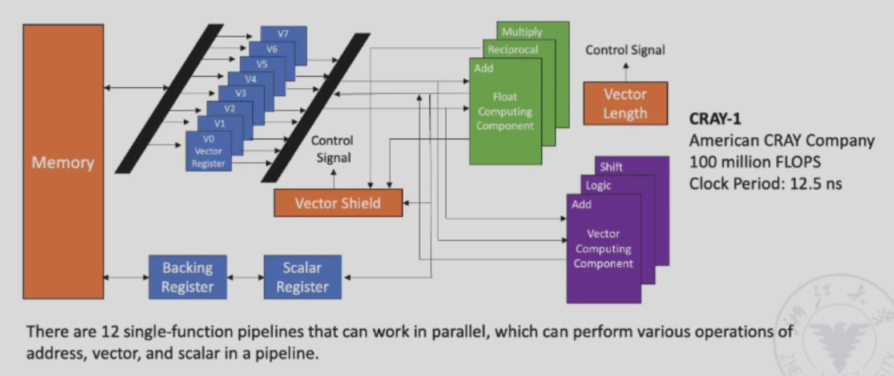

有8个向量寄存器和12个单功能流水线

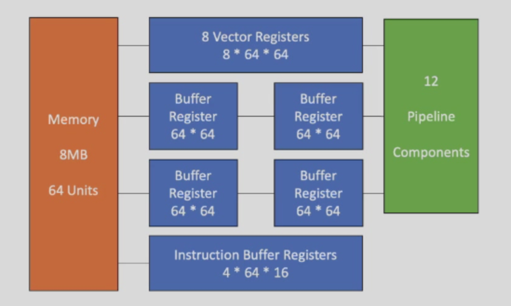

寄存器冲突：分为写读数据相关、读数据相关

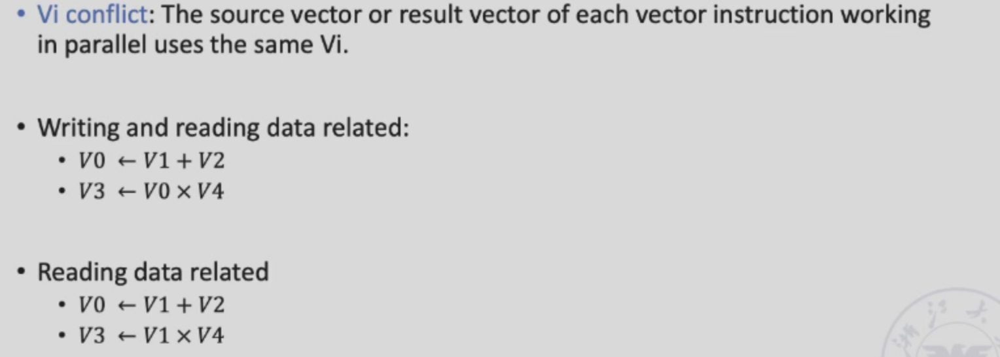

功能部件冲突：看是否有多个功能部件，如果只有一个功能部件，那么两个指令同时要用就会产生冲突

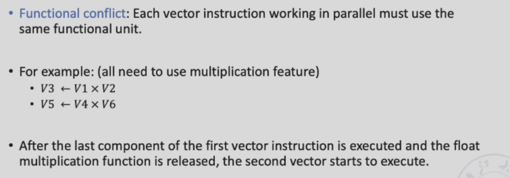

以下四个操作，向量加法、向量和标量的乘法、内存写入寄存器、寄存器写入内存都需要一定的时间（拍数）

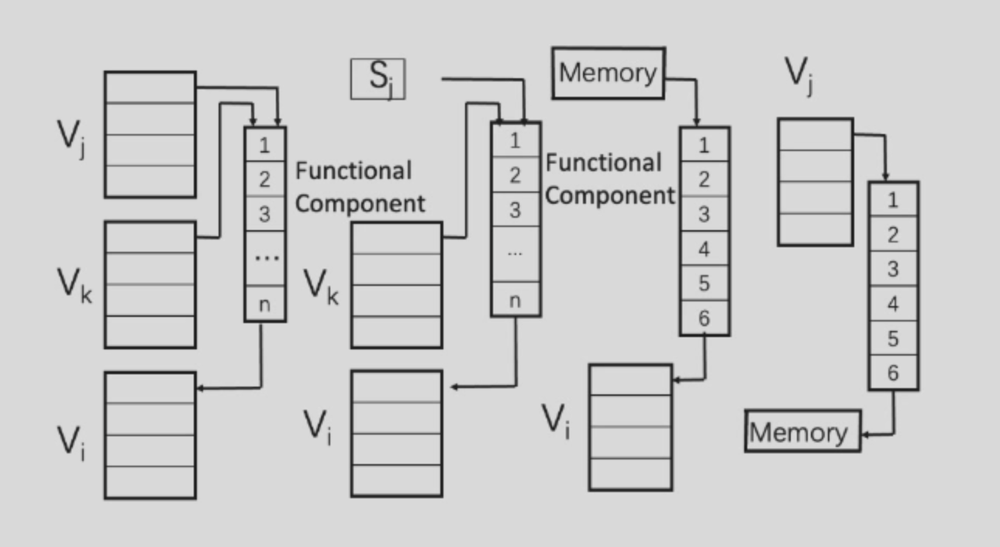

### 改善向量处理器的性能

**1）设置多个功能组件并使它们并行工作，这是硬件的角度；**

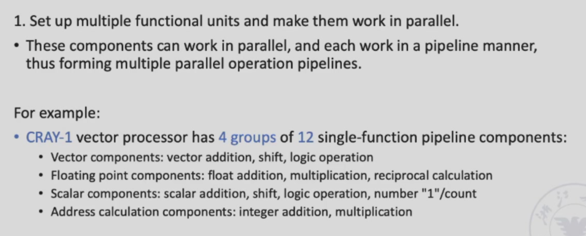

**2）使用向量链接技术加快向量指令串的执行速度；**

其实仍然是想进行并行，比如计算$D = A \times (B + C)$的第一个元素$d_1 = a_1 \times (b_1 + c_1)$，$b_1 + c_1$的结果可以在和$a_1$进行乘法的同时，$b_2+c_2$同时进行运算。

前两条指令没有冲突

我们只需要V2的第一个元素的结果出来，就可以运算V4的第一个结果，在同时我们运算V2的第二个元素的结果。

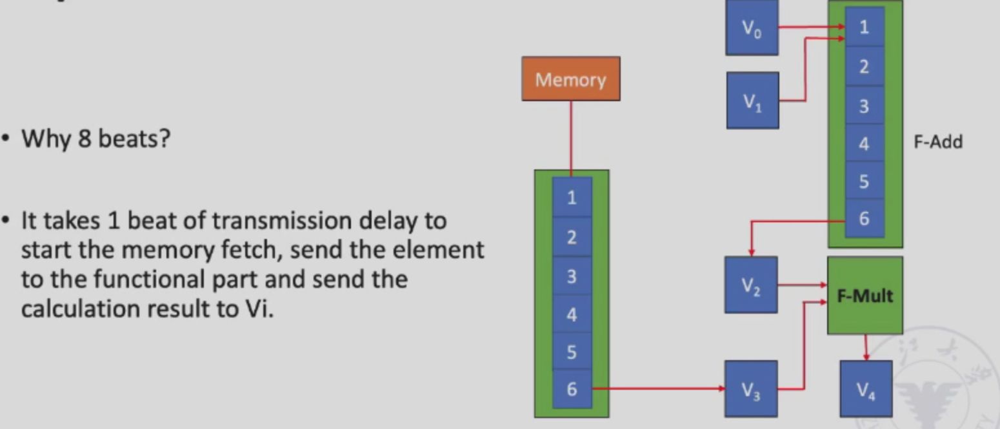

经过8拍之后，V2和V3的第一个结果已经出来，就进行乘法运算计算V4的第一个结果，同时计算V2和V3的第二个结果。

如果是常规的顺序执行：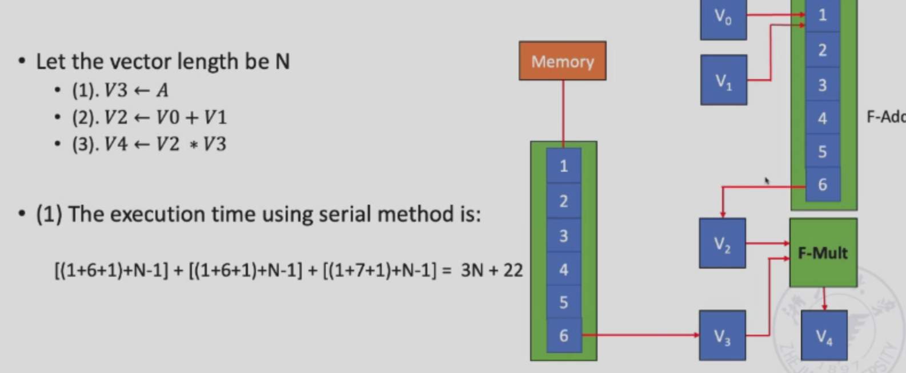

前两条指令并行：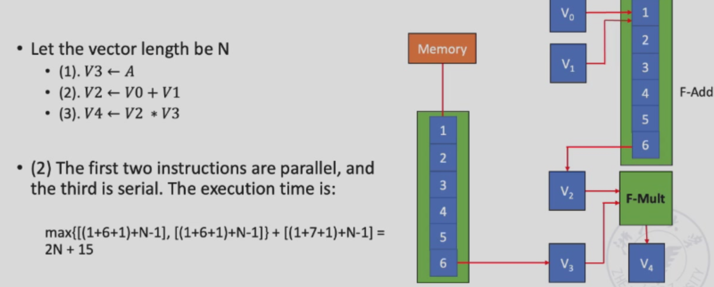

使用链接技术：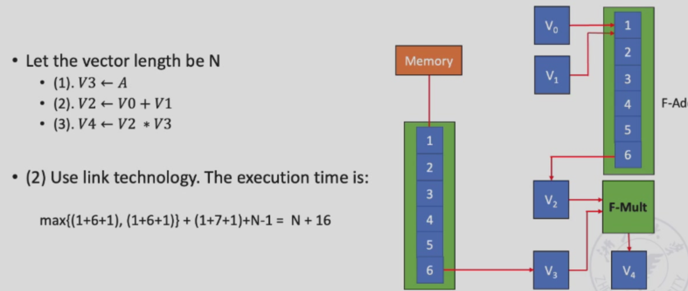

**3）采用回收开采技术，加快回收加工；**

Adopt recycling mining technology to speed up recycling processing. 

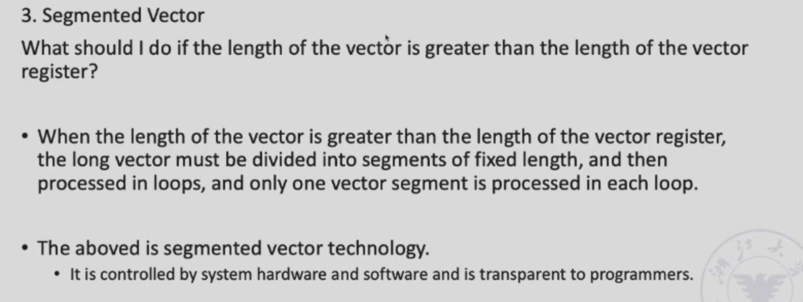

**4）使用多处理器系统来进一步提高性能；**

Using a multi-processor system to further improve the performance.

