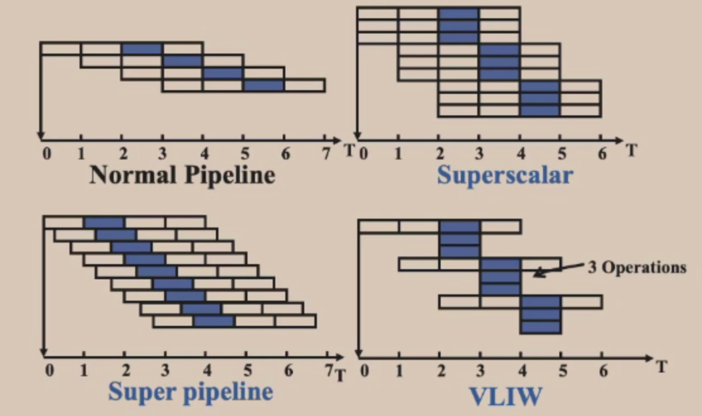
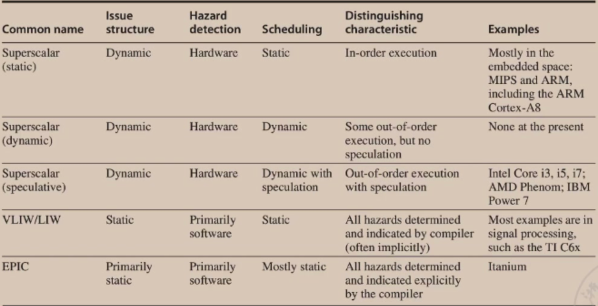
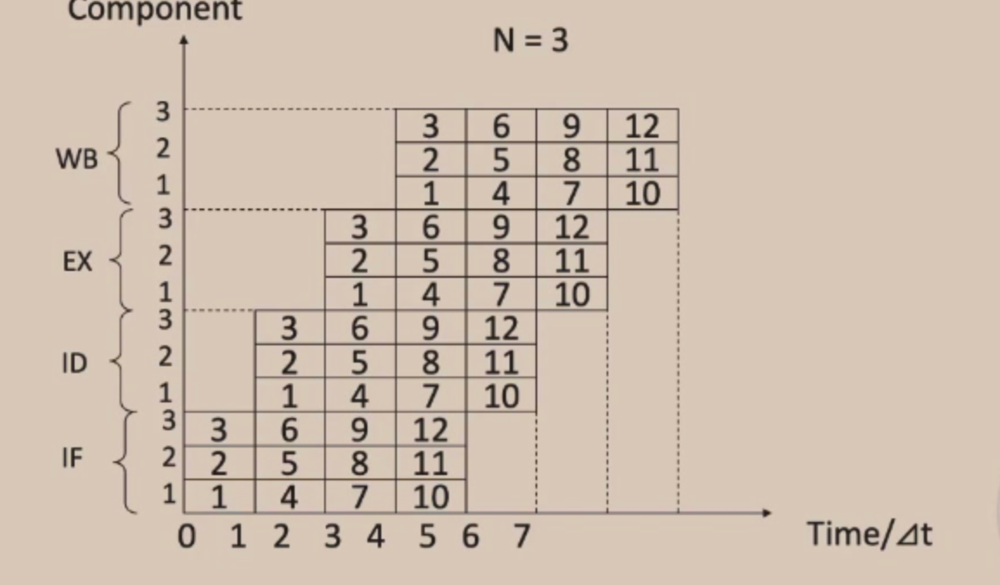
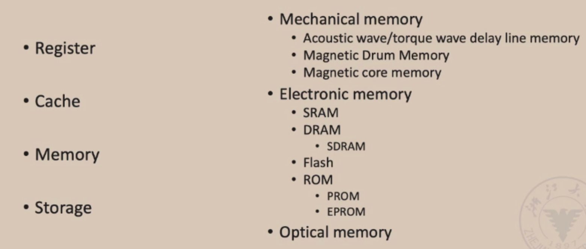
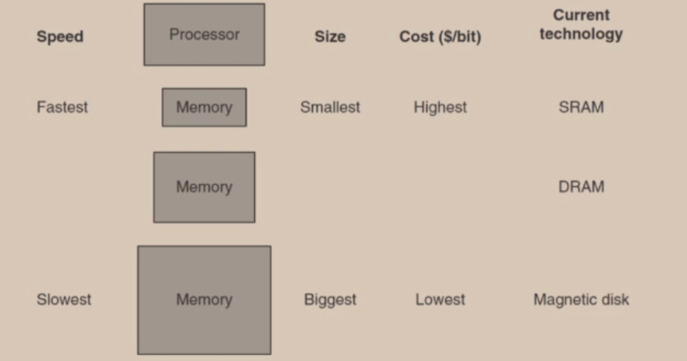
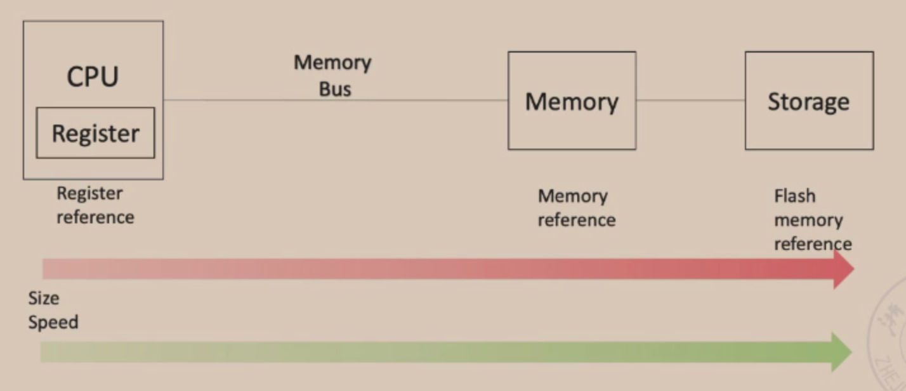
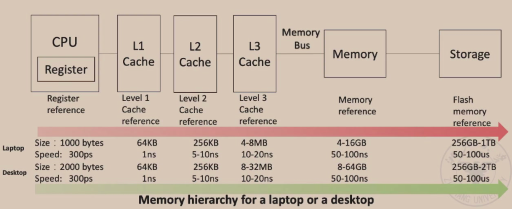

### Multiple-issue processors

这部分了解即可，不是重点。

理想情况下，单流出指在一段无限长的时间中，平均单位时间只能流出一条指令。

#### Superscalar

超标量（superscalar）是指在CPU中有一条以上的流水线，并且每时钟周期内可以完成一条以上的指令，这种设计就叫超标量技术。 其实质是以空间换取时间。而超流水线是通过细化流水、提高主频，使得在一个机器周期内完成一个甚至多个操作，其实质是以时间换取空间。

将一条指令分成若干个周期处理以达到多条指令重叠处理,从而提高cpu部件利用率的技术叫做标量流水技术。超级标量是指cpu内一般能有多条流水线,这些流水线能够并行处理。在单流水线结构中，指令虽然能够重叠执行，但仍然是顺序的,每个周期只能发射(issue)或退休(retire)一条指令。超级标量结构的cpu支持指令级并行，每个周期可以发射多条指令(2-4条居多)。可以使得cpu的IPC(InstructionPerClock)>，从而提高cpu处理速度。超级标量机能同时对若干条指令进行译码，将可以并行执行的指令送往不同的执行部件，在程序运行期间，由硬件(通常是状态记录部件和调度部件)来完成指令调度。超级标量机主要是借助硬件资源重复(例如有两套译码器和ALU等)来实现空间的并行操作。熟知的pentium系列(可能是p-II开始),还有SUNSPARC系列的较高级型号,以及MIPS若干型号等都采用了超级标量技术。

方框里面的数字表示第几条指令。

#### VLIW

超常指令字（VLIW：VeryLongInstructionWord）是由美国Yale大学教授Fisher提出的。它有点类似于超级标量，是一条指令来实现多个操作的并行执行，之所以放到一条指令是为了减少内存访问。通常一条指令多达上百位，有若干操作数，每条指令可以做不同的几种运算。那些指令可以并行执行是由编译器来选择的。通常VLIW机只有一个控制器，每个周期启动一条长指令，长指令被分为几个字段，每个字段控制相应的部件。由于编译器需要考虑数据相关性，避免冲突，并且尽可能利用并行，完成指令调度，所以硬件结构较简单。 　　

一条指令来实现多条指令的内容，并且把这条指令的瓶颈段进行并行，从而提高效率。比如EX段特别长，就把EX段进行并行。

### 超流水线

- 仍然是流水线，只是可以把阶段分的很多很多，另外由于应用的领域不同，比如如果EX阶段的时间很长，就把EX进行细分，如果MEM阶段很长，就把MEM进行细分，实现整体上各个阶段的时间差不多相等。

### Scheduling of Nonlinear Pipelining

- 上学期已经学过了，看上学期的笔记吧！

## Memory Hierarchy

### Memory

- Register、Cache、Memory and Storage
- 介质的发展

- Temporal locality: 时间上的相关性，如果某个东西被访问，他会被倾向于被再次打开；
- Spatial locality: 空间上的相关性，比如某个空间的内存被访问了，那么他的相邻的空间也会被倾向于被访问；

CPU直接操作的只是Memory，不会操作Storage，当保存了之后，Memory的东西才会写入Storage；

如果Memory访问速度太慢了，而CPU的速度太快了，就会加Cache，Cache和Memory的关系和Memory和Storage的关系是差不多的。

