## Dynamic Scheduling

### 1. 模型概述

- Method: out of order execution(乱序执行)
- 如下是比较早的模型：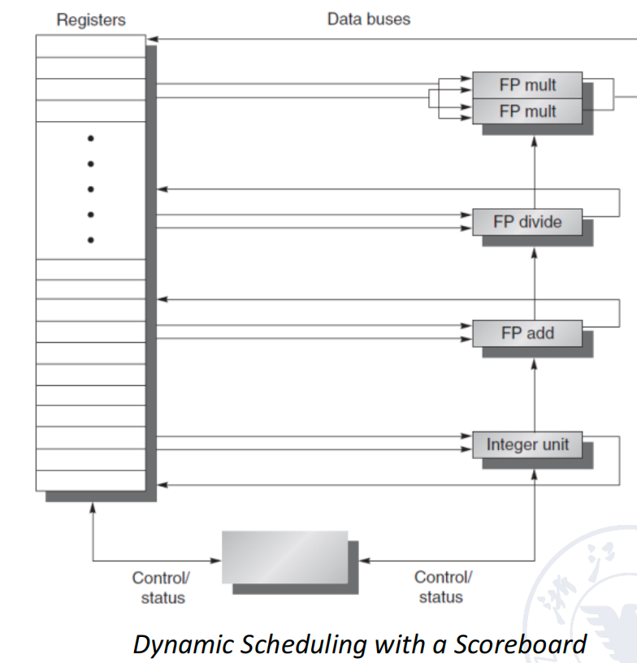
  - scoreboard用来记录一些指令的状态信息和控制信号，比如功能部件的busy与否、指令所在的状态、寄存器（什么寄存器要被写，什么寄存器要被读入）；
  - register寄存器存放变量；
  - 右边的是一些部件，两个乘法一个除法一个加法（这些都是浮点数的）和一个整数部件（load和store指令都要通过整数部件）；

### 2. 整体实现

- 把ID段的功能再进行细分，去检查结构冲突和数据冲突；
- 即把ID段分成两个段：
  - IS(Issue)：解码指令，检查是否有结构（运算部件）冲突；(in-order issue)
  - RO(Read Operands)：（检查数据冲突）等待直到没有数据冲突，然后读操作数 (out of order execution)，相当于之前的ID；
    - 乱序在RO段就已经发生了，如果后面的指令和前面的指令元操作数没有冲突，而且没有结构冲突，那就直接先执行了；
- 对于顺序执行来说，WAR和WAW不会有任何问题，但是一旦有乱序，那么结果就会出现问题；

### 3. Scoreboard Algorithm

#### 3.1 概况
- 这是一种调度指令的算法；
- 把一个指令执行过程分成四个阶段：
  - IS：检测是否有结构冲突，如果没有，则IS段完成；
  - RO：检测操作数（相当于原来流水线的ID），如果乱序从RO开始就是乱的；

- 加法周期短，所以一个就够了，而乘法比较慢，而且相对除法出现的概率较高；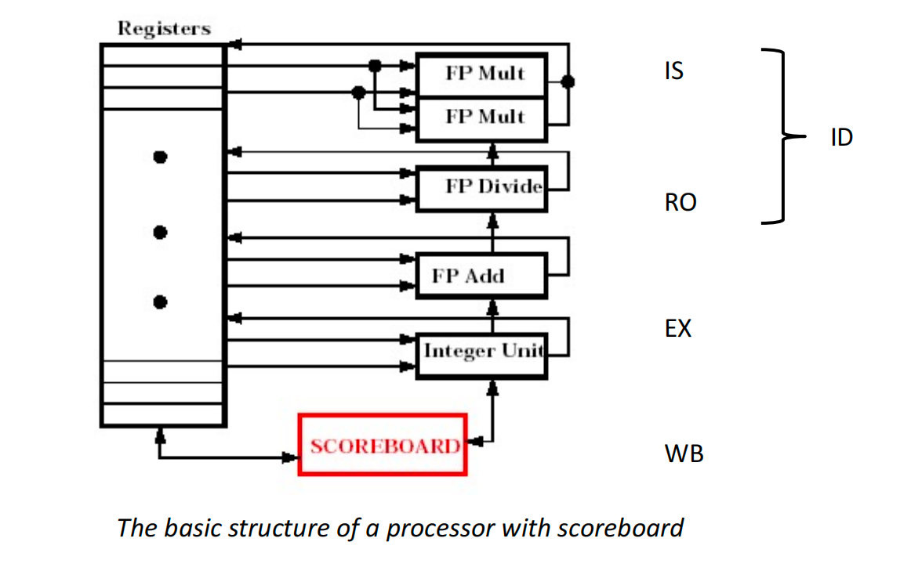

#### 3.2 Example

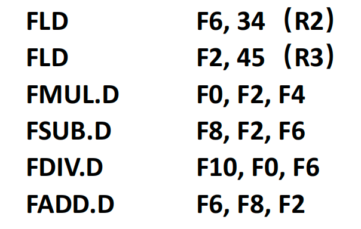
##### 3.2.1 第一阶段
- 指令状态表
  - 前面两个都可以执行没有问题；
  - 第三到第五条因为数据有依赖，所以在RO卡住了；
  - 而第六条，因为ADD部件被SUB占了，结构有冲突，所以在IS就卡住了；
- 寄存器状态表（存放结果寄存器的状态）

- 功能部件状态表
  - 目前有四条指令在执行，所以有四个部件是处于忙碌状态；
  - Op记录当前的操作；
  - F代表源操作数和目的操作数（Fi是目的操作数，其实就是对应着寄存器状态表）；
  - Q表示从哪个功能部件来，比如第二行Mult1，F2就从Integer里来，可以表示等待的关系；
  - R表示源操作数在哪，yes表示要等另一个源操作数ready；
##### 3.2.2 第二阶段

- 指令状态表（假设乘法需要很多拍，还没有写结果）
  - FUML卡住了FDIV，而FDIV没有读F6，导致FADD无法写回F6；
- 寄存器状态
- 功能部件状态

##### 3.2.3 第三阶段

- 指令状态表（假设除法还没有写结果）
- 寄存器状态、功能部件状态

### 4. Tomasulo 

#### 4.1 作用

- 解决问题
  - 1. 反相关；
  - 2. 输出相关；

#### 4.2 基本结构

对于load和store指令有六个buffer，对于mult指令有两个，对于add指令有三个，运算完后的数据线连到所有部件，给所有需要运用到这个数据的地方分别送过去；

保留栈就是实现乱序的主要结构，什么时候所有源操作数都ready了，先ready先计算，那么就可以从保留栈里面出来进入到运算部件中进行运算；

**检测结构冲突就相当于变成了检测保留栈是否有空位**，只要进了保留栈，就相当于过了结构冲突的检测，相当于功能部件扩容了，以前只有一条，现在是可以同时拥有保留栈大小的指令（虽然还是只能有一条指令执行）；

**重命名也是在保留栈完成**的，只要之前没有真实的数据依赖，那么进入了保留栈就相当于重命名。

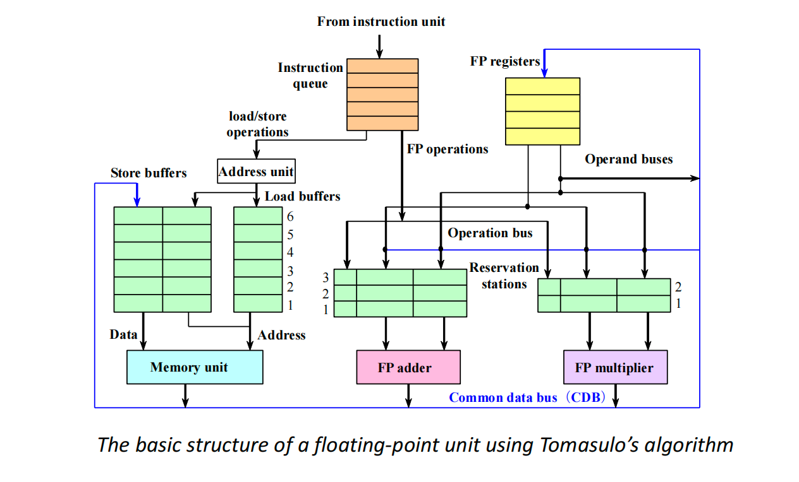

#### 4.3 主要思想

- 它跟踪指令操作数何时可用，以减少RAW危害；

- 它在硬件中引入了寄存器重命名，以最小化WAW和WAR的危害；

#### 4.4 过程

把一条指令的执行过程分成三步：

- Issue（可以重命名寄存器，消除WAR和WAW的影响）
  - 从指令队列拿出指令（FIFO）；
  - 如果保留栈有空位，那么将指令放进去；
  - 如果没空位，则结构冲突，等待知道有空位；
  - 如果操作数不在寄存器里，就要追踪那些会产生这些操作数的功能部件；
- Execute
  - 当所有的操作数都有了，就可以在对应的功能部件进行执行了；
  - PS：load和store需要两个步骤
    - 首先判断base register是否就绪，并计算地址；
    - 把计算后的有效地址放到loadstore的buffer里；
- Write results
  - 当结果计算出来后，就通过CDB总线传输到所有需要这个结果的保留栈（包括store buffer）和寄存器中；
  - store指令在store buffer中等待，直到要存储的值和存储地址都可用，然后在内存单元可用时立即写入结果

#### 4.5 Example

- 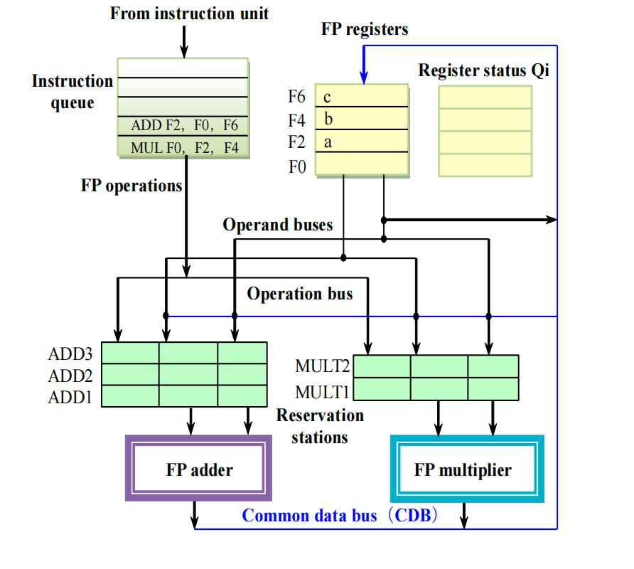

- 分析：MUL指令的F2和ADD的F2没有关系，F0有关系；
- MUL进入保留栈，结果是MULT1（通过结果寄存器识别）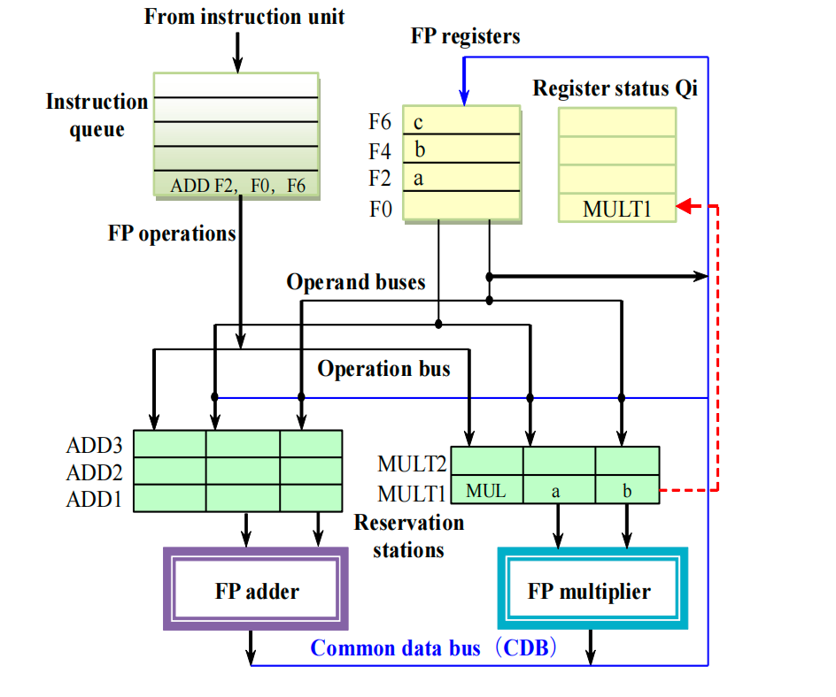

- ADD的MULT1直接从运算部件里来，而不是从F0里来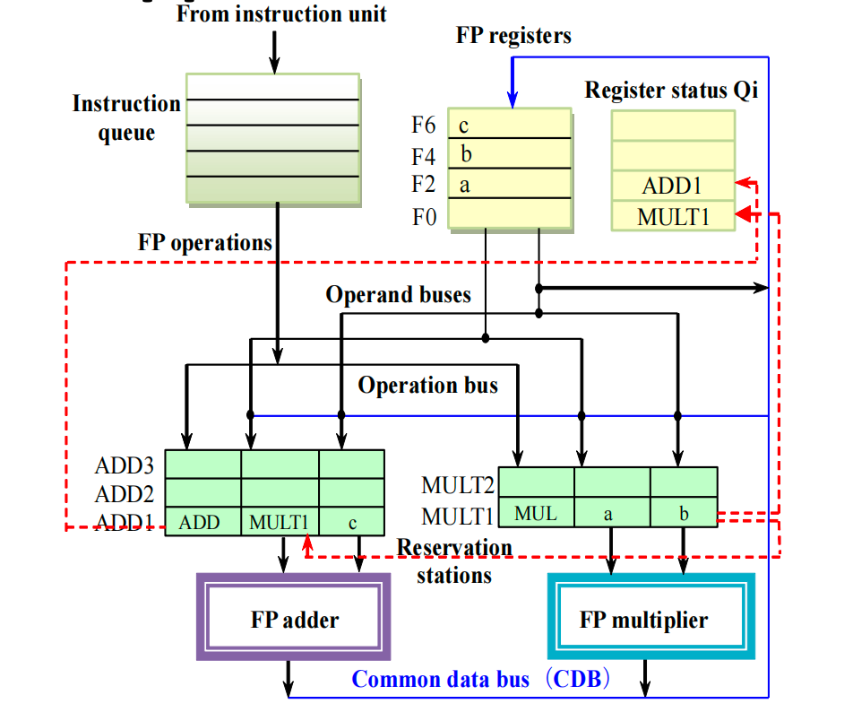

- 当MUL的WB写完了之后，F0和ADD里同步变成了e；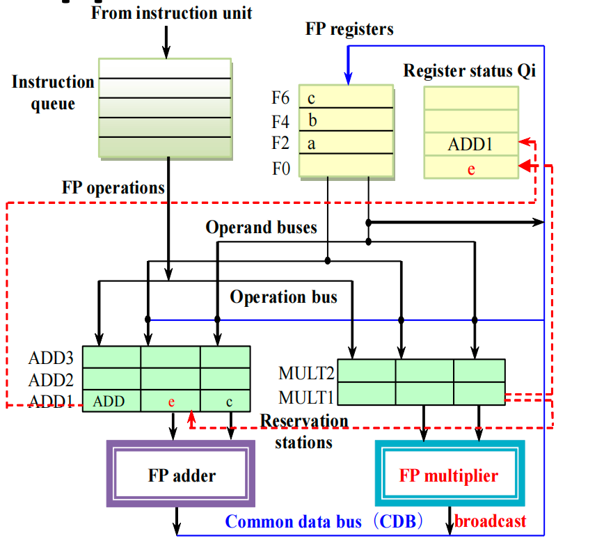

- 现代计算机中会增加多条CDB来改善性能；

#### 4.6 三张表记录信息

- 指令状态表
  
- 保留栈状态表（对应于scoreboard中的功能部件表）
  - Op：当前的操作；
  - Qj, Qk：表示从哪个功能部件来；
  - Vj, Vk：源操作数的value；
  - Busy：保留栈位置是否被占用；
  - A：对于load和store，记录memory的地址；
  
- 结果寄存器状态表（Field Qi）

##### 4.6‘ 一个例子
  - 假设第一条指令已经执行完，第二条指令还没写回；
    - 指令状态表：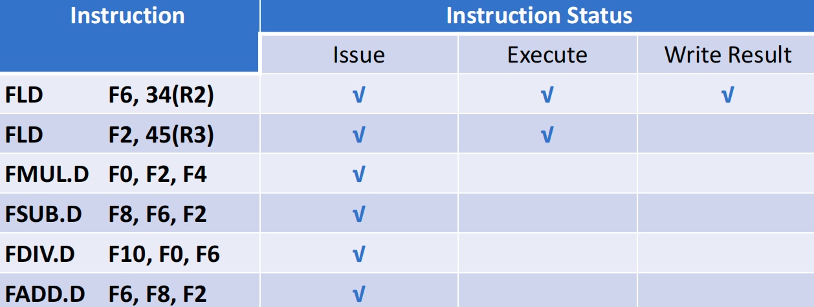三四六要等F2，五要等F0；
    - 保留栈状态表：
    - 寄存器状态表：

- 假设第二条指令load已经执行完了，乘法指令还没有写结果，除法要等F0；
  - 指令状态表：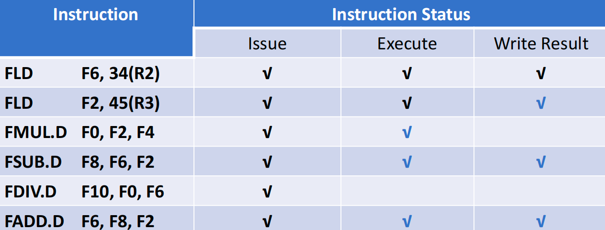
  - 保留栈状态表：
  - 寄存器状态表：

### 5. 总结
- Tomasula算法优点：
  - Dynamic scheduling；
  - Register renaming---eliminatining WAW and WAR hazards；
  - Load/store disambiguation；
  - Better than Scoreboard Algorithm；

- 缺点：
  - 结构比较复杂；
  - Its performance is limited by Common Data Bus；
  - 

- ILP方法的局限性直接导致了多核技术的发展；

### 6. Homework
- 

- 

- 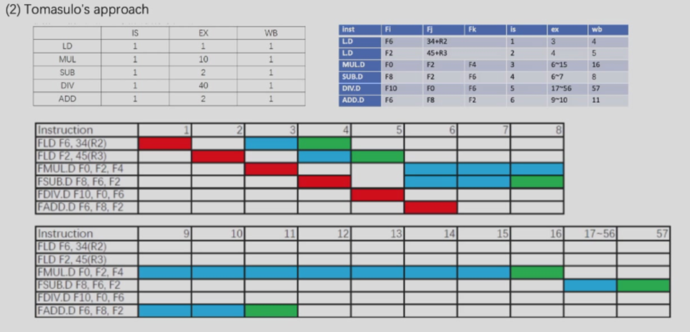