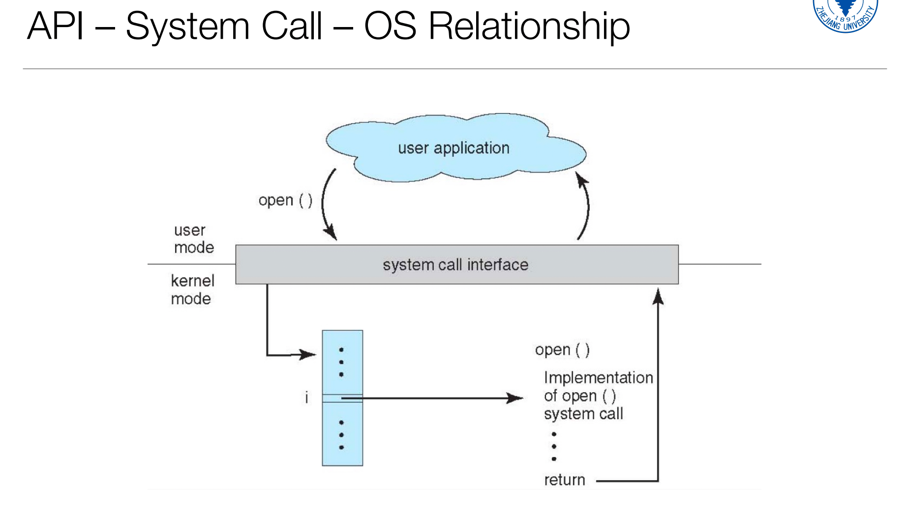
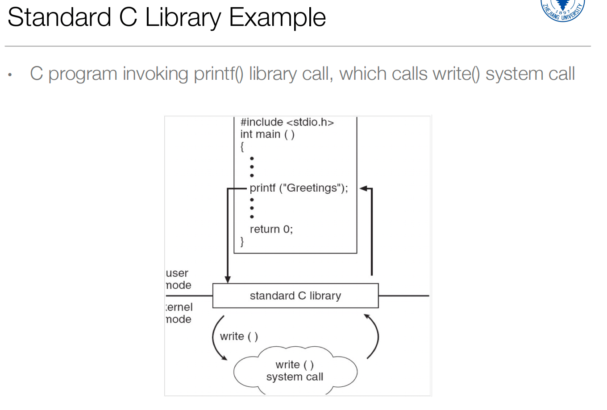
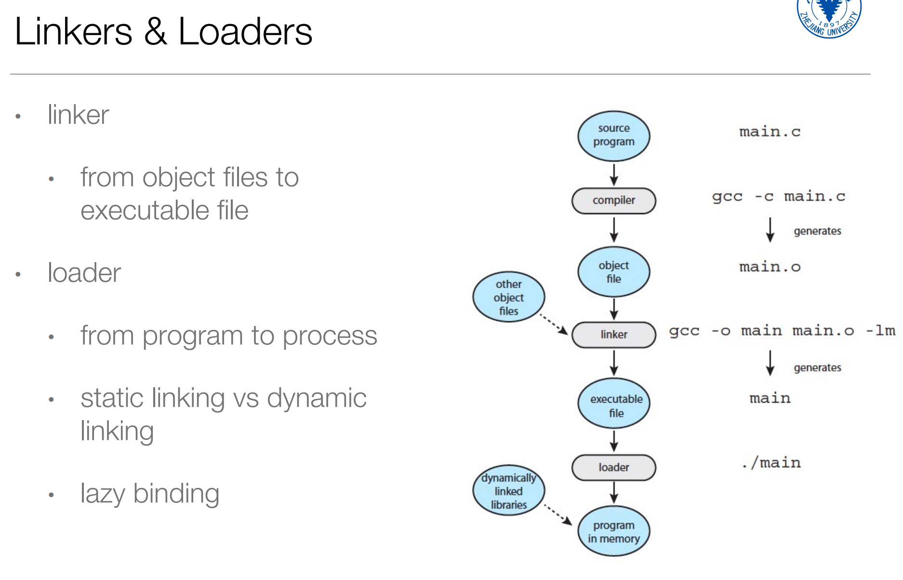

### 1. 操作系统能提供的服务
### 2. 用户和os交互方式
#### 2.1 User Operating System Interface - CLI
shell本身也是program，而且不管是内置指令还是自己的程序，都是程序；
>- 内置指令：根据path环境变量，循环查找path下的命令程序，path可以有很多个；
>- 调用命令其实是原来shell通过系统调用fok()，创建了子进程；

#### 2.2 User Operating System Interface - GUI
#### 2.3 Touchscreen Interfaces
安全隐患：clickjacking（点击劫持）；
#### 2.4 Voice Commands（语音交互）
### 3. 程序与os的交互（系统调用）
#### 定义
- System call is a programming interface to access the OS services（用户态程序和操作系统的接口）
	- Typically written in a high-level language (C or C++)
	- Certain low level tasks are in assembly languages

#### Application Programming Interface
- API封装了我们所要使用的系统调用；
- API的代码具体实现一般在libc里面，最后生成的程序默认动态链接，所以具体代码是没有的。

#### System Calls Implementation
把用户态变成内核态，进入异常处理（如x86的int），然后通过系统调用号来区分，把pc指向系统调用的实现代码；
> 如何传输系统调用号？
> 1. 利用寄存器（事先放在R0里），当下比较流行；
> 2. 可以带操作数；

> 一旦系统调用号确定，再去修改的代价很大；

以printf为例；

#### System Call Parameter Passing
1. 通过寄存器传递；
2. 通过block传递（如果太长了，寄存器放不下；那就把参数存在memory  block里面，传递的是block的地址）；
3. 通过stack传递（如果参数个数特别多，就用栈传递；栈就是内存里的一块区域）；
>example of 系统调用(execve)：
>- Store syscall number in eax(传系统调用号)；
>- Save arg 1 in ebx, arg 2 in ecx, arg 3 in edx(传参)；
>- Execute int 0x80 (or sysenter)；
>- Syscall runs and returns the result in eax；

#### Types of System Calls
- Process control（进程控制）
	- create process, terminate process（最开始系统内核会创建一号进程，之后的进程都是一号进程create出来的）；
	- load, execute（fok只是创建了实体，是父进程的代码，所以如果子进程要运行其他代码，就要load）；
	- wait for time；
- File management（文件管理）
	- create  file, delete file
	- open, close
- Device management
- Information maintenance
	- 比如getpid()
- Communications
	- 比如进程之间共享memory
- Protection

- （important！！）shell去调用/bin/ls，首先会调用fok()（创建子进程），fok()返回pid，系统根据pid的值来判断是父进程还是子进程，据此使用iflese来使父进程和子进程运行不同的代码，然后子进程通过execve(“ls”)，将ls加载到自己的代码中，修改了自己的代码；
>子进程，是父进程的完全拷贝；
>比如父进程fok()返回的pid是子进程的pid，而子进程的pid是0；

#### Linkers & Loaders

- 静态链接：所以依赖的系统代码，会完整拷贝到可执行文件中；
- 动态链接（延迟绑定）：加载的时候把一些库函数的实现代码的首地址记录，之后利用间接寻址，来调用函数；

### Operating System Structure
#### Microkernel System Structure
运行在内核态的代码只维持一些critical的服务，这样可以更方便调试，也更安全（每个操作系统都有很多bug）；

但是在微内核中，信息传递很多，状态切换频繁，性能开销非常大；

