#### 1. Motivation

- 线程可以被操作系统内核单独调度，又天生可以共享内存；

- 

#### 2. What is Thread

- A thread is an **independent stream of instructions that can be scheduled to run as such by the kernel**.
- 有些资源（pre-thread resources）比如（stack、registers、pc、thread- specific data）线程之间不隔离也不共享，所以其实是可以访问的；
- 线程都是可以被单独调度的实体；
- 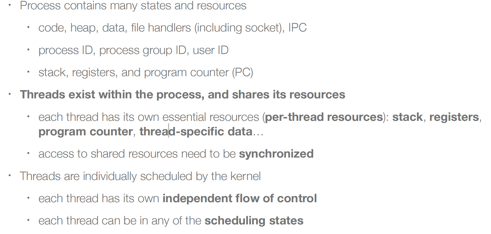 

- 单线程和多线程
- 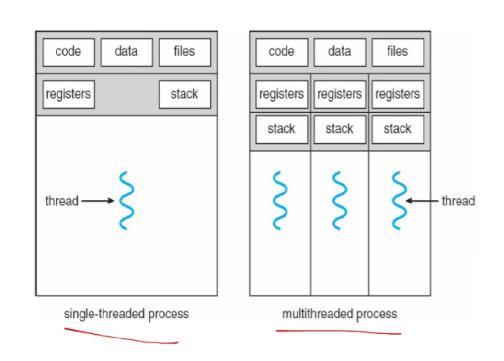
- 当程序运行在用户态时，就使用User Stack，当运行在内核态时，就使用Kernel Stack（内核栈在高位），因为如果调用了系统调用，那么成为了内核态运行内核代码之后，如果内核代码有函数调用，那么就需要栈（通过MMU保证内核栈不被用户态访问，来保护内核）；
- 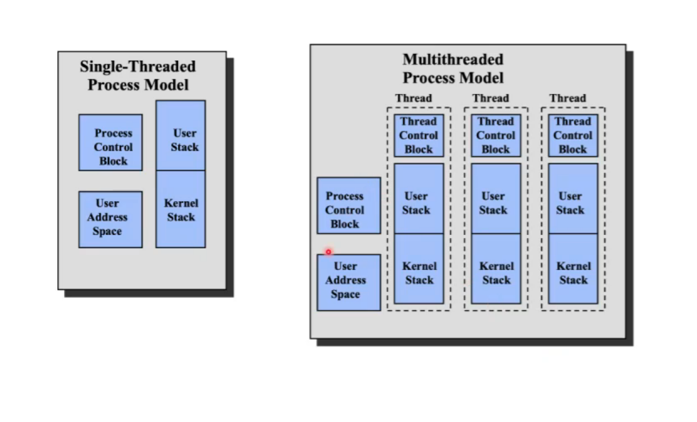

#### 3. Thread Benefits

- 响应性好、资源共享、经济（轻量级）、可以并行（多个CPU core同时运行一个程序的多个线程）；

- 

#### 4. Multithreaded Server Architecture

- 为了增加系统吞吐量：
    - 服务端fork()出来进程，父进程接受新的客户端连接，子进程执行要求比如读取网页；（但是需要系统调用，开销比较高）
    - 对于每一个用户的请求，都创建一个线程，执行请求后，直接把数据丢给客户端（因为共享资源）；
    - 更高效的服务器往往使用多进程多线程的方式；
  
- 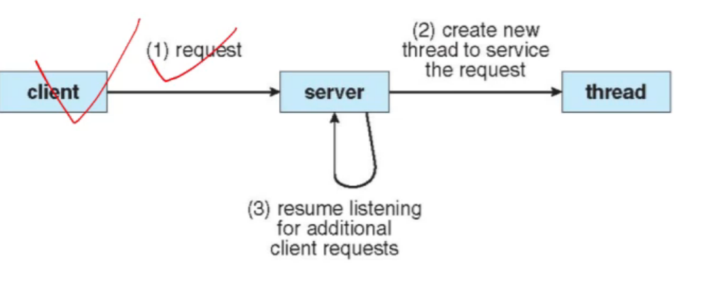

#### 5. Concurrent Execution on a Single-core System（Concerrency 并发）

- 将一个任务切分成多个部分；

- 
- 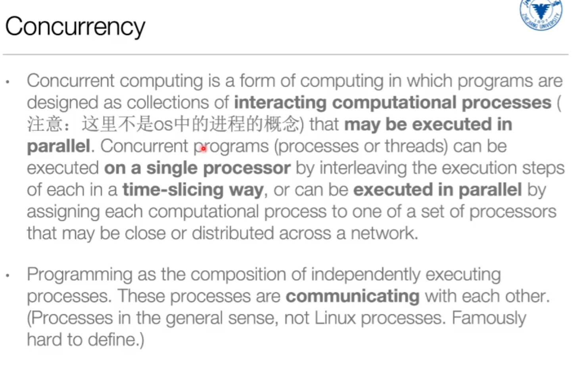

#### 6. Concerrent Execution on a Single-core System（并行执行）

- 同时执行；

- 
- 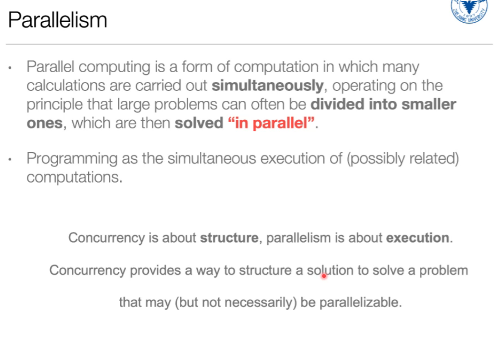

#### 7. Implement Threads

- 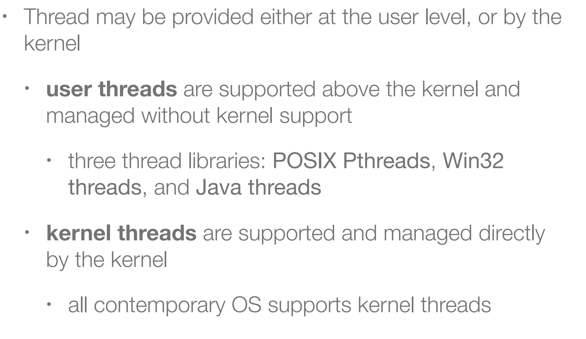

- 如果操作系统内核不支持线程，不妨碍用户态有线程，但是操作系统还是只能调度进程，至于用户态内部哪个线程获得了CPU资源，这是由用户态线程库自己决定；
- 而只有操作系统内核有内核线程这个概念，他会为每个用户态线程创建一个内核线程进行绑定，从而对每个用户态线程进行调度；
##### 7.1 Kernel-Level Threads 

- 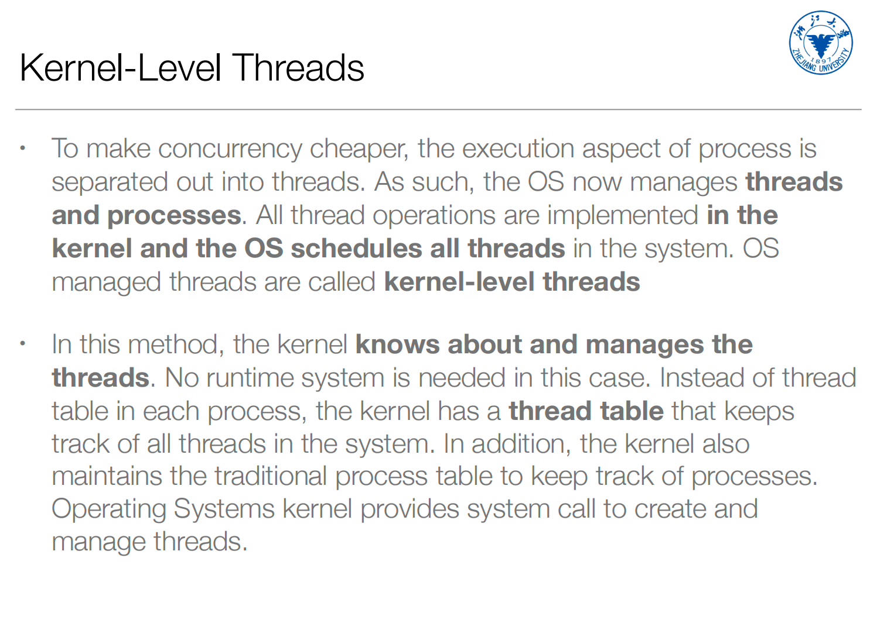

- 好处很明显了，缺点是需要消耗操作系统内核更多的资源，而针对缺点的低一点，实际上总的来说内核线程调度是会使程序变得高效，他的意思是创建一个内核态线程比创建用户态线程要慢，但是一旦创建完成，实际上给系统带来的好处是非常明显的；
- 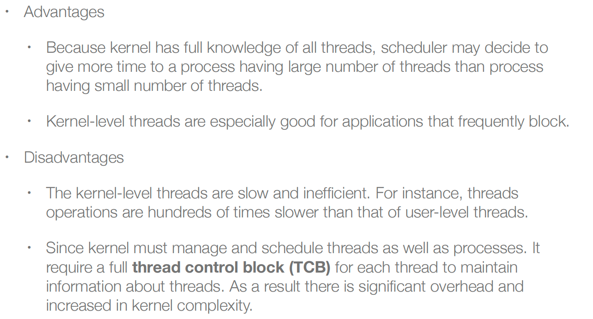

##### 7.2 User-Level Threads

- 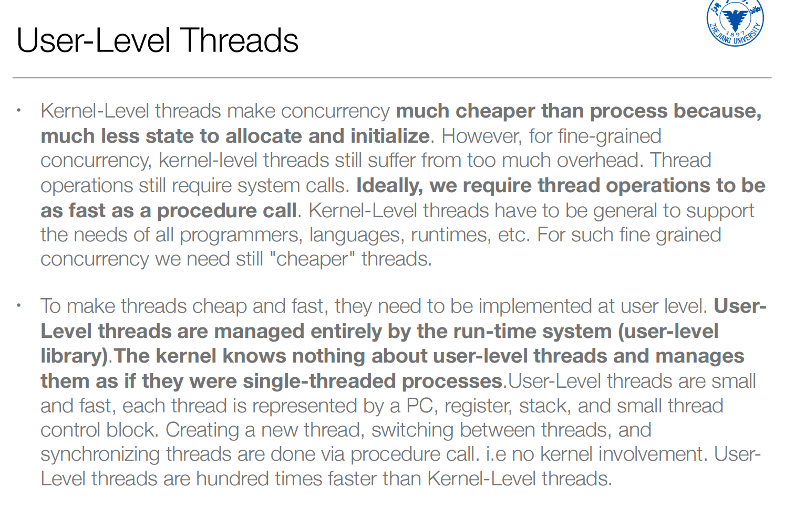
- 用户态不一定需要内核的支持才能创建线程， 在用户态将其切分成多个线程，如果没有内核线程，那么用户态线程只能并发而不能并行；
- 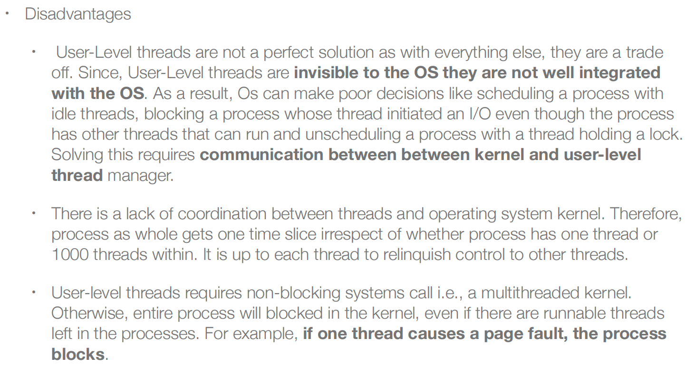

#### 8. Multithreading Models

##### 8.1 Many-to-One

- 多个用户态线程绑定到一个内核态线程；
- 每次内核线程被调度的时候，回到用户态之后，先回 到用户态的调度器（运行时系统），由他来确定运行哪个用户态线程；
- 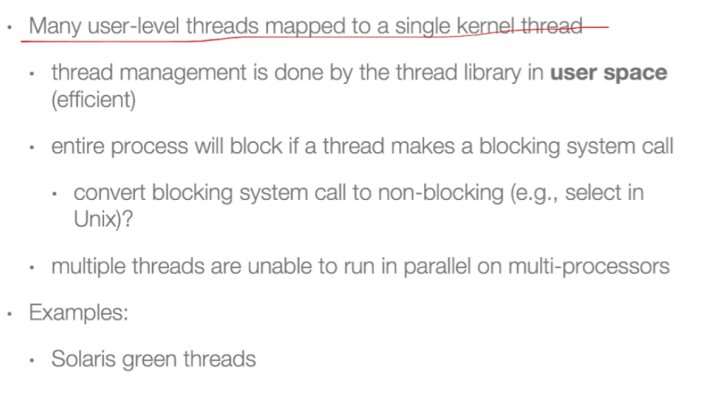
- 这种模型在今天已经不存在了；

##### 8.2 One-to-One
- 一个用户态线程绑定到一个内核态线程；
- 

##### 8.3 Many-to-Many

- 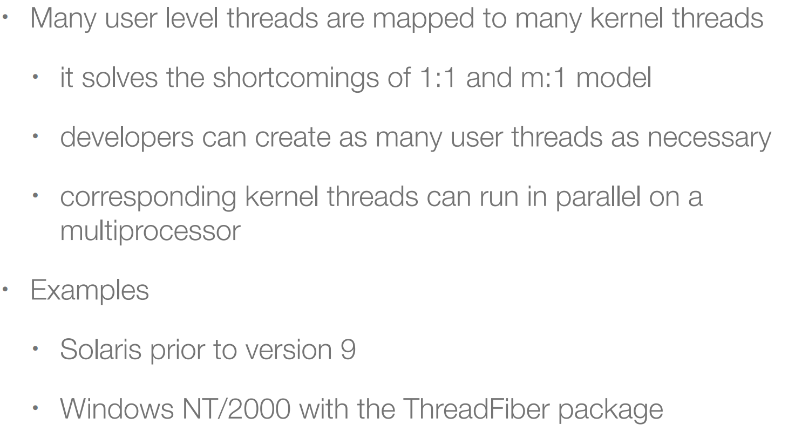

#### 9. Threading Issues

- fork和exec的语义，信号处理都是进程的概念；终止线程；如何让线程都有自己的data；

- 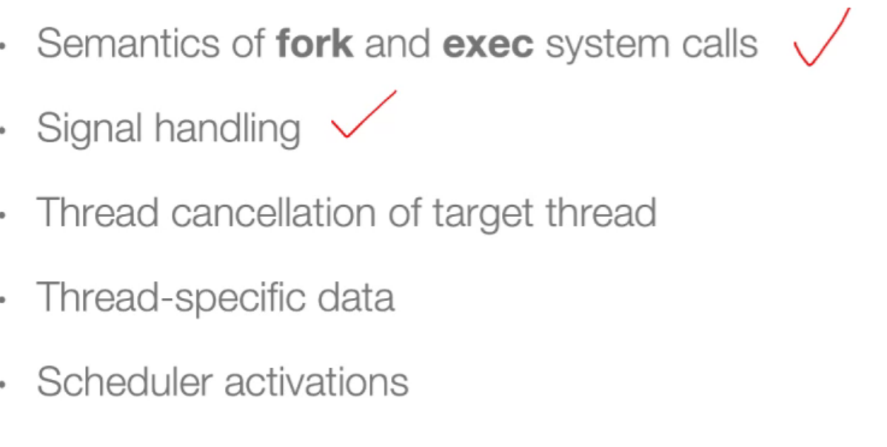

##### 9.1 Senmatics of Fork and Exec

- 本来fork的意思是duplicate整个进程里的所有资源；
- 那么当线程去调用的时候，duplicate线程还是进程呢？
- 有些系统是两个选择都有的；

- 如果fork之后直接进行exec，那说明只用复制一个线程就好了；

- 

- 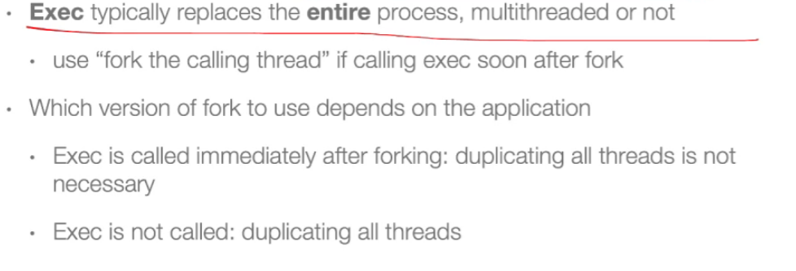

##### 9.2 Signal Handling

- Call back（回调），可以为某个信号注册一个回调函数；比如segment fault，然后用户态可以注册一个回调函数，当内核发现访问了无效地址后，把信号发送给用户态，就会调用回调函数；
- 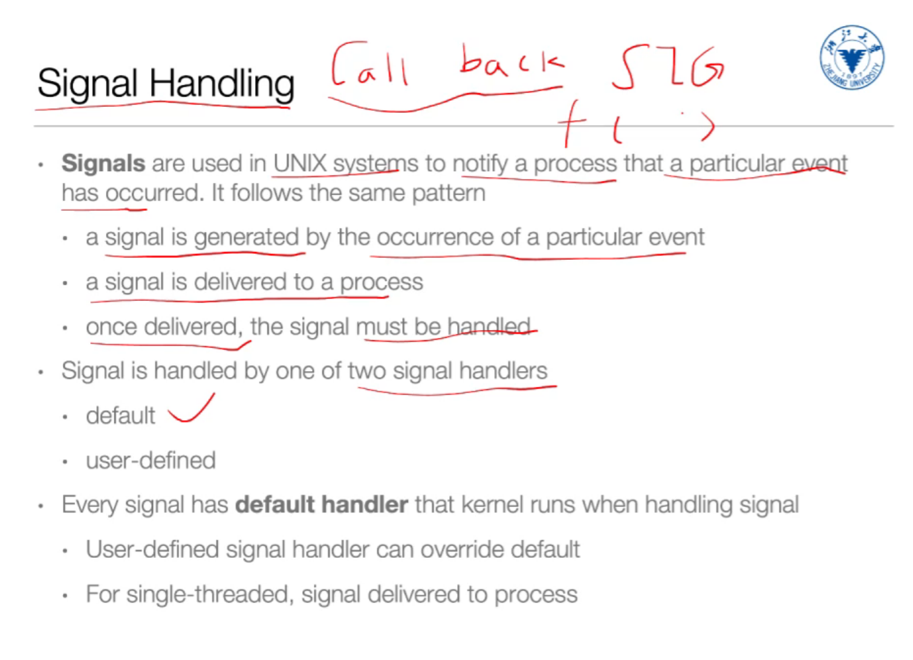
- default就是默认信号处理函数，比如直接退出；user-defined，就是用户自己注册的函数；
- 

##### 9.3 Thread Cancellation

- 如何结束一个线程？

- 

- asychronous cancellation：就是立即结束；
- 

- 关键区域：当多个线程要对一个共享区域进行访问的时候，我们称这个代码区域为关键区域；当一个代码被多个线程执行的时候（一串代码可以被多个线程执行），而当这个代码要对globle data或者heap进行访问时，如果不同步那就乱了，所以把访问globle data的代码段称为critical section；
- 在同一个时刻只有一个线程能执行关键区域代码 ；
- 
- target thread会周期性地检查自己是否被发送了结束请求；

##### 9.4 Thread Specific Data

- Thread-local storage(TLS) ，当我们使用线程时，想要全局变量的拷贝，使线程逻辑变简单；
- 与local variable区别
    - 局部变量（存在栈上）只在function被调用时才存在；
    - 而TLS在所有function都是生效的，但是每个线程都有自己的一个拷贝；
    - 全局变量是每个进程有一个拷贝；

- 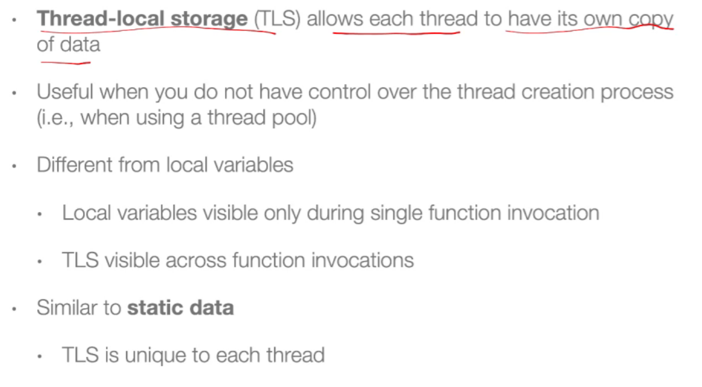

- 简单的实现方式：在globe区域划一个哈希表，然后通过pid去索引，得到data，这样可以实现不同线程访问同名变量是不同的拷贝；

##### 9.5 Lightweight Process & Scheduler Activations

- Lightweight process（LWP），每个LWP和内核态线程绑定，对于内核态来说，起着虚拟处理器的作用；

- 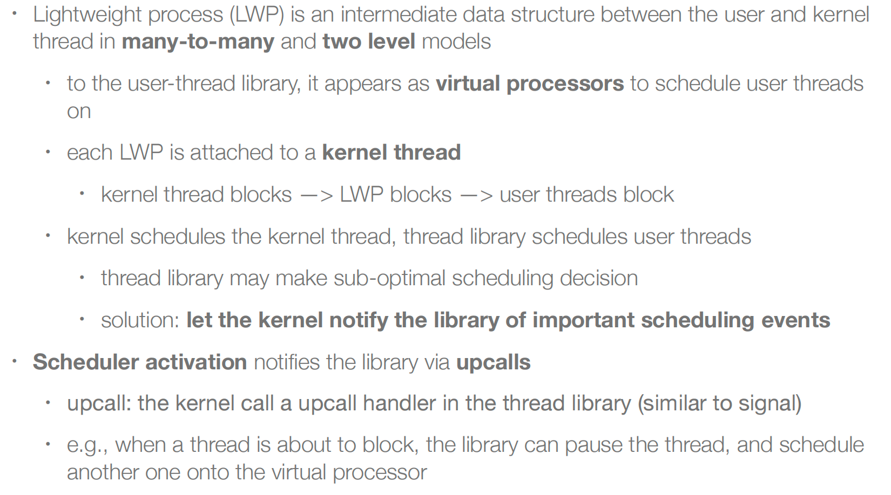

#### 10. Operating System Examples

##### 10.1 Windows XP threads

##### 10.2 Linux Threads

- linux可以控制一些资源共享，一些资源不共享（通过flag来控制）；

- 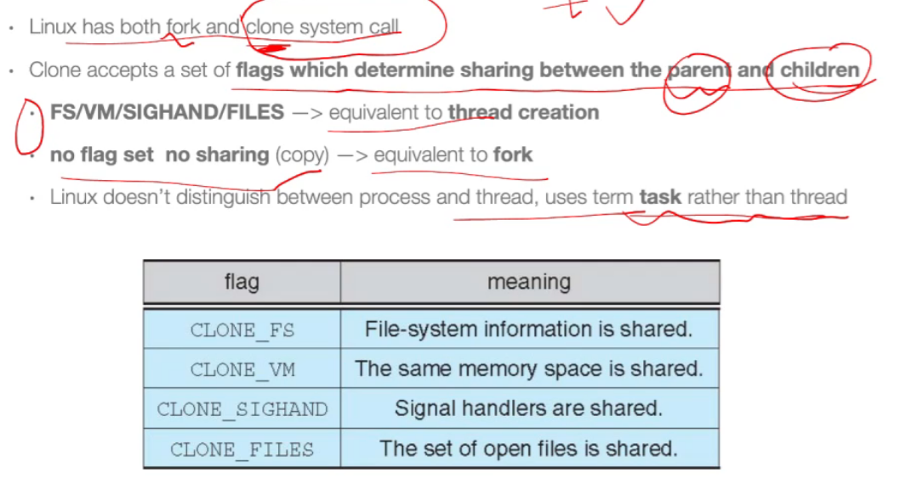

#### 11. Thread Libraries

- 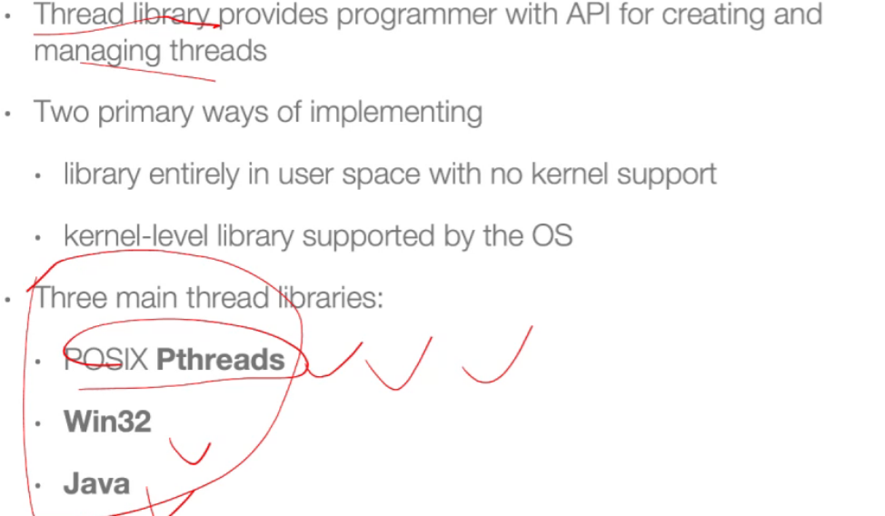

- Pthreads: 用于线程的创建与同步，具体如下；在unix操作系统里很常见；

- 

- 

#### 12. Pthreads Example

- 进程从main函数开始运行，线程从thread_start开始运行；
- 我们不希望多个线程同时对物理内存（全局变量）进行修改；
